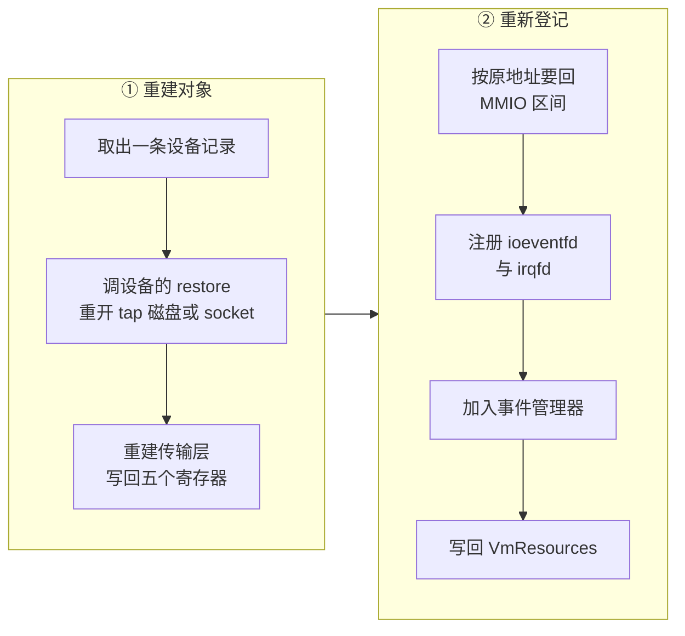

# 40 · 设备状态的 Persist：逐设备的保存与恢复

> 快照里除了内存与 vCPU，还有十几个设备的状态。它们的保存与恢复靠同一个只有四行的 trait 组织起来，
> 但每个设备真正要存什么、恢复时哪些东西必须重新向内核申请、哪些运行时状态干脆不存，各不相同。
> 本篇把这一层拆开：共通的骨架、逐设备的差异，以及恢复出来的设备与原来那个的差距。
>
> **读者**：系统工程师。　**预备**：[第 25 篇 · virtio 设备模型与 MMIO 传输层](25-virtio-device-model-and-transport.md)、
> [第 36 篇 · 快照总览](36-snapshot-overview-and-format.md)、[第 37 篇 · 创建快照](37-snapshot-create.md)。
> **代码**：`src/vmm/src/snapshot/persist.rs`、`src/vmm/src/device_manager/persist.rs`、
> `src/vmm/src/devices/virtio/persist.rs`、各设备目录下的 `persist.rs`

---

## 0. 本篇要回答的问题

1. `Persist` trait 为什么要把「状态」与「构造参数」分成两个关联类型？
2. `DeviceStates` 为什么按设备类型分成一堆字段，而不是一个同构的列表？
3. 一个 virtio 设备的状态里到底有什么，队列的哪些字段被存下来？
4. 恢复时哪些东西是从状态里读出来的，哪些是必须重新向内核申请的？
5. 每类设备在恢复时有什么自己的动作，tap、磁盘文件、vsock socket 是怎么回来的？
6. 哪些运行时状态根本没有存，恢复出来的设备因此与原来差在哪里？

---

## 1. Persist：把「能序列化的」与「不能序列化的」分开

`src/vmm/src/snapshot/persist.rs` 里的 trait 只有四行：

```rust
pub trait Persist<'a> where Self: Sized {
    type State;
    type ConstructorArgs;
    type Error;
    fn save(&self) -> Self::State;
    fn restore(constructor_args: Self::ConstructorArgs, state: &Self::State)
        -> Result<Self, Self::Error>;
}
```

两个关联类型的分工是这个设计的全部要点。`State` 是能写进文件的那一半：纯数据，
实现 `Serialize` 与 `Deserialize`，不含任何文件描述符、指针或 `Arc`。
`ConstructorArgs` 是不能写进文件、必须由恢复方现场提供的那一半：guest 内存的句柄、
`VmFd`、事件管理器的引用、MMDS 数据仓的 `Arc`。

这条界线让保存端与恢复端不对称：`save()` 不需要任何参数，`restore()` 需要一整套上下文。
它同时也解释了为什么 `restore()` 是关联函数而不是方法 —— 恢复的产物是一个新造的设备对象，
不是把状态写回一个已存在的设备。这一点在原地回滚的场景下会成为约束，见第 8 节。

`State` 全部是纯数据还有一个副作用：`MicrovmState` 从文件里读出来之后、交给 `restore()` 之前，
是可以修改的。`restore_from_snapshot()`（`src/vmm/src/persist.rs`）就用了这一点：
`network_overrides` 参数按 `iface_id` 找到对应的 `NetState`，
把里面的 `tap_if_name` 换成新的 tap 名，然后才开始重建。找不到对应的接口就报错。
同一个性质也是 `snapshot-editor` 存在的基础（[第 41 篇](41-snapshot-tools-and-compat.md)）。

---

## 2. DeviceStates：按类型分开的一棵树

`MicrovmState.device_states` 的类型是 `DeviceStates`（`src/vmm/src/device_manager/persist.rs`），
它不是一个同构的设备列表，而是按设备种类分开的一组字段：

```text
DeviceStates
├── legacy_devices : Vec<ConnectedLegacyState>   (仅 aarch64)
├── block_devices  : Vec<ConnectedBlockState>
├── net_devices    : Vec<ConnectedNetState>
├── vsock_device   : Option<ConnectedVsockState>
├── balloon_device : Option<ConnectedBalloonState>
├── entropy_device : Option<ConnectedEntropyState>
└── mmds_version   : Option<MmdsVersionState>
```

`Vec` 与 `Option` 的区别直接对应配置约束：block 与 net 可以有多个，
vsock、balloon、entropy 各自最多一个。

每个 `ConnectedXState` 都是同样的四件套：

| 字段 | 内容 |
|---|---|
| `device_id` | 配置时给的设备标识，恢复时按同一个名字重新注册 |
| `device_state` | 设备自己的状态，类型逐设备不同 |
| `transport_state` | virtio-mmio 传输层的五个寄存器（`MmioTransportState`） |
| `device_info` | `MMIODeviceInfo`：MMIO 起始地址、长度、IRQ 号 |

为什么不做成同构列表？因为 bincode 是紧密编码，没有类型标签
（[第 36 篇 §2](36-snapshot-overview-and-format.md#2-vmstate-文件的布局)）。一个 `Vec<Box<dyn 某种设备状态>>`
在反序列化时无法判断下一段字节该按哪个类型解码。按类型分字段把这个判断挪到了编译期：
读到第几个字段就按第几个类型解码。代价是每加一种设备就要改 `DeviceStates` 的定义，
而这个改动必然抬高快照格式的主版本号。

`transport_state` 里只有五个寄存器：`features_select`、`acked_features_select`、
`queue_select`、`device_status`、`config_generation`。传输层其余的东西 —— guest 内存引用、
指向设备对象的 `Arc`、中断触发器 —— 都在 `MmioTransportConstructorArgs` 里，
由恢复方现场提供。`MmioTransport::restore()` 的实现就是先 `MmioTransport::new()` 造一个新的，
再把这五个字段逐一写回去。

---

## 3. 保存：遍历总线，逐个 downcast

`MMIODeviceManager::save()` 用 `for_each_device()` 遍历已注册的设备，对每一个做三件事：
判断要不要跳过、拿到传输层状态、按设备类型分派。

跳过两类。`DeviceType::BootTimer` 不存，它只在启动路径上有意义。
aarch64 上的 serial 与 RTC 属于 legacy 设备，只把 `device_info` 存进 `legacy_devices`，
不存任何内部状态 —— 恢复时重新造一个新的就行，串口的历史输入输出本来也不是 VM 状态的一部分。

剩下的都是 virtio 设备，通过 `mmio_transport_ref()` 拿到传输层，`save()` 出 `transport_state`，
再用 `device_type()` 分派，`downcast_ref` 或 `downcast_mut` 到具体类型后调各自的 `save()`。
vhost-user 的块设备在这里被跳过并打一条 warn：它还不支持快照。

有两个设备在 `save()` 之前有副作用 —— block 的 `prepare_save()` 与 vsock 的
`send_transport_reset_event()`。它们都会改动 guest 内存与队列，
因此必须发生在内存文件写出之前，理由在[第 37 篇 §3](37-snapshot-create.md#3-save_state收集的顺序)讲过，这里不重复。

一个实现细节值得知道：`for_each_device()` 遍历的 `id_to_dev_info` 是一个 `HashMap`，
遍历顺序不稳定。所以同一台 microVM 连续存两次，`block_devices` 里两个块设备的先后可能不同。
恢复不依赖这个顺序（每个设备按自己的 `device_info.addr` 重新落位），
但依赖快照字节逐位可重复的做法在这里不成立。

---

## 4. VirtioDeviceState：所有 virtio 设备共用的那一段

`src/vmm/src/devices/virtio/persist.rs` 里的 `VirtioDeviceState` 是每个 virtio 设备状态里都嵌着的一块：

| 字段 | 含义 |
|---|---|
| `device_type` | virtio 设备类型号，恢复时用来核对 |
| `avail_features` | 设备提供的特性位 |
| `acked_features` | 驱动接受的特性位 |
| `queues` | 每条队列一个 `QueueState` |
| `interrupt_status` | MMIO 中断状态寄存器的值 |
| `activated` | 驱动有没有完成激活 |

`QueueState` 存的是队列的描述：`max_size`、驱动选定的 `size`、`ready` 标志、
描述符表 / avail ring / used ring 的三个 GPA，以及三个游标 `next_avail`、`next_used`、`num_added`。
注意环里的内容一个字节都没有存 —— 那些在 guest 内存里，随内存文件一起走。
存下来的只是「设备这一侧处理到哪儿了」。

恢复走 `VirtioDeviceState::build_queues_checked()`，它是快照里唯一一处成体系的合法性校验，
共四道：设备类型必须与期望的一致；`acked_features` 必须是 `avail_features` 的子集；
队列数量必须等于该设备编译期确定的数量；每条队列的 `max_size` 必须等于期望值且 `size` 不超过它。
另外，只有 `activated` 为真时才额外要求 `q.is_valid(mem)` —— 代码注释解释了为什么：
快照可以在任意时刻拍下，包括驱动正在配置队列、三个地址只填了一半的时候。
这时队列不合法是正常的，不该拒绝恢复。

`Queue::restore()` 同样看 `activated`：为真才调 `queue.initialize(&mem)`
把三个 GPA 翻译成宿主指针；为假就留着空指针，等驱动日后激活时再算。
再加上一条：`acked_features` 里有 `VIRTIO_RING_F_EVENT_IDX` 时打开通知抑制。

---

## 5. 恢复：重建对象，再向内核重新登记

`MMIODeviceManager::restore()` 按固定顺序处理：aarch64 的 legacy 设备 → balloon → block →
MMDS 版本 → net → vsock → entropy。顺序里只有一处是有依赖的：
MMDS 的版本必须在 net 之前落定，因为 net 设备恢复时要拿 MMDS 数据仓的引用。
如果快照里没有 `mmds_version`（来自更老的版本），但存在带 MMDS 命名空间的网卡，
就用默认版本初始化一个。

每类设备恢复完各自的对象之后，都走同一个 `restore_helper`，它做四件事：

1. `MmioTransport::restore()`：新建传输层并写回五个寄存器；
2. 按 `device_info.addr` 以 `AllocPolicy::ExactMatch` 向资源分配器要回原来那段 MMIO 地址；
3. `register_mmio_virtio()`：给每条队列的 `queue_evt` 注册 ioeventfd（地址是设备基址加通知寄存器偏移，
   数据值是队列序号），给设备的中断 eventfd 注册 irqfd；
4. 把设备作为订阅者加进事件管理器。

第 2、3 两步是这一层的核心：**地址与中断号从快照里读，但与 KVM 的绑定关系必须重新建立**。
设备管理器一侧的同一件事在[第 23 篇 §7](23-bus-and-mmio-device-manager.md#7-恢复地址精确匹配中断号不重放)讲过。
ioeventfd 与 irqfd 是内核对象，活不过进程；新进程里必须用新的 eventfd 重新登记一遍，
只有登记时用的地址、数据值与 IRQ 号来自快照，guest 才看不出换过进程。
`register_mmio_virtio()` 无条件注册所有队列的 ioeventfd，不看设备有没有激活。

有一处明确写进注释的取舍：IRQ 号的分配器（`IdAllocator`）的状态不保存也不恢复。
后果是恢复出来的实例里，分配器不知道哪些 IRQ 号已经被用掉了。
目前不出问题是因为恢复之后不会再热插设备；注释说明如果将来要支持热插，这里要补上。



最后一步 `update_from_restored_device()` 容易被忽略：它把新建的设备对象塞回 `VmResources`，
这样 `GET /vm/config` 之类的查询看到的才是恢复出来的这套设备。
balloon 在这里还顺带做了一次校验 —— balloon 与大页不能共存，
恢复一个同时有两者的快照会在这一步失败。

---

## 6. 逐设备的差异

共通骨架之外，每类设备恢复时要自己处理外部资源与内部缓存：

| 设备 | 状态里额外存了什么 | 恢复时额外做了什么 |
|---|---|---|
| block | `disk_path`、`cache_type`、`root_device`、`file_engine_type`、速率限制器状态 | 按原路径重新打开磁盘文件并重建文件引擎；只读标志从特性位反推 |
| net | `tap_if_name`、guest MAC、两个速率限制器、MMDS 栈、`RxBufferState` | 按名字重开 tap；已激活时按 `acked_features` 重设 tap 的 offload 标志；重建 RX 描述符缓存 |
| vsock | CID、后端 socket 的路径 | 按路径重建 Unix 后端；已建立的连接一概不恢复 |
| balloon | 目标页数、实际页数、统计采样间隔与最近一次统计 | 已激活且开了统计时重置统计定时器；按后端类型决定移除内存的方式 |
| entropy | 只有速率限制器状态 | 无；随机数源本来就是每次现取 |
| MMDS | 数据仓的版本号 | 按版本号初始化空数据仓；数据仓的内容不在快照里 |

三处值得展开。

**net 的 RX 缓存。** `RxBufferState` 里只有三个计数：已从 guest 解析出多少条描述符链、
用掉了多少个描述符、用掉了多少字节。恢复时不是把解析结果存回来，而是把 RX 队列的
`next_avail` 往回退 `parsed_descriptor_chains_nr`，再调一次 `parse_rx_descriptors()` 重新解析一遍，
然后把两个计数写回去。这是一种典型的取舍：存三个整数而不是存一整份描述符链快照，
代价是恢复时要重做一遍解析工作，前提是 guest 内存里那些描述符还在原处 —— 它们确实还在，
因为内存是一起恢复的。

**block 的文件引擎。** `file_engine_type` 存的是 Sync 还是 Async（io_uring）。
这个字段有一个 `#[default] Sync`：更老的快照里没有这个字段，反序列化时补成 Sync，
因为那时候还没有异步引擎。在途的 io_uring 请求一条都不存 ——
保存前的 `prepare_save()` 已经把队列排空刷盘了，快照里不存在未完成的 I/O。

**vsock 的连接。** `VsockUdsState` 里只有一个 socket 路径。所有已建立的连接、
在途的数据包都不保存，设备是「空着」恢复出来的。保存时向 guest 发的
`VIRTIO_VSOCK_EVENT_TRANSPORT_RESET` 就是为了让 guest 侧知道要重建连接；
`kick_devices()` 里对 vsock 唯一的动作也只是让 guest 去处理这条事件
（`src/vmm/src/device_manager/mmio.rs`，注释写明 vsock 的协议经不起丢包，所以不做连接持久化）。

---

## 7. 恢复出来的设备与原来差在哪里

把上面的内容反过来列一遍，得到一张「快照带不走」的清单：

- 环里的数据不属于设备状态（在 guest 内存里），但**在途的宿主侧 I/O** 属于，
  而它的处理方式是消灭而不是保存：block 排空刷盘，io_uring 的完成项先回填再存。
- **vsock 连接**全部丢失，靠一条 reset 事件通知 guest。
- **MMDS 数据仓的内容**不保存，只保存版本号；恢复后是空的。
- **ioeventfd / irqfd 与 MMIO 地址的占用**不是状态而是重新申请的结果，
  只有申请时用的参数来自快照。
- **速率限制器**恢复成未阻塞状态，在途的 timerfd 事件被丢弃；`kick_devices()` 的注释说明
  这样做是安全的，因为设备会被人为踢一次，该处理的队列都会被重新扫到。
- **日志与 metrics 的配置**、串口的历史输出不在快照里。

这张清单的另一面是恢复之后的一次补偿动作：`Vmm::resume_vm()` 先调 `kick_devices()`，
对每个已激活的 virtio 设备人为地触发一次队列处理，补上快照期间可能漏掉的 epoll 事件。
这不属于 `Persist` 这一层，但它是这一层能把「不保存在途状态」当作安全选择的前提。

---

## 8. 后续各层的差异

e2b 定制版没有改动本篇涉及的任何文件。ARM 适配版的 checkpoint / restore 扩展改了三处：
给 `MmioTransport` 加了 `apply_state()`，把快照里的传输层寄存器写到一个**已存在**的传输层上；
给 `NetState` 加了两个取值方法，让外部能读到虚拟设备状态与 RX 计数；
给 vmgenid 加了 `refresh_generation()`。这三处的共同动机是原地回滚不能像 `restore()` 那样重建对象 ——
设备对象必须留在原地，只把状态写回去，见[第 72 篇 · 回滚的设备状态](72-rollback-devices.md)。

---

## 9. 小结

- `Persist` 把设备状态切成两半：能序列化的 `State` 写进快照，不能序列化的上下文由恢复方通过 `ConstructorArgs` 现场提供。
- `State` 是纯数据，所以可以在反序列化之后、重建之前被修改；`network_overrides` 与 `snapshot-editor` 都建立在这一点上。
- `DeviceStates` 按设备类型分字段而不是同构列表，因为 bincode 没有类型标签；代价是加一种设备就要抬快照主版本号。
- 每条记录都是设备状态加传输层五个寄存器加 MMIO 地址与 IRQ 号。
- 队列只存描述（三个 GPA、长度、就绪位）与三个游标，环里的数据随 guest 内存走。
- `build_queues_checked()` 做四道校验，但只对已激活的队列要求地址合法 —— 快照可能拍在驱动配置到一半的时刻。
- 恢复时地址与 IRQ 号从快照读，ioeventfd 与 irqfd 必须重新向 KVM 登记；IRQ 分配器的状态不恢复，因此恢复后不支持热插设备。
- 外部资源按名字重新打开：磁盘按路径、tap 按接口名、vsock 按 socket 路径；名字对不上就恢复失败。
- 在途 I/O、vsock 连接、MMDS 数据、速率限制器的阻塞状态一概不保存，靠保存前排空与恢复后 `kick_devices()` 补偿。

---

## 延伸阅读 / 下一篇

- [第 25 篇 §3](25-virtio-device-model-and-transport.md#3-mmiotransport寄存器到-trait-调用的翻译)：`MmioTransport` 五个寄存器的含义。
- [第 37 篇 · 创建快照](37-snapshot-create.md)：保存设备状态的两处副作用为什么必须在写内存文件之前。
- [第 38 篇 §5](38-snapshot-load.md#5-设备是怎么重建的)：设备重建在整条恢复流程里的位置。
- [下一篇：第 41 篇 · snapshot-editor、rebase-snap 与兼容性](41-snapshot-tools-and-compat.md)。
- [第 72 篇 · 回滚的设备状态](72-rollback-devices.md)：不重建对象、只写回状态的那条路径。
