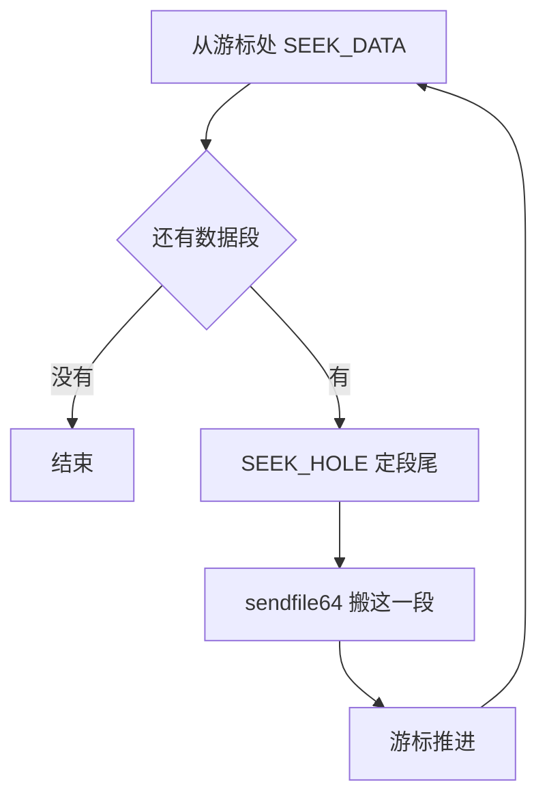

# 41 · snapshot-editor、rebase-snap 与兼容性

> Diff 快照的内存文件单独拿出来是没法用的，要先叠回一个全量文件上。上游为此提供了两个命令行工具，
> 它们的核心算法一样，只有十几行。本篇讲这个算法、它对文件系统的隐含要求，
> 以及围绕快照的另一个更大的问题：一个快照到底能在哪些机器上恢复。
>
> **读者**：系统工程师、运维。　**预备**：[第 36 篇 · 快照总览](36-snapshot-overview-and-format.md)、
> [第 37 篇 · 创建快照](37-snapshot-create.md)。
> **代码**：`src/rebase-snap/src/main.rs`、`src/snapshot-editor/src/`、
> `src/vmm/src/snapshot/mod.rs`、`src/vmm/src/persist.rs`

---

## 0. 本篇要回答的问题

1. Diff 快照的内存文件为什么不能直接拿去恢复？
2. 合并靠的是什么机制，为什么只需要十几行代码？
3. 这个算法对底层文件系统有什么隐含要求，不满足会怎样？
4. 多层 Diff 叠加时顺序能不能换？
5. `snapshot-editor` 能改 vmstate 的什么，为什么它能打开当前 Firecracker 拒绝加载的快照？
6. 「这个快照能在哪里恢复」这个问题有几个维度，每个维度由谁来检查、失败时是什么表现？

---

## 1. Diff 内存文件是一张补丁

回顾[第 37 篇 §6](37-snapshot-create.md#6-dump_dirty逐页判定与成批写)：Diff 快照的内存文件是按脏页写出来的。
`dump_dirty()` 逐页判断，脏页写出去，干净页用 `seek` 跳过去，最后 `set_len()`
把文件长度补齐到 guest 内存的完整大小。产物是一个稀疏文件：长度等于全量，
但只有脏页那些位置真正占了磁盘块，其余位置是洞。

洞在这里的含义是「这一页自上次快照以来没有被写过，内容与上一份内存文件相同」。
读一个洞得到的是零，而零几乎肯定不是那一页真正的内容。所以直接拿 Diff 内存文件去
`PUT /snapshot/load`，guest 会读到一片大部分为零的内存。

合并就是把这张补丁贴到基线上：凡是 Diff 里有数据的位置，用 Diff 的内容覆盖基线；
凡是洞，保留基线原样。

```text
基线 memfile   [AAAA][BBBB][CCCC][DDDD]
Diff memfile   [XXXX][....][YYYY][....]      "...." 是洞
合并之后       [XXXX][BBBB][YYYY][DDDD]
```

---

## 2. 算法：SEEK_DATA 加 sendfile

`src/rebase-snap/src/main.rs` 的 `rebase()` 是整个工具的全部内容。
它不需要知道页大小，也不需要知道哪些页脏 —— 文件系统已经把这个信息以「洞」的形式记下来了。
循环结构是：

1. 从当前游标开始调 `seek_data()`（`lseek(SEEK_DATA)`），找到下一段有数据的起点；找不到就结束；
2. 从这个起点调 `seek_hole()`（`lseek(SEEK_HOLE)`），找到这段数据的终点；
   没有下一个洞就用文件长度当终点；
3. 把基线文件的写位置定位到这一段的起点，用 `sendfile64()` 把这一段从 Diff 文件直接搬过去，
   内核内部完成，不经过用户态缓冲区；
4. 游标推进到这一段末尾，回到第 1 步。



用 `sendfile64` 而不是读一段再写一段，省掉的是用户态缓冲区那一次来回拷贝。
内存文件动辄几个 GiB，合并又是恢复之前的必经步骤，这一层开销值得省。
代价是这个工具只能做「整段原样搬运」这一件事：想在合并的同时对内容做任何加工，
就得放弃这条内核内部的快路径。

`snapshot-editor` 的 `edit-memory rebase` 子命令（`src/snapshot-editor/src/edit_memory.rs`）
是同一段代码，错误类型换了一套，参数改成 `--memory-path` 与 `--diff-path`。
`rebase-snap` 已被标记废弃，无论怎么调用都会打印一条提示指向 `snapshot-editor`；
两者的行为没有区别，新的部署应当只用后者。

两个边界行为来自 `sendfile64` 而不是显式的代码。基线文件以 `write(true)` 打开，不截断；
如果 Diff 比基线长，最后一段会写到基线末尾之外，把基线撑长；
如果基线比 Diff 长，超出部分原样保留。上游的单元测试把这两种情况都列为期望行为。

---

## 3. 这个算法的隐含前提

**前提一：文件系统如实报告洞。** 整条推理是「Diff 里是洞 ⇒ 那一页没脏 ⇒ 用基线的」。
如果文件系统把一个本该是洞的位置当作数据报告出来（例如内存文件被复制到一个不保留稀疏性的
文件系统上，洞被物化成了零块），`seek_data()` 会把它当成数据段，
`sendfile64` 会把一片零覆盖到基线的有效内容上。结果是一个损坏的内存文件，
而且没有任何一步会报错 —— 内存文件没有校验和（[第 36 篇 §2](36-snapshot-overview-and-format.md#2-vmstate-文件的布局)）。
所以搬运 Diff 内存文件必须用保留稀疏性的方式。

**前提二：guest 真的把某页写成了全零时，那一页必须是数据而不是洞。**
这一条是成立的：`dump_dirty()` 对脏页一律 `write_all()`，写的是零它也照写，
落到文件上就是一段实际分配的零块。上游的测试用例专门覆盖了「基线有内容、Diff 是显式的零块」
这种情况，期望结果是零覆盖掉基线。

**前提三：叠加顺序是时间顺序。** 多层 Diff 要从最早的一层开始，依次叠到同一个基线上。
把顺序颠倒，后写的内容会被先写的覆盖。工具本身不校验顺序，也无从校验 ——
内存文件里没有任何版本或时间戳。这个约束由调用方保证。

---

## 4. snapshot-editor 的另外两组子命令

`snapshot-editor` 是一个 `clap` 组织的三层命令（`src/snapshot-editor/src/main.rs`），
除了上面的 `edit-memory`，还有 `info-vmstate` 与 `edit-vmstate`。

`info-vmstate` 有三个子命令，都走 `utils.rs` 的 `open_vmstate()`：
`version` 打印快照的格式版本，`vcpu-states` 把每个 vCPU 的状态按 Rust 的调试格式打印出来，
`vm-state` 打印整个 `MicrovmState`。后两个的输出是给人看的，不是给程序解析的。

这里有一个值得注意的差别：`open_vmstate()` 调的是 `Snapshot::load()`，
而 Firecracker 加载快照时调的是 `Snapshot::load_with_version_check()`
（`src/vmm/src/persist.rs` 的 `snapshot_state_from_file`）。
两者都校验魔数与 CRC64，但只有后者比较版本号。所以 `snapshot-editor` 能打开一个当前
Firecracker 拒绝加载的快照 —— 只要它的结构还能被同一套 `MicrovmState` 定义解出来。
反过来说，如果结构本身变了，反序列化会失败，工具也读不了。
只想知道版本号时还有一条更宽松的路：`firecracker --describe-snapshot <path>` 只读文件头，
不解析后面的状态，也不校验 CRC。

`edit-vmstate remove-regs` 只在 aarch64 上编译。它按 KVM 的寄存器 ID
从每个 vCPU 状态的寄存器数组里删掉指定的项，把结果写成一个新文件，
并按原来的版本号重新加魔数与 CRC。用途是跨宿主内核恢复：
某些寄存器在源机器上存在、在目标机器上 KVM 不认，恢复时会因为写不进去而失败，
把它们删掉就能绕过。代价明确：被删掉的寄存器在恢复出来的 vCPU 上是 KVM 的默认值，
不是快照时的值；这个操作是否安全要由使用者按寄存器的语义判断，工具不做任何检查。

x86_64 上没有对应的子命令，整个 `edit_vmstate` 模块都不编译。

---

## 5. 一个快照能在哪里恢复

「兼容性」在快照这件事上不是一个维度，而是四个。它们由不同的机制检查，失败时的表现也不同。

| 维度 | 谁检查 | 判据 | 不匹配时 |
|---|---|---|---|
| 格式版本 | `Snapshot::load_with_version_check()` | 主版本相等且次版本不超过 | 加载报错 |
| 架构 | `Snapshot::unchecked_load()` 的魔数比较 | x86_64 与 aarch64 各一个魔数 | 加载报错 |
| CPU 厂商 / 型号 | `validate_cpu_vendor()` / `validate_cpu_manufacturer_id()` | 宿主与快照的厂商 ID 相同 | 只打一条 warn，继续加载 |
| 宿主内核与外部资源 | 无 | 无 | 加载成功但行为不可预期 |

**格式版本。** 上游 v1.12.1 的 `SNAPSHOT_VERSION` 是 `6.0.0`（`src/vmm/src/persist.rs`）。
它与 Firecracker 的版本号是两套编号：`--snapshot-version` 打印二进制支持的格式版本。
历史上这个号从 v1.7.0 起独立编号，并且几乎每次改动 `MicrovmState` 的结构都抬主版本 ——
v1.10.1 抬到 4.0.0，v1.11 抬到 5.0.0，v1.12.0 抬到 6.0.0。原因在编码方式上：
bincode 没有字段名也没有类型标签，加一个字段就会让后面所有字节的含义错位，
没有「向后兼容地加字段」这种可能。判据里的「次版本不超过」因此在实践中很少用到。

**CPU 厂商这一行是这张表里最需要注意的。** 代码只在两边的厂商 ID 不同时打一条
`warn!("Host CPU vendor ID differs from the snapshotted one")`，然后照常往下走。
上游文档明说 Intel 与 AMD 之间的恢复不受支持，但控制面不会替你拦住。
真正的失败会推迟到 guest 执行到某条它以为存在的指令时，表现为 guest 内的异常而不是 API 报错。
同一架构的不同型号之间同样如此：只要暴露给 guest 的 CPU 特性集合在保存与恢复时不一致，
结果就是未定义的。要让这件事可控，办法是用 CPU 模板把特性集合钉死
（[第 20 篇 · CPU 模板](20-cpu-templates.md)）。

这张表整体呈现出一个取舍：Firecracker 只硬性拦住那些「一定读不出来」的情况，
凡是需要理解语义才能判断的（CPU 特性、内核行为），一律交给使用者。
好处是控制面简单、不会因为过度保守拒绝掉本来能跑的组合；
代价是一类错误被推迟到 guest 运行时才暴露，而那时已经很难追回原因。

**aarch64 上还多一条硬约束**：GICv2 与 GICv3 之间不能互相恢复。
GIC 的状态在 `vm_state` 里按具体版本序列化，恢复时版本对不上会失败。

**宿主内核。** 上游把跨内核版本的恢复定性为不稳定：KVM 保存下来的状态在不同内核上语义可能不同。
文档里给了一张很窄的经验表，只覆盖同一机型从 5.10 到 6.1 这一个方向，
并且明说不提供保证、不建议用于生产。

---

## 6. 跨机器恢复时另外几件要对上的事

除了上面四个维度，还有几处具体的坑，它们都不属于「快照格式」而属于「快照引用的外部世界」：

- **按名字引用的资源**：tap 接口名、块设备文件路径、vsock 的 Unix socket 路径。
  这三样都以字符串存在快照里（[第 40 篇 §6](40-device-persist.md#6-逐设备的差异)），
  目标机器上必须存在同名的资源且权限正确。tap 名可以在加载时用 `network_overrides` 覆盖，
  另外两样不行。
- **时钟**：x86_64 上如果保存时某个 vCPU 的 `MSR_IA32_TSC_DEADLINE` 是 0，
  Firecracker 会用同一个 vCPU 的 `MSR_IA32_TSC` 值替换它，以免快照期间丢掉的那次
  定时中断让 guest 从此收不到 TSC 中断。这是一处为了恢复后能继续跑而故意不忠实保存状态的地方。
- **vmgenid**：恢复时会给 guest 注入一次通知，让它知道自己是一个克隆并重新播种随机数。
  上游提醒不要在 guest 内核刚开始启动时拍快照 —— 那时中断处理还没就绪，注入通知可能让内核崩溃。
- **随机性与身份**：同一个快照恢复出多个实例时，它们的熵池、网络身份、
  各种缓存下来的 UUID 都是一样的。这不是工具能解决的问题，属于使用快照的系统要自己设计的部分。

---

## 7. 后续各层的差异

两层改动都没有碰 `rebase-snap` 与 `snapshot-editor`，也没有改快照的格式版本。
但它们都改变了「快照由哪些文件组成」：e2b 定制版让内存文件变成可选，
一次 `create` 可以只产出 vmstate，内存由宿主进程自己直读导出，因此 rebase 这条路径不再适用
（[第 54 篇](54-optional-memfile-snapshot.md)）；
ARM 适配版在内存文件之外多写一个位图 sidecar，记录这次导出写了哪些页
（[第 67 篇](67-dirty-bitmap-sidecar.md)）。本篇讲的合并原理在两处都仍然成立，
只是合并的执行者从命令行工具换成了调用方。

---

## 8. 小结

- Diff 内存文件是一张以稀疏文件形式表达的补丁：有数据的地方是脏页，洞表示「与基线相同」。
- 合并算法只有一个循环：`SEEK_DATA` 找段首、`SEEK_HOLE` 找段尾、`sendfile64` 整段搬，不经过用户态。
- 这条推理依赖文件系统如实保留洞；洞被物化成零块时合并会静默地写坏基线，内存文件没有校验和兜底。
- 多层 Diff 必须按时间顺序叠加，工具不校验也无法校验。
- `rebase-snap` 与 `snapshot-editor edit-memory rebase` 是同一个算法，前者已废弃。
- `snapshot-editor` 读 vmstate 时不做版本兼容检查，所以能打开 Firecracker 拒绝加载的快照；
  `--describe-snapshot` 连状态都不解析。
- `edit-vmstate remove-regs` 只有 aarch64 有，用来删掉目标宿主不认的 vCPU 寄存器，代价是那些寄存器变成默认值。
- 兼容性有四个维度：格式版本与架构会硬性拒绝，CPU 厂商只警告不拒绝，宿主内核与外部资源根本不检查。
- 快照格式版本与 Firecracker 版本是两套编号；bincode 的编码方式决定了几乎每次结构改动都抬主版本。

---

## 延伸阅读 / 下一篇

- [第 36 篇 §2](36-snapshot-overview-and-format.md#2-vmstate-文件的布局)：魔数、版本字段与 CRC 的布局。
- [第 37 篇 §6](37-snapshot-create.md#6-dump_dirty逐页判定与成批写)：稀疏内存文件是怎么写出来的。
- [第 20 篇 · CPU 模板](20-cpu-templates.md)：把暴露给 guest 的特性集合钉死，让跨机型恢复可控。
- [下一篇：第 42 篇 · seccomp](42-seccomp.md)。
- 上游文档 `docs/snapshotting/versioning.md`、`docs/snapshotting/snapshot-editor.md`。
- e2b 不用 `rebase-snap`：它在 orchestrator 里按自己的映射表做同样的叠加，
  见 [e2b 手册第 37 篇](../e2b-infra/37-pause-and-snapshot.md)（映射表怎么合并）与
  [e2b 手册第 30 篇](../e2b-infra/30-block-layer.md)（合并后的多代 diff 怎么按块读）。
