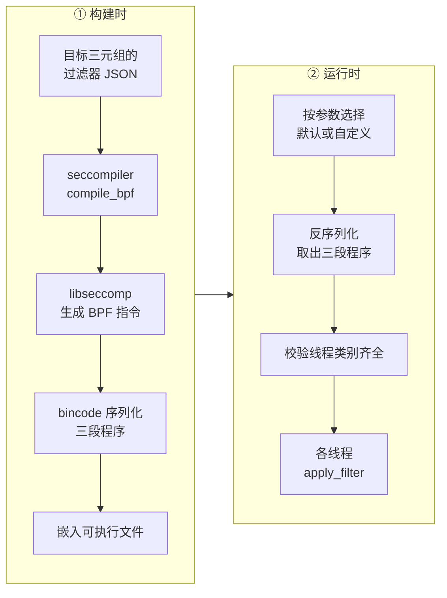
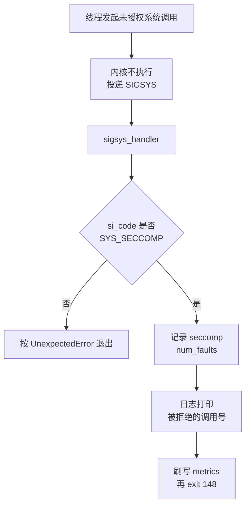

# 42 · seccomp：seccompiler、过滤器与安装时机

> Firecracker 把「这个进程允许对宿主内核说哪些话」写成三张 JSON 表，在构建时编译成 BPF 程序嵌进二进制，
> 再由三类线程各自在进入主循环前装上。本篇讲这三张表长什么样、编译与安装发生在哪一刻、
> 一条带参数条件的规则怎么读，以及这道边界挡得住什么、挡不住什么。
>
> **读者**：系统工程师、运维。　**预备**：[第 07 篇 · 进程启动](07-process-startup.md)、
> [第 15 篇 · vCPU 线程与状态机](15-vcpu-threads-and-state-machine.md)。　**代码**：`resources/seccomp/`、
> `src/seccompiler/src/lib.rs`、`src/seccompiler/src/types.rs`、`src/firecracker/build.rs`、
> `src/firecracker/src/seccomp.rs`、`src/vmm/src/seccomp.rs`、`src/vmm/src/signal_handler.rs`

---

## 0. 本篇要回答的问题

1. 为什么一个已经跑在 KVM 之上的 VMM 还需要系统调用过滤，它防的是哪一类失效？
2. 一张过滤器 JSON 的结构是什么，`default_action` 与 `filter_action` 各管什么？
3. 从 JSON 到二进制里的 BPF，中间经过哪些程序，哪一步发生在构建时？
4. 三类线程的过滤器为什么不一样，各自在生命周期的哪一点装上？
5. 一条带参数条件的规则（例如 vCPU 线程的 `ioctl` 白名单）应该怎么读，它隐含了什么前提？
6. 违规之后会发生什么，退出码与 metrics 分别是什么？
7. 这道边界不覆盖哪些东西？

---

## 1. 问题：VMM 进程是一个高权限的翻译器

guest 里跑的是不受信任的代码。KVM 负责让它执行的指令不能直接作用于宿主，但 guest 每一次
I/O 都会以 VM exit 的形式落到 Firecracker 进程里，由用户态代码去解析 virtqueue 描述符、
读写块设备文件、往 tap 写以太帧。这条路径上的代码是 Rust 写的，但它要处理的是由 guest
完全控制的数据结构，而且它调用的每一个系统调用都带着 Firecracker 进程的全部权限。

于是威胁模型里有一类失效是必须假设会发生的：**Firecracker 的某个设备模型被 guest 构造的输入打穿，
攻击者拿到了在 Firecracker 进程上下文里执行任意代码的能力。** 这一步之后，KVM 不再是边界 ——
攻击者已经在宿主的用户态了。剩下能挡住他的，只有宿主内核对这个进程施加的限制。

seccomp 提供其中一层：把进程能发起的系统调用收缩到它正常工作确实需要的那几十个，
并且对其中一部分连参数也一起约束。一个能在 Firecracker 进程里执行任意代码的攻击者，
如果连 `execve`、`ptrace`、`socket(AF_INET, ...)` 都发不出去，他手上的内核攻击面就从
三百多个系统调用缩到几十个，横向移动的手段也基本被拿掉。

这一层不是唯一的一层。文件系统的可见范围、uid、cgroup 限额由 jailer 提供，
见[第 43 篇 · jailer](43-jailer.md)；两者的分工在本篇第 7 节说明。

代价也要说清楚：过滤器是一张与代码强耦合的白名单。**任何新增的代码路径，只要引入了一个新的系统调用
或者一组新的参数，就必须同步改这张表，否则功能会在运行时以「进程被杀」的形式失败，而不是以错误码失败。**
本书后面讲的三层改动，每一层都因为这个原因动过这些 JSON 文件。

---

## 2. 过滤器的表达形式

过滤器源文件在 `resources/seccomp/`，按构建目标命名：`x86_64-unknown-linux-musl.json`、
`aarch64-unknown-linux-musl.json`，另有一张空表 `unimplemented.json`。
文件的顶层是一个字典，键是线程类别，固定为 `vmm`、`api`、`vcpu` 三个。

每个类别下是一张 `Filter`（`src/seccompiler/src/types.rs`），三个字段：

| 字段 | 含义 | 默认过滤器里的取值 |
|---|---|---|
| `default_action` | 规则都不匹配时对该系统调用采取的动作 | `trap` |
| `filter_action` | 某条规则匹配时采取的动作 | `allow` |
| `filter` | 规则数组，每条一个 `SyscallRule` | 见下 |

也就是说这是一张**白名单**：列出来的放行，没列出来的触发 SIGSYS。
这个方向的选择本身是有代价的 —— 白名单比黑名单更容易把自己挡住，
但它保证了「忘记考虑某个系统调用」的后果是拒绝而不是放行。

一条 `SyscallRule` 只有两个字段：`syscall`（系统调用名，字符串）与可选的 `args`。
没有 `args` 的规则表示这个系统调用无条件放行；有 `args` 的规则表示只有参数满足全部条件时才放行。
`args` 里的每个 `SeccompCondition` 有四项：`index`（第几个参数，从 0 起）、`op`（比较运算）、
`val`（比较值）、`type`（`dword` 或 `qword`，即按 32 位还是 64 位比较）。
JSON 里还可以写 `comment`，解析时被忽略，但默认过滤器几乎每条规则都写了，
读这些注释是理解「这个系统调用是谁在用」的最快途径。

同一个系统调用可以出现多条规则，条件之间是「或」的关系：任何一条匹配就放行。
`mmap` 就是典型，默认表里给它写了四条，分别对应 balloon、时区读取、Rust 标准库的大块分配与 io_uring 的队列映射。

一个实现细节值得注意。`op` 写 `eq` 且 `type` 是 `dword` 时，`SeccompCondition::to_scmp_type()`
并不生成一次相等比较，而是生成一次掩码为 `0x00000000FFFFFFFF` 的掩码相等比较。
代码里的注释给出了原因：底层比较的是 64 位寄存器，而 musl 的 `ioctl` 包装会在 `request`
参数的高 32 位留下未清零的残留值；如果按 64 位比较，规则就会莫名其妙地不匹配。
掩码比较把高 32 位排除在外，代价是多一条 BPF 指令。

---

## 3. 从 JSON 到二进制

JSON 不是运行时读的。它在构建时被编译成 BPF 程序，序列化后直接嵌进 Firecracker 可执行文件。

驱动这条链的是 `src/firecracker/build.rs`。它按 `TARGET` 环境变量拼出 JSON 路径，
调用 `seccompiler::compile_bpf()`，把结果写到 `OUT_DIR/seccomp_filter.bpf`；
`src/firecracker/src/seccomp.rs` 的 `get_default_filters()` 再用 `include_bytes!` 把这个文件读进二进制。
`build.rs` 还打印了 `cargo:rerun-if-changed`，指向 JSON 与 seccompiler 的源码目录，
所以改了过滤器就会触发重新编译。

`build.rs` 里有两个分支会把目标 JSON 换成空表 `unimplemented.json`：
debug 构建，以及当前目标三元组没有对应的 JSON 文件（例如 GNU libc 的构建）。
两种情况都会打印一条 `cargo:warning`。**这意味着 debug 二进制默认不带任何过滤器**，
`docs/seccomp.md` 也明确说这类二进制不用于生产。这是一个为了开发便利做的取舍：
调试时经常要 attach 调试器、打开额外的文件，带着白名单会寸步难行。

编译本身在 `src/seccompiler/src/lib.rs` 的 `compile_bpf()`。v1.12.1 的 seccompiler
不再自己生成 BPF 指令，而是通过 `src/seccompiler/src/bindings.rs` 里的 FFI 直接调用 libseccomp：
`seccomp_init()` 建上下文并设默认动作，`seccomp_arch_add()` 指定目标架构，
逐条 `seccomp_rule_add()` 或 `seccomp_rule_add_array()` 加规则，最后 `seccomp_export_bpf()`
把程序导出。导出的目标是一个 `memfd_create()` 建出来的匿名文件，读回来之后按 `u64`
切成指令数组。用 `u64` 而不是 8 字节结构体，是为了满足内核要求的 4 字节对齐，
注释里写了这个理由。链接 libseccomp 由 `src/seccompiler/build.rs` 的两行 `cargo::rustc-link-lib` 完成。

三段 BPF 程序装进一个 `HashMap<String, Vec<u64>>`，用 bincode 以小端、定宽整数的配置序列化。
反序列化在 `src/vmm/src/seccomp.rs` 的 `deserialize_binary()`，配置里带一个
`DESERIALIZATION_BYTES_LIMIT`（100 000 字节）上限，注释说明了它的依据：
BPF 程序最长 4096 条指令，线程类别有限，所以这个上限不会误伤合法输入，但能挡住一个畸形文件引发的大块分配。
反序列化时还会把线程类别名统一转小写。

同一套代码也编成一个独立工具 `seccompiler-bin`（`src/seccompiler/src/bin.rs`），
参数是 `--target-arch`、`--input-file`、`--output-file`。它的用途是给自定义过滤器用：
Firecracker 的 `--seccomp-filter` 参数收的是**已经编译好的二进制**，不是 JSON。

---

## 4. 三张表，三个安装时机

命令行上有两个互斥的参数（`src/firecracker/src/main.rs` 的参数表）：`--no-seccomp`
完全不装过滤器，`--seccomp-filter <path>` 用自定义的二进制过滤器替换默认的。
两者都不给就用嵌入的默认过滤器。这三种情况对应 `src/firecracker/src/seccomp.rs` 的
`SeccompConfig` 三个变体，由 `SeccompConfig::from_args()` 判定，`get_filters()` 取出对应的 `BpfThreadMap`。

取出之后有一道校验：`filter_thread_categories()` 要求 map 的键恰好是 `vmm`、`api`、`vcpu`
三个，多一个报 `ThreadCategories`，少一个报 `MissingThreadCategory`。
自定义过滤器如果漏了一类线程，进程在启动阶段就退出，而不是带着一个没有保护的线程跑起来。

三张表的装载点分散在三处：

| 线程 | 装载位置 | 时机 |
|---|---|---|
| `api` | `src/firecracker/src/api_server/mod.rs` 的 `ApiServer::run()` | 线程起来后、`start_server()` 之前 |
| `vcpu` | `src/vmm/src/vstate/vcpu.rs` 的 `Vcpu::run()` | 线程起来、TLS 初始化完成后，进入状态机之前 |
| `vmm` | `src/vmm/src/builder.rs` 的 `build_microvm_for_boot()` 与 `build_microvm_from_snapshot()` | microVM 构建完成、vCPU 线程已启动之后 |

`api` 线程的过滤器在 `src/firecracker/src/api_server_adapter.rs` 的 `run_with_api()` 里
被 `remove("api")` 从 map 中摘走，随线程闭包一起 move 过去；这样主线程后续拿到的 map 里就没有它了。
`--no-api` 模式下 `main.rs` 干脆把 `api` 这一项过滤掉。

`vmm` 线程的装载点在两处构建函数里都写着同一句注释：保持它是构建过程的最后一步。
这句话解释了整套设计的关键前提：**过滤器不是在进程启动时装的，而是在「所有需要高权限的初始化都做完之后」装的。**
建 KVM 虚拟机、创建 vCPU、写 vCPU 寄存器、打开磁盘镜像、打开 tap —— 这些动作用到的系统调用
根本不在白名单里，它们必须发生在装过滤器之前。装上过滤器，等于宣布进程从「配置阶段」进入了「运行阶段」，
而且这个转换不可逆（seccomp 过滤器只能叠加，不能卸载）。

从快照恢复的那条路径把这个前提暴露得最清楚：三张表里**没有 `userfaultfd` 这个系统调用，也没有任何 `UFFDIO_*` 的 `ioctl` 请求码**。
能这样写，是因为 uffd 的创建、`UFFDIO_REGISTER` 与把 fd 交给外部 handler 全部发生在
`build_microvm_from_snapshot()` 里、装 `vmm` 过滤器之前；装完过滤器之后，Firecracker
这一侧不再碰这个 fd，缺页由外部 handler 的进程处理（[第 39 篇 §2](39-uffd-backend.md#2-握手一次性交出去的两样东西)）。
代价是这条路径一旦要在运行期重新注册 uffd，就必须同步改表。

`Vcpu::run()` 与 `ApiServer::run()` 在装载失败时直接 panic，注释里给的理由是：
不装过滤器地跑下去不是一个可接受的降级，要跳过过滤请显式用 `--no-seccomp`。

安装动作本身在 `src/vmm/src/seccomp.rs` 的 `apply_filter()`：先检查程序长度不超过内核上限
`BPF_MAX_LEN`（4096 条），再 `prctl(PR_SET_NO_NEW_PRIVS, 1)`，最后
`syscall(SYS_seccomp, SECCOMP_SET_MODE_FILTER, 0, &prog)`。`PR_SET_NO_NEW_PRIVS`
是内核对非特权进程装 seccomp 过滤器的前置要求，它同时保证了后续 `execve` 不能通过 setuid 提权。
空程序直接返回成功，不做任何调用 —— `--no-seccomp` 走的就是这条路径（`get_empty_filters()` 返回三段空程序）。

---

## 5. 怎么读一张表：vCPU 线程的 ioctl 白名单

vCPU 线程是三类线程里最值得细看的，因为它的白名单几乎全部由 `ioctl` 的参数条件构成。
x86_64 的 `vcpu` 表共 43 条规则，涉及 23 个不同的系统调用，其中 15 条是 `ioctl`；
每条 `ioctl` 规则都对参数 1（请求码）做等值比较，注释里写着对应的 KVM 常量名。

把这 15 条按用途分一下：`KVM_RUN` 是进入 guest 的那一次调用；
`KVM_KVMCLOCK_CTRL` 在暂停 vCPU 之后发，避免 guest 里报软锁死；
`TUNSETOFFLOAD` 与 tap 有关；剩下十二条全部是 `KVM_GET_*`：
`KVM_GET_REGS`、`KVM_GET_SREGS`、`KVM_GET_MSRS`、`KVM_GET_CPUID2`、`KVM_GET_XSAVE`、
`KVM_GET_XSAVE2`、`KVM_GET_XCRS`、`KVM_GET_DEBUGREGS`、`KVM_GET_LAPIC`、
`KVM_GET_VCPU_EVENTS`、`KVM_GET_MP_STATE`、`KVM_GET_TSC_KHZ`。

这份清单里**一条 `KVM_SET_*` 都没有**。这不是遗漏，是对生命周期的一个直接编码：
vCPU 的寄存器只在两个时刻被写入 —— 引导前的配置与从快照恢复 —— 而这两次都发生在
`vmm` 线程上、且都在 vCPU 线程装上自己的过滤器之前。装上过滤器之后，vCPU 线程只读不写自己的状态。
读的那一批是为了创建快照：`save_state` 由 `vmm` 线程通过消息请求，在 vCPU 线程里执行
（见[第 37 篇 · 创建快照](37-snapshot-create.md)）。

这个约束不是抽象的。ARM 适配版为了实现原地回滚，需要在一台还活着的 microVM 上重新写 vCPU 寄存器，
于是不得不往 `vcpu` 表里加 `KVM_SET_ONE_REG`、`KVM_SET_MP_STATE` 等四条规则；
本篇第 8 节会再提一次。

aarch64 的表是另一个形状：`vcpu` 只有 5 条 `ioctl`（`KVM_RUN`、`KVM_GET_MP_STATE`、
`KVM_GET_ONE_REG`、`KVM_GET_REG_LIST`、`TUNSETOFFLOAD`），因为 aarch64 的 vCPU
状态是用统一的 `KVM_GET_ONE_REG` 接口按寄存器 id 逐个读的，不像 x86_64 那样一类状态一个 ioctl。
反过来 aarch64 的 `vmm` 表里多了 `KVM_SET_DEVICE_ATTR` 与 `KVM_GET_DEVICE_ATTR`，
那是 GIC 状态的保存与恢复路径（[第 19 篇](19-aarch64-platform.md)）。同一份语义，
在两个架构上落成两张形状完全不同的表，这正是过滤器必须按目标三元组分文件的原因。

其余两类线程的规模：x86_64 的 `vmm` 表 58 条规则、43 个系统调用，是三者中最宽的，
因为设备 I/O、快照写文件、io_uring、vsock 的 Unix socket 都在这个线程上；
`api` 表 35 条规则、29 个系统调用，只需要一个 Unix socket 上的 HTTP 服务所需的那些。

---

## 6. 违规之后

`filter_action` 是 `allow`，`default_action` 是 `trap`。`trap` 对应
`SCMP_ACT_TRAP`：内核不执行这个系统调用，而是给发起它的线程送一个 SIGSYS，
并把被拒绝的系统调用号放进 `siginfo`。

处理函数在 `src/vmm/src/signal_handler.rs`，由宏 `generate_handler!` 生成，
SIGSYS 这一路的函数体是 `log_sigsys_err()`：

三点值得留意。第一，退出码是 `FcExitCode::BadSyscall = 148`（`src/vmm/src/lib.rs`），
这是一个专有值，外部管理进程可以据此把「被 seccomp 拒绝」与其它崩溃区分开。
第二，退出前会调用 `METRICS.write()` 把指标刷出去，并且 `seccomp.num_faults`
已经被置位，所以 metrics 文件里留得下证据（[第 44 篇 · 日志与 metrics](44-logging-and-metrics.md)）。
第三，动作选的是 `trap` 而不是 `kill_thread` 或 `kill_process`：
后两者由内核直接终止，进程没有机会写日志与 metrics；`trap` 用一次信号换来了可观测性，
代价是在信号处理函数里执行了一小段并非严格异步信号安全的代码，
这一点代码注释用「注册时的 `sa_mask` 屏蔽了其它信号」作了限定。

日志里打印的是**系统调用号**，不是名字。排查时需要自己按目标架构的系统调用表去查，
而且 x86_64 与 aarch64 的编号不同。

---

## 7. 这道边界不覆盖什么

白名单里有几条无条件放行的规则，值得单独指出，因为它们划出了 seccomp 的能力上限。

`open`（aarch64 上是 `openat`）在三类线程里都是无条件放行的：没有路径条件，也不可能有
—— seccomp 的条件只能比较寄存器里的标量，不能解引用指针去看路径字符串。
这意味着 **seccomp 完全不是一道文件系统边界**。一个拿到代码执行能力的攻击者，
在 Firecracker 进程里仍然可以打开进程能看见的任何文件。
把「能看见什么」收窄是 jailer 的职责：chroot 之后进程的文件系统视图只剩下那个目录，
uid 切换之后连目录里的东西也不都能写。两者是互补的，缺一层，另一层就要独自承担全部压力
（[第 43 篇](43-jailer.md)）。

同样地，`read`、`write`、`close`、`mmap` 这些都在白名单里，所以 seccomp 也不限制
进程对已打开的文件描述符做什么。它限制的是**种类**：不能 `execve`，不能 `ptrace`，
不能建 `AF_INET` 的 socket（`socket` 规则把地址族条件死在 `AF_UNIX`），不能 `clone` 出新进程。

还有两条实践上的限制。一是自定义过滤器把安全责任整体转移给使用者：
`--seccomp-filter` 接受的是二进制文件，Firecracker 只校验线程类别齐全，
不校验内容，`docs/seccomp.md` 为此写了两条警告。二是过滤器与代码版本必须配套：
把某个版本的 JSON 编译出来喂给另一个版本的二进制，缺一条规则的后果是运行到那条路径时进程被杀。

---

## 8. 后续各层的差异

e2b 定制版为新增的内存查询 API 往 `vmm` 表里加了系统调用：两个架构都加了 `mincore`，
x86_64 还加了 `pread64`（读 `/proc/self/pagemap`），见
[第 55 篇 · seccomp、构建发布脚本与合入的上游修复](55-seccomp-build-upload-and-upstream-fixes.md)。

ARM 适配版在 aarch64 的表上补齐了 `pread64`，并且为原地回滚往 `vcpu` 表里加了
`KVM_SET_ONE_REG`、`KVM_SET_MP_STATE`、`KVM_ARM_VCPU_INIT`、`KVM_ARM_VCPU_FINALIZE`
四条 `ioctl` 规则 —— 即上一节说的「在运行中的 vCPU 上写状态」这条新路径。
见[第 62 篇 · aarch64 的 seccomp 过滤器](62-aarch64-seccomp-filter.md)与
[第 73 篇 · 失败模型、Faulted 状态与 seccomp 白名单](73-failure-model-faulted-and-seccomp.md)。

---

## 9. 小结

- seccomp 防的是「Firecracker 进程被攻破之后」这一步，它与 KVM 的隔离是串联关系，不是替代关系。
- 过滤器是白名单：`default_action` 为 `trap`，只有命中规则的系统调用（及参数组合）才放行。
- JSON 在构建时由 `build.rs` 调用 seccompiler 编译，v1.12.1 的 seccompiler 是 libseccomp 的 FFI 封装；
  产物经 bincode 序列化后用 `include_bytes!` 嵌进二进制。
- debug 构建与没有对应 JSON 的目标三元组会退化成空过滤器，只打一条构建警告。
- 三类线程各一张表，各自在进入主循环前装载；`vmm` 线程的装载被刻意放在构建过程的最后一步，
  因为所有高权限初始化都必须发生在它之前。
- `vcpu` 表里只有 `KVM_GET_*` 没有 `KVM_SET_*`，这是把「vCPU 状态只在构建期被写」这条不变量编码进了过滤器。
- 违规触发 SIGSYS：记 `seccomp.num_faults`、打日志、刷 metrics，以退出码 148 结束进程。
- seccomp 不限制路径、不限制对已打开 fd 的操作；文件系统边界由 jailer 提供。
- 过滤器与代码强耦合，任何新系统调用都要同步改表，三层改动各自都动过这些文件。

---

## 延伸阅读 / 下一篇

- [第 43 篇 · jailer：chroot、cgroup 与 namespace](43-jailer.md)：另一半隔离，以及两者的分工。
- [第 44 篇 · 日志与 metrics](44-logging-and-metrics.md)：`seccomp.num_faults` 与退出码的观测面。
- [第 15 篇 · vCPU 线程与状态机](15-vcpu-threads-and-state-machine.md)：过滤器装载点所在的那个函数的上下文。
- [第 39 篇 · userfaultfd 后端与缺页处理](39-uffd-backend.md)：为什么白名单里不需要出现 uffd 相关的调用。
- [第 47 篇 · 测试体系](47-testing.md)：`tests/integration_tests/security/test_seccomp.py` 怎么验证过滤器生效。
- 上游文档 `docs/seccomp.md`、`docs/seccompiler.md`。
