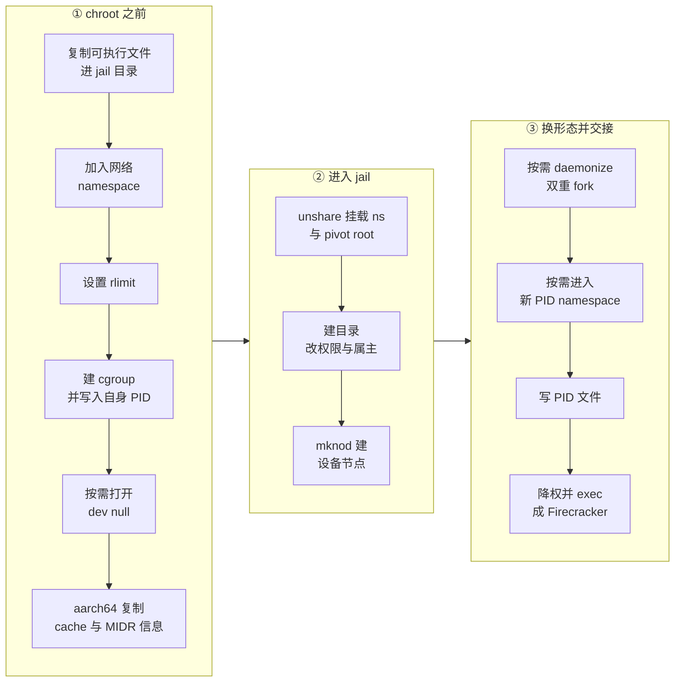

# 43 · jailer：chroot、cgroup 与 namespace

> jailer 是一个只活几毫秒的程序：它以 root 起，把一个空目录布置成 Firecracker 能在里面跑起来的最小环境，
> 设好 cgroup、资源上限与 namespace，降权，然后 `exec` 成 Firecracker。本篇讲这些步骤的顺序为什么是这个顺序、
> 每一步挡住了什么，以及有哪些事它明确不做。
>
> **读者**：系统工程师、运维。　**预备**：[第 07 篇 · 进程启动](07-process-startup.md)、
> [第 42 篇 · seccomp](42-seccomp.md)。　**代码**：`src/jailer/src/main.rs`、`src/jailer/src/env.rs`、
> `src/jailer/src/chroot.rs`、`src/jailer/src/cgroup.rs`、`src/jailer/src/resource_limits.rs`
>
> 本篇的所有仓库相对路径都以 firecracker 仓库根为基准。

---

## 0. 本篇要回答的问题

1. seccomp 已经限制了系统调用，为什么还需要一个单独的 jailer 程序？
2. jail 的目录布局是什么，里面必须有哪些文件与设备节点？
3. `Env::run()` 的步骤顺序由什么决定，哪些步骤换了位置就不成立？
4. `chroot.rs` 为什么不只调用 `chroot()`，`pivot_root` 这一串动作各自解决什么问题？
5. cgroup v1 与 v2 的处理有什么不同，`inherit_from_parent` 解决的是什么问题？
6. `--daemonize` 与 `--new-pid-ns` 分别改变了进程形态的哪一面，怎么拿到 Firecracker 的 PID？
7. jailer 明确不负责的事情有哪些？

---

## 1. 问题：过滤系统调用不等于限制可达的对象

[第 42 篇](42-seccomp.md)末尾指出了 seccomp 的能力上限：它比较的是系统调用的寄存器参数，
不能解引用指针，所以 `openat` 只能整条放行或整条禁止，不可能按路径过滤。
换句话说，seccomp 限制的是 Firecracker **能做哪类动作**，限制不了它**能作用于哪些对象**。

一台宿主上会同时跑几十上百个 Firecracker 进程，每个进程服务一个互不信任的租户。
需要保证的是：即使某个进程被 guest 打穿，攻击者也看不到别的租户的磁盘镜像、
改不动宿主的配置文件、抢不走整台机器的 CPU 与内存、发不出别的租户网络命名空间里的包。
这几条都不是系统调用种类层面的问题，是**命名空间与权限**层面的问题。

jailer 提供的就是这一层。它不是监督进程，也不常驻：它做完布置工作就 `exec` 成 Firecracker，
把自己的进程映像换掉。此后系统里只有一个进程，它的 PID 就是 jailer 原来的 PID（不加 `--new-pid-ns` 时），
它的文件系统根是那个 jail 目录，uid 是一个非特权用户，cgroup 与 namespace 都已就位。
这个「一次性启动器」的形态有一个直接后果：**jailer 退出后没有任何东西在监视这些限制**，
清理 jail 目录与 cgroup 目录是调用方的责任。

`docs/jailer.md` 的免责声明写得很直接：jailer 只为 Firecracker 设计，
不适用于别的二进制，而且要求配套使用同版本的静态链接（musl）Firecracker。
`Env::validate_exec_file()` 把这一点硬编码成了检查 —— `--exec-file` 的文件名里必须包含 `firecracker`，
否则报 `ExecFileName`。

---

## 2. jail 的目录布局

jail 目录由四段拼成（`src/jailer/src/env.rs` 的 `Env::new()`）：

```text
<chroot-base-dir>/<exec_file_name>/<id>/root
       ↓                ↓            ↓
  默认 /srv/jailer   一般是         --id 给的
                   firecracker    实例标识
```

`--id` 要通过 `validate_instance_id()`，只允许字母数字与连字符，最长 64 字符；
`--chroot-base-dir` 必须已经存在且是目录。把可执行文件名放进路径里，是为了让同一台宿主上
不同版本的 Firecracker 各有一棵子树。

chroot 之后 jailer 建出这样一棵树（`FOLDER_HIERARCHY` 与 `mknod_and_own_dev()`）：

```text
/                       0700, 属主 uid:gid
├── firecracker         从宿主复制进来的可执行文件
├── firecracker.pid     子进程 PID，exec 前写入
├── dev/
│   ├── kvm             字符设备 10:232
│   ├── urandom         字符设备 1:9，尽力而为
│   ├── userfaultfd     字符设备 10:<从 /proc/misc 查到的次设备号>，宿主有才建
│   └── net/
│       └── tun         字符设备 10:200
└── run/                供 API socket 等运行时文件使用
```

四个目录（`/`、`/dev`、`/dev/net`、`/run`）都被 `chmod 0700` 并 `chown` 给目标 uid/gid。
设备节点用 `mknod()` 现场创建而不是 bind mount 进来，因为 chroot 之后已经没有宿主的挂载点可用了；
主次设备号是写死的常量。

三个设备的处理不一样，差别有意义。`/dev/net/tun` 与 `/dev/kvm` 失败就报错退出 —— 没有它们 microVM 根本起不来。
`/dev/urandom` 失败只打一条警告，并提示 MMDS v2 将不可用（token 需要随机数，见[第 32 篇 · MMDS](32-mmds.md)）。
`/dev/userfaultfd` 则先查 `/proc/misc` 拿次设备号（`get_userfaultfd_minor_dev_number()`），
查不到就当宿主不支持，根本不建 —— 这条路径决定了 jail 里的 Firecracker 能不能用 uffd 后备的内存
（[第 39 篇 · userfaultfd 后端](39-uffd-backend.md)）。

可执行文件是**复制**进来的，不是硬链接。`copy_exec_to_chroot()` 的注释给了两个理由：
硬链接跨设备不成立；更重要的是硬链接会让多个 Firecracker 进程共享同一份只读代码页，
而这在 Firecracker 的威胁模型里不是想要的性质。代价是每个 jail 多占一份二进制的磁盘空间与页缓存。

需要强调的是，**guest 用到的其它资源 —— 内核镜像、rootfs、额外的磁盘镜像 —— 不由 jailer 搬进来**。
`docs/jailer.md` 明确说这是使用者的事：自己硬链接或复制进 jail，自己管好属主与读写权限。

---

## 3. `Env::run()` 的顺序

`main_exec()` 在解析参数之前先做 `sanitize_process()`：用 `close_range(3, UINT_MAX, CLOSE_RANGE_UNSHARE)`
关掉从父进程继承来的所有文件描述符（保留标准输入输出错误），再清空全部环境变量。
这两件事防的是同一类问题：调用方无意中把一个打开的 fd 或一个带敏感信息的环境变量漏进 jail。

之后 `Env::new()` 解析并校验参数，`main_exec()` 建出 jail 目录，`Env::run()` 开始布置。



顺序不是随意的，几处必须在 chroot 之前：

- **cgroup**。代码注释直说了原因：cgroup 的配置要写 `/sys/fs/cgroup` 下的文件，chroot 之后那棵树就不可见了。
- **网络 namespace**。`join_netns()` 要 `open()` 一个 `/var/run/netns/<name>` 这样的路径再 `setns()`，
  同样依赖宿主的文件系统视图。
- **`/dev/null`**。`--daemonize` 要把标准输入输出重定向到它，而 jail 里没有这个节点，
  所以先在宿主上打开，把 fd 带进去。
- **aarch64 的 cache 与 MIDR 信息**。`copy_cache_info()` 与 `copy_midr_el1_info()` 从
  `/sys/devices/system/cpu/...` 读出来写进 jail 里的同名路径，供 Firecracker 后续构造 FDT 使用
  （[第 19 篇 · aarch64 平台](19-aarch64-platform.md)）。这是一个只在 aarch64 上编译的分支。

反过来，`--daemonize` 的双重 fork 被刻意放在很靠后的位置。`docs/jailer.md` 的说明是：
jailer 目前只能往标准输出与标准错误打日志，太早切断这两个描述符，前面所有步骤的错误信息就都看不见了。
这是一个「可观测性优先于形态整洁」的取舍，文档里也写明了这是暂时状态。

---

## 4. chroot 这一步做了什么

`src/jailer/src/chroot.rs` 的 `chroot()` 不是一次 `chroot(2)`，而是六个动作：

1. `unshare(CLONE_NEWNS)`：进入一个新的挂载 namespace，后续的挂载操作不影响宿主。
2. `mount(NULL, "/", NULL, MS_SLAVE | MS_REC, NULL)`：把这个 namespace 里所有挂载点的传播类型递归改成 slave。
   这既让后面的 `pivot_root` 合法，也保证 jail 内的挂载变化不会往宿主传播。
3. 把 jail 目录 bind mount 到它自己身上（`MS_BIND | MS_REC`）。这一步是为了绕过 `pivot_root`
   的一条限制：新根与旧根不能在同一个文件系统上。bind mount 之后 jail 目录自己成了一个挂载点。
4. `chdir` 进 jail 目录，建一个相对路径的 `old_root` 子目录，调用 `pivot_root(".", "old_root")`。
   `pivot_root` 没有 libc 包装，代码里直接 `syscall(SYS_pivot_root, ...)`。
5. `chdir("/")`，因为 `pivot_root` 不保证当前目录已经是新根。
6. `umount2("old_root", MNT_DETACH)` 再 `rmdir("old_root")`。

最后一步是关键：`chroot(2)` 的经典逃逸手法依赖于进程仍然持有旧根的某个引用，
而 `pivot_root` 加上卸载并删除 `old_root` 之后，旧的文件系统树在这个挂载 namespace 里不再有任何名字。
文件头的注释把这称为「相比只用 chroot 更硬的 jail」。

注意这里没有用户 namespace，也没有 PID namespace（除非显式加 `--new-pid-ns`），
只有挂载 namespace 与可选的网络 namespace。隔离的强度因此是有边界的：
jail 里的进程仍然在宿主的 PID 空间与用户空间里，看得见 `/proc` 下的其它进程（如果它自己挂载了 procfs），
只是它的文件系统视图与网络视图被换掉了。

---

## 5. cgroup

cgroup 的处理在 `src/jailer/src/cgroup.rs`，两个版本两套实现，由 `--cgroup-version` 选择，
**默认值是 `1`**。在只挂载了 cgroup v2 的宿主上必须显式传 `--cgroup-version 2`，否则
`CgroupHierarchies::new()` 找不到 v1 挂载点，报 `CgroupHierarchyMissing`。

`CgroupHierarchies::new()` 用一条正则扫 `/proc/mounts`，从每一行里抓出挂载目录、
版本（`cgroup2` 与 `cgroup` 的区别）与挂载选项。v2 是单一层级，找到就记为 `unified`；
v1 有多个层级，先把所有挂载点缓存下来，等到真要建某个控制器的 cgroup 时，
再按挂载选项里有没有这个控制器名去匹配（`get_v1_hierarchy_path()`）。
`docs/jailer.md` 的 Caveats 提到，如果用 `all` 选项把所有 v1 控制器堆在一个挂载点上，这套逻辑会认不出来。

`--cgroup` 参数可以给多次，格式是 `<控制器>.<属性>=<值>`，例如 `cpu.shares=10`。
cgroup 的路径是 `<层级根>/<parent_cgroup>/<id>`，`--parent-cgroup` 默认取可执行文件名。
参数里的路径成分被校验过：`.`、`..` 与绝对路径都拒绝（`CgroupInvalidParentPath` 与 `CgroupInvalidFile`），
否则写路径就能逃出预期的子树。

两个版本的差异集中在三处：

| 维度 | cgroup v1 | cgroup v2 |
|---|---|---|
| 层级 | 每个控制器一棵树，按需发现 | 单一 unified 树 |
| 加入进程 | 写 `tasks` | 写 `cgroup.procs` |
| 启用控制器 | 建目录即可 | 要沿路径逐级往 `cgroup.subtree_control` 写 `+<控制器>` |

v2 还多一层校验：`CgroupV2::add_property()` 会先看这个控制器是否在 `cgroup.controllers` 里出现过，
没有就直接报 `CgroupControllerUnavailable`，不会写出一个静默无效的配置。

v1 特有的是 `inherit_from_parent()`。问题在于：新建的 cgroup 目录里会自动出现控制器的配置文件，
但内容不一定被填上，而有些控制器（`cpuset` 最典型）在 `cpuset.cpus` 为空时拒绝接收进程。
这个函数递归往上找到第一个非空的同名文件，把它的第一行抄下来。
注释里还承认了一个竞态：多个 jailer 并发时可能有另一个进程先写了父目录的那个文件，
这时自己的写入会失败，但这不影响结果，因为真正在意的是「文件不再为空」。

最后是 `setup_cgroup_conf()`：它把所有 cgroup 迭代两遍，第一遍 `write_values()`，第二遍 `attach_pid()`。
分两遍的原因写在注释里 —— 某些属性必须在进程加入之前设好（`cpuset.mems` 与 `cpuset.cpus`）。
attach 的是 jailer 自己的 PID，而 `exec` 不改变 PID 与 cgroup 归属，所以 Firecracker 自然落在同一个 cgroup 里。

还有一条容易忽略的路径：如果用了 v2 且**一条 `--cgroup` 都没给**，`Env::new()` 会检查
`<unified 根>/<parent_cgroup>` 是否存在，存在就把自己的 PID 写进它的 `cgroup.procs`。
这让「只想把进程放进一个外部已经配好的 cgroup」成为可能，不必逐条重复它的属性。

与 cgroup 并列的还有 `--resource-limit`（`src/jailer/src/resource_limits.rs`），
走的是 `setrlimit` 而不是 cgroup，只支持两项：`fsize`（创建文件的最大字节数）与
`no-file`（文件描述符上限，默认 2048）。它们作用于进程，cgroup 作用于一组进程，两者不可互相替代。

---

## 6. 进程形态与交接

布置完成后，jailer 要把自己变成 Firecracker。这一步有三种形态。

**默认**：调用 `save_exec_file_pid()` 把自己的 PID 写进 `/firecracker.pid`，
然后 `exec_command()` 走 `Command::exec()`。这个调用不返回 —— 返回了就是出错，
所以 `run()` 的这一支把返回值直接包成 `JailerError::Exec`。
`exec` 之前通过 `CommandExt` 设了 `uid()` 与 `gid()`，降权发生在 `execve` 的同时。
传给 Firecracker 的参数是四个计时与标识参数（`--id`、`--start-time-us`、`--start-time-cpu-us`、
`--parent-cpu-time-us`）加上命令行 `--` 之后的全部透传参数。那四个参数解释了 Firecracker
为什么能报出一个包含 jailer 启动耗时的进程启动时延（[第 44 篇 · 日志与 metrics](44-logging-and-metrics.md)）。

**`--daemonize`**：经典的双重 fork。第一次 fork 让子进程不再是进程组组长，
于是 `setsid()` 能成功，进程脱离控制终端；第二次 fork 让孙进程不是会话组长，
因而无法重新获得控制终端。之后把标准输入输出错误都 `dup2` 到先前打开的 `/dev/null`。
最终 `exec` 的是孙进程，PID 与 jailer 启动时的 PID 不同 —— 这正是 PID 文件存在的理由。

**`--new-pid-ns`**：`exec_into_new_pid_ns()` 用 `clone(CLONE_NEWPID)` 派生子进程。
父进程不进新 namespace，子进程成为新 namespace 里的 1 号进程；父进程把子进程的 PID
写进 PID 文件后 `exit(0)`。这里有一处不显眼的处理：如果 jailer 本身是会话组长，
子进程要先 `setsid()`。原因写在函数开头的长注释里 —— PID namespace 的 1 号进程只有在自己注册了
信号处理函数时才收得到祖先 namespace 发来的信号，而 Firecracker 恰好注册了 SIGHUP 处理函数；
jailer 作为会话组长退出时会给会话成员发 SIGHUP，于是 Firecracker 会莫名其妙地收到一个终止信号。
让子进程另起一个会话就避开了这条路径。

三种形态下 PID 文件都会写，路径是 jail 根目录下的 `<exec_file_name>.pid`，
`docs/jailer.md` 建议的做法就是读它。文件用 `create_new(true)` 打开，
所以同一个 jail 目录被重复使用时会直接报错而不是覆盖。

---

## 7. jailer 不做什么

把边界说清楚，比罗列它做了什么更重要。

- **不做资源准备**。内核镜像、rootfs、额外磁盘、vsock 的 Unix socket 都要使用者自己放进 jail 并设好权限。
- **不做清理**。jailer `exec` 之后就不存在了，jail 目录与 cgroup 目录的删除是调用方的事；
  `docs/jailer.md` 提到可以用 cgroup 的 `notify_on_release`，同时提醒了其中的竞态。
- **不做资源分配策略**。默认不绑 NUMA 节点、不绑核，要做就自己用 `--cgroup` 写。
- **不降低自身权限**。jailer 必须以 root 运行；文档说它实际需要的是一组更小的 capability，
  但目前没有细分。这意味着调用方要以 root 启动它，被攻破的 jailer 就是宿主的 root。
- **不监督被 exec 的进程**。没有重启、没有超时、没有健康检查。

最后，jailer 与 seccomp 的分工可以这样记：**seccomp 决定进程能发出哪些系统调用，
jailer 决定这些系统调用能触及哪些对象。** 两者都不完备，叠起来才构成 Firecracker 文档里说的那道边界。
把 jailer 拿掉而只留 seccomp，进程仍然能 `openat` 宿主上任何它有权限读的文件；
把 seccomp 拿掉而只留 jailer，进程仍然能在 jail 里 `execve` 一个自己写出来的二进制。

---

## 8. 后续各层的差异

`src/jailer/` 的代码在 e2b 定制版与 ARM 适配版中都没有改动。
但两层的实际部署都**不使用 jailer**：Firecracker 进程由 orchestrator 直接用
`ip netns exec <namespace> firecracker --api-sock …` 拉起，网络隔离由预先建好的网络 namespace 提供，
文件系统边界与 cgroup 限额则由部署侧的其它机制承担或者不承担。

cgroup 这一项在 ARM 部署里也没有人接手。orchestrator 一侧有一个 cgroup v2 管理器，
但把 Firecracker 进程原子放进 cgroup 的那段代码（`CLONE_INTO_CGROUP`）在进程启动路径上是注释掉的，
传下去的是「没有 cgroup fd」这个哨兵值；管理器的初始化在宿主没挂 cgroup v2 时也只打一条日志就返回。
于是 jailer 原本提供的 CPU 与内存限额在这套部署里既不由 jailer 提供，也不由 orchestrator 提供。
这条选择的后果与替代方案见[第 63 篇 · 与 e2b infra 的对接](63-integration-with-e2b-infra.md)。

---

## 9. 小结

- jailer 是一次性的启动器，不是监督进程：布置完环境就 `exec` 成 Firecracker，此后无人维持这些限制。
- jail 路径是 `<chroot-base-dir>/<exec_file_name>/<id>/root`；可执行文件被复制而非硬链接，
  理由是避免两个 Firecracker 进程共享内存页。
- 设备节点用 `mknod` 现场创建；`/dev/kvm` 与 `/dev/net/tun` 是硬性的，`/dev/urandom` 与
  `/dev/userfaultfd` 是尽力而为的，后两者缺失分别影响 MMDS v2 与 uffd 内存后端。
- 步骤顺序由「哪些操作依赖宿主的文件系统视图」决定：cgroup、netns、`/dev/null`、
  aarch64 的 cache 信息都必须在 chroot 之前完成。
- `chroot()` 实际是 unshare 挂载 namespace + 递归 slave + 自绑定挂载 + `pivot_root` + 卸载删除旧根，
  目的是让旧文件系统树在这个 namespace 里不再有任何名字。
- cgroup v1 与 v2 走两套代码，默认版本是 1；v1 需要 `inherit_from_parent` 处理空配置文件，
  v2 需要逐级写 `subtree_control`；属性写入与进程加入分两遍，因为 `cpuset` 要求先配置后加入。
- `--daemonize` 用双重 fork，`--new-pid-ns` 用 `clone(CLONE_NEWPID)`；两种情况下 Firecracker 的 PID
  都与 jailer 的初始 PID 不同，统一从 jail 根目录的 `firecracker.pid` 读取。
- jailer 不准备资源、不清理、不绑核、不降自身权限、不监督子进程，这些都是调用方的责任。
- 两层部署都不用 jailer；网络隔离改由预建的网络 namespace 提供，cgroup 限额则两边都没有接手。

---

## 延伸阅读 / 下一篇

- [第 44 篇 · 日志与 metrics](44-logging-and-metrics.md)：jailer 传进来的计时参数最终出现在哪里。
- [第 42 篇 · seccomp](42-seccomp.md)：另一半隔离，以及两道边界为什么必须叠加。
- [第 47 篇 · 测试体系](47-testing.md)：`tests/integration_tests/security/test_jail.py` 验证了哪些性质。
- [e2b 手册第 28 篇](../e2b-infra/28-firecracker-process-management.md)：不使用 jailer 的那套进程管理是什么形态。
- 上游文档 `docs/jailer.md`。
