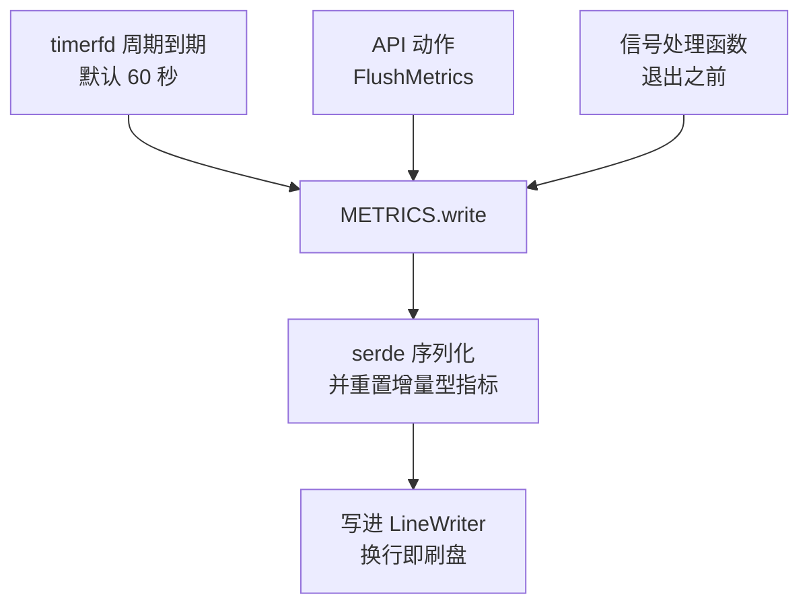

# 44 · 日志与 metrics

> Firecracker 进程里没有监控代理，也没有采集线程。可观测性由两个全局静态量承担：一个 `LOGGER`
> 负责人类可读的行，一个 `METRICS` 树负责机器可读的计数。本篇讲这两套东西的结构、
> 写出的时机与格式，以及它们各自在什么情况下会悄悄丢数据。
>
> **读者**：系统工程师、运维。　**预备**：[第 09 篇 · rpc_interface](09-rpc-interface.md)、
> [第 12 篇 · Vmm、事件循环与退出路径](12-vmm-event-loop-and-exit.md)。　**代码**：
> `src/vmm/src/logger/logging.rs`、`src/vmm/src/logger/metrics.rs`、`src/vmm/src/logger/mod.rs`、
> `src/firecracker/src/metrics.rs`、`src/vmm/src/vmm_config/metrics.rs`

---

## 0. 本篇要回答的问题

1. 日志的一行由哪些字段组成，哪些字段可以关掉，过滤器怎么工作？
2. `METRICS` 是什么形状的数据结构，它为什么能在信号处理函数里被安全地写出？
3. `IncMetric` 与 `StoreMetric` 的差别是什么，为什么「序列化」这个动作会顺便重置计数器？
4. metrics 有哪几条写出路径，默认周期是多少？
5. `latencies_us` 里的十个值分别测的是哪一段，为什么同一件事有 API 级与 VMM 级两个数？
6. 这套系统在什么情况下会丢数据，丢了之后有没有痕迹？

---

## 1. 设计约束

先看约束，再看实现。Firecracker 的可观测性受三条约束挤压。

第一，**不能引入额外线程**。每多一个线程就多一份 seccomp 过滤器要维护，
也多一份内存占用；而 microVM 的卖点之一就是进程本身足够小。

第二，**记录点分布在所有线程上，而且在热路径上**。vCPU 线程每处理一次 MMIO 退出就要记一笔，
设备线程每收发一个包就要记一笔。任何需要加锁的记录方式都会把可观测性变成性能问题。

第三，**进程可能在任何时刻死掉，而恰恰是那一刻的数据最有价值**。
SIGSYS（seccomp 拒绝）、SIGSEGV、SIGBUS 的处理函数必须能把指标写出去，
而信号处理函数里能安全做的事非常有限。

`src/vmm/src/logger/metrics.rs` 的模块注释把由此推出的设计目标列得很明确：
用无锁操作，靠内部可变性让所有方法都能在一个非 `mut` 的全局静态量上调用，
序列化交给 serde，所有指标从 0 开始因而可以 `derive(Default)`。
同一段注释也承认了局限：metrics 只写到缓冲区里，写出的可靠性不由这套系统负责。

---

## 2. 日志

日志的后端是 `log` crate，Firecracker 提供实现：`src/vmm/src/logger/logging.rs` 的
`pub static LOGGER: Logger`，内部是一个 `Mutex<LoggerConfiguration>`，
持有输出目标、模块过滤器与两个格式开关。`Logger::init()` 把它注册成 `log` 的全局 logger。

配置有两个入口：命令行参数（`--log-path`、`--level`、`--module`、`--show-level`、`--show-log-origin`，
在 `src/firecracker/src/main.rs` 里读出后调用 `LOGGER.update()`）与 API 的 `PUT /logger`
（请求体对应 `LoggerConfig`，字段同名）。两者走同一个 `update()`，所以运行中可以改级别与目标。

`--log-path` 指向的文件用 `O_NONBLOCK` 并以读写方式打开。这两个标志合起来说明了一件事：
**这个路径可以是一个命名管道**。以非阻塞方式打开管道，读端还没来时不会卡住；
以读写方式打开，管道不会因为暂时没有读端而让写入立刻报错。
没有配置 `log_path` 时，日志写标准输出。

一行日志的格式在 `Logger::log()` 里拼出来：

```text
<本地时间> [<实例 id>:<线程名>:<级别>:<源文件>:<行号>] 消息正文
                                        \____ 可选 ____/  \____ 可选 ____/

例（打开了 show-level，未打开 show-log-origin）：
2026-09-14T08:12:03.481293 [i-0abc:fc_vcpu 0:WARN] 消息正文
```

实例 id 来自全局 `INSTANCE_ID`（由 `--id` 设定，未设时是 `anonymous-instance`），
线程名来自 `thread::current().name()`，所以日志里能直接看出这一行是 `fc_vcpu 0`、`fc_api`
还是主线程打的 —— 这与 [第 42 篇](42-seccomp.md)讲的三类 seccomp 过滤器是同一组线程。
级别与来源默认都不打印，要 `--show-level` / `--show-log-origin` 打开。

过滤有两级。级别过滤由 `log` crate 的 `max_level` 完成，默认 `Info`；
`LevelFilter` 的反序列化实现额外接受大小写混写与 `Warning` 这个旧拼法，
代码注释说明这是为了不破坏既有配置，下一个破坏性版本会去掉。
模块过滤在 `Logger::log()` 内部，判据是 `record.module_path()` 是否以配置的字符串**开头**，
所以 `--module vmm::devices` 会把整棵设备子树的日志留下。
配了 `module` 但某条记录没有模块路径时，这条记录被丢弃。

一个容易被忽略的行为：写入失败不会报错，也不会往标准错误打任何东西，
只是把 `logger.missed_log_count` 加一。代码注释解释了原因 —— 在日志系统内部报告日志系统的错误会绕回自身。
代价是日志的丢失只能从 metrics 里看出来，这也是这两套系统必须配套读的原因之一。

还有一点值得记住：`Logger::log()` 在写之前要拿那把 `Mutex`。日志是全局串行的，
所以在热路径上打 `debug!` 会真实地影响并发。这是「日志走互斥、指标走原子」这个分工的直接后果。

---

## 3. 两种指标

`src/vmm/src/logger/metrics.rs` 定义了两个 trait 与两个实现。

`IncMetric` 是计数器：`add()`、`inc()`、`count()`、`fetch_diff()`。
实现 `SharedIncMetric` 是**两个** `AtomicU64`：第一个是当前值，第二个是上次刷出时的值。
`StoreMetric` 是当前值指示器：`store()`、`fetch()`，实现 `SharedStoreMetric` 只有一个 `AtomicU64`。
两者的原子操作都用 `Ordering::Relaxed`，注释里说明 `fetch_add` 本身就是跨线程原子的，
这里不需要更强的序。

`SharedIncMetric` 为什么要存两个值，在 `Serialize` 的实现里才看得出来：
序列化时读出当前值，**输出的是当前值减去上次刷出时的值**，写成功之后把当前值存进第二个槽。
换句话说，**每次刷出的都是这一个周期内的增量，而且序列化这个动作本身就是重置。**
源码的注释把这个后果单独标了出来：任何一次刷出 metrics 都会重置计数。

这个设计换来的是：刷出的那个线程不需要对每个计数器再做一次写操作去清零，
也就不需要与所有记录方做同步；而且写出失败时数据不会丢 —— 因为第二个槽只在写成功后才更新，
下一次刷出的增量会把这段时间一起算上。

`SharedStoreMetric` 的序列化不改状态，就是当前值。哪些指标用哪一种是有讲究的，
最能说明问题的是 `SignalMetrics`：致命信号的计数器全部是 `SharedStoreMetric`，
注释给的理由是 `SharedIncMetric` 的序列化「读—写」两步不是原子的，
而信号处理函数可能在任意线程上与一次正常的 `METRICS.write()` 并发；
致命信号的取值只有 0 和 1，用 store 型就没有这个竞态。
`SIGPIPE` 是七个信号计数里唯一的例外，它不致命（处理函数只记一笔就返回，让 `EPIPE` 由调用方处理），所以是 inc 型，
也是这七个里唯一会累加的。同一条理由也用在 `vmm.panic_count` 上：它是 store 型，panic 路径也要写 metrics，
所以取值只区分「发生过」与「没发生过」，不统计次数。

第三种形态是 `LatencyAggregateMetrics`：三个字段 `min_us`、`max_us`、`sum_us`。
配套的 `LatencyMetricsRecorder` 在构造时取一次单调时钟，在 `Drop` 里算出差值并更新这三个值。
用 `Drop` 而不是显式的 `stop()`，是为了让作用域结束就等于测量结束，不会因为提前 `return` 漏掉。

---

## 4. METRICS 这棵树

全局量是 `pub static METRICS: Metrics<FirecrackerMetrics, FcLineWriter>`。
`Metrics` 只有两个字段：一个 `OnceLock<Mutex<M>>` 的输出缓冲，一个 `FirecrackerMetrics` 应用数据。
它实现了 `Deref` 到后者，所以代码里写 `METRICS.vcpu.exit_mmio_read.inc()` 就能直达叶子。

```text
FirecrackerMetrics
├── utc_timestamp_ms          序列化时生成的时间戳，永远是第一个字段
├── api_server                进程启动时延、同步响应失败数
├── put_api_requests          按资源分的 PUT 请求计数与失败计数
├── get_api_requests          同上，GET
├── patch_api_requests        同上，PATCH
├── deprecated_api            命中废弃接口的次数
├── latencies_us              快照与暂停恢复的时延（第 6 节）
├── logger                    missed_log_count / log_fails / missed_metrics_count / metrics_fails
├── mmds                      元数据服务
├── seccomp                   num_faults
├── signals                   sigbus / sigsegv / sigxfsz / sigxcpu / sigpipe / sighup / sigill
├── vcpu                      四类 KVM 退出的计数与 min max sum、失败数
├── vmm                       device_events、panic_count
└── 设备（serde flatten，提到顶层）
    ├── block / block_<drive_id>
    ├── net   / net_<iface_id>
    ├── vsock、balloon、entropy、vhost_user、legacy 串口等
```

最后一组用 `#[serde(flatten)]` 声明，所以它们在 JSON 里不是嵌在某个 `devices` 对象下，
而是直接出现在顶层。每类设备既有按实例 id 分组的条目，也有一个聚合条目：
`src/vmm/src/devices/virtio/net/metrics.rs` 的模块注释解释了这个安排 ——
按实例分组是为了能定位到具体哪块网卡出了问题，保留聚合条目是为了不破坏既有的消费方。
键名用配置时的 id（`net_eth0` 对应 `/network-interfaces/eth0`）而不是宿主上的 tap 名，
这样 metrics 的键与 API 路径对得上。同一份注释还指出，设备的 metrics 放在设备模块的全局量里
而不是设备结构体里，正是为了让信号处理函数也能把它们刷出去。

---

## 5. 什么时候写出

输出目标由 `--metrics-path` 指定，`src/vmm/src/vmm_config/metrics.rs` 的 `init_metrics()`
以非阻塞方式打开它，包一层 `FcLineWriter`（`LineWriter<File>` 的别名）交给 `METRICS.init()`。
`OnceLock` 保证只能初始化一次，重复调用报 `AlreadyInitialized`。
**没有 `--metrics-path` 时整套 metrics 仍在记录，只是无处可写**：`METRICS.write()` 返回 `Ok(false)`，
不报错。这是一个安静的失败模式，值得在排查「metrics 文件是空的」时首先排除。

写出有三条路径：



第一条是常规路径。`src/firecracker/src/metrics.rs` 的 `PeriodicMetrics` 是一个
`MutEventSubscriber`，注册到 VMM 线程的事件循环里，靠一个周期性 `TimerFd` 驱动，
周期常量 `WRITE_METRICS_PERIOD_MS` 是 60 000。`start()` 除了武装定时器还会**立刻刷一次**，
注释说明这是为了尽早把进程启动时延写出来。写失败时给 `logger.missed_metrics_count` 加一并打一条错误日志。

还有一条与暂停有关的性质：VMM 线程处理完 `Pause` 之后不返回事件管理器，而是停在一个只等 `Resume` 的内层循环里，
所以**暂停期间这条周期路径不工作**，timerfd 累积的超时要等 resume 之后才被一次性消化
（[第 12 篇 §5](12-vmm-event-loop-and-exit.md#5-定时与指标)）。暂停中的 microVM 想要一份新数据，只能走下面第二条路径。

第二条是显式请求：`PUT /actions` 的 `action_type` 为 `FlushMetrics`，
落到 `src/vmm/src/rpc_interface.rs` 的 `flush_metrics()`，直接调 `METRICS.write()`。
这个动作**在 microVM 启动之前不可用**，`PrebootApiController` 把它归在
`OperationNotSupportedPreBoot` 那一组里。`flush_metrics()` 里有一条 `FIXME` 注释，
说明它丢掉了 `write()` 返回的那个「是否真的写出去了」的布尔值 ——
所以一次成功的 `FlushMetrics` 响应并不保证 metrics 落了盘。

第三条是退出路径。`src/vmm/src/signal_handler.rs` 的 `exit_with_code()` 在 `_exit()` 之前调用
`METRICS.write()`。`Metrics::write()` 的文档注释专门讨论了这条路径：它承认在信号处理函数里
调用这个函数会与正常刷出竞争，做法是让致命信号的指标用 store 型以保证那一个值是对的，
并接受「其它指标可能没有被正确写出」作为代价 —— 进程反正要死了，此刻重要的只有信号本身那一笔。

序列化用 `serde_json::to_string()`，结果加一个换行写进 `LineWriter`；
`LineWriter` 遇到换行自动刷出，所以不需要显式 `flush()`。
每次写出是一整行 JSON，因此 metrics 文件是一个逐行 JSON 的流，不是一个 JSON 文档。

---

## 6. `latencies_us`

`PerformanceMetrics` 有十个字段，五件事各两个：

| 事件 | API 级 | VMM 级 |
|---|---|---|
| 创建 Full 快照 | `full_create_snapshot` | `vmm_full_create_snapshot` |
| 创建 Diff 快照 | `diff_create_snapshot` | `vmm_diff_create_snapshot` |
| 加载快照 | `load_snapshot` | `vmm_load_snapshot` |
| 暂停 | `pause_vm` | `vmm_pause_vm` |
| 恢复 | `resume_vm` | `vmm_resume_vm` |

两组的差别是计时的起点。API 级在 `src/firecracker/src/api_server/mod.rs` 的
`serve_vmm_action_request()` 里记录，起点是 HTTP 请求开始被处理的时刻，
终点是 VMM 线程把结果送回来之后；它包含了请求解析、跨线程传递与等待。
VMM 级在 `src/vmm/src/rpc_interface.rs` 里记录，起点是 VMM 线程真正开始干活的时刻。
两个数一起看，差值就是控制面的开销 —— 这正是判断「暂停慢是慢在快照本身还是慢在排队」的依据。

两组都用 `update_metric_with_elapsed_time()`（`src/vmm/src/logger/mod.rs`）写入，
它取单调时钟的差值、`store()` 进去、再把差值返回给调用方打一条日志。
所以每次这类操作在日志里也留一行「'create full snapshot' API request took N us.」。

这些是 `SharedStoreMetric`，也就是说**它们只保留最后一次的值**。
`PerformanceMetrics` 的注释把这个后果写得很直白：如果一分钟内做了多次 `/snapshot/create`，
刷出的只是最后一次的时长；想要每一次的值，就在每次 `create` 之后发一个 `FlushMetrics`。
这是这套系统里最容易踩的坑 —— 指标不是丢了，是被覆盖了，而且没有任何痕迹。

与之对比，`vcpu` 下的四个 `*_agg` 用的是 `LatencyAggregateMetrics`，
刷出的是这个周期内的最小值、最大值与总和，不会互相覆盖。两种做法的取舍很清楚：
store 型便宜、够用于低频事件；aggregate 型多三个原子量，用于高频事件。

---

## 7. 怎么用这两套东西排查

把前面几节的事实整理成对应关系，读者可以直接照着查：

| 现象 | 先看哪里 |
|---|---|
| 进程突然消失，退出码 148 | `seccomp.num_faults` 与日志里的「bad syscall」行（[第 42 篇](42-seccomp.md)） |
| 进程突然消失，退出码 149 至 157 | `signals` 下对应的那一项：`sigbus` 149、`sigsegv` 150、`sigxfsz` 151、`sigxcpu` 154、`sighup` 156、`sigill` 157 |
| 日志文件行数少于预期 | `logger.missed_log_count`、`logger.log_fails` |
| metrics 文件是空的 | 是否给了 `--metrics-path`；`logger.missed_metrics_count` |
| 暂停或快照变慢 | `latencies_us` 的 API 级与 VMM 级两个值之差 |
| guest I/O 慢 | `vcpu.exit_mmio_*_agg` 的 min/max/sum，再看对应设备的分组条目 |
| 某块网卡或磁盘异常 | `net_<iface_id>` / `block_<drive_id>` 而不是聚合条目 |

要强调的是最后一列全部是**计数与时长**，不是事件流。这套系统不记录「第几次请求失败了」，
只记录「失败了多少次」。需要逐次的证据就得靠日志，而日志的级别默认是 `Info`。

---

## 8. 后续各层的差异

`src/vmm/src/logger/` 与 `src/firecracker/src/metrics.rs` 在 e2b 定制版与 ARM 适配版中都没有改动，
两层也没有新增 metrics 字段。两层各有一处因此产生的语义混用。

e2b 定制版新增的三个内存查询端点在 `src/firecracker/src/api_server/request/memory.rs` 里
统一累加 `get_api_requests.instance_info_count` —— 这个计数器原本只属于 `GET /`。
于是四个端点共用一个计数，从 metrics 上分不清请求打的是哪一个
（[第 50 篇](50-memory-mappings-api.md)、[第 51 篇](51-memory-resident-empty-api.md)、[第 52 篇](52-memory-dirty-api.md)）。

ARM 适配版的原地回滚复用了 `latencies_us.vmm_pause_vm`
来记录一次回滚的耗时，没有为它新开字段 —— 后果是这个字段在开启回滚的部署里混了两种语义，
读数时要结合日志里的动作名区分。见
[第 69 篇 · PUT /snapshot/rollback：阶段、参数与响应](69-rollback-api-and-phases.md)。

---

## 9. 小结

- 可观测性由两个全局静态量承担：`LOGGER` 走互斥锁与人类可读的行，`METRICS` 走原子量与 JSON。
  没有采集线程，没有额外进程。
- 日志行带实例 id 与线程名，级别与来源默认不打印；模块过滤是前缀匹配；
  `--log-path` 用 `O_NONBLOCK` 读写方式打开，因此可以是命名管道。
- 日志写失败不报错，只把 `logger.missed_log_count` 加一 —— 日志的丢失只能从 metrics 看出来。
- 指标分两类：`SharedIncMetric` 存当前值与上次刷出值两份，序列化时输出增量并顺带重置；
  `SharedStoreMetric` 只存一个当前值，序列化不改状态。
- 致命信号的指标必须是 store 型，因为 inc 型的序列化不是原子的，会与信号处理函数里的写出竞争。
- metrics 树顶层按子系统分，设备类用 `serde flatten` 提到顶层，并且每类设备同时有分组条目与聚合条目。
- 三条写出路径：60 秒周期的 timerfd、`FlushMetrics` 动作（启动后才可用）、以及退出前的信号处理函数。
- 没配 `--metrics-path` 时 `METRICS.write()` 返回 `Ok(false)`，不报错；这是一个安静的失败模式。
- 暂停期间事件循环停在内层循环里，周期刷写随之冻结；这时要拿数据只能发 `FlushMetrics`。
- `latencies_us` 的十个字段是 API 级与 VMM 级两两成对，差值即控制面开销；
  它们是 store 型，一个刷出周期内多次操作只留最后一次。

---

## 延伸阅读 / 下一篇

- [第 45 篇 · GDB 调试、tracing 与形式化验证](45-gdb-tracing-and-kani.md)：当计数与日志不够用时还有什么。
- [第 42 篇 · seccomp](42-seccomp.md)：`seccomp.num_faults` 与退出码 148 的来龙去脉。
- [第 37 篇 · 创建快照](37-snapshot-create.md)：`latencies_us` 里那几个快照字段测的是哪一段代码。
- [第 77 篇 · 配置项、命令行参数、环境变量与 metrics 总表](77-config-cli-env-metrics-reference.md)：完整字段清单。
- 上游文档 `docs/logger.md`、`docs/metrics.md`。
