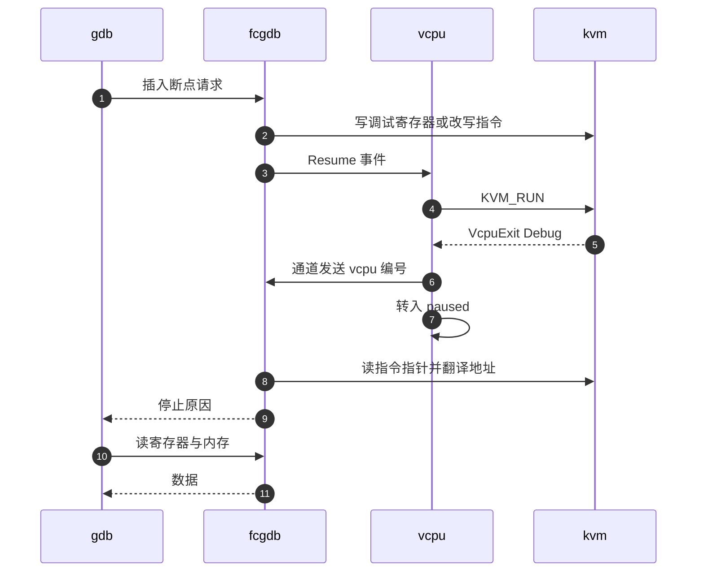
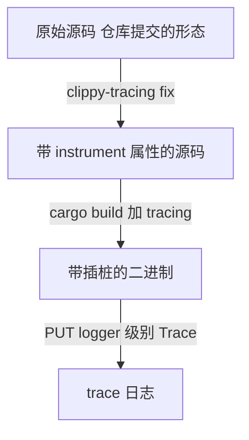

# 45 · GDB 调试、tracing 与形式化验证

> 日志和 metrics 告诉你系统在运行时报了什么，但有三类问题它们回答不了：guest 里的内核卡在哪一行、
> 一次 API 调用在进程内部走了哪条函数路径、一段处理 guest 数据的代码是否对所有输入都安全。
> 上游 v1.12.1 为这三类问题各准备了一套工具，它们的共同点是都不在生产二进制里。
>
> **读者**：需要定位 guest 侧启动问题、VMM 内部时延异常，或评估 Firecracker 安全论证强度的工程师。
> **预备**：[第 05 篇 · 本书用到的 Rust 与依赖 crate](05-rust-and-crates-primer.md)、
> [第 15 篇 · vCPU 线程与状态机](15-vcpu-threads-and-state-machine.md)、
> [第 44 篇 · 日志与 metrics](44-logging-and-metrics.md)。
> **代码**：`src/vmm/src/gdb/`、`src/log-instrument/`、`src/clippy-tracing/`、
> `src/vmm/src/devices/virtio/queue.rs`、`src/vmm/src/rate_limiter/mod.rs`、
> `tests/integration_tests/test_kani.py`

---

## 0. 本篇要回答的问题

1. Firecracker 怎么让 GDB 调试的是 guest 内核，而不是 Firecracker 进程自己？
2. 断点命中之后，vCPU 线程与 GDB 线程之间发生了什么？软件断点与硬件断点的区别落在哪里？
3. 为什么 GDB 支持要做成编译期特性，而不是一个命令行开关？
4. 函数级 tracing 是怎么实现的，为什么需要一个专门的源码改写工具？
5. Kani 证明的是什么性质，哪些代码有证明，哪些没有？一个证明「成立」到底意味着什么？

---

## 1. 问题：三类看不见的东西

日志记录的是代码作者预先决定要记的事件，metrics 记录的是预先定义的计数与时延。
它们覆盖不到的地方有三处。

第一处在 guest 内。microVM 起不来时，Firecracker 侧往往一切正常：设备都挂上了，vCPU 在跑，
没有任何错误日志，只是 guest 内核没有走到 init。这时需要的是在 guest 内核的某个符号上下断点，
看寄存器和内存 —— 也就是把 Firecracker 变成一个 GDB 远程目标。

第二处在进程内的函数路径。一次请求慢了 50 ms，日志只能告诉你它进来和出去的时刻，
中间调用了哪些函数、各自停留多久，无从得知。要回答这个问题只能在每个函数的入口与出口打点。

第三处是「所有输入」。virtio 的队列结构、iovec、以太网帧解析这些代码直接读 guest 写进来的字节
（上游把 vCPU 从启动那一刻起就当作运行恶意代码看待，见 `docs/design.md`）。
单元测试只能覆盖作者想到的输入组合；「不存在任何一组输入会导致越界或 panic」这种命题，测试给不出。

三套工具分别对应这三处：`gdb` 特性、`tracing` 特性与 Kani 证明。前两个是编译期特性，
默认不编进二进制；第三个根本不产生可执行代码，只在 CI 里跑。这不是疏忽而是取舍 ——
每一项都会以体积、性能或攻击面的形式向生产路径收费，所以都被挡在了编译开关后面。

---

## 2. GDB：把 Firecracker 变成一个远程目标

### 2.1 编译期开关与配置入口

GDB 支持由 cargo feature `gdb` 控制。`src/vmm/Cargo.toml` 里它展开为三个可选依赖
（`arrayvec`、`gdbstub`、`gdbstub_arch`），`src/firecracker/Cargo.toml` 的同名 feature 转发到 `vmm/gdb`。
`gdbstub` 这个 crate 实现了 GDB 远程串行协议的服务端，Firecracker 要做的是为它实现一个 `Target`。

开启这个特性后，`machine-config` 多出一个字段 `gdb_socket_path`
（`src/vmm/src/vmm_config/machine_config.rs` 里的 `MachineConfig` 与 `MachineConfigUpdate`，
两处都带 `#[cfg(feature = "gdb")]`）。字段只在启动前可设，通过 `PUT` 或 `PATCH /machine-config` 送进来。

这个字段不进快照。`src/vmm/src/persist.rs` 的恢复路径在重建 `MachineConfigUpdate` 时
显式把 `gdb_socket_path` 置为 `None`，也就是说**从快照恢复的 microVM 无法被调试**。
这一条是硬编码的，没有开关。

把 GDB 做成编译期特性而不是运行时开关，代价是要为它多维护一个构建组合，
收益是生产二进制里不存在这段代码：`gdbstub` 的协议解析要处理来自调试器 socket 的任意输入，
而 `FirecrackerTarget` 持有 vCPU 的 fd 副本并能读写 guest 的任意内存。
CI 对这个组合只做一件事 —— `tests/integration_tests/build/test_gdb.py` 的 `test_gdb_compiles()`
执行 `cargo build --features gdb`，确认它还能编过。**没有任何测试验证调试功能本身是否正确**。

### 2.2 启动与连接

入口是 `src/vmm/src/gdb/mod.rs` 的 `gdb_thread()`，由 `src/vmm/src/builder.rs` 在
`configure_system_for_boot()` 之后、vCPU 线程启动之前调用。它按顺序做四件事：

1. 对 vCPU 0 调 `arch::vcpu_set_debug()`，在内核入口地址上设一个硬件断点；其余 vCPU 只开调试模式不设断点。
2. 在 `gdb_socket_path` 上 `bind` 一个 Unix socket。
3. **阻塞**在 `accept()` 上等调试器连上来。
4. 连上之后 spawn 一个名为 `gdb` 的线程跑 `event_loop()`，自己返回，让构建流程继续。

第 3 步意味着启动被挂起，这正是要的效果：调试器在 guest 执行第一条指令之前就接管，
可以先下断点再放行。入口断点不记入 `FirecrackerTarget` 的断点表，所以第一次 `continue` 时它自然消失。

`event_loop()`（`src/vmm/src/gdb/event_loop.rs`）在真正进入 `gdbstub` 的循环之前，
还要在 `gdb_event` 通道上收一次消息 —— 等 vCPU 0 报告它已经停在入口断点上。

### 2.3 vCPU 线程与 GDB 线程怎么配合

这里有三个线程参与：vCPU 线程跑 `KVM_RUN`，GDB 线程跑协议循环，VMM 线程跑事件循环。
它们之间靠两组通道联系。

第一组是 `gdb_event`：一个 `mpsc` 通道，发送端在 builder 里通过 `Vcpu::attach_debug_info()`
交给每个 vCPU，接收端交给 `FirecrackerTarget`。`src/vmm/src/vstate/vcpu.rs` 的 `run_emulation()`
在 `#[cfg(feature = "gdb")]` 下多了一个分支：`KVM_RUN` 返回 `VcpuExit::Debug(_)` 时，
把自己的编号发进这个通道，然后返回 `VcpuEmulation::Paused`，状态机随之转入 `paused` 状态。
x86_64 上转入 paused 之前还会调一次 `kvmclock_ctrl()`，让 guest 的 softlockup 看门狗
不会因为这段暂停而在恢复后 panic；失败只记 metrics 不报错。

第二组是 vCPU 原有的事件通道（`VcpuEvent::Pause` / `Resume`）。`FirecrackerTarget::pause_vcpu()`
与 `resume_vcpu()` 通过 `Vmm::vcpus_handles` 发这两个事件并同步等回应，
也就是说 GDB 线程复用了[第 15 篇](15-vcpu-threads-and-state-machine.md)那套状态机，没有另起一套暂停机制。

还有第三条路径：寄存器与调试寄存器的读写不走通道。builder 里用 `Vcpu::copy_kvm_vcpu_fd()`
对每个 vCPU 的 fd 做一次 `dup`，把副本交给 GDB 线程，于是 GDB 线程可以直接对 vCPU 发 ioctl，
不必打断 vCPU 线程。代价是同一个 vCPU fd 同时被两个线程持有，
正确性靠「只在 vCPU 已暂停时才用副本」这个约定维持 —— `VcpuState::update_kvm_debug()`
在 `paused` 为假时直接返回并打一条 info 日志，就是这个约定的体现（推论：这只是防御性检查，不是同步机制）。

下图是一次断点命中的过程。`gdb` 指调试器客户端，`fcgdb` 指 Firecracker 的 GDB 线程，
`vcpu` 指 vCPU 线程，`kvm` 指内核里的 KVM。



第 8 步是判断停止原因的地方：`FirecrackerTarget::get_stop_reason()` 先看该 vCPU 是否在单步状态，
否则取指令指针、翻译成 GPA，再依次查软件断点表、硬件断点表与入口地址。
四项都不匹配说明这个断点不是调试器设的 —— 典型情况是 guest 内核自己的启动自检 ——
函数返回 `None`，事件循环转而调用 `inject_bp_to_guest()` 把断点异常注入回 guest 并恢复该 vCPU，
不通知调试器。这一步靠的是 `KVM_GUESTDBG_INJECT_BP` 标志。

### 2.4 两种断点

硬件断点存在 `FirecrackerTarget::hw_breakpoints` 里，类型是 `ArrayVec<GuestAddress, 4>`：
上限 4 个，因为 x86 的调试寄存器只有 4 个地址槽。`src/vmm/src/gdb/arch/x86.rs` 的 `set_kvm_debug()`
把地址写进 `kvm_guest_debug` 的 `debugreg[0..4]`，再在 `debugreg[7]` 里逐位打开对应的使能位。
超过 4 个时 `add_hw_breakpoint()` 返回 `Ok(false)`，由调试器自己决定怎么处理。

软件断点存在 `sw_breakpoints: HashMap<u64, [u8; SW_BP_SIZE]>` 里，键是 GPA。
`add_sw_breakpoint()` 先把原指令字节读出来存进表，再把断点指令写进 guest 内存；
删除时把存下来的字节写回去。x86_64 的断点指令是单字节 `0xCC`（`INT3`），
aarch64 是 4 字节的 `BRK #0`（`src/vmm/src/gdb/arch/aarch64.rs` 里写成 `[0, 0, 32, 212]`）。
软件断点数量不限，代价是要改写 guest 内存，而且在 guest 开启分页之前地址翻译还不可用 ——
上游文档 `docs/gdb-debugging.md` 给出的绕法是先用硬件断点停在 `start_kernel`，之后再下软件断点。

`Target::guard_rail_implicit_sw_breakpoints()` 返回 `false`，也就是关掉了 `gdbstub` 自带的软件断点管理。
原因就是上一节那个注入逻辑：Firecracker 必须自己知道哪些断点是它设的，才能把别的断点还给 guest。

### 2.5 地址翻译的架构差异

调试器给的是 guest 虚拟地址，读写内存要的是 GPA，中间隔着 guest 的页表。两个架构的解法完全不同。

x86_64 上有现成的 ioctl：`translate_gva()` 直接调 `VcpuFd::translate_gva()`（`KVM_TRANSLATE`），
`valid` 为 0 就报错。

aarch64 上 KVM 没有这个 ioctl，`src/vmm/src/gdb/arch/aarch64.rs` 的 `translate_gva()` 自己走页表：
读 `TCR_EL1` 确认翻译已启用且粒度是 4 KiB，读 `ID_AA64MMFR0_EL1` 取物理地址位宽，
从 `TTBR1_EL1` 拿到页表基址，然后逐级读页表项。这个实现有三条写死的前提：
地址必须落在内核空间（第 55 位为 1）、页大小必须是 4 KiB、物理地址位宽必须落在它枚举的六档之内。
不满足就返回 `GvaTranslateError`。这是「实现够用就好」的典型例子：
这段代码只服务调试场景，把通用性换成了一百来行可读的实现。

---

## 3. tracing：每个函数的进出都打一条日志

### 3.1 宏与它的运行时

tracing 不是采样式 profiler，而是彻底的插桩：每个被标注的函数在入口与出口各打一条 `Trace` 级日志。

实现分两个 crate。`src/log-instrument-macros/src/lib.rs` 是过程宏 `#[instrument]`，
它做的事只有一件：在函数体第一条语句前插入
`let __ = log_instrument::__Instrument::new("函数名");`。
`src/log-instrument/src/lib.rs` 是运行时：`__Instrument::new()` 打一条「进入」日志，
`Drop` 实现打一条「退出」日志。利用 Rust 的析构语义，函数从哪个分支返回都会打上出口日志。

为了让日志里带上调用栈，运行时维护一张 `HashMap<ThreadId, Vec<&'static str>>`：
进入时把函数名压栈、退出时弹栈，日志前缀是当前栈的拼接。于是输出形如
`ThreadId(2)::run::handle_request>>try_from`，`>>` 是进入、`<<` 是退出。
代价是这张表由一把全局 `Mutex` 保护，每次函数进出都要取锁 ——
所以这套机制对多线程程序的时序有可观扰动，用它测绝对时延没有意义。

### 3.2 为什么需要 clippy-tracing

`#[instrument]` 是属性宏，必须写在每个函数上。Firecracker 有上万个函数，手工加不现实，
而且加完之后还要能全部撤掉。`src/clippy-tracing` 就是干这件事的独立二进制：
用 `syn` 解析源文件，遍历其中的函数定义，按 `--action` 执行三种动作之一 ——
`check`（缺插桩就以退出码 2 失败）、`fix`（补上）、`strip`（全部删掉），
配合 `--path` 与可重复的 `--exclude` 控制范围。

排除项不是可选项。`docs/tracing.md` 给出的命令里排除了四类文件：测试、bindgen 生成的绑定、
插桩工具自身，以及 `logger/`、`signal_handler.rs`、`time.rs`——
给日志实现本身加上「打日志」的插桩会构成无限递归。



反过来，`clippy-tracing --action strip` 把 B 改回 A，也就是把源码还原成不带插桩的形态。
缩小观察范围就靠这条回路：先全部删掉，
再只给关心的目录加回插桩，然后编译。与之相对的是运行时过滤 —— 插桩全留着，
靠 `PUT /logger` 的 `level` 与 `module` 字段筛选输出。两者的差别在于成本落在哪里：
运行时过滤省掉了格式化与写入，但每个函数仍要进出那把全局锁并判断一次条件；
编译期过滤连插桩本身都不存在。

上游文档给出的量级是二进制增大约 100 KiB、执行速度下降十倍以上。
这个规模解释了为什么 `tracing` 从不进发布二进制，也解释了为什么代码仓库里提交的是**没有**插桩的源码。
需要说明的是，与 `gdb` 不同，CI 里没有任何步骤构建或测试 `tracing` 特性
（`tests/` 下没有引用它的用例，`.buildkite/` 的流水线里也没有对应步骤），
只有 `clippy-tracing` 自己有一套集成测试。

---

## 4. Kani：对关键代码做形式化验证

### 4.1 为什么是这几处代码

Kani 是针对 Rust 的模型检查器：它不执行代码，而是把函数翻译成约束问题，
交给求解器判断「是否存在一组输入使某个断言不成立」。它能查的性质包括越界访问、
空指针解引用、算术溢出、`unwrap()` 在 `None` 上调用，以及用户自己写的 `assert!`。

上游选择证明的位置有一个共同点：**输入由 guest 控制，或者手工测试难以穷尽**。
按 v1.12.1 的代码，带 `#[cfg(kani)]` 证明模块的文件有六个：

| 位置 | 证明数 | 为什么是它 |
|---|---|---|
| `src/vmm/src/devices/virtio/queue.rs` | 16 | 描述符表、avail / used 环全部由 guest 写 |
| `src/vmm/src/dumbo/pdu/ethernet.rs` | 10 | MMDS 要解析 guest 发来的以太网帧 |
| `src/vmm/src/rate_limiter/mod.rs` | 5 + 1 个契约证明 | 令牌桶有整数溢出风险，手工构造反例困难 |
| `src/vmm/src/devices/virtio/iovec.rs` | 2 | 描述符链到 iovec 的转换涉及裸指针 |
| `src/vmm/src/arch/x86_64/mod.rs`、`aarch64/mod.rs` | 各 1 | 内存布局划分的边界条件 |

`src/clippy-tracing` 自己没有证明，它只是在识别函数属性时认得 `#[kani::proof]` 这个标记。

### 4.2 一个证明长什么样

以 `queue.rs` 的 `verify_add_used()` 为例，形状是固定的三段：

```rust
#[kani::proof]
#[kani::unwind(0)]
fn verify_add_used() {
    let ProofContext(mut queue, _) = kani::any();
    // …
    let used_desc_table_index = kani::any();
    if queue.add_used(used_desc_table_index, kani::any()).is_ok() {
        // 断言 used 环的写入位置与 idx 的更新符合规范
    }
}
```

第一段用 `kani::any()` 造出一个任意的队列状态。`kani::Arbitrary for Queue` 的实现
把队列的每个字段都设成任意值，再用 `kani::assume(queue.is_valid(&mem))` 把范围缩回到合法队列。
第二段调用被证明的函数，第三段用 `assert!` 写出要成立的性质。
和单元测试的唯一形式差别就是 `kani::any()` 取代了具体值 —— 但语义差别是根本的：
单元测试检查一组输入，证明检查全部输入。

有几处工程手段值得单独提，它们决定了这些证明能不能在可接受的时间内跑完：

- **替身内存**。`queue.rs` 的证明模块自定义了一个 `ProofGuestMemory`，只含单个内存区域。
  真实的 `GuestMemoryMmap` 要在区域列表里二分查找，那个循环会迫使 Kani 展开，
  换成单区域之后可以用 `kani::unwind(0)`。
- **打桩**。`rate_limiter` 的证明用 `#[kani::stub(std::time::Instant::now, stubs::instant_now)]`
  把时钟换成一个「非递减的任意值」，因为真实时钟对求解器没有意义。
  `iovec` 的证明则把 `IovDeque::push_back` 换掉。
- **契约**。`gcd` 用 `#[kani::proof_for_contract]` 单独证明一次，
  其余证明用 `#[kani::stub_verified(gcd)]` 直接引用结论，避免每次重新展开欧几里得算法。
- **不安全的转换**。为了绕开 `MmapRegion::build()` 里的 `libc::sysconf` 调用，
  证明代码用 `transmute` 从一个结构体字面量造出 `MmapRegion`。注释写明这只在 Kani 下成立：
  Kani 不经过 LLVM，不会重排字段。这是一段只在验证构建里存在的技术债，
  一旦上游结构体字段顺序变化而注释没跟上，证明的前提就悄悄失效了。

### 4.3 怎么跑，以及它证明了什么

CI 入口是 `tests/integration_tests/test_kani.py` 的 `test_kani()`，
执行 `cargo kani` 并打开 `-Z stubbing`、`-Z function-contracts`、`-Z restrict-vtable` 三个不稳定特性，
`-j` 并行跑所有 harness，超时设 1 小时。这个用例带 `skipif`：
不在 CI 环境里就跳过，理由写在代码里 —— 本地机器多半满足不了内存需求。
`.buildkite/pipeline_pr.py` 把这一步排在专用机型上，超时给到 300 分钟，
并且只在 `.rs`、`.toml`、`.lock` 文件有改动时才触发。

最后是边界。`docs/formal-verification.md` 自己把话说得很明白：
证明只和它的假设一样强。上面那些 `kani::assume` 与替身实现都是假设，
它们缩小了被检查的输入空间；假设过强，证明就会漏掉真实存在的场景。
上游给的原则是宁可**过近似** —— 宁可把一些实际不可能出现的状态也纳入检查，
也不要把可能出现的状态排除掉。

还有几件事它不做：不覆盖并发与线程交互，不覆盖时序性质，
不覆盖没有写 harness 的代码（block、net、vsock 的设备逻辑都没有），
也不能替代单元测试 —— 上游明确表示不追求「证明覆盖率」，不要求贡献者为新代码写 harness。
换句话说，Kani 在 Firecracker 里是一把针对少数几处高风险代码的精确工具，不是一道全局防线。

---

## 5. 三种工具的位置

| 维度 | gdb 特性 | tracing 特性 | Kani |
|---|---|---|---|
| 看的对象 | guest 内核的执行 | Firecracker 的函数路径 | Firecracker 的代码性质 |
| 开启方式 | `--features gdb` + `gdb_socket_path` | 改写源码 + `--features tracing` | 不产生可执行代码 |
| 运行时代价 | vCPU 被暂停，guest 时间中断 | 十倍以上的执行开销 | 无 |
| 在生产二进制里 | 否 | 否 | 否 |
| CI 验证程度 | 只验证能编译 | 无 | 每个 PR 全量跑 |
| 典型用途 | guest 起不来 | 定位长耗时函数 | 队列与帧解析的安全性 |

三者不重叠，也不互相替代。真正定位一个问题时常见的顺序是：先看日志与 metrics
（[第 44 篇](44-logging-and-metrics.md)）确定问题在 Firecracker 侧还是 guest 侧；
在 Firecracker 侧就用 tracing 缩小到具体函数，在 guest 侧就用 GDB；
而 Kani 属于另一个时间尺度 —— 它在代码合入之前就该起作用。

---

## 6. 小结

- `gdb` 特性把 Firecracker 变成 GDB 的远程目标，调试的是 **guest 内核**，不是 Firecracker 进程。
- 断点命中由 `KVM_RUN` 返回 `VcpuExit::Debug` 触发，vCPU 线程通过通道通知 GDB 线程并转入 paused 状态；
  GDB 线程用 `dup` 出来的 vCPU fd 直接读写寄存器，不打断 vCPU 线程。
- 停止原因对不上任何已知断点时，断点异常被注入回 guest，调试器不会看到它；
  guest 内核的启动自检依赖这个行为。
- 硬件断点上限 4 个（x86 调试寄存器槽位数），软件断点不限但要改写 guest 内存，且在分页启用前不可用。
- aarch64 没有 `KVM_TRANSLATE`，页表由 Firecracker 自己走，只支持 4 KiB 页与内核空间地址。
- 从快照恢复的 microVM 无法调试：恢复路径把 `gdb_socket_path` 硬编码为 `None`。
- tracing 靠过程宏 + `Drop` 打进出日志，调用栈由一张全局加锁的每线程栈维护，
  因此它能定位长耗时函数，但不能用来测绝对时延。
- 插桩由 `clippy-tracing` 批量增删，仓库里提交的是不带插桩的源码；运行时过滤省的是写日志，
  编译期过滤省的是插桩本身。
- Kani 证明集中在 guest 可控数据的解析路径：virtio 队列、以太网帧、iovec、令牌桶。
- 证明只和它的假设一样强；上游不追求证明覆盖率，也不覆盖并发与时序性质。
- 三套工具都不在生产二进制里，但 CI 投入差别很大：Kani 每个 PR 全量跑，GDB 只验证能编译，tracing 无人验证。

---

## 延伸阅读 / 下一篇

- 下一篇：[第 46 篇 · 代码组织、依赖与构建](46-code-organization-and-build.md) —— 这些编译期特性在 workspace 里的位置。
- [第 44 篇 · 日志与 metrics](44-logging-and-metrics.md) 讲 tracing 复用的日志后端与 `PUT /logger` 的过滤字段。
- [第 15 篇 · vCPU 线程与状态机](15-vcpu-threads-and-state-machine.md) 讲 GDB 线程复用的那套暂停机制。
- [第 47 篇 · 测试体系：单元、集成与性能](47-testing.md) 讲 Kani 用例所在的 pytest 工程与 CI 分组。
- [第 26 篇 · virtqueue 实现](26-virtqueue-implementation.md) 是 Kani 证明数量最多的那份代码。
- 上游文档 `docs/gdb-debugging.md`、`docs/tracing.md`、`docs/formal-verification.md` 给出更多操作细节；以代码为准。
