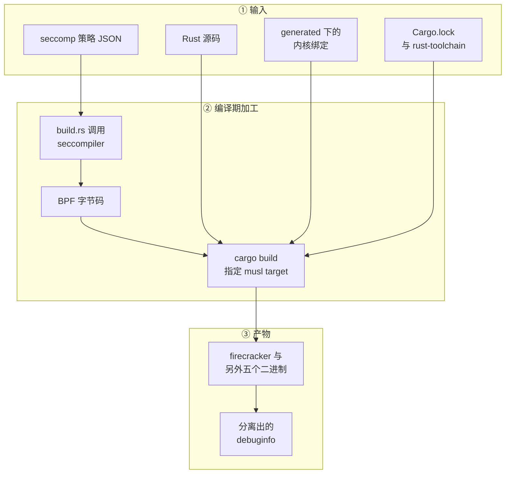

# 46 · 代码组织、依赖与构建

> 九万四千行代码切成十二个 crate，不是为了复用 —— 这些 crate 没有一个发布到 crates.io。
> 切分的目的是约束：谁能依赖谁、哪些代码进哪个二进制、哪些东西在编译期就必须定下来。
> 本篇讲这套约束是什么、由什么机制维持，以及它在两层改动下各被动了哪里。
>
> **读者**：要改 Firecracker 源码、升级它的依赖，或者把它接进自己构建体系的工程师。
> **预备**：[第 05 篇 · 本书用到的 Rust 与依赖 crate](05-rust-and-crates-primer.md)、
> [第 06 篇 · 构建、运行与调试环境](06-build-run-debug.md)（本篇不重复讲怎么编）。
> **代码**：`Cargo.toml`、`src/*/Cargo.toml`、`src/firecracker/build.rs`、`rust-toolchain.toml`、
> `deny.toml`、`tools/bindgen.sh`、`tools/test_bindings.py`、`.buildkite/pipeline_pr.py`

---

## 0. 本篇要回答的问题

1. 十二个 crate 之间的依赖方向是什么，哪几条边是**刻意**不存在的？
2. `jailer` 为什么被排除在默认构建之外，正式构建又怎么把它编回来？
3. 一个编译期 feature 的成本体现在源码的哪里？
4. 内核头文件的绑定为什么提交进仓库，而不是在构建时生成？
5. 依赖升级这件事被哪些机制卡住？CI 怎么决定跑哪些步骤？

---

## 1. 问题：边界要由什么来保证

Firecracker 的代码有两类边界需要维持。

第一类是**产物边界**。同一个仓库要产出六个可执行文件，它们运行在不同的信任位置上：
`firecracker` 是被隔离的对象，`jailer` 是做隔离的那个，`snapshot-editor` 和 `rebase-snap`
是离线工具，跑在开发者或运维的机器上。让 `jailer` 链接进 VMM 的全部代码，
等于让做隔离的进程携带被隔离进程的攻击面。

第二类是**编译期边界**。有些东西必须在二进制生成时就固定：seccomp 白名单、
内核头文件里的常量、工具链版本。这些东西如果留到运行时再解析或探测，
就会出现「同一份源码在两台机器上编出行为不同的二进制」这种情况。

Rust 的 crate 与 cargo 的 feature 是实现这两类边界的工具。下面几节看它们具体被用来做什么。

---

## 2. 依赖方向：哪几条边被刻意画出来

十二个 crate 的清单与规模在[第 01 篇 §3](01-lineage-and-repo-map.md#3-仓库地图十二个-crate)，这里只看边。

### 2.1 `vmm` 是唯一的大库，三个二进制建立在它之上

`firecracker`、`snapshot-editor`、`cpu-template-helper` 都依赖 `vmm`。
这不是分层复用，而是同一套数据结构在三个场景下的三种用法：
主程序用它跑 microVM，`snapshot-editor` 用它反序列化 vmstate，
`cpu-template-helper` 用它构建一台不启动的 microVM 来采集 CPU 特性
（`src/cpu-template-helper/src/utils/mod.rs` 的 `build_microvm_from_config()`）。

代价很直接：`vmm` 里任何公共结构体加一个字段，这三个二进制的构造点都要跟着改。
e2b 定制版给 `InstanceInfo` 加了一个 `memory_regions` 字段，
`src/firecracker/src/main.rs` 与 `src/cpu-template-helper/src/utils/mod.rs` 各多了一行
`memory_regions: None`——两处都不使用这个字段，只是因为 Rust 要求结构体字面量写全。
这是「一个大库 + 若干薄二进制」这种切法的固定开销。

### 2.2 `jailer` 与 `rebase-snap` 不依赖 `vmm`

`src/jailer/Cargo.toml` 的依赖只有 `libc`、`regex`、`thiserror`、`vmm-sys-util` 和本仓库的 `utils`。
它做的事（建 chroot、写 cgroup、切 uid、`exec`）与 VMM 的数据结构毫无关系，
所以这条边不存在是设计而不是巧合。`rebase-snap` 同理：它按字节合并两个内存文件，
不需要理解快照格式。

`jailer` 还有一层特殊处理。根 `Cargo.toml` 的 `default-members` 列了七个成员，
唯独不含 `src/jailer`，注释给出的理由是：默认的 `cargo build` 编 gnu target，
而 jailer 必须静态链接才能在 chroot 之后正常工作。于是日常开发时 `cargo build`
不会编它，正式构建靠 `tools/release.sh` 里的 `cargo build --target … --workspace --bins --examples`
绕过 `default-members` 把它编回来（`--libc gnu` 时脚本反过来显式 `--exclude jailer`）。

这个安排有个后果值得记住：**本机随手跑一次 `cargo build` 并不会发现 jailer 编不过**。
上游靠 CI 的构建步骤覆盖这个缺口。

### 2.3 `seccompiler` 是唯一一条编译期的边

`src/firecracker/Cargo.toml` 里 `seccompiler` 出现在 `[build-dependencies]` 而不是 `[dependencies]`：
它不进二进制，而是被 `src/firecracker/build.rs` 在编译时调用一次，
把 `resources/seccomp/<target triple>.json` 编译成 BPF，写到 `OUT_DIR`，
再由 `src/firecracker/src/seccomp.rs` 用 `include_bytes!(concat!(env!("OUT_DIR"), "/seccomp_filter.bpf"))` 取回来。
`build.rs` 同时声明了两条 `cargo:rerun-if-changed`：JSON 文件与 `seccompiler` 的源码目录。

这条边是「编译期确定」原则的具体实现：白名单不是配置文件，不能在部署时替换，
它随二进制一起发布。`--seccomp-filter` 参数允许在运行时换一份，
但那是显式的降级路径，默认路径上过滤器与二进制同生命周期（[第 42 篇 §3](42-seccomp.md#3-从-json-到二进制)）。

### 2.4 两个容易认错的 `utils`

仓库里有两个叫 utils 的东西，它们没有关系。`src/utils/` 是一个独立 crate，
只有三个模块（`arg_parser`、`time`、`validators`），一千四百行，
服务的是「不依赖 VMM 也要用」的场景 —— 所以 `jailer` 和 `rebase-snap` 依赖的是它。
`src/vmm/src/utils/` 是 `vmm` 内部的模块（`byte_order`、`net`、`signal`、`sm`），
只在 crate 内部可见。写代码时要分清一个工具函数该放哪边：
放进 `src/utils/` 意味着 `jailer` 也会链接它，放进 `vmm` 则不会。

这个重名在 `snapshot-editor` 里造成了一处别扭：
`src/snapshot-editor/Cargo.toml` 把依赖写成
`fc_utils = { package = "utils", path = "../utils" }`，给它起了别名以免与别的东西撞名。

`acpi-tables` 单独成 crate 的理由类似：它构造 ACPI 表，内容是纯数据结构与字节布局，
与 KVM 无关，独立出来可以单独测试，也让 `vmm` 对它的依赖方向显式可见。

### 2.5 lint 规则在 workspace 一级统一

根 `Cargo.toml` 有 `[workspace.lints.rust]` 与 `[workspace.lints.clippy]` 两段，
每个 crate 的 `Cargo.toml` 末尾写一行 `[lints] workspace = true` 继承。
打开的规则有实际含义：`undocumented_unsafe_blocks` 要求每个 `unsafe` 块都写 `SAFETY` 注释，
`cast_possible_truncation` / `cast_possible_wrap` / `cast_sign_loss` 三项把隐式截断的 `as` 转换标出来
（一个要处理 guest 提供的长度与偏移的程序，这类转换是越界的常见来源），
`exit` 禁止在库代码里直接调 `std::process::exit`，
`error_impl_error` 禁止把错误类型命名为 `Error`。
`unexpected_cfgs` 那条声明了 `cfg(kani)` 是合法的条件编译名，否则验证代码会触发警告。

这些规则在 CI 里由 `tests/integration_tests/build/test_clippy.py` 以 `-D warnings` 强制，
而且对 gnu 与 musl 两个 target 各跑一遍。

下图把一次构建里的输入与这几条边画在一起。



---

## 3. `vmm` 内部：一条主干与两个例外

`vmm` 一个 crate 占全部代码的八成，所以它内部的划分才是真正起作用的组织结构。
`src/vmm/src/lib.rs` 声明了二十三个模块（十六个目录加七个顶层文件，
逐项清单见[第 01 篇 §4](01-lineage-and-repo-map.md#4-vmm-内部十六个目录与八个顶层文件)），按职责可以归成四组。

```text
src/vmm/src/
├── 控制面：从 API 请求到动作
│   ├── rpc_interface.rs     VmmAction 与两个控制器（Preboot / Runtime）
│   ├── resources.rs         启动前累积的配置集合 VmResources
│   ├── vmm_config/          每类资源的配置结构与校验
│   ├── builder.rs           从配置构建出一台 microVM
│   └── lib.rs               Vmm 结构体本身与事件循环
├── 状态面：快照、暂停与恢复
│   ├── persist.rs           MicrovmState 的保存与恢复
│   └── snapshot/            版本化的序列化格式
├── 机器面：KVM 之上的抽象
│   ├── vstate/              kvm.rs / vm.rs / vcpu.rs / memory.rs
│   ├── arch/                x86_64/ 与 aarch64/ 两套平台代码
│   ├── cpu_config/          CPU 模板
│   └── acpi/                x86_64 的 ACPI 表
└── 数据面：设备与 I/O
    ├── device_manager/      总线与 MMIO 设备管理（唯一的 pub(crate) 模块）
    ├── devices/             legacy、virtio、pseudo 三类设备
    ├── io_uring/            block 的一种 I/O 引擎
    ├── rate_limiter/        令牌桶
    ├── dumbo/ 与 mmds/      MMDS 与它自带的 TCP/IP 栈
    └── logger/              日志与 metrics
```

两个例外。`device_manager` 是这些模块里唯一声明为 `pub(crate)` 的，
也就是说设备管理器不对 crate 外暴露 —— 外部要操作设备只能经由 `Vmm` 的方法。
另一个是 `gdb/` 与 `test_utils/`：前者挂在 `#[cfg(feature = "gdb")]` 下，
后者只在测试与 `integration_tests` 里用到，两者都不进正常的发布产物。

`arch/` 的组织方式对读代码影响最大。同一个概念在两个架构下各有一份实现，
靠 `#[cfg(target_arch = …)]` 选择；`src/vmm/src/arch/mod.rs` 负责把两边的公共接口对齐。
读一个功能时通常要同时看 `arch/x86_64/` 与 `arch/aarch64/` 下的同名文件，
两边的差异往往就是[第 58 篇 · 在 aarch64 上构建与运行](58-building-and-running-on-aarch64.md)那一部分要处理的问题的来源。

---

## 4. feature 的成本落在源码里

`vmm` 的 `[features]` 只有三项：`default = []`、`tracing`、`gdb`。数量少是有原因的 ——
每个 feature 都会在源码里留下痕迹，而痕迹的数量不与 feature 的功能量成正比，
而与「这个 feature 改动了多少个公共结构体」成正比。

`gdb` 是个好例子。它的功能代码集中在 `src/vmm/src/gdb/` 的四个文件里，
但因为它给 `MachineConfig` 加了一个 `gdb_socket_path` 字段，
凡是构造 `MachineConfig` 或 `MachineConfigUpdate` 的地方都要加一行 `#[cfg(feature = "gdb")]`：
`src/vmm/src/vmm_config/machine_config.rs` 里有五处，`src/vmm/src/persist.rs`、
`src/vmm/src/resources.rs`、`src/firecracker/src/api_server/request/machine_configuration.rs`
里还有若干处。这些 `cfg` 与调试功能本身无关，纯粹是「可选字段」这一决定的税
（该特性的行为见[第 45 篇 §2](45-gdb-tracing-and-kani.md#2-gdb把-firecracker-变成一个远程目标)）。

真正的开关不只 feature 一种。`Cargo.toml` 的 profile 设置也是编译期决定，其中两条值得说：

- `panic = "abort"`，而且 `[profile.dev]` 与 `[profile.release]` 都设了。
  这意味着 panic 不展开栈、不能被 `catch_unwind` 接住，进程直接死。
  对一个持有 guest 内存映射与 KVM fd 的进程来说，「panic 之后继续运行」比「立刻死掉」危险得多；
  两个 profile 都设同一个值，则保证了开发时看到的失败语义与生产一致。
- `lto = true` 与 `strip = "none"` 只在 release 下。不 strip 是因为
  `tools/release.sh` 要用 `objcopy` 自己把 debuginfo 分离成 `.debug` 文件，
  而不是简单丢掉（[第 06 篇 §2.3](06-build-run-debug.md#23-产物)）。

---

## 5. 生成代码与依赖治理

### 5.1 内核绑定是提交进仓库的

`tools/bindgen.sh` 用 `bindgen` 从内核头文件生成 Rust 绑定，产物落在四个 `generated/` 目录
与 `src/vmm/src/io_uring/generated.rs`、`src/seccompiler/src/bindings.rs`。
关键在于：**这个脚本不在构建时执行**，生成的 `.rs` 文件直接提交进仓库，由人手动更新。

这是一个明确的取舍。若在 `build.rs` 里跑 bindgen，绑定就会随构建机的内核头文件版本漂移，
同一份源码在两台机器上编出的二进制里 `struct kvm_run` 的布局可能不同。
提交入库把这个变量消掉了，代价是绑定会过时，需要人定期重新生成。

脚本里还有几处工程细节：它按固定的内核源码目录（`amazonlinux-v5.10.y`）取头文件而不是取本机的；
用 `perl` 把某些常量从十进制改写成十六进制以便与内核文档对照；
最后统一 `git apply` 一遍 `tools/bindgen-patches/` 下的补丁，
把 bindgen 生成不对的地方改回来（当前只有一个补丁，把 `ifrn_name` 的 `c_char` 改成 `c_uchar`）。

绑定更新之后怎么确认没改坏？`tools/test_bindings.py` 用 `pahole` 从两个 firecracker 二进制里
读出所有名字含 `bindings` 的结构体的大小与对齐，逐个比对新旧版本。
这是 ABI 层面的检查，比读 diff 可靠。

### 5.2 依赖被四道机制卡着

| 机制 | 位置 | 卡的是什么 |
|---|---|---|
| `Cargo.lock` 入库 | 仓库根 | 依赖版本对所有人一致 |
| `deny_dirty_cargo_locks.yml` | GitHub Actions | lock 文件与 `Cargo.toml` 必须同步 |
| `dependency_modification_check.yml` | GitHub Actions | PR 的改动集里**不允许出现** `Cargo.lock` |
| `deny.toml` + `cargo udeps` | 仓库根 + `tests/integration_tests/build/test_dependencies.py` | 许可证白名单、被封禁的版本区间、无用依赖 |

第三条是最强硬的一条：一个普通 PR 只要碰了 `Cargo.lock` 就直接失败，依赖升级必须走单独的流程。
这条规则对分叉者的意义在第 7 节。

`deny.toml` 的内容很短：许可证白名单六项（MIT、Apache-2.0、BSD-3-Clause、ISC、Unicode-3.0、OpenSSL），
以及一条针对 `serde_derive` 的版本封禁 —— 那个区间的版本分发过预编译二进制，
对一个要求可复现构建的项目来说不可接受。

`rust-toolchain.toml` 把工具链钉在 1.85.0。文件里的注释说明了钉死的真实原因不是语言特性，
而是 A/B 测试：工具链升级可能引入新的系统调用，而 seccomp 白名单里没有它
（同一条约束的运行时后果见[第 42 篇](42-seccomp.md)）。

---

## 6. CI：流水线是生成出来的

`.buildkite/` 下没有 YAML，只有六个 Python 脚本。`pipeline_pr.py` 在每次 PR 上运行，
先调 `get_changed_files()` 拿到改动文件清单，再按清单决定生成哪些步骤：

- 改动全是 `.md` 时，整个构建步骤被跳过。
- `devctr/` 下有改动才做开发容器镜像的 sanity build。
- `tools/` 下的 `devtool` 或 `release*` 有改动才跑一次完整的发布打包。
- 有 `.rs`、`.toml` 或 `.lock` 改动才跑 Kani 证明，而且排在专用机型上、超时 300 分钟。

这套「按改动裁剪」的做法把一次 PR 的 CI 时间压在可接受的范围内，
代价是裁剪规则本身成了需要维护的代码 —— 判断条件写错就会漏跑。

GitHub Actions 只承担四件周边的事：上面两个依赖检查，以及 PR 与 release 的通知、A/B 测试触发。
真正的构建与测试都在 Buildkite 上，跑在自建的 x86_64 与 aarch64 裸金属机器上
（测试体系本身见[第 47 篇](47-testing.md)）。

---

## 7. 后续各层的差异

e2b 定制版在这一层做了三件事。一是在仓库根加了 `Makefile` 与 `scripts/build.sh`、`scripts/upload.sh`，
在 `tools/devtool build --release` 外面套一层版本命名与上传（[第 55 篇](55-seccomp-build-upload-and-upstream-fixes.md)）。
二是把 `userfaultfd` 依赖从 crates.io 的 0.8.1 换成自己的一个 git 分支，
以取得写保护相关的接口（[第 53 篇](53-uffd-write-protection.md)）——
这必然要改 `Cargo.lock`，于是第三件事就是**删掉 `dependency_modification_check.yml`**。
这是一个清晰的因果：上游那条「PR 不得改 lock 文件」的规则服务于上游自己的依赖审查流程，
分叉方既然要换依赖源，就只能把规则去掉，代价是失去了对依赖变动的自动提醒。
此外 `vmm` 里多了一个模块 `src/vmm/src/utils/pagemap.rs`（[第 51 篇](51-memory-resident-empty-api.md)）。

ARM 适配版在这一层的改动只有一处构建脚本：`scripts/build.sh` 里的产物路径
由写死的 `x86_64-unknown-linux-musl` 改为按 `uname -m` 推导目标三元组
（[第 58 篇](58-building-and-running-on-aarch64.md)）。同一个提交里还注释掉了
`src/firecracker/src/main.rs` 的 `resize_fdtable()` 调用 —— 这不是构建改动，
而是绕开一处在该环境下失败的启动步骤；用注释而不是条件编译来关闭一条代码路径，
后果是这条路径不再随源码演进被检查到。模块层面，ARM 适配版在 `vmm` 里新增了
`src/vmm/src/rollback.rs`（[第 69 篇](69-rollback-api-and-phases.md)），
是三层里唯一一个新加的顶层模块。

---

## 8. 小结

- crate 切分服务于两类边界：产物边界（谁进哪个二进制）与编译期边界（哪些东西在编译时定死）。
- `vmm` 是唯一的大库，`firecracker`、`snapshot-editor`、`cpu-template-helper` 是薄二进制；
  代价是 `vmm` 的公共结构体一改，三处构造点都要跟着改。
- `jailer` 与 `rebase-snap` 刻意不依赖 `vmm`；`jailer` 还被排除在 `default-members` 之外，
  因为它必须静态链接，正式构建用 `--workspace` 把它编回来。
- `seccompiler` 以 build-dependency 的身份参与构建，把 seccomp 策略在编译期编成 BPF 内嵌进二进制。
- 独立的 `utils` crate 与 `vmm` 内部的 `utils` 模块是两回事；放错位置会让 `jailer` 多链接一批代码。
- lint 规则在 workspace 一级统一声明、由各 crate 继承，并在 CI 里以 `-D warnings` 对两个 target 强制。
- `vmm` 内部按控制面、状态面、机器面、数据面四组划分；`device_manager` 是唯一不对外暴露的模块。
- 一个 feature 的成本主要不在功能代码，而在它给公共结构体加的可选字段所引发的 `cfg` 扩散。
- 两个 profile 都设 `panic = "abort"`：持有 KVM fd 与 guest 内存的进程，panic 后继续运行比立刻死更危险。
- 内核绑定由 `tools/bindgen.sh` 生成后提交入库，不在构建时生成，为的是产物不随构建机头文件漂移；
  更新后用 `pahole` 做 ABI 比对。
- 依赖被四道机制卡住，其中「PR 不得改 `Cargo.lock`」最强硬；e2b 定制版为了换 `userfaultfd` 的来源，
  把这道检查删掉了。
- CI 流水线由 Python 按改动文件生成，Kani、镜像构建、发布打包都是条件触发。

---

## 延伸阅读 / 下一篇

- 下一篇：[第 47 篇 · 测试体系：单元、集成与性能](47-testing.md) —— 上面这些 CI 步骤里具体跑的是什么。
- [第 06 篇 · 构建、运行与调试环境](06-build-run-debug.md) 讲怎么真正编出一个二进制。
- [第 48 篇 · 发布策略、版本与兼容承诺](48-release-and-compat-policy.md) 讲版本号与兼容窗口。
- [第 75 篇 · 代码地图](75-code-map.md) 是本篇模块树的完整版，按文件对应到篇目。
- [第 78 篇 · 三层差异总表](78-layer-diff-tables.md) 给出文件级的改动清单与升级重放顺序。
