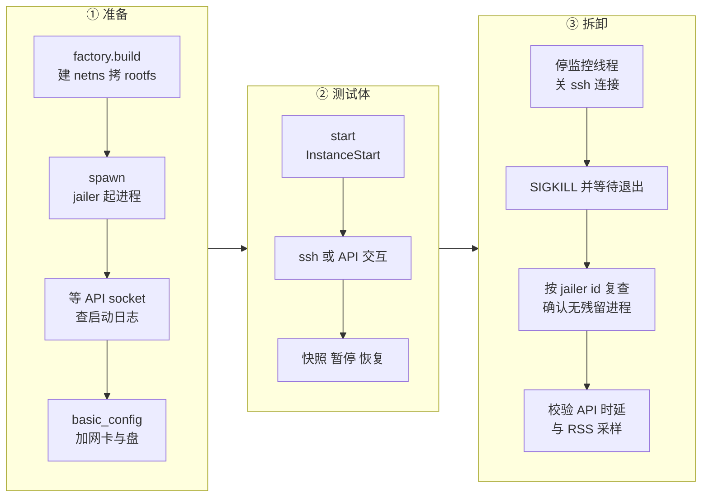
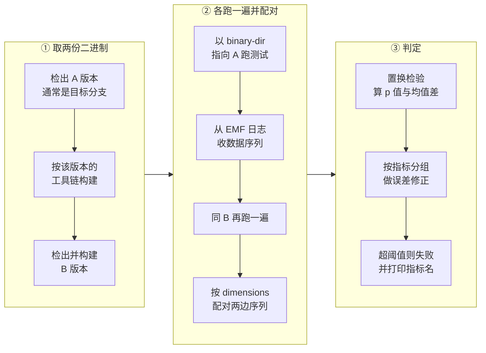

# 47 · 测试体系：单元、集成与性能

> 一个 VMM 的正确性没法靠肉眼复核：它的行为分布在 Rust 代码、KVM、guest 内核与宿主内核四处，
> 很多故障只在特定内核版本或特定 CPU 型号上出现。本篇讲上游 v1.12.1 用什么办法把这些行为钉住：
> 三层测试各自能证明什么、pytest 夹具怎么把一台真 microVM 变成可复用的测试对象、
> 没有基线的性能与安全属性怎么用 A/B 比较来判定。
>
> **读者**：维护者、要改 Firecracker 的工程师。
> **预备**：[第 06 篇 · 构建、运行与调试环境](06-build-run-debug.md#2-两条构建路径)、
> [第 46 篇 · 代码组织、依赖与构建](46-code-organization-and-build.md)。
> **代码**：`src/vmm/src/test_utils/`、`src/vmm/tests/integration_tests.rs`、`tests/framework/`、
> `tests/integration_tests/`、`tests/conftest.py`、`tools/test.sh`、`tools/ab_test.py`

---

## 0. 本篇要回答的问题

1. 单元测试、Rust 集成测试、pytest 集成测试各自覆盖什么，边界在哪里？
2. 单元测试怎么在没有真实内核镜像的情况下把一台 microVM 构建出来？
3. pytest 里的一台 microVM 从创建到销毁经过哪些步骤，拆卸时做了哪些断言？
4. 五个测试目录（build / functional / performance / security / style）分别在守什么契约？
5. 性能与安全这类「没有正确答案」的属性，怎么判断一次改动是不是让它变坏了？
6. 在 aarch64 上、在没有官方测试容器的环境里，这套测试还剩下多少能跑？

---

## 1. 问题：要证明的东西分布在四个地方

改一行 Firecracker 的代码，可能出错的地方不止在 Rust 里。

一个 virtqueue 的描述符解析写错，是纯 Rust 逻辑问题，单元测试就能抓住。
但「快照恢复后 guest 的时钟没有跳变」这种论断，牵涉 KVM 的寄存器保存、guest 内核的时钟驱动、
宿主内核版本；「进程只发出白名单内的系统调用」这种论断，只在 release 的 musl 构建里成立
（debug 构建装的是空过滤器，见[第 06 篇](06-build-run-debug.md)）；
「这次改动没有让快照恢复变慢」这种论断，甚至没有一个可以写进仓库的正确答案。

上游的应对是把测试按「需要什么才能成立」分层，而不是按「测什么功能」分层：

| 层 | 需要什么 | 能证明什么 | 不能证明什么 |
|---|---|---|---|
| 单元测试 | 只要能编译 | 函数与数据结构的逻辑 | 与 KVM、guest 的交互 |
| Rust 集成测试 | `/dev/kvm` | 程序化 API 能把 VM 建起来并跑起来 | HTTP API 的行为、jailer 与 seccomp |
| pytest 集成测试 | 裸金属主机、KVM、Docker、内核与 rootfs 产物 | 端到端行为、进程边界、安全属性 | 无基线的性能属性 |
| A/B 测试 | 两个二进制 + 同一套测试代码 | 某个量在两次构建之间**没有变坏** | 这个量的绝对值合不合格 |

这张表解释了后面几节的顺序：能在便宜的层证明的，不放到贵的层。

---

## 2. 单元测试：在没有真内核的情况下造一台 microVM

Rust 的单元测试按惯例内联在被测模块里（`mod tests`），v1.12.1 的 `src/` 下有 187 处这样的模块、
829 个 `#[test]` 函数。它们与被测代码同文件，可以调用私有函数，这是它们与集成测试最大的差别。

难点在于 VMM 的大部分逻辑都需要一个「已经建好的 VM」作为上下文。
`src/vmm/src/test_utils/mod.rs` 就是为这件事存在的，它提供三组工具：

- 内存构造：`single_region_mem()`、`multi_region_mem()`、`arch_mem()`。
  最后一个按当前架构的 `arch_memory_regions()` 布局分配区域，
  这样内存布局相关的测试在 x86_64 与 aarch64 上写法一致。
- VM 构造：`create_vmm()` 走的是真正的 `build_microvm_for_boot()`（[第 11 篇 · builder](11-builder.md)），
  不是 mock。它只是把输入换成 `MockVmResources`，并用 `get_empty_filters()` 装一套空的 seccomp 过滤器。
  派生出的 `default_vmm()`、`default_vmm_no_boot()`、`dirty_tracking_vmm()` 区别只在是否启动 vCPU、
  是否开脏页跟踪。
- 假内核：`src/vmm/src/test_utils/mock_resources/` 里放着 `test_elf.bin`（x86_64）与 `test_pe.bin`（aarch64）。
  它们是能被 Firecracker 的内核加载器接受、但什么也不做的极小镜像。
  另有 `test_noisy_elf.bin`（`NOISY_KERNEL_IMAGE`），它会持续写内存，用来给脏页相关的测试制造脏页。

所以单元测试里的「一台 microVM」是真的：真的 `KVM_CREATE_VM`、真的内存映射、真的设备对象，
只有 guest 里跑的东西是假的。代价是这些测试需要 `/dev/kvm`，在没有 KVM 的机器上会失败。

`src/vmm/tests/` 下的三个文件（`integration_tests.rs`、`devices.rs`、`io_uring.rs`）是 Rust 集成测试：
cargo 把它们编成独立的 crate，因此只能调用 `pub` 的接口。
`integration_tests.rs` 里的 `test_build_and_boot_microvm()`、快照创建与恢复的用例，
走的是 `VmmAction` 与 `RuntimeApiController`（[第 09 篇 · rpc_interface](09-rpc-interface.md)），
也就是 HTTP API 背后的那一层，但不经过 HTTP。
这一层有一个已知的副作用：正常路径下 VMM 会自己 `exit`，而 cargo 不预期测试进程自杀，
所以这类用例的输出收集不完整，`tests/README.md` 里对此有说明。

单元测试与文档测试由 `tests/integration_tests/build/test_unittests.py` 在集成测试阶段再跑一遍，
调用 `host_tools/cargo_build.py` 的 `cargo_test()`，目标固定为 `<arch>-unknown-linux-musl`，
并设 `RUST_TEST_THREADS=1`（这些测试会争用 `/dev/kvm` 与网络设备，不能并行）。
aarch64 上还要额外加 `-C link-arg=-lgcc -C link-arg=-lfdt` 才能链上。

---

## 3. pytest 夹具：一台 microVM 的生命周期

pytest 这一层测的是**进程**，不是函数。它拉起真的 `firecracker` 二进制、真的 jailer、
真的 guest 内核与 rootfs，通过 UNIX socket 上的 HTTP API 驱动它。

组织方式是 pytest 的夹具（fixture）。`tests/conftest.py` 里的 `microvm_factory` 是根：
它读 `--binary-dir` 指定的二进制目录，构造一个 `MicroVMFactory`，把它 yield 给测试，
测试结束后统一销毁所有由它造出来的 VM。
上面叠着一串便利夹具：`uvm_plain`（5.10 内核 + 只读 squashfs rootfs）、
`uvm_nano`（已 spawn 并配好 2 vCPU / 256 MiB）、
`uvm_plain_any`（对所有受支持的 guest 内核参数化）。
`guest_kernel` 系列夹具由 `framework/artifacts.py` 的 `kernels()` 按文件名正则从产物目录挑出
`vmlinux-5.10.*` 与 `vmlinux-6.1.*`，于是同一个测试函数会被每个内核版本各跑一遍。

`uvm_booted` 与 `uvm_restored` 这一对更有意思：后者先按前者启动一台，做全量快照，杀掉，
再从快照恢复出第二台。参数化夹具 `uvm_any` 把两者并列，
于是任何用 `uvm_any` 的测试都同时覆盖「启动出来的 VM」与「恢复出来的 VM」。
这是把「快照恢复后行为应当与启动一致」这条契约变成了测试基础设施，而不是逐个测试去写。

下面是一台 microVM 在测试中的生命周期。左列是准备，中列是测试体，右列是拆卸。

拆卸这一列不是清理，是断言。`framework/microvm.py` 的 `Microvm.kill()` 在杀掉进程之后做三件检查：

- 日志里不能出现 `Shutting down VM after intercepting signal`，否则说明 VM 是被信号打死的，而不是测试预期的方式结束。
- 用 `ps aux | grep <jailer_id>` 复查，确认没有进程残留。这一条是为一个真实缺陷加的：
  Firecracker 上报的 PID 曾经在 `--new-pid-ns` 下是错的，杀了一个无关进程而 VM 还活着。
- `_validate_api_response_times()` 从日志里配对「收到请求」与「上次 API 调用耗时」两条记录，
  对除 `/snapshot/create` 与 `/snapshot/load` 之外的每个端点断言耗时上限。
  这等于给控制面加了一条全局的性能契约：任何测试只要跑过 API，就顺带验证了它。
  这条检查在宿主内核 6.1 上和并行执行时会自动关掉（噪声太大）。

`monitor_memory` 打开时还会有一个 `MemoryMonitor` 线程按 50 ms 采样 Firecracker 的 RSS，
跳过 guest 内存区域，只看 VMM 自身的开销，超阈值在拆卸时报错。

测试失败时，`microvm_factory` 夹具会把 chroot 里的文件、宿主 dmesg 与 guest 串口输出
收集到 `test_results/<vm id>/` 下 —— 这是这套框架里唯一为「事后排查」而存在的机制。

---

## 4. 五个目录守五类契约

`tests/integration_tests/` 下按契约分五个目录，v1.12.1 共 250 个测试函数。

| 目录 | 守什么 | 代表用例 |
|---|---|---|
| `build/` | 构建期的质量门 | `test_unittests.py`、`test_clippy.py`、`test_coverage.py`、`test_dependencies.py`、`test_gdb.py` |
| `functional/` | 功能行为（168 个，占绝大多数） | `test_snapshot_basic.py`、`test_pause_resume.py`、`test_dirty_pages_in_full_snapshot.py`、`test_uffd.py` |
| `security/` | 安全边界 | `test_seccomp.py`、`test_jail.py`、`test_vulnerabilities.py`、`test_sec_audit.py` |
| `performance/` | 性能指标的采集 | `test_snapshot_ab.py`、`test_boottime.py`、`test_memory_overhead.py` |
| `style/` | 仓库自身的一致性 | `test_swagger.py`、`test_markdown.py`、`test_rust.py`、`test_licenses.py` |

几个值得单独说的：

`test_clippy.py` 对 gnu 与 musl 两个目标各跑一遍 clippy，并用 `-D warnings` 把警告当错误。
`test_coverage.py` 用 `-Cinstrument-coverage` 加 grcov 生成覆盖率，
注意它用的是 gnu 工具链而单元测试用 musl —— 原因是 aarch64 的 musl 目标不支持 profiling。
于是「跑测试」和「量覆盖率」是两次编译。

`test_dirty_pages_in_full_snapshot.py` 是一个小而典型的例子：
它连做一次全量快照与两次差分快照，然后比较三个内存文件的 `st_blocks`（而不是 `st_size`，
因为差分快照是稀疏文件）。断言是「差分比全量占的块少」且「两次连续的差分占块相同」。
它顺带记录了一条实现事实：差分快照里总会有一些页，因为 virtqueue 用到的页永远被标记为脏
（[第 14 篇 · 脏页跟踪](14-dirty-page-tracking.md)）。

两个编译期特性在这一层的待遇差别很大。`build/test_gdb.py` 的 `test_gdb_compiles()` 只执行一次
`cargo build --features gdb`，确认这个组合还能编过，不验证任何调试行为；`tracing` 特性则在 `tests/` 下
没有任何用例，`.buildkite/` 的流水线里也没有对应步骤。Kani 是第三种待遇：它的入口
`tests/integration_tests/test_kani.py` 不在这五个目录里，而是放在 `tests/integration_tests/` 根下，
由 `pipeline_pr.py` 在有 `.rs` / `.toml` / `.lock` 改动时条件触发，排在专用机型上
（三者的对比见[第 45 篇 §5](45-gdb-tracing-and-kani.md#5-三种工具的位置)）。

`test_swagger.py` 用 `openapi_spec_validator` 校验 `src/firecracker/swagger/firecracker.yaml`。
swagger 文件因此是一个会被 CI 拦住的契约，不是文档——这一点在[第 48 篇](48-release-and-compat-policy.md)还会用到。

`tests/pytest.ini` 里默认排除 `nonci` 与 `no_block_pr` 两个标记，测试默认超时 300 秒。
入口脚本 `tools/test.sh` 在跑 pytest 之前做两件与测试内容无关但必需的事：
把 TMPDIR 设到 `/srv`（让硬链接能跨目录生效），
以及把 Docker 创建的 cgroup 转成可嵌套的形式 —— 否则 `test_jail.py` 没法在容器里建 cgroup 子组。

---

## 5. A/B 测试：没有基线时怎么判回归

有两类属性没法写死期望值。

一类是性能：快照恢复时延依赖机型、宿主内核、并发度，把一个数字写进仓库，
换台机器就失效，且需要持续维护。另一类是「外部世界决定」的安全属性：
`cargo audit` 的结果取决于 RustSec 数据库今天有没有新增公告，
一条与本次改动无关的新公告会让所有 PR 同时变红。

上游的办法是放弃绝对判据，改判**相对变化**：同一套测试代码，用两个不同提交编出的二进制各跑一遍，
比较两次的结果。基线不写进仓库，而是每次现场生成。

实现分两处。`tests/framework/ab_test.py` 提供机制：
`git_ab_test()` 把两个 revision 各克隆到临时目录、各跑一次、把两个结果交给比较函数；
`check_regression()` 用 `scipy.stats.permutation_test` 做置换检验 —— 一种不假设分布形状的非参数检验，
统计量取「两组样本均值之差」。
`tools/ab_test.py` 是编排脚本：性能测试本身不写断言，只用 `aws_embedded_metrics` 吐出数据序列，
脚本收集两次运行的序列，按 dimensions 配对后逐条做检验。

配对靠 dimensions 这一点带来三条使用约束，`tests/README.md` 里写得很明确：
每个指标必须发出**多个**数据点（置换检验作用在序列上，不是单点）；
dimensions 里必须带 `performance_test` 键；
而且必须把所有 pytest 参数都写进 dimensions，否则不同 vCPU 数的数据序列会被混成一堆。

还有一条容易踩的边界：`tools/ab_test.py` 只按两个 revision 重新编 Rust 二进制，
测试代码本身两次用的是同一份。所以它测不出只改 Python 代码带来的差异。

`analyze_data()` 里有一段专门的误差修正：同一个指标在不同参数下的多个结果会被放在一起看，
如果一个场景略好、另一个略坏，就当作互相抵消的噪声。
理由写在代码注释里：历史上真实的性能变化从来不是只出现在单个测试上。
这段逻辑的取舍是明确的 —— 用略微升高的漏报率换掉大量误报，因为误报会让人开始忽略这个信号。

功能性的 A/B 测试用法不同但机制相同。`test_sec_audit.py` 的 `test_cargo_audit()`
把 `cargo audit` 的输出转成「漏洞集合」，比较函数是 `set_did_not_grow_comparator` ——
只要集合没有变大就通过。于是外部新增的公告不会拦住 PR，而 PR 自己引入的有漏洞依赖会被拦住。
`test_vulnerabilities.py` 对宿主与 guest 的侧信道缓解状态用同样的手法。

---

## 6. 在本项目的环境里还剩什么

官方的运行方式是 `tools/devtool -y test`：它拉一个固定 tag 的容器镜像
（`public.ecr.aws/firecracker/fcuvm`），从 S3 下载内核与 rootfs 产物，在容器里跑 pytest。
这条路径对环境的要求很硬：裸金属主机、KVM、Docker、可访问 AWS 的网络，
以及 `test_vulnerabilities.py` 这类用例还要求特定的 CPU 型号。

在本项目的 aarch64 环境（鲲鹏 / openEuler，见[第 60 篇](60-kunpeng-openeuler-host.md)）里，这条路径不成立：
容器镜像与测试产物都取不到。**推论**：可行的退路是绕过 devtool 直接跑 cargo，
即在仓库根执行 `cargo test --all --target aarch64-unknown-linux-musl`，
并按 `host_tools/cargo_build.py` 的 `get_rustflags()` 加上 `-C link-arg=-lgcc -C link-arg=-lfdt`、
把 `RUST_TEST_THREADS` 设为 1。这样能跑到的是单元测试与 `src/vmm/tests/` 下的 Rust 集成测试，
它们只需要 `/dev/kvm`，不需要外部产物。

跑不到的是整个 pytest 层：功能、安全、性能、风格四类契约在这个环境里都没有自动化验证。
这意味着 ARM 适配版与 checkpoint / restore 扩展的正确性证据来自别处 ——
扩展自带的单元测试、以及编排层的端到端验证，后者在 checkpoint / restore 手册里。
这是一个需要如实记录的缺口，不是可以忽略的细节：
上游用来防止快照回归的那批用例（`test_snapshot_basic.py` 的十五个用例、`test_uffd.py`、
`test_snapshot_restore_cross_kernel.py`）恰好覆盖的是本项目改动最多的区域。

---

## 7. 后续各层的差异

e2b 定制版对测试层做了四处改动：`tests/framework/http_api.py` 里给 `Api` 加了 `/memory` 与
`/memory/mappings` 两个资源，`test_api.py` 增加了约 237 行针对这两个端点的用例，
`test_shut_down.py` 删掉了「Firecracker 恰好有 6 个线程」的断言，
`tools/test.sh` 里把 `BUILDKITE` 的引用改成带默认值（便于在 CI 之外跑）。
细节见[第 55 篇 · seccomp、构建发布脚本与合入的上游修复](55-seccomp-build-upload-and-upstream-fixes.md)。

ARM 适配版没有修改 `tests/` 与 `tools/` 下的任何测试代码；
它面对的是上一节说的运行环境问题，见[第 58 篇 · 在 aarch64 上构建与运行](58-building-and-running-on-aarch64.md)。

---

## 8. 小结

- 上游按「成立需要什么」分层测试：能在不需要 KVM 的层证明的，就不放到需要真机的层。
- 单元测试里的 microVM 是真的 KVM 虚拟机，只有 guest 镜像是假的；`test_utils` 提供内存、VM 与假内核三组构造器。
- Rust 集成测试走 `VmmAction` 这一层，覆盖 HTTP 之下、KVM 之上的程序化接口；代价是测试进程自杀导致输出收集不全。
- pytest 夹具把「启动的 VM」与「从快照恢复的 VM」并列参数化，使快照一致性成为基础设施而非逐个测试的负担。
- `Microvm.kill()` 的拆卸阶段带三条断言：无信号终止、无进程残留、API 时延在上限内。
- 五个测试目录对应五类契约；swagger 校验与 clippy 是会拦住合入的硬门。
- 三个编译期工具的 CI 投入差三个量级：Kani 条件触发全量跑，gdb 只验证能编译，tracing 无任何步骤。
- 没有基线的属性改判相对变化：性能用置换检验比较两个二进制，安全审计用「集合没有变大」作判据。
- A/B 测试只重编 Rust 二进制，测不出 Python 侧改动；误差修正用漏报换误报，这是自觉的取舍。
- 本项目的 aarch64 环境跑不了 pytest 层，只能跑 cargo 单元与集成测试；快照相关的上游用例因此全部失效。

---

## 延伸阅读 / 下一篇

- 下一篇：[第 48 篇 · 发布策略、版本与兼容承诺](48-release-and-compat-policy.md) —— 测试通过之后，一个版本怎么发出去。
- [第 45 篇 · GDB 调试、tracing 与形式化验证](45-gdb-tracing-and-kani.md) 讲 Kani 证明 harness，那是测试之外的另一类保证。
- [第 42 篇 · seccomp](42-seccomp.md) 讲 `test_seccomp.py` 验证的那套过滤器。
- [第 43 篇 · jailer](43-jailer.md) 讲 `test_jail.py` 里那些 cgroup 与 namespace 断言的对象。
- 上游文档 `tests/README.md` 给出 devtool 与 A/B 测试的完整操作说明；以代码为准。
- 编排层的端到端验证与性能数据在 [e2b 手册第 37 篇](../e2b-infra/37-pause-and-snapshot.md) 与 checkpoint / restore 手册
  `../../e2b-infra-docs/rollback/docs/` 中。
