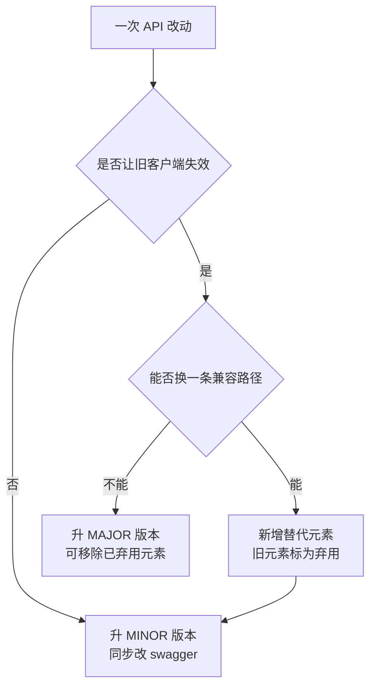
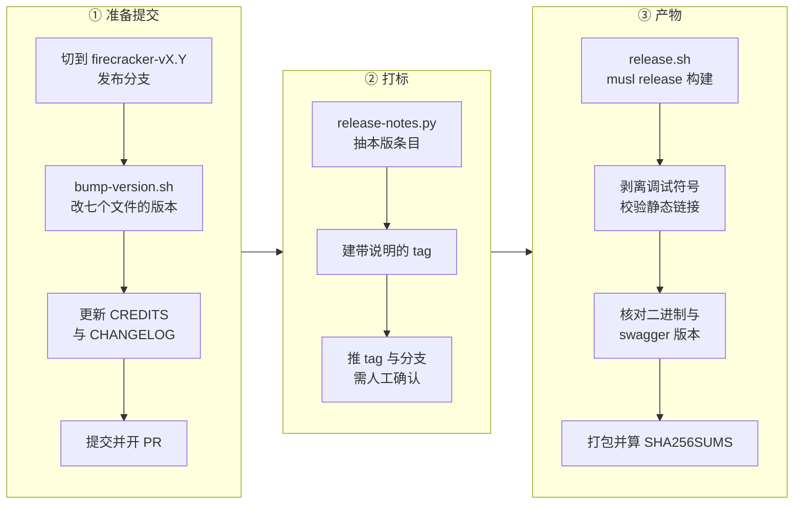

# 48 · 发布策略、版本与兼容承诺

> Firecracker 是被嵌进别人系统里的一个二进制，所以它承诺的不只是「这个版本能用」，
> 还包括「旧客户端配新二进制能用多久」「旧快照能不能加载」「哪些宿主与 guest 内核被验证过」。
> 本篇讲上游 v1.12.1 的这几套承诺分别由什么规则定义、由什么机制执行，
> 以及本项目把版本钉在 v1.12.1 意味着承接了哪些约束。
>
> **读者**：维护者、要决定是否升级基线的人。
> **预备**：[第 36 篇 · 快照总览与格式](36-snapshot-overview-and-format.md)、
> [第 47 篇 · 测试体系](47-testing.md)。
> **代码**：`docs/RELEASE_POLICY.md`、`docs/kernel-policy.md`、`docs/api-change-runbook.md`、
> `CHANGELOG.md`、`DEPRECATED.md`、`src/vmm/src/snapshot/mod.rs`、`src/vmm/src/persist.rs`、
> `tools/release.sh`、`tools/release-prepare.sh`、`tools/release-tag.sh`、`tools/bump-version.sh`

---

## 0. 本篇要回答的问题

1. 上游承诺了哪几件事，每件的有效期由什么规则决定？
2. 一次 API 改动怎么判定是不是破坏性的，弃用一个字段要做哪几步？
3. 快照格式版本为什么与二进制版本分开，它的兼容检查具体是什么表达式？
4. 内核支持政策约束的是谁，它和快照兼容是什么关系？
5. 发布流程里哪些步骤是机械的，哪些是人要拍板的？
6. 把基线钉在 v1.12.1，本项目实际承接了什么，升级到后续版本要重做哪些定制？

---

## 1. 问题：承诺的对象不是一个

「向后兼容」这个词在 Firecracker 语境里至少指四件不同的事，它们的规则、执行者与有效期都不同。

- **API 兼容**：一个按 v1.12 的 swagger 写的客户端，配 v1.13 的二进制还能不能工作。
- **快照兼容**：v1.12 产出的 vmstate 文件，能不能被另一个版本的二进制加载。
- **内核兼容**：哪些宿主内核与 guest 内核被持续验证过。
- **支持期**：某个版本出了安全问题，还会不会有补丁版本。

混淆它们的后果很具体。以为二进制版本号相同就快照兼容，会在升级补丁版本后遇到加载失败；
以为 API 兼容就意味着快照兼容，会在一次「只加了个可选字段」的小版本升级后发现旧快照全部作废。
上游把这四件事分别写在四个地方，下面逐一看。

---

## 2. 版本号与支持期

`docs/RELEASE_POLICY.md` 规定 Firecracker 用语义化版本 2.0.0，并且**二进制版本号就是 API 版本号**。
三类版本的定义与常规一致：MAJOR 带破坏性改动，MINOR 加功能但不改已有行为，PATCH 只修关键缺陷与安全问题。

支持期是三条规则的并集，只要满足任一条就继续出补丁版本：

- 最近两个 `MAJOR.MINOR` 版本，自发布起一年内；
- 任何 `MAJOR.MINOR` 版本，自发布起至少六个月；
- 每个 `MAJOR` 的最新 `MINOR`，自发布起一年内。

这三条合起来的效果是：发布节奏越快，旧版本被挤出支持期越早。
`docs/RELEASE_POLICY.md` 末尾的 Release Status 表记录了每个版本的实际结束时间，
表里有一半版本是被新版本发布挤掉的，另一半是六个月自然到期。

这条规则对本项目有直接后果。v1.12 发布于 2025-05-07，v1.12.1 是它唯一的补丁版本；
按上游在 v1.17.0 时点维护的同一张表，v1.12 的支持在 2025-12-17（v1.14 发布日）结束。
也就是说，本项目的基线**已经不在上游支持范围内**：
此后上游若修复了影响 v1.12 的安全问题，不会有 v1.12.2，只会出现在更新的分支上。
这不是一个可以靠流程解决的问题，只能靠两种办法之一承担：
定期把上游的相关修复挑回本地分支，或者整体升级基线（第 7 节给判断依据）。

另外两类承诺在这份文档里也有定义。**开发者预览**（developer preview）功能不受支持期保护，
可以在小版本里改变行为。v1.12.1 里快照功能整体仍标着开发者预览
（`docs/snapshotting/snapshot-support.md` 的 Developer preview status 一节，原因是多台 microVM 从同一快照恢复时
的随机数可重放问题）。**弃用**的 API 元素保证至少活到下一个 MAJOR 版本，
清单在仓库根的 `DEPRECATED.md`，v1.12.1 里有八项，包括 `/snapshot/load` 的 `mem_file_path` 字段、
MMDSv1、静态 CPU 模板与 `rebase-snap` 工具。

---

## 3. API 兼容：什么算破坏，怎么弃用

`docs/api-change-runbook.md` 把判定规则写成了可执行的清单，核心是「必填」与「选填」的区别。

破坏性的是：新增一个**必需**的端点或字段、删除任何端点或字段、
在响应里删除一个头或字段。非破坏性的是：新增**可选**端点或字段、
弃用某个元素、把必填改成选填、为字段增加新的合法取值、甚至改变端点的 URI
（因为旧 URI 要保留并重定向）。

「标为弃用」不是加一句注释，runbook 规定了四个动作：
在解析函数里加注释、运行时打一条 `warn!` 日志、递增 `deprecatedHttpApi` metric、
在 HTTP 响应里带上 `Deprecated` 头。前三条是给运维看的，第四条是给客户端看的。
弃用一个 HTTP 端点的替代品若找不到合适名字，约定是在旧 URI 后面加 `/v2`，
也就是「每端点各自版本化」，而不是给整个 API 加版本前缀。

swagger 文件（`src/firecracker/swagger/firecracker.yaml`）在这套流程里是契约而不是文档：
它有独立的 `version` 字段，`tools/bump-version.sh` 把它与各 crate 的 `Cargo.toml` 一起改；
`tools/release.sh` 的 `check_swagger_artifact()` 在打包时校验它与发布版本一致；
`tests/integration_tests/style/test_swagger.py` 在 CI 里校验它是合法的 OpenAPI 规格。
三道检查合起来的意思是：改了 API 却没改 swagger，发布流程会停下来。

对外契约不只在 HTTP 上，进程退出码也是一条。`src/vmm/src/lib.rs` 的 `FcExitCode` 把信号类退出码
排成 148 到 157 的一段，但 `SIGXCPU` 是 154 —— 中间的 152 与 153 被 `BadConfiguration`
与 `ArgParsing` 占着，这两个枚举项在源码里写在 `SIGILL = 157` 之后。
也就是说这两个值是后来插进信号码区间的，而枚举的书写顺序没有被整理成数值顺序。
整理它会改变已经发出去的退出码含义，而外部管理进程正按这些数字判断 Firecracker 是怎么死的
（各值的含义见[第 77 篇](77-config-cli-env-metrics-reference.md)）。
这是「一旦对外，就不重排」这条原则在 HTTP 之外的一个实例。

这套规则的收益是客户端可以按小版本号放心升级：
按 X.Y.Z 写的客户端，在所有 X.V.W（V ≥ Y）的二进制上都应当工作。
代价则落在维护者身上 —— 每一个为了避免破坏而保留的旧端点、旧字段名、旧 URI，
都要一直带到下一个 MAJOR 版本为止，中间所有版本都要为它写解析分支与测试。
`DEPRECATED.md` 里那八项就是这笔债的账面；`rebase-snap` 工具自 v1.6.0 被弃用，
到 v1.12.1 仍然在仓库里、仍然被构建、仍然被打进发布产物。

---

## 4. 快照兼容：独立的版本号与一个严格的表达式

快照格式有自己的版本号，与二进制版本无关。`src/vmm/src/persist.rs` 里的常量
`SNAPSHOT_VERSION` 在 v1.12.1 是 `6.0.0`，每个二进制只会按这一个版本写出快照。

加载时的检查在 `src/vmm/src/snapshot/mod.rs` 的 `Snapshot::load_with_version_check()`，
条件是：快照的 major 必须等于本二进制支持的 major，且快照的 minor 不得大于本二进制的 minor。
换句话说，同一个 major 内可以**向前**读旧快照，不能读比自己新的 minor，跨 major 一律拒绝。

为什么几乎每次状态结构改动都会撞 major？`docs/snapshotting/versioning.md` 给了原因：
序列化用 serde + bincode，bincode 的编码格式不携带字段名与类型信息，
在结构体里加一个字段就会改变整个字节流的解释方式，没有向后兼容的余地。
文档里明说「本质上每次 microVM 状态描述的改动都会导致 MAJOR 版本上升」。
这是一次明确的取舍：用兼容性换取最小的快照体积与最低的 CPU 开销
（[第 36 篇 · 快照总览与格式](36-snapshot-overview-and-format.md)）。

版本号只是最外层的门。即使版本对得上，快照能不能恢复还受三重更强的约束：

| 约束 | 内容 | 后果 |
|---|---|---|
| 硬件 | 必须是相同的 CPU 型号与特性 | 跨机型恢复失败或行为异常 |
| 宿主内核 | 原则上必须相同 | 文档只对少数机型列出 5.10 → 6.1 的单向可行组合，且不作保证 |
| aarch64 GIC | GICv2 与 GICv3 之间不能互相恢复 | 集群内 GIC 版本必须一致 |

`CHANGELOG.md` 里还能看到另一类事件：某些改动并不动格式版本，但要求用户重新生成快照。
v1.12.0 为支持 Intel AMX 改用 `Xsave` 替代 `kvm_xsave`，条目里直接写着「users need to regenerate snapshots」。
所以「快照能不能跨版本用」这个问题，看版本号是不够的，还要读 CHANGELOG。

---

## 5. 内核支持政策

`docs/kernel-policy.md` 约束的是**被持续验证过的组合**，不是「能不能跑」。
规则是：一个内核版本一旦正式纳入，至少支持两年；任何时候至少支持两个主要的 guest 与宿主版本；
加入第三个时，最旧的一个在其最短支持期之后被移除。

v1.12.1 的表里宿主内核是 5.10（自 v1.0.0）与 6.1（自 v1.5.0），guest 内核同样是 5.10 与 6.1
（6.1 自 v1.9.0）。配套的验证矩阵在 `README.md` 的 Tested platforms 一节：
十一种 AWS 裸金属机型 × 两个宿主内核 × 两个 guest 内核 × 一个 rootfs。
本项目的宿主是鲲鹏 950 + openEuler，不在这张表里的任何一格
（[第 60 篇](60-kunpeng-openeuler-host.md)）；这意味着上游的验证结论对本项目不直接适用。

这份文档的另一半是 guest 内核配置项清单：哪些 `CONFIG_*` 是 Firecracker 需要的、
按架构分别需要什么、最小可引导配置是什么。它是[第 56 篇](56-guest-kernel-requirements-and-e2b-configs.md)
与[第 61 篇](61-guest-kernel-on-arm.md)的依据。
文档同时声明：这些 config 是用来编 Amazon Linux 的 microVM 内核的，
上游不保证用它们编主线内核能得到可用镜像。

---

## 6. 发布流程：机械的部分与要拍板的部分

发布由三个脚本串起来，每一步都窄到可以核对。

几处值得注意的检查：

`tools/release-prepare.sh` 先用 `validate_version()` 拒绝空版本、非 `X.Y.Z` 开头的版本，
以及带 `wip` 或 `dirty` 字样的版本；再用 `check_local_branch_is_release_branch()` 强制当前分支是
`firecracker-vX.Y`。补丁版本（`PATCH > 0`）的 PR 目标分支是发布分支本身，而不是 `main` ——
这就是上游的补丁版本能只针对旧分支发布的原因。

CHANGELOG 不只是写给人看的。`tools/release-notes.py` 直接从它里面抽出本版条目做 tag 说明与发布说明，
而 `tests/integration_tests/style/test_repo.py` 的 `test_repo_validate_changelog()` 校验它严格遵守
Keep a Changelog 格式：二级标题必须是 `## [版本]`，三级标题只能是
Added / Changed / Deprecated / Removed / Fixed 五者之一。格式写错，CI 拦下。

`tools/release.sh --make-release` 产出的一套产物包括：六个二进制
（`firecracker`、`jailer`、`seccompiler-bin`、`rebase-snap`、`cpu-template-helper`、`snapshot-editor`）
各带一个 `.debug` 文件、对应架构的 seccomp 过滤器 JSON、swagger 规格、六个静态 CPU 模板 JSON，
以及一份 `SHA256SUMS`。
其中两条硬检查是：二进制必须是静态链接（否则 `die`），
每个二进制 `--version` 的输出与 swagger 的 `version` 都必须与发布版本一致。

要人拍板的只有两处：改动该归入哪一类（决定版本号怎么跳），以及 `release-tag.sh` 推 tag 前的那次确认。
其余都是脚本。

值得注意的是，这一整套流程在两层定制里都没有被使用。
e2b 定制版与 ARM 适配版的构建走的是各自仓库根目录下的 `Makefile` 与 `scripts/build.sh`，
只产出 `firecracker` 一个二进制，不打包 seccomp 过滤器 JSON、不打包 CPU 模板、不算校验和。
这是合理的取舍 —— 它们的消费者只有自己的编排层，不是外部用户 ——
但也意味着上游那几道「版本号与产物一致」的校验在本项目的产物上没有跑过。

---

## 7. v1.12.1 之后：升级要重做什么

本项目把基线钉在 v1.12.1。判断是否升级，要看后续版本里有什么、以及本地定制会不会被冲掉。
下面按上游 CHANGELOG 列出与本项目相关的条目（读的是上游后续 tag 的 `CHANGELOG.md`）。

| 版本 | 与本项目相关的改动 | 对本地定制的影响 |
|---|---|---|
| v1.13.0 | 允许在关闭脏页跟踪时用 `mincore(2)` 近似脏页集合来做差分快照 | 与 e2b 定制版的脏页判据高度重叠，见下 |
| v1.13.0 | 快照功能从开发者预览转为正式可用；增量快照仍是预览 | 支持承诺变强 |
| v1.13.0 | `enable_diff_snapshots` 参数被弃用，改用 `track_dirty_pages` | 调用方要改 |
| v1.13.0 | 可选的 PCI 支持，靠 `--enable-pci` 打开；打开后所有 virtio 设备走 PCI 传输 | 默认不开，但设备层代码改动大 |
| v1.13.0 | aarch64 的 PVTime 支持 | ARM 适配版可受益 |
| v1.14.0 | `virtio-mem` 内存热插、`virtio-pmem` 设备 | 与本项目的内存管线正交但会改内存模块 |
| v1.14.0 | 在 aarch64 的 virtio-mmio 节点上加 `dma-coherent` 属性，修一个非 FWB 平台的缓存一致性问题 | 直接关系 ARM 适配版的正确性 |
| v1.14.0 | 恢复前调用 `KVM_KVMCLOCK_CTRL`，修快照恢复后的 watchdog soft lockup | 关系快照恢复稳定性 |

第一条要单独说。e2b 定制版加的 `/memory/dirty` 正是为了在不开 KVM 脏页日志的情况下拿到脏页判据
（[第 52 篇](52-memory-dirty-api.md)），而上游 v1.13.0 用 `mincore(2)` 做了一件目标相近的事。
两者不是同一个东西：上游的做法是把它接到自己的差分快照流程里、且在开启 swap 时不成立，
e2b 的做法是把位图交给编排层自己用。
升级时这两条路径会在同一批代码上相遇，需要重新判断本地改动还有多少是必要的。

**推论**：升级的成本主要不在 rebase 冲突，而在三处重新验证。
其一，快照格式版本在 v1.12.1 是 6.0.0，后续版本几乎一定上升，
跨版本的旧快照无法加载，集群里必须按版本分组或全量重建。
其二，seccomp 过滤器是按文件维护的，本地增补的系统调用要重新合入
（[第 55 篇](55-seccomp-build-upload-and-upstream-fixes.md)、[第 62 篇](62-aarch64-seccomp-filter.md)）。
其三，PCI 与 virtio-mem 改动的是设备与内存模块，也就是 checkpoint / restore 扩展改得最多的地方
（[第 70 篇](70-rollback-memory.md)、[第 72 篇](72-rollback-devices.md)）。

---

## 8. 后续各层的差异

e2b 定制版与 ARM 适配版都不改版本号：`src/firecracker/Cargo.toml` 与 swagger 里仍是 `1.12.1`，
CHANGELOG 也不追加条目。版本标识改由构建脚本拼出来：
`scripts/build.sh` 从 swagger 里取版本、取 git 短哈希（7 位），
产物目录名是 `v1.12.1_<commit>`，e2b infra 就按这个字符串选二进制。

这个做法的代价要说清楚：两层都在不动版本号的前提下往 swagger 里加了端点 ——
e2b 加了 `/memory` 与 `/memory/mappings`，ARM 适配版又加了 `/snapshot/rollback` 与
`/snapshot/save-dirty-bitmap`。按上游自己的规则，新增可选端点确实是非破坏性的，
但版本号从此不再能标识 API 面，只有提交哈希能。
对应篇目：[第 50 篇](50-memory-mappings-api.md)、[第 68 篇](68-save-dirty-bitmap-api.md)、
[第 69 篇](69-rollback-api-and-phases.md)。

---

## 9. 小结

- 上游的「兼容」是四件独立的事：API、快照、内核、支持期，各有各的规则与有效期，不能互相推断。
- 二进制版本号即 API 版本号；支持期由三条规则的并集决定，发布节奏越快旧版本退出越早。
- 本项目的基线 v1.12.1 已在 2025-12-17 退出上游支持，安全修复只能自行挑选或整体升级。
- API 改动的判定围绕「必填还是选填」；弃用要同时做注释、日志、metric 与 `Deprecated` 响应头四件事。
- swagger 是被三道检查守着的契约：打包校验版本、CI 校验规格、发布脚本校验一致性。
- 快照格式版本独立于二进制版本，v1.12.1 为 6.0.0；检查规则是 major 相等且 minor 不超过自己。
- bincode 编码不携带字段信息，所以状态结构的任何改动几乎都会撞 major —— 这是用兼容性换体积与速度。
- 版本号对得上也不等于能恢复：CPU 型号、宿主内核、aarch64 的 GIC 版本都是更强的前置条件。
- 内核支持政策约束的是被验证过的组合；本项目的宿主环境不在上游验证矩阵内。
- 发布流程里只有两处需要人判断，其余都是脚本，且每一步都带校验；CHANGELOG 的格式由 CI 强制。
- 两层定制都不改版本号，靠提交哈希标识；代价是版本号不再能标识 API 面。
- 对外契约一旦发出就不重排：`FcExitCode` 里 152 / 153 插在信号码中间、书写顺序与数值不一致，就是这条原则的痕迹。

---

## 延伸阅读 / 下一篇

- 下一篇：[第 49 篇 · 为什么分叉：e2b 的内存管线要什么](49-why-e2b-forked.md) —— 第九部分的开篇。
- [第 41 篇 · snapshot-editor、rebase-snap 与兼容性](41-snapshot-tools-and-compat.md) 讲快照兼容的工具面。
- [第 47 篇 · 测试体系](47-testing.md) 讲本篇提到的那几道 CI 检查是怎么跑起来的。
- [第 78 篇 · 三层差异总表](78-layer-diff-tables.md) 给出两层定制的文件级清单。
- 上游文档 `docs/RELEASE_POLICY.md`、`docs/kernel-policy.md`、`docs/api-change-runbook.md`、
  `docs/snapshotting/versioning.md` 是本篇的原始依据。
- 编排层怎么按版本字符串选二进制、怎么滚动升级，见 [e2b 手册第 28 篇](../e2b-infra/28-firecracker-process-management.md)。
