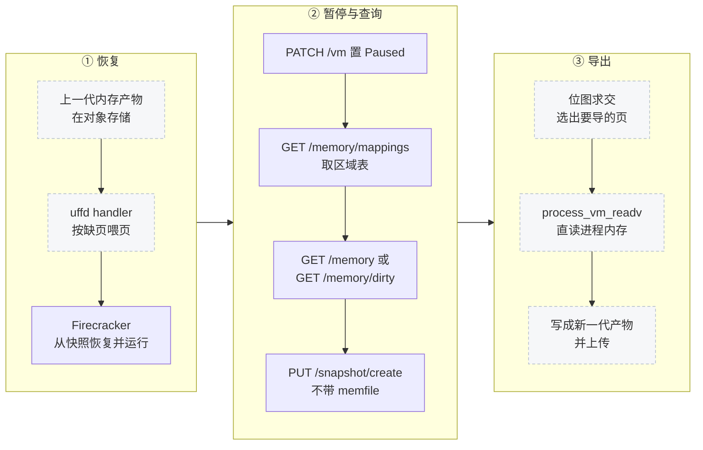

# 49 · 为什么分叉：e2b 的内存管线要什么

> 上游 Firecracker 把 guest 内存的导出封装得很严：什么时候导、导哪些页、导到哪里，全部由
> `PUT /snapshot/create` 一次决定，调用方只能给一个文件路径。e2b 的内存管线要的恰好是这三件事的控制权。
> 本篇讲这个需求从哪来、上游的接口在哪几处不合用、e2b 定制版用什么代价换了什么，
> 以及这 28 个提交各自属于哪一类。
>
> **读者**：所有要读第九部分的人；排查线上内存管线问题的工程师。
> **预备**：[第 36 篇 · 快照总览](36-snapshot-overview-and-format.md)、[第 37 篇 · 创建快照](37-snapshot-create.md)、
> [第 39 篇 · userfaultfd 后端](39-uffd-backend.md)。
> **代码**：`src/vmm/src/vstate/vm.rs`、`src/vmm/src/lib.rs`、`src/vmm/src/persist.rs`、
> `src/vmm/src/rpc_interface.rs`、`src/vmm/src/utils/pagemap.rs`、`src/firecracker/swagger/firecracker.yaml`、`scripts/build.sh`

---

## 0. 本篇要回答的问题

1. e2b 运行沙箱的循环是什么样的，这个循环对 VMM 提出了什么上游没有的要求？
2. 上游的 `PUT /snapshot/create` 具体在哪三处不满足这个要求？
3. e2b 定制版加的三个只读端点、可选 memfile 与 uffd 写保护，分别解决其中哪一处？
4. 这 28 个提交怎么分组，哪些是 e2b 自己的功能，哪些是从上游维护分支带进来的？
5. 版本名 `v1.12.1_a41d3fb` 是怎么拼出来的，谁把它钉成默认值？
6. 这一层改动的代价是什么：安全边界、接口契约与维护成本各有什么变化？

---

## 1. 循环：每次暂停只应该付出改动量的代价

e2b 的沙箱不是长期运行的虚拟机，而是一个会被反复暂停、反复拉起的执行环境。
一台沙箱的生命周期大致是这样一个循环：从一份**模板快照**恢复起来，
运行一段用户代码，暂停下来变成**新一代快照**，下次再从新快照恢复。
恢复这一端已经由上游的 userfaultfd 后端解决得很好：内存不必先落盘再映射，
Firecracker 建匿名映射，页内容由外部进程按缺页事件一页一页喂进来
（[第 39 篇](39-uffd-backend.md)）。真正的问题在暂停这一端。

如果暂停要把整台 microVM 的内存写出来，那么一台刚起来跑了两条命令的沙箱与一台跑了半小时的沙箱，
代价完全相同，都正比于内存大小而不是正比于改动量。要让代价正比于改动量，
产物就必须是**差分**：只包含这一轮被写过的页，加上一张「哪一页归属于哪一代产物」的映射表，
恢复时按映射表逐页回溯。这套差分链在 e2b 侧是怎么组织的不属于本书范围，
延伸阅读给出链接；本书只关心它对 VMM 提出的要求。

要求可以拆成三句话：

- 调用方要能**自己判断**哪些页需要导出，判据不止一种，而且判据之间要能做集合运算；
- 导出的页要能**直接进入调用方的缓冲区**，不必先由 Firecracker 写成一个本地文件；
- 上面两件事都要在 microVM 处于 Paused 状态时完成，而且不能改变 microVM 的运行语义，
  因为同一台 Firecracker 进程在暂停之后还可能被继续使用。

判据不止一种，是因为沙箱有两种起法。**从零启动**的沙箱（模板构建时的那一次）没有基线快照，
它的 guest 内存是匿名映射，从未被触碰的页根本不占物理内存，导出时只需要那些已经落到物理内存、
并且内容不全为零的页。**从快照恢复**的沙箱有基线，基线就是上一代的内存文件，
导出时需要的是「恢复之后被写过」的那些页。两种判据的口径不同，产出的位图却要能被同一套差分逻辑消费。

---

## 2. 上游接口的三处不合用

上游把上面三件事全部收在 `src/vmm/src/persist.rs` 的 `create_snapshot()` 里。
读一遍这个函数就能看清边界在哪。

**第一处：内存只能经由文件导出。** `create_snapshot()` 在写完状态文件之后无条件调用
`vmm.vm.snapshot_memory_to_file(&params.mem_file_path, params.snapshot_type)`，
参数里的 `mem_file_path` 是 `PathBuf`，不是 `Option`。也就是说，一次 create 必然产生一个内存文件。
对 e2b 来说这一步是纯粹的额外成本：内容最终要进对象存储，先在本地落一遍盘，
意味着一次完整的写加一次完整的读，而且这个文件的稀疏结构还要被再解析一次。

**第二处：脏页判据不外露，而且只有一种。** 上游的差分判据写在
`src/vmm/src/vstate/memory.rs` 的 `dump_dirty()` 里，表达式是「KVM 日志说脏」或「用户态位图说脏」
（[第 37 篇 §6](37-snapshot-create.md#6-dump_dirty逐页判定与成批写)）。
这个判据没有任何对外出口：它在函数内部被消费，产物是写好的文件，位图本身不会回到调用方手里。
调用方因此无法把它与别的条件求交，例如「脏且非零」或「常驻且非零」。
更根本的是，KVM 脏页日志的语义是**取走并清零**（[第 14 篇 §2](14-dirty-page-tracking.md#2-kvm-侧一份读一次就消失的日志)），
读一次就消耗掉一次，不能先看一眼再决定怎么用。

**第三处：宿主虚拟地址不外露。** 要让调用方直接从 Firecracker 进程里把页读走，
它必须知道每个内存区域的宿主虚拟地址（HVA）。上游代码里唯一交出 HVA 的地方是 userfaultfd 握手：
`persist.rs` 的 `GuestRegionUffdMapping` 带着 `base_host_virt_addr`、`size`、`offset`、`page_size`
四个字段通过 Unix socket 发给 uffd handler。但这条路径只在**恢复时**走一次，
而且给的是恢复端的进程；一台已经跑起来的 microVM 没有任何接口再把这份信息说出来。

三处合起来构成同一个判断：上游的假设是「快照产物由 VMM 写出、由 VMM 决定内容」，
这个假设在 e2b 的管线里不成立，因为决定内容的是外面那个知道差分链形状的进程。

---

## 3. 方案：把决定权挪到进程外

e2b 定制版的做法是在控制面上新开三个只读端点，把上游藏在 `create_snapshot()` 内部的三样信息各自暴露出来，
再把 `mem_file_path` 放松成可选，让 create 退化成「只写状态文件」。

| 端点 | 交出什么 | 解决第 2 节的哪一处 | 展开 |
|---|---|---|---|
| `GET /memory/mappings` | 每个区域的 HVA、大小、扁平偏移与页大小 | 第三处 | [第 50 篇](50-memory-mappings-api.md) |
| `GET /memory` | 常驻页位图与零页位图 | 第二处（从零启动的判据） | [第 51 篇](51-memory-resident-empty-api.md) |
| `GET /memory/dirty` | 脏页位图 | 第二处（从快照恢复的判据） | [第 52 篇](52-memory-dirty-api.md) |
| `PUT /snapshot/create` 不带 `mem_file_path` | 只写状态文件 | 第一处 | [第 54 篇](54-optional-memfile-snapshot.md) |

三张位图都按同一套页序编码：所有区域首尾相接拼成一条扁平的页序列，
第 n 位对应第 n 页，每 64 位打包成一个 `u64`。`GET /memory/mappings` 给出的 `offset` 用的是同一条序列的字节偏移，
因此调用方拿到位图之后不需要额外信息就能把位号换算成地址。
这里的「页」是 `machine_config.huge_pages` 这个**配置值**换算出来的粒度，不是宿主页：
`HugePageConfig::page_size()`（`src/vmm/src/vmm_config/machine_config.rs`）在 `None` 这一支直接返回常量 4096，
不查 `sysconf(_SC_PAGESIZE)`，所以位图粒度与宿主真实页大小是两个量（[第 50 篇 §2.2](50-memory-mappings-api.md#22-page_size-描述的是配置不是区域)）。
另外要先记住一条调用方事实：orchestrator 在 `PUT /machine-config` 里把 `track_dirty_pages` 固定填 `false`
（`packages/orchestrator/internal/sandbox/fc/client.go`），所以上游那两份脏页记录在 e2b 的 microVM 里压根没有被建立起来，
三个新端点不是「多一种选择」，而是唯一的信息来源。

`GET /memory/dirty` 的判据依赖一个前提：guest 内存必须被 userfaultfd 写保护过，
否则 `/proc/self/pagemap` 里的写保护位恒为零，所有常驻页都会被算成脏。
这就是第四项改动的来源 —— `persist.rs` 的 `guest_memory_from_uffd()` 换用一个支持写保护的
`userfaultfd` crate 分叉，注册时在 `MISSING` 之外加上 `WRITE_PROTECT` 模式（[第 53 篇](53-uffd-write-protection.md)）。

下面这张图是 Firecracker 在这套管线里的位置。三个阶段里，只有中间那一段发生在 Firecracker 进程内。

虚线框里的节点都在 Firecracker 进程之外。读内存这一步用的是 `process_vm_readv`：
调用方按 `/memory/mappings` 把要导出的页号换算成一组宿主虚拟地址区间，
一次系统调用跨进程搬走多段，不经过 `/proc/<pid>/mem`，也不经过任何文件。

这个方案的形状值得单独说一句：**它没有改动 Firecracker 的任何既有行为路径**。
三个端点都是只读的，调用它们不改变 microVM 状态，也不消耗 KVM 脏页日志；
`mem_file_path` 变成 `Option` 之后，传路径的旧调用方式语义完全不变。
换句话说，这一层是加了一条旁路，而不是改了主路。第 55 篇会看到，
这也正是它能用不到七百行功能代码做完的原因。

---

## 4. 28 个提交分成四类

从 `v1.12.1` 到 `a41d3fb` 一共 28 个提交，其中两个是合并提交。按内容分成四类。

| 类别 | 提交数 | 代表提交 | 内容 |
|---|---|---|---|
| 功能 | 4 | `03e506146`、`0bb99c51d`、`54a1c1ad3`、`8fc760f61` | 暴露映射与可选 memfile、`GET /memory`、`GET /memory/dirty`、uffd 写保护 |
| 修补 | 5 | `eff49ed1e`、`5cfd4e39f`、`523dc12c9`、`8769de7cf`、`178223a0e` | 编译错误、swagger 必填字段、参数与类型修正、版本号 |
| 上游回合 | 5 | `85ebde70e`、`21dc66d1a`、`13ffca99b`、`7f528b416`、`dbc555204` | 宿主 CPU 特性检查、MSR 例外表、测试 URL 与断言 |
| 构建、脚本与 CI | 12 | `55b6479f2`、`1133bd6cd`、`f1510d5b1`、`a41d3fb53` | 构建 / 上传脚本、GitHub Actions runner、测试集裁剪 |
| 合并提交 | 2 | `412995637`、`63ed77027` | 合入上游 `firecracker-v1.12` 与自身远端 |

功能那四个提交里，`03e506146` 与 `0bb99c51d` 属于同一件事的两步：
前者加 `GuestMemoryRegionMapping` 与 `Vm::guest_memory_mappings()` 并把 `mem_file_path` 改成 `Option`，
后者把这份区域表从 `GET /` 的响应里挪到独立的 `GET /memory/mappings`，同时补上 `GET /memory`、
seccomp 条目与 pytest 用例。四个功能提交合计 989 行新增，占全部增量的九成以上。

「上游回合」这一类需要一句解释。这五个提交的作者是 Firecracker 上游的维护者，
它们是通过把上游维护分支 `firecracker-v1.12` 合进分叉带进来的（合并提交 `412995637`），
内容与 e2b 的功能无关：AMD 宿主 CPU 特性检查的修正、把 `MSR_TSC_RATE` 加进 MSR 例外表、
Spectre / Meltdown 检查脚本换一个 URL、`test_reboot` 去掉线程数断言。
判断某个提交是不是上游的，方法是看它在不在 `upstream/firecracker-v1.12` 上；第 55 篇给出完整清单。

「构建与 CI」占了提交数的一小半却只有几十行代码，因为其中大部分是反复调整 GitHub Actions 的
runner 标签与测试集。这一类改动的取向是「够用即可」：`tools/test.sh` 限制了测试集，
`test_shut_down.py` 去掉了一条对线程数的断言，依赖变更检查的工作流被整个删掉
（`a41d3fb53`，也就是分叉头部那个提交）。这是分叉维护姿态的一部分，同样在第 55 篇展开。

---

## 5. 改动落在哪些文件

下表是 `src/` 与 `resources/` 下被改动的文件，按本书篇目归类。`tests/`、`scripts/`、
`Makefile`、`Cargo.lock` 与 CI 配置不在表内，合计约 350 行，都归第 55 篇。

| 文件 | +/− | 内容 | 篇目 |
|---|---|---|---|
| `src/vmm/src/vstate/vm.rs` | +192/−1 | `GuestMemoryRegionMapping`、`guest_memory_mappings()`、`get_memory_info()`、`mincore_bitmap()` | 50、51 |
| `src/vmm/src/utils/pagemap.rs` | +115 | 新文件：`PagemapEntry`、`PagemapReader` | 52 |
| `src/firecracker/swagger/firecracker.yaml` | +82/−1 | 两个新端点与三个响应类型的契约 | 50、51、54 |
| `src/vmm/src/rpc_interface.rs` | +67/−5 | 三个 `VmmAction` 变体、三个 `VmmData` 变体、`get_dirty_memory_info()` | 50、51、52 |
| `src/firecracker/src/api_server/parsed_request.rs` | +70 | `/memory` 前缀的路由与响应分发 | 50 |
| `src/firecracker/src/api_server/request/memory.rs` | +52 | 新文件：三个解析函数 | 50 |
| `src/vmm/src/lib.rs` | +44 | `Vmm::get_dirty_memory()` | 52 |
| `src/vmm/src/persist.rs` | +27/−6 | 可选 memfile 的分支、uffd 写保护注册 | 53、54 |
| `src/vmm/src/vmm_config/instance_info.rs` | +29/−1 | 三个响应结构体、`memory_regions` 字段 | 50、51、52 |
| `resources/seccomp/*.json` | +15/−3 | x86_64 加 `mincore` 与 `pread64`，aarch64 只加 `mincore` | 55 |
| `src/vmm/Cargo.toml` | +5/−1 | `userfaultfd` 换成带写保护特性的分叉 | 53 |
| 其余八个文件 | +13/−6 | 路由注册、请求解析、`Option` 化带来的调用点修正 | 54、55 |

三个端点的实现主体集中在 `vstate/vm.rs` 与新文件 `utils/pagemap.rs`，其余都是把这条链路接起来的胶水：
从 HTTP 路径到 `VmmAction`，从 `VmmAction` 到 `RuntimeApiController` 的分支，再到 `VmmData` 的序列化。
这条链路本身是上游的（[第 08 篇](08-api-server.md)、[第 09 篇](09-rpc-interface.md)），
新端点只是在每一层各加一个分支，这是分叉能保持小体量的结构性原因。

---

## 6. 版本名与钉住

分叉产出的不是「Firecracker v1.12.1」，而是一个带提交哈希的版本名。
`scripts/build.sh` 从 `src/firecracker/swagger/firecracker.yaml` 的 `info.version` 字段取出版本号，
再取 `git rev-parse --short=7 HEAD`，拼成 `v<版本号>_<7 位哈希>`，
调用 `tools/devtool -y build --release` 构建，把产物复制到 `build/fc/<版本名>/firecracker`。
`scripts/upload.sh` 再用 `gsutil` 把整个目录传到对象存储的版本桶里。
提交 `a41d3fb` 对应的版本名因此是 `v1.12.1_a41d3fb`。

消费侧把这个字符串当作目录名。e2b infra 的
`packages/shared/pkg/feature-flags/flags.go` 里有一组常量：
`DefaultFirecackerV1_12Version = "v1.12.1_a41d3fb"`，`DefaultFirecrackerVersion` 指向它，
另有 `DefaultFirecackerV1_10Version = "v1.10.1_30cbb07"` 对应分叉的 `firecracker-v1.10-direct-mem` 分支
—— 同一组内存端点移植到上游 v1.10 上的版本，本书不讲。
两个常量被组织进 `FirecrackerVersionMap`，再经 feature flag 暴露出去，
所以线上换版本只是改一个字符串，不需要重新部署 orchestrator。
本书讲的 e2b 定制版，就是这个映射表在 2026.09 指向的那一份。

`build.sh` 里有一处写死值得记下来：产物路径是
`build/cargo_target/x86_64-unknown-linux-musl/release/firecracker`，架构写死在字符串里。
分叉只在 x86_64 上构建与运行，这个假设在 seccomp 过滤器上也留下了痕迹（第 5 节表格最后一行），
并且是 ARM 适配版第一个要改的地方（[第 58 篇](58-building-and-running-on-aarch64.md)）。

---

## 7. 代价

**信任域缩小到一台宿主上的两个进程。** `GET /memory/mappings` 把 Firecracker 进程的宿主虚拟地址
交给了外部调用方，`process_vm_readv` 又要求调用方对 Firecracker 进程有 ptrace 级的权限。
这套组合只在「orchestrator 与 Firecracker 属于同一信任域」的前提下成立。
上游 Firecracker 的威胁模型把 Firecracker 进程本身当作要被约束的对象，
用 jailer 与 seccomp 把它关起来（[第 42 篇](42-seccomp.md)、[第 43 篇](43-jailer.md)）；
e2b 定制版没有削弱这些约束，但在它们之外增加了一条从外向内的读路径，
这条路径的安全性由部署环境保证，而不是由 Firecracker 保证。

**脏页判据从 VMM 内部移到了宿主内核特性上。** `GET /memory/dirty` 读的是
`/proc/self/pagemap` 的 userfaultfd 写保护位，异步写保护要求宿主内核 6.7 以上。
上游的 KVM 脏页日志没有这个要求。换来的是判据可以被外部消费与组合，代价是对宿主内核版本的硬依赖，
而且这个依赖在 aarch64 上直接落空（[第 57 篇](57-which-fork-commit-and-uffd-wp.md)）。

**接口契约与实现不完全同步。** `a41d3fb` 的 `src/firecracker/swagger/firecracker.yaml` 里
只有 `/memory/mappings` 与 `/memory`，没有 `/memory/dirty`；这个端点在代码里可用，
在分叉自己的契约文件里查不到。e2b infra 侧维护的那份 `packages/shared/pkg/fc/firecracker.yml`
补上了它的定义，客户端代码由那一份生成，所以线上能用。
另一处同类的痕迹在 `src/vmm/src/vmm_config/instance_info.rs`：
`InstanceInfo` 上有一个 `memory_regions: Option<Vec<GuestMemoryRegionMapping>>` 字段，
两处显式构造点都写 `None`，运行期没有任何代码给它赋值，而 swagger 的 `InstanceInfo` 定义里也没有它。
结果是 `GET /` 返回一个契约上不存在、值恒为 `null` 的字段。这两处都不影响功能，
但在排查「文档里为什么没有这个端点」时会浪费时间，也是升级分叉时要一并处理的负债。

**维护成本随上游演进增长。** 分叉钉在 v1.12.1 这条线上，上游的修复要靠人工合并维护分支带进来
（本篇第 4 节的「上游回合」那一类）。e2b 已经有 v1.10、v1.13、v1.14 几条平行分支把同一组端点移植过去，
说明这组改动的移植成本是可控的，但每次升级都要重放一遍。
第 55 篇给出重放清单，第 78 篇把三层差异整理成表。

---

## 8. 小结

- e2b 的循环要求暂停成本正比于改动量，因此产物必须是差分；决定「哪些页进差分」的进程在 Firecracker 之外。
- 上游 `create_snapshot()` 有三处不合用：内存只能经文件导出、脏页判据不外露且只有 KVM 日志一种、
  运行中的 microVM 不交出 guest 内存的宿主虚拟地址。
- e2b 定制版的回应是三个只读端点加一个放松的字段：`GET /memory/mappings` 给地址，
  `GET /memory` 给常驻与零页位图，`GET /memory/dirty` 给脏页位图，`mem_file_path` 变成可选。
  三张位图共用同一条扁平页序，可以直接做集合运算。
- 判据有两套，因为沙箱有两种起法：从零启动用「常驻且非零」，从快照恢复用「写保护位已被清掉」。
  后者依赖 uffd 写保护，这就是第四个功能提交的来源。
- 这一层不改任何既有行为路径，只加旁路；`src/` 下 18 个文件约 696 行，一半集中在
  `vstate/vm.rs` 与新文件 `utils/pagemap.rs`。
- 28 个提交里只有四个是功能提交，五个来自上游维护分支，其余是修补与 CI 调整。
- 版本名由 `scripts/build.sh` 拼成 `v<swagger 版本>_<7 位哈希>`，
  infra 的 `flags.go` 把 `v1.12.1_a41d3fb` 钉为默认值；构建脚本里的目标架构写死为 x86_64。
- 代价有四项：信任域收缩为同宿主两进程、脏页判据依赖宿主内核 6.7 的 uffd 异步写保护、
  契约文件与实现不同步（`/memory/dirty` 未写进分叉 swagger，`InstanceInfo.memory_regions` 恒为 `null`）、
  以及每次跟随上游都要重放一遍的移植成本。

---

## 延伸阅读 / 下一篇

- [第 50 篇 · /memory/mappings](50-memory-mappings-api.md)：下一篇，三个端点里最基础的那个。
- [第 51 篇 · /memory：常驻页与零页位图](51-memory-resident-empty-api.md)、
  [第 52 篇 · /memory/dirty](52-memory-dirty-api.md)：两套判据的实现。
- [第 53 篇 · uffd 写保护](53-uffd-write-protection.md)、
  [第 54 篇 · 可选 memfile 的快照](54-optional-memfile-snapshot.md)：本篇第 3 节两项改动的展开。
- [第 55 篇 · seccomp、构建发布脚本与合入的上游修复](55-seccomp-build-upload-and-upstream-fixes.md)：第 4、6 节的展开。
- [第 01 篇 · 三层版本谱系与仓库地图](01-lineage-and-repo-map.md)：三层提交谱系与改动规模。
- [第 78 篇 · 各层差异总表](78-layer-diff-tables.md)：文件级差异总表。
- e2b 侧的差分链、映射表与上传流程，见 [e2b 手册第 37 篇](../e2b-infra/37-pause-and-snapshot.md)；
  沙箱从模板恢复的全过程见 [e2b 手册第 12 篇](../e2b-infra/12-sandbox-lifecycle-walkthrough.md)。
