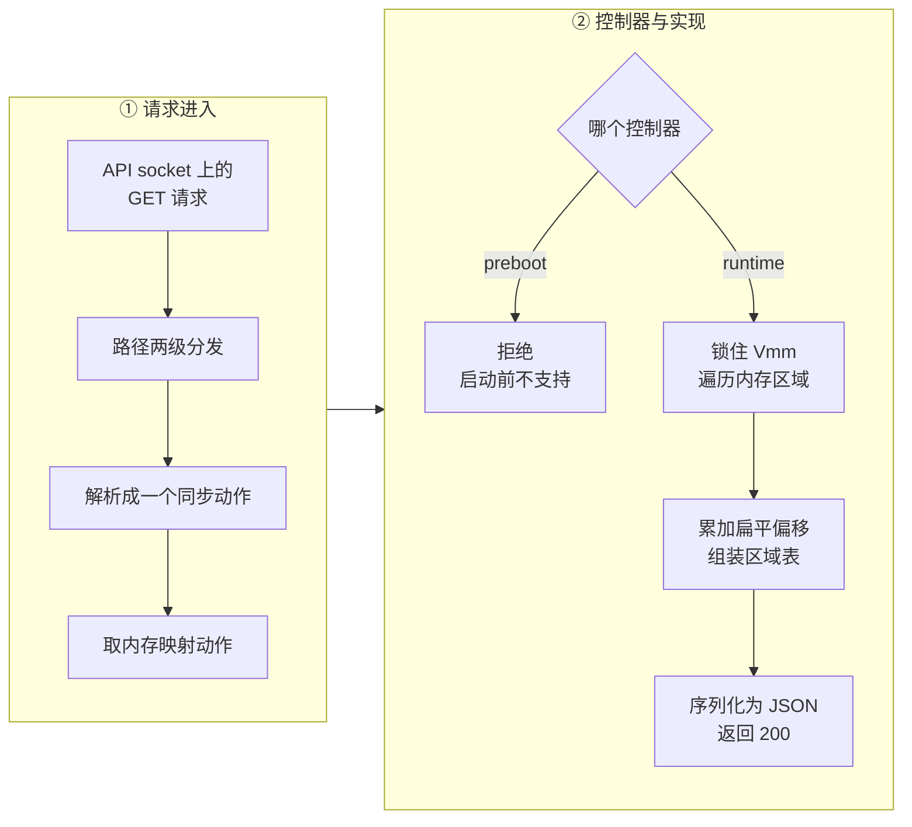

# 50 · /memory/mappings：把 guest 内存的宿主地址交出去

> 要让另一个进程直接读走 guest 内存，它得先知道这些内存在 Firecracker 的地址空间里落在哪。
> 上游只在 userfaultfd 握手时交出过一次这份信息，而且是交给恢复端。
> 本篇讲 e2b 定制版新增的 `GET /memory/mappings`：它交出什么、这些字段怎么用、
> 从 HTTP 路径到响应的完整链路，以及把宿主虚拟地址暴露给进程外意味着什么。
>
> **读者**：要读懂 e2b 内存管线的工程师；排查「导出的页对不上」这类问题的人。
> **预备**：[第 13 篇 · guest 内存](13-guest-memory.md)、[第 39 篇 · userfaultfd 后端](39-uffd-backend.md)、
> [第 49 篇 · 为什么分叉](49-why-e2b-forked.md)。
> **代码**：`src/vmm/src/vstate/vm.rs`、`src/vmm/src/rpc_interface.rs`、
> `src/vmm/src/vmm_config/instance_info.rs`、`src/firecracker/src/api_server/request/memory.rs`、
> `src/firecracker/src/api_server/parsed_request.rs`、`src/firecracker/swagger/firecracker.yaml`

---

## 0. 本篇要回答的问题

1. 这个端点返回的四个字段各是什么，`offset` 相对于哪一个坐标系？
2. `page_size` 从哪里来，它描述的是内存区域的实际后备，还是别的东西？
3. 从 `GET /memory/mappings` 到 `Vm::guest_memory_mappings()` 中间经过哪几层，各层做了什么？
4. 什么时候能调这个端点，什么时候不能，返回的内容会随时间变化吗？
5. 调用方拿到这份表之后怎么把「第 n 页」换算成一次跨进程读？
6. 把宿主虚拟地址交出去，改变了什么安全前提？

---

## 1. 问题：跨进程读内存要先有地址

e2b 的暂停流程要把 guest 内存里选中的那些页直接搬进 orchestrator 的缓冲区，
不经过 Firecracker 写文件这一步（[第 49 篇](49-why-e2b-forked.md)）。
Linux 提供的手段是 `process_vm_readv`：给定目标进程的 pid 和一组
「远端地址 + 长度」的区间，一次系统调用把多段内容拷进本进程的缓冲区。
这个接口要的是**宿主虚拟地址**（HVA），不是 guest 物理地址（GPA），也不是内存文件里的偏移。

Firecracker 进程里这份对应关系存在 `GuestMemoryMmap` 里：每个 `GuestRegionMmap`
记着自己的 GPA 起点和一块 `mmap` 出来的宿主内存（[第 13 篇](13-guest-memory.md#5-四层数据结构)）。
问题是它不出进程。上游代码里唯一把 HVA 送出去的地方是 `src/vmm/src/persist.rs` 的
userfaultfd 握手：`GuestRegionUffdMapping` 带着 `base_host_virt_addr`、`size`、`offset`、
`page_size` 四个字段经 Unix socket 发给 uffd handler（[第 39 篇 §2](39-uffd-backend.md#2-握手一次性交出去的两样东西)）。
这条路径只在恢复时走一次；一台已经跑起来的 microVM 没有任何接口再说出这份信息。

而且调用方还需要另一半：同一页在**内存产物**里的位置。e2b 的差分链按「页号」组织，
页号来自把所有区域首尾相接拼成的那条扁平序列。要在「宿主地址」与「页号」之间换算，
每个区域的起点、大小与它在扁平序列里的起始偏移缺一不可。

`GET /memory/mappings` 就是把这四样东西一次交出来。

---

## 2. 四个字段

响应体是一个对象，里面只有一个数组字段 `mappings`，数组元素是
`src/vmm/src/vstate/vm.rs` 里定义的 `GuestMemoryRegionMapping`：

```rust
pub struct GuestMemoryRegionMapping {
    pub base_host_virt_addr: u64,
    pub size: usize,
    pub offset: u64,
    pub page_size: usize,
}
```

一个典型的响应长这样（一台 8 GiB、未开大页的 x86_64 microVM，两个区域）：

```json
{
  "mappings": [
    {"base_host_virt_addr": 140244174766080, "size": 3489660928, "offset": 0, "page_size": 4096},
    {"base_host_virt_addr": 140247664427008, "size": 5100273664, "offset": 3489660928, "page_size": 4096}
  ]
}
```

四个字段的含义分别是：

- `base_host_virt_addr`：该区域在 Firecracker 进程地址空间里的起始地址，
  取自 `mem_region.as_ptr()`，也就是 `mmap` 的返回值。
- `size`：该区域的字节数。
- `offset`：该区域在**扁平内存序列**里的起始字节偏移，等于前面所有区域大小之和。
- `page_size`：换算页号时用的页粒度。

这个结构与上游 uffd 握手用的 `GuestRegionUffdMapping` 逐字段同形，只少一个字段 ——
上游那边还有一个 `page_size_kib`，注释里写明名字是错的（它的值其实是字节数）、
因为属于对外接口不能改名、标记为弃用待 2.0 移除。新结构没有背这个包袱。
同形是有意的：orchestrator 侧解析 uffd 握手表与解析这个端点的响应，用的是同一个
`Mapping` 类型（`internal/sandbox/uffd/memory/mapping.go` 的 `NewMappingFromFc()`），
因此「按 offset 找区域」「按 HVA 找 offset」这两个方向的换算函数只写了一份。

### 2.1 `offset` 的坐标系：扁平序列，不是 GPA

`offset` 不是 GPA，也不是 GPA 减去区域基址。它是「把所有区域按顺序首尾相接拼起来」之后的字节偏移。
x86_64 上一台 8 GiB 的 microVM 有两个区域，第二个区域的 GPA 从 4 GiB 开始，
中间隔着 768 MiB 的 MMIO 空洞；但在扁平序列里，第二个区域紧跟在第一个之后，
`offset` 是 3 489 660 928（3.25 GiB），不是 4 GiB。

```text
GPA 空间                         扁平序列（内存产物的坐标系）

0x0000_0000  +-------------+     0            +-------------+
             | region 0    |                  | region 0    |
             | 3.25 GiB    |                  | 3.25 GiB    |
0xD000_0000  +-------------+     0xD000_0000  +-------------+
             | MMIO 空洞   |                  | region 1    |
             | 768 MiB     |                  | 4.75 GiB    |
0x1_0000_0000+-------------+                  |             |
             | region 1    |     0x2_0000_0000+-------------+
             | 4.75 GiB    |
0x2_3000_0000+-------------+     总长 8 GiB，空洞不占位
```

这套平铺规则不是这个端点发明的，它就是上游内存文件的布局规则
（[第 13 篇 §3](13-guest-memory.md#3-区域的后备四种做法)）：
`memory.rs` 的 `create()` 给第 k 个区域算 `FileOffset` 时用的也是前 k 个区域大小的累加。
所以 `offset` 直接可以当成「这一段内容在一份完整内存文件里的位置」来用，
调用方不需要知道 GPA，也不需要知道 MMIO 空洞在哪。

### 2.2 `page_size` 描述的是配置，不是区域

`page_size` 的来源是 `vm_info.huge_pages.page_size()`，
其中 `vm_info` 由 `VmInfo::from(&self.vm_resources)` 现场构造，
`huge_pages` 取自 `machine_config.huge_pages`。
`HugePageConfig::page_size()`（`src/vmm/src/vmm_config/machine_config.rs`）只有两个取值：
`None` 返回 4096，`Hugetlbfs2M` 返回 2 MiB。

两个后果要记住。第一，**所有区域的 `page_size` 必然相同**，因为它来自同一个配置项，
而不是逐个区域探测出来的；这条性质被 `GET /memory` 明确依赖（[第 51 篇](51-memory-resident-empty-api.md)）。
第二，它是配置值而不是观测值：它说的是「这台 microVM 按 2 MiB 大页配置」，
不是「这段映射当前确实由 2 MiB 的 HugeTLB 页后备」。
两者在正常情况下一致 —— 配了大页而池子不够时 `mmap` 会直接失败，不会静默退化 ——
但「4096」这个值同样不保证宿主页就是 4 KiB，它只是 `HugePageConfig::None` 的常量。
真正的宿主页大小由 `arch::host_page_size()` 用 `sysconf(_SC_PAGESIZE)` 取，
这两个值在 `GET /memory` 与 `GET /memory/dirty` 的实现里都出现，不能混用。

---

## 3. 从 HTTP 路径到响应

这个端点走的是上游既有的控制面链路（[第 08 篇](08-api-server.md)、[第 09 篇](09-rpc-interface.md)），
每一层各加一个分支。



**路由。** `src/firecracker/src/api_server/parsed_request.rs` 的
`TryFrom<&Request> for ParsedRequest` 里新增了一条匹配臂：路径第一段是 `memory` 且方法是 GET 时，
再取下一段 —— `Some("mappings")` 走 `parse_get_memory_mappings()`，`Some("dirty")` 走
`parse_get_memory_dirty()`，`None`（也就是 `GET /memory`）走 `parse_get_memory()`，
其余一律返回 `RequestError::InvalidPathMethod`。三个端点共用同一个前缀分支，
这是上游路由表里少见的两级分发，其它端点都只看第一段。

**解析。** `src/firecracker/src/api_server/request/memory.rs` 是个 52 行的新文件，
三个解析函数都不读请求体，各自只做两件事：给一个 metrics 计数器加一，
返回 `ParsedRequest::new_sync(VmmAction::GetMemoryMappings)`。
这里有一处要留意：三个函数用的计数器都是 `METRICS.get_api_requests.instance_info_count`，
也就是 `GET /` 的那个计数器。新端点没有自己的 metrics 条目，
所以 metrics 里的 `instance_info_count` 实际上是四个端点调用次数之和，
在按 metrics 定位调用来源时会误导（[第 44 篇](44-logging-and-metrics.md)）。

**动作分发。** `src/vmm/src/rpc_interface.rs` 里加了三个 `VmmAction` 变体与三个 `VmmData` 变体。
`PrebootApiController` 对这三个动作一律返回 `VmmActionError::OperationNotSupportedPreBoot`，
写成一条合并的匹配臂；`RuntimeApiController` 对 `GetMemoryMappings` 的处理是三行：
锁住 `Vmm`，调用 `locked_vmm.vm.guest_memory_mappings(&VmInfo::from(&self.vm_resources))`，
把结果包进 `MemoryMappingsResponse`。

**实现。** `src/vmm/src/vstate/vm.rs` 的 `Vm::guest_memory_mappings()` 本身只有十行：
`offset` 从 0 开始，遍历 `self.guest_memory().iter()`，每个区域推入一条记录并把
`offset` 累加上该区域的大小。没有系统调用，没有锁，也不访问 guest 内存的内容。

**响应。** `parsed_request.rs` 的响应分发里新增 `VmmData::MemoryMappings(mappings) =>
Self::success_response_with_data(mappings)`，走的是与 `GET /` 完全相同的序列化路径。
swagger 里对应 `MemoryMappingsResponse` 与 `GuestMemoryRegionMapping` 两个定义，
四个字段全部标为 required。

---

## 4. 什么时候能调，结果会不会变

**preboot 不行。** microVM 还没启动时没有 `Vmm` 对象，也就没有 guest 内存，
控制器直接返回 `OperationNotSupportedPreBoot`，HTTP 状态码 400。
分叉的集成测试 `tests/integration_tests/functional/test_api.py::test_memory_mappings_pre_boot`
明确断言了这一条。

**启动之后随时可以。** 与 `GET /memory/dirty` 不同，这个端点**没有**要求 microVM 处于 Paused：
`RuntimeApiController` 的分支里没有任何状态检查。运行中调用是安全的，因为它只读区域表，
不读区域内容，也不与 vCPU 线程竞争 —— 它拿的是 `Vmm` 的互斥锁，
而 vCPU 线程访问 guest 内存不经过这把锁。

**结果在进程生命周期内不变。** 内存区域是在 `builder.rs` 构建 microVM 时一次性切好并注册给 KVM 的，
运行期不增不减（[第 13 篇 §4](13-guest-memory.md#4-注册给-kvm一个区域一个-memslot)）。
balloon 设备回收内存用的是 `madvise`，改变的是这些页有没有物理后备，
不改变区域的数量、起点与长度。因此调用方可以在恢复之后取一次这张表，
之后整个沙箱生命周期都用它，不必每次暂停都重取；
实际的调用方并没有这样缓存，每次导出前都重新取一次，代价只是一次 HTTP 往返。

---

## 5. 调用方怎么用

orchestrator 侧的用法集中在
`packages/orchestrator/internal/sandbox/fc/memory.go` 的 `Process.ExportMemory()`，
它拿到一个「要导出哪些页」的位集合，把它变成一次跨进程读。三步：

1. 调 `GET /memory/mappings`，用 `memory.NewMappingFromFc()` 把响应变成 `Mapping` 对象。
2. 把位集合按块大小展开成一串 `[起始偏移, 长度)` 区间（扁平序列坐标），
   每个区间交给 `Mapping.GetHostVirtRanges()`。这个函数按 `offset` 与 `size` 定位区域，
   算出 `base_host_virt_addr + (请求偏移 − 区域 offset)`，并在区间跨越区域边界时把它切开 ——
   扁平序列里连续的一段，在宿主地址空间里未必连续。
3. 把得到的一组宿主地址区间交给 `block.NewCacheFromProcessMemory()`，
   后者调 `unix.ProcessVMReadv()` 按批搬运，批的大小受两个内核限制约束：
   一次调用的 iovec 条数不超过 `IOV_MAX`，总字节数不超过 `MAX_RW_COUNT`。

第 2 步是这个端点存在的全部理由：没有 `base_host_virt_addr` 就没法发起读，
没有 `offset` 就不知道页号对应哪个区域，没有 `size` 就不知道区间在哪里被切开。
`page_size` 在这条路径上没有直接参与换算 —— 块大小由 e2b 侧的产物格式决定 ——
但它在另外两个端点的位图解码里是必需的。

值得对照一下这与上游 uffd handler 的关系。uffd handler 做的是**反方向**的换算：
收到一个故障地址（HVA），按同一张表算出它在内存文件里的偏移，再把内容拷进去
（[第 39 篇 §4](39-uffd-backend.md#4-处理器一侧一个-poll-循环加一次地址换算)）。
两个方向共用一张表、一份代码，这是把新端点的字段与 uffd 握手对齐带来的直接收益。

---

## 6. 代价：交出去的是进程地址

这个端点把 Firecracker 进程的一段真实虚拟地址写进了 HTTP 响应。
三条后果值得写清楚。

**它让调用方有能力读 guest 内存的任意一页。** 光有地址还不够，`process_vm_readv`
要求调用进程对目标进程有 ptrace 级的权限（内核里的 `PTRACE_MODE_ATTACH_REALCREDS` 检查），
通常意味着同一个 uid 或者 `CAP_SYS_PTRACE`。
换句话说，安全性由部署环境保证：orchestrator 与 Firecracker 必须在同一台宿主、同一信任域里。
上游 Firecracker 的威胁模型是反过来的 —— 它假设 Firecracker 进程本身可能被 guest 攻破，
因而用 jailer 与 seccomp 把它往小里关（[第 42 篇](42-seccomp.md)、[第 43 篇](43-jailer.md)）。
e2b 定制版没有削弱这些约束，但在它们之外开了一条从外向内的读路径，
这条路径不在 Firecracker 的防护范围内。

**它泄露了地址空间布局。** `base_host_virt_addr` 是 `mmap` 的返回值，受 ASLR 影响。
把它交出去，等于对拿到响应的一方取消了这一段的地址随机化。
对同信任域的 orchestrator 没有意义，但如果这个 API socket 被别的东西碰到，
这是一条现成的信息泄露。Firecracker 的 API socket 本来就是全权接口 ——
能访问它的一方已经可以停机、改配置、创建快照 —— 所以这一条没有改变信任边界的形状，
只是让边界被突破之后的后果更直接。

**Firecracker 侧没有新增系统调用。** 这个端点的实现只是遍历一个 `Vec`，
`resources/seccomp/*.json` 里不需要为它加任何条目
（另外两个端点要加 `mincore` 与 `pread64`，见[第 51 篇](51-memory-resident-empty-api.md)与[第 52 篇](52-memory-dirty-api.md)）。
真正做读操作的 `process_vm_readv` 发生在 orchestrator 进程里，不受 Firecracker 的过滤器管辖。

还有一处与本端点同源的残留。`src/vmm/src/vmm_config/instance_info.rs` 的 `InstanceInfo`
上有一个字段 `memory_regions: Option<Vec<GuestMemoryRegionMapping>>`。
全仓库只有两处显式构造这个结构体 —— `src/firecracker/src/main.rs` 与
`src/cpu-template-helper/src/utils/mod.rs` —— 两处都写死 `memory_regions: None`；
`Vmm::instance_info()` 返回的是这份值的克隆，运行期没有任何代码给它赋值，
而 `src/firecracker/swagger/firecracker.yaml` 的 `InstanceInfo` 定义里也没有这个属性。
结果是 `GET /` 会返回一个契约上不存在、值恒为 `null` 的字段。
它不影响功能，但读代码的人会以为存在第二条取映射表的路径；
升级分叉时这是可以一并删掉的东西。

---

## 7. 小结

- `GET /memory/mappings` 返回一个区域数组，每条给出宿主虚拟地址、字节数、扁平序列偏移与页大小；
  这是跨进程直读 guest 内存的前提。
- `offset` 的坐标系是「所有区域首尾相接」的扁平序列，与上游内存文件的布局规则一致，
  MMIO 空洞不占位；它不是 GPA。
- `page_size` 来自 `machine_config.huge_pages`，是配置值，因此所有区域必然相同；
  它与 `host_page_size()` 取到的宿主页大小是两回事。
- 结构与上游 uffd 握手的 `GuestRegionUffdMapping` 同形（少一个弃用字段），
  使调用方两个方向的地址换算共用一份代码。
- 链路是路由两级分发 → `parse_get_memory_mappings()` → `VmmAction::GetMemoryMappings` →
  `Vm::guest_memory_mappings()` → `VmmData::MemoryMappings`；实现本身只有十行，无系统调用。
- preboot 调用返回 `OperationNotSupportedPreBoot`；启动之后任何状态都可调，不要求 Paused；
  返回内容在进程生命周期内不变。
- 三个新端点共用 `instance_info_count` 这一个 metrics 计数器，按 metrics 区分调用来源不可行。
- 代价是把进程地址交到了外面：能力由部署环境而非 Firecracker 保证，并且取消了这一段的地址随机化。
  Firecracker 侧不需要新的 seccomp 条目。
- `InstanceInfo.memory_regions` 是一个恒为 `null`、契约里不存在的残留字段。

---

## 延伸阅读 / 下一篇

- [第 51 篇 · /memory：常驻页与零页位图](51-memory-resident-empty-api.md)：下一篇，两张位图共用本篇的扁平页序。
- [第 52 篇 · /memory/dirty](52-memory-dirty-api.md)：第三个端点，脏页判据。
- [第 54 篇 · 可选 memfile 的快照](54-optional-memfile-snapshot.md)：不写内存文件的 create，与本端点配套。
- [第 13 篇 · guest 内存](13-guest-memory.md#3-区域的后备四种做法)：区域切分与内存文件的平铺规则。
- [第 39 篇 · userfaultfd 后端](39-uffd-backend.md#2-握手一次性交出去的两样东西)：同形结构的另一端。
- orchestrator 侧怎么把位图与映射表合成一次导出，见 [e2b 手册第 37 篇](../e2b-infra/37-pause-and-snapshot.md)；
  uffd 服务的实现见 [e2b 手册第 31 篇](../e2b-infra/31-uffd-memory-backend.md)。
