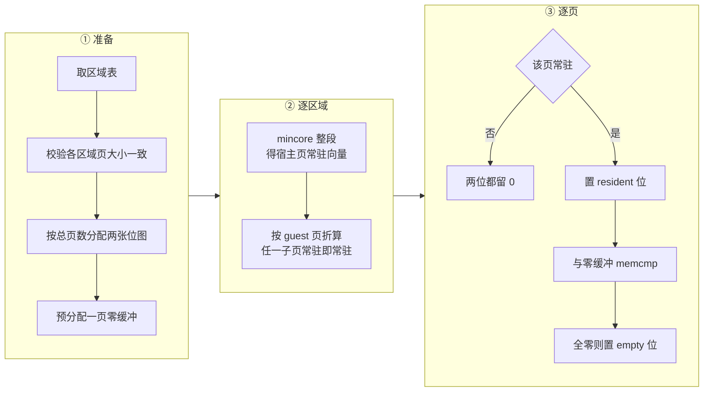

# 51 · /memory：常驻页与零页位图

> 一台刚从零启动的 microVM，配了 8 GiB 内存，真正被碰过的可能只有几百 MiB，
> 碰过的页里又有一大片是全零。把这台机器的内存导出去，导 8 GiB 是浪费，
> 但 Firecracker 并不知道调用方想要哪一种口径。
> 本篇讲 `GET /memory` 这个端点：它返回的两张位图怎么算出来、`mincore` 的粒度问题出在哪、
> 保守判断的方向是什么，以及它与另外两个内存端点的分工。
>
> **读者**：要读懂 e2b 内存管线的工程师。
> **预备**：[第 13 篇 · guest 内存](13-guest-memory.md)、[第 49 篇 · 为什么分叉](49-why-e2b-forked.md)、
> [第 50 篇 · /memory/mappings](50-memory-mappings-api.md)。
> **代码**：`src/vmm/src/vstate/vm.rs`、`src/vmm/src/vmm_config/instance_info.rs`、
> `src/vmm/src/rpc_interface.rs`、`resources/seccomp/*.json`、`src/firecracker/swagger/firecracker.yaml`

---

## 0. 本篇要回答的问题

1. 为什么「常驻」与「零页」这两张位图合起来正好是从零启动那条路的导出判据？
2. 两张位图怎么编码，位序与 `GET /memory/mappings` 的扁平偏移是什么关系？
3. `Vm::get_memory_info()` 的算法是什么，`mincore` 的宿主页粒度与 guest 页粒度怎么对齐？
4. 哪些地方做了保守处理，保守的方向是什么，失败时会退化成什么？
5. 这个端点的代价是什么，为什么它不要求 microVM 处于 Paused？
6. `mincore_bitmap()` 这个独立函数是给谁用的？

---

## 1. 问题：没有基线的时候，什么算「要导出的页」

e2b 的沙箱有两种起法（[第 49 篇](49-why-e2b-forked.md)）。
**从快照恢复**的那一种有基线：基线就是上一代的内存产物，要导出的是恢复之后被写过的页，
判据由 `GET /memory/dirty` 给（[第 52 篇](52-memory-dirty-api.md)）。
**从零启动**的那一种没有基线 —— 模板构建时的第一次快照就是这种情况。
这时候「被写过的页」这个概念不成立，因为整台机器的内存都是新的。

那么什么算要导出的页？guest 内存是 `MAP_PRIVATE | MAP_ANONYMOUS` 加 `MAP_NORESERVE`
映射出来的（[第 13 篇 §3](13-guest-memory.md#3-区域的后备四种做法)），
这意味着两件事：

- 从未被访问过的页**没有物理后备**。内核不会为它们分配页帧，读它们会得到零页。
  这些页不必导出，恢复时按零页填即可。
- 已经有物理后备、但内容仍然全为零的页，同样不必导出。这类页比想象的多：
  guest 内核启动时会 `memset` 大片区域，页分配器的空闲页也常常是零。

把这两条合起来，导出集合就是「有物理后备**且**内容不全为零」的页。
导出量因此从「内存配置大小」降到「工作集减去其中的零页」，
这是从零启动那条路上唯一能拿到的收敛手段。

`GET /memory` 返回的正是这个判据的两个组成部分：一张 `resident` 位图标出有物理后备的页，
一张 `empty` 位图标出其中内容全零的页。调用方要的集合是两者之差。
端点本身不做这个减法 —— 它交出的是两个可以组合的事实，而不是一个结论，
这与第 49 篇说的「把决定权挪到进程外」是同一条设计线。

---

## 2. 两张位图的编码

响应体是 `src/vmm/src/vmm_config/instance_info.rs` 里的 `MemoryResponse`：

```rust
pub struct MemoryResponse {
    pub resident: Vec<u64>,
    pub empty: Vec<u64>,
}
```

两个数组的长度相同，都是 `total_pages.div_ceil(64)`，其中 `total_pages`
是所有区域的页数之和，页大小取自 `GET /memory/mappings` 报的那个 `page_size`
（也就是 `machine_config.huge_pages.page_size()`，4 KiB 或 2 MiB）。

页序就是[第 50 篇 §2.1](50-memory-mappings-api.md#21-offset-的坐标系扁平序列不是-gpa)讲的扁平序列：
区域按顺序首尾相接，第一个区域的第 0 页是全局第 0 页，第二个区域的第 0 页接在第一个区域最后一页之后。
第 n 页对应 `bitmap[n / 64]` 的第 `n % 64` 位，低位在前。
实现上这条性质来自 `get_memory_info()` 里那个**跨区域连续递增**的 `global_page_idx`：
它在区域之间不清零、不对齐，下标直接 `global_page_idx / 64`。
这一点与 `GET /memory/dirty` 不同，后者按区域各自算一张 `nr_pages.div_ceil(64)` 的位图再 `extend_from_slice` 拼接，
区域页数不是 64 的整数倍时会插入填充位。两张位图因此**不保证共用同一套位号**，
细节与发作条件见[第 52 篇 §4](52-memory-dirty-api.md#4-计算过程两级过滤)。
调用方只要把 `Vec<u64>` 原样喂给一个 64 位字宽、低位在前的位集合实现，
位号就直接是页号；orchestrator 侧用的 `bitset.From()` 正是这个约定。

`empty` 是 `resident` 的子集，这条性质由实现保证：`empty` 位只在该页已被判定为常驻的分支里才有机会置上。
分叉的集成测试 `tests/integration_tests/functional/test_api.py::test_memory_post_boot`
显式断言了 `empty[i] & resident[i] == empty[i]`。
swagger 里 `MemoryResponse` 的两个字段都标为 required，描述也写明了这层包含关系。

调用方的用法在 `packages/orchestrator/internal/sandbox/uffd/noop.go`：
`NoopMemory.DiffMetadata()` 取到这两张图之后，第一步就是
`diffInfo.Dirty.Difference(diffInfo.Empty)` —— 用 `resident` 减掉 `empty`，
得到真正要导出的页集合，剩下的全部记成「空」，由恢复端按零页处理。
这个类型叫 `NoopMemory`，是因为从零启动的沙箱没有 uffd 后端，
内存后端是个不做任何事的占位实现；`GET /memory` 只在这条路径上被调用。

---

## 3. `get_memory_info()` 的算法

实现在 `src/vmm/src/vstate/vm.rs` 的 `Vm::get_memory_info()`，
一个 `unsafe` 块包住了主体。分三段看。



**准备。** 先调 `self.guest_memory_mappings(vm_info)` 拿到区域表（与 `GET /memory/mappings`
返回的是同一份数据）。区域表为空就返回两个空数组。
然后校验所有区域的 `page_size` 相同，不同就返回
`VmError::InvalidMemoryConfiguration("All memory regions must have the same page size")`。
这条检查在 v1.12.1 的代码里永远不会触发，因为 `page_size` 来自同一个配置项
（[第 50 篇 §2.2](50-memory-mappings-api.md#22-page_size-描述的是配置不是区域)），
它防的是将来允许逐区域配置页大小的情况。
接着按总页数分配两张 `Vec<u64>`，并分配一个 `page_size` 字节的全零缓冲区 ——
分配一次、所有页复用，注释明确说这是最重要的一处优化。

**逐区域。** 对每条映射，先用 `base_host_virt_addr` 在 `guest_memory().iter()` 里反查回对应的区域对象。
这一步是按指针相等匹配的线性查找，找不到就 `expect` 崩溃；
由于区域表刚刚由同一个函数生成，它不可能找不到，代价是区域数的平方级比较 —— 区域数最多是 2，可以忽略。

然后对整个区域调一次 `libc::mincore(region_ptr, region_size, mincore_vec.as_mut_ptr())`。
`mincore` 的语义是：给定一段映射，为其中**每个宿主页**返回一个字节，最低位为 1 表示该页当前在物理内存里。
所以 `mincore_vec` 的长度是 `region_size.div_ceil(sys_page_size)`，
`sys_page_size` 来自 `arch::host_page_size()`（`sysconf(_SC_PAGESIZE)`），
与 guest 页大小是两个独立的量。

**逐页。** 对区域内的每个 guest 页（`num_pages = region_size / page_size`），
先算出它覆盖了 `mincore_vec` 里的哪一段 —— 起点 `page_offset / sys_page_size`，
长度 `page_size.div_ceil(sys_page_size)` —— 只要这一段里**任意一个**字节的最低位是 1，
就判定该 guest 页常驻。常驻的页置上 `resident` 位，再用
`libc::memcmp(page_ptr, zero_buf.as_ptr(), page_size)` 与零缓冲区逐字节比较，
返回 0 就置上 `empty` 位。不常驻的页两张图都留 0，也不做 `memcmp` ——
对一个没有物理后备的页做比较会把它整页缺页调入，那正是要避免的事。

---

## 4. 三处保守处理

这个算法有三处在信息不全时做了取舍，方向都一致：**宁可多导出，不可漏导出**。
多导一页只是让产物变大，漏导一页会让恢复出来的 guest 读到错误内容。

| 情形 | 代码怎么做 | 后果 |
|---|---|---|
| 大页覆盖多个宿主页，其中一部分常驻 | 任一子页常驻即整页判常驻 | 可能把部分常驻的大页整页导出；不会漏 |
| `mincore` 调用失败 | 该区域所有页按常驻处理 | 退化成「全部导出」，静默，无日志 |
| guest 页覆盖的 `mincore` 区间越界 | 判为不常驻 | 可能漏判，见下文 |

第一处是粒度问题。开了 2 MiB 大页时，一个 guest 页对应 512 个宿主页表项，
`mincore` 仍然按宿主页粒度回答。代码取的是「或」而不是「与」，所以只要有一丁点常驻就算整页常驻。
对 HugeTLB 后备的映射来说这两种取法结果相同 —— 大页要么整个在，要么整个不在 ——
所以这里的保守主要是为不开大页、但 guest 页与宿主页仍然不等的情形留的余地。

第二处是失败处理，也是这段代码里最值得注意的一处技术债。
`mincore` 的返回值被存进 `mincore_result`，之后只用来做「是否等于 0」的判断；
非 0 时既不读 `errno`，不返回错误，也不打日志，而是把该区域的每一页都当成常驻。
正确性上这是安全的（导出集合变大），但成本上是静默退化：
一次 `mincore` 失败会让这台 microVM 的这一轮导出从「工作集」放大到「全部内存减去零页」，
而运维侧看不到任何信号。`mincore` 在这里失败的常见原因是地址或长度不合法，
正常路径上不应该发生；但如果 seccomp 过滤器没放行 `mincore`，
进程会被直接杀掉而不是走到这个分支（[第 42 篇](42-seccomp.md)），所以这条路径基本是死代码。

第三处是边界。判定常驻之前有一句
`if page_mincore_start + page_mincore_count <= mincore_vec.len()`，
不满足就判不常驻。`mincore_vec` 的长度是按 `div_ceil` 向上取整算的，
而 guest 页数是按 `region_size / page_size` 向下取整算的，
所以只有当区域大小不是 guest 页大小整数倍时才可能出现不对齐的尾巴，
而那种情况下最后那个不完整的 guest 页本来就不在遍历范围内。
在 v1.12.1 的区域切分规则下这个分支取不到，它是一层防御。
同一个函数里还有两处 `bitmap_idx < resident_bitmap.len()` 的检查，性质相同 ——
位图长度就是按总页数算的，索引不可能越界。

---

## 5. 代价与调用约束

**每个常驻页一次 `memcmp`。** 这是这个端点的主要开销，而且不可省：
判断一页是不是全零只能真的读一遍。开了 2 MiB 大页时单次比较扫 2 MiB，
一台 8 GiB 的 microVM 若全部常驻则要扫 8 GiB。
比较本身是顺序读，对缓存友好，但它会把这些页全部拉进 CPU 缓存，
挤掉宿主上其它进程的工作集。分叉带了一个 `@pytest.mark.nonci` 的基准用例
`test_memory_benchmark` 专门量这一段的耗时，说明作者也把它当成需要关注的成本。
本书不给性能数字。

**不要求 Paused。** `RuntimeApiController` 对 `GetMemory` 的处理里没有任何状态检查，
与 `GetMemoryDirty` 明确要求 `VmState::Paused` 形成对照。
原因是这两张位图不依赖「某个时刻之后没有新的写」这种语义：
`mincore` 与 `memcmp` 观察的是当下的状态，读到的结果只是那一瞬间的事实。
**推论：** 在运行中的 microVM 上调用它，得到的是一张撕裂的映像 ——
遍历前半段时某页是零，遍历到后半段时 guest 可能已经写了它，两条记录不属于同一个时刻。
用它来决定导出集合因此必须先把 microVM 暂停，这一点由调用方保证，端点自己不强制。

**没有计时日志。** `get_dirty_memory_info()` 在返回前用 `info!` 打了一条耗时，
`GetMemory` 这条分支没有。两个端点的开销量级相近，可观测性却不对称。

**`unsafe` 块的范围偏大。** 整个双重循环包在一个 `unsafe` 块里，
其中真正需要 `unsafe` 的只有 `libc::mincore`、`libc::memcmp` 与 `region_ptr.add()` 三处，
位图的下标运算与向量分配都是安全代码。这不影响正确性，
但让「这段代码的安全性依赖哪些前提」变得不容易核对。
安全性注释写的是 "We're reading from valid memory regions that we own"，
真正要成立的前提是：区域指针在整个遍历期间有效（由持有 `Vmm` 锁保证区域表不变），
以及 `page_ptr + page_size` 不超过区域末尾（由 `num_pages` 的向下取整保证）。

---

## 6. `mincore_bitmap()`：给脏页端点复用的那一份

`vstate/vm.rs` 在 `impl Vm` 之外还有一个自由函数：

```rust
pub fn mincore_bitmap(addr: *mut u8, len: usize, page_size: usize) -> Result<Vec<u64>, VmError>
```

它做的事是 `get_memory_info()` 里「逐区域」那一段的独立版本：对一段内存调一次 `mincore`，
按 `page_size` 折算成一张常驻位图返回，保守规则（任一子页常驻即常驻、失败按常驻处理、越界判不常驻）
与内联的那一份逐字相同。调用它的是 `src/vmm/src/lib.rs` 的 `Vmm::get_dirty_memory()`：
脏页端点要先用常驻位图筛掉没有物理后备的页，再对剩下的页去读 pagemap，
这样能把 `pread` 的次数从「全部页」降到「常驻页」（[第 52 篇](52-memory-dirty-api.md)）。

两份实现并存是一处重复：`get_memory_info()` 完全可以调用 `mincore_bitmap()`，
只是它还要在同一趟循环里做 `memcmp`，作者选择了把常驻判定内联进去。
后果是保守规则改一处就要改两处；这在 ARM 适配版引入硬件脏页跟踪时是要留意的地方
（[第 65 篇](65-dirty-tracking-backend.md)）。

`mincore_bitmap()` 的签名接收裸指针却标成安全函数（`unsafe` 只用在函数体内部的
`libc::mincore` 调用上），文档注释里用 `# Safety` 段说明了调用方要保证的前提。
这是一处与 Rust 惯例不一致的地方：有安全前提要求调用方满足的函数通常应当标记为 `unsafe fn`。

---

## 7. 端点的约束与 seccomp

路由、动作与响应的链路与 `GET /memory/mappings` 完全相同（[第 50 篇 §3](50-memory-mappings-api.md#3-从-http-路径到响应)）：
`parsed_request.rs` 的 `memory` 前缀分支里，子路径为空时走 `parse_get_memory()`，
产出 `VmmAction::GetMemory`，`PrebootApiController` 与另外两个内存动作一起拒绝为
`OperationNotSupportedPreBoot`，`RuntimeApiController` 调 `Vm::get_memory_info()`
并把结果包成 `VmmData::Memory(MemoryResponse { resident, empty })`。
`get_memory_info()` 返回的 `VmError` 被包成
`VmmActionError::InternalVmm(VmmError::Vm(e))`，对外是 500。
分叉的集成测试覆盖了 preboot 拒绝与启动后的返回结构，后者在 2 MiB 大页配置下跑，
断言位图长度等于 `ceil(总页数 / 64)`。

seccomp 侧要加一条：`mincore` 进白名单。
`resources/seccomp/x86_64-unknown-linux-musl.json` 与
`resources/seccomp/aarch64-unknown-linux-musl.json` 都加了这一条，注释相同。
这是 e2b 定制版少数几处对两个架构同时改动的地方 —— `pread64` 只加进了 x86_64 那一份，
因为分叉只在 x86_64 上构建与运行（[第 55 篇](55-seccomp-build-upload-and-upstream-fixes.md)）。
过滤器是在 vmm 线程启动前装上的，运行期的 `GET /memory` 一定在过滤器生效之后执行，
所以这一条不是可选的：不加就不是端点报错，而是整个进程被内核杀掉。

`memcmp` 不是系统调用，`libc` 的实现是纯用户态代码，不需要任何过滤器条目。

---

## 8. 小结

- 从零启动的沙箱没有基线，导出判据只能是「有物理后备且内容不全为零」；
  `GET /memory` 把它拆成 `resident` 与 `empty` 两张可组合的位图交出去，减法由调用方做。
- 两张位图共用 `GET /memory/mappings` 的扁平页序，每 64 页打包一个 `u64`、低位在前，
  长度都是 `ceil(总页数 / 64)`；`empty` 由实现保证是 `resident` 的子集。
- 本端点的位号由跨区域连续的 `global_page_idx` 给出，而 `/memory/dirty` 按区域各自补齐到 64 位再拼接；
  区域页数非 64 倍数时两张位图会错位，调用方不能假定它们同号。
- 算法是：校验各区域页大小一致 → 对每个区域调一次 `mincore` 得到宿主页粒度的常驻向量 →
  按 guest 页折算 → 常驻页再用一个复用的零缓冲区做 `memcmp`。
- 三处保守处理方向一致（宁可多导）：任一子页常驻即整页常驻、`mincore` 失败按全部常驻、
  越界判不常驻。第二处是静默退化，没有日志。
- 主要代价是每个常驻页一次 `memcmp`，且没有耗时日志；`unsafe` 块包住了整个双重循环，
  超出真正需要的三处调用。
- 端点不要求 Paused，因为两张位图只描述当下；**推论**：运行中调用得到的是撕裂映像，
  暂停由调用方保证。
- `mincore_bitmap()` 是同一段常驻判定逻辑的独立版本，供 `GET /memory/dirty` 先筛常驻页用；
  两份实现并存，保守规则改一处要改两处。
- seccomp 两个架构都加了 `mincore`；不加不是报错，是进程被杀。

---

## 延伸阅读 / 下一篇

- [第 52 篇 · /memory/dirty](52-memory-dirty-api.md)：下一篇，另一套判据，复用本篇的 `mincore_bitmap()`。
- [第 50 篇 · /memory/mappings](50-memory-mappings-api.md#21-offset-的坐标系扁平序列不是-gpa)：位图页序的定义处。
- [第 49 篇 · 为什么分叉](49-why-e2b-forked.md)：两套判据为什么是两个端点。
- [第 13 篇 · guest 内存](13-guest-memory.md#3-区域的后备四种做法)：匿名映射与 `MAP_NORESERVE` 的语义。
- [第 42 篇 · seccomp](42-seccomp.md)：过滤器的安装时机与漏放行的后果。
- [第 55 篇 · seccomp、构建发布脚本与合入的上游修复](55-seccomp-build-upload-and-upstream-fixes.md)：两个架构过滤器改动不对称的原因。
- orchestrator 侧怎么用这两张位图生成第一代产物，见 [e2b 手册第 37 篇](../e2b-infra/37-pause-and-snapshot.md)。
