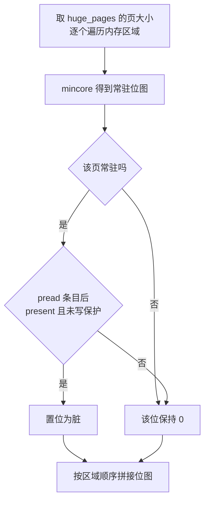

# 52 · /memory/dirty：pagemap 与写保护位的脏页判据

> 上游判断「哪些页被写过」的两个来源都与快照流程绑死：KVM 的日志读一次就清零，用户态位图随内存文件一起被消费。
> e2b 要的是一个可以在暂停之后单独问一次、问完不改变任何状态、结果直接交给外部进程的判据。
> 本篇讲这个判据长什么样：`/proc/self/pagemap` 的两个位怎么组合成「脏」，计算过程为什么分两级过滤，代价在哪里。
>
> **读者**：系统工程师。　**预备**：[第 14 篇 · 脏页跟踪](14-dirty-page-tracking.md)、
> [第 51 篇 · 常驻页与零页位图](51-memory-resident-empty-api.md)。
> **代码**：`src/vmm/src/utils/pagemap.rs`、`src/vmm/src/lib.rs`、`src/vmm/src/rpc_interface.rs`、
> `src/vmm/src/vstate/vm.rs`、`src/firecracker/src/api_server/request/memory.rs`

---

## 0. 本篇要回答的问题

1. 上游已有两份脏页记录，为什么 e2b 定制版还要第三种判据？
2. `is_page_dirty` 的两个位分别是什么，「不再被写保护」为什么等于「被写过」？
3. 为什么要先用 `mincore` 过一遍，再读 pagemap？
4. 返回的位图按什么顺序编号，它与 `/memory` 那两张位图的编号是不是同一套？
5. 这个判据在什么状态下才被允许调用，调用它会改变什么？
6. 它的代价与失效条件是什么，和上游 v1.13.0 用 `mincore` 近似脏页的做法差在哪里？

---

## 1. 问题：两份既有记录都不能单独交出去

[第 14 篇](14-dirty-page-tracking.md)讲过上游 v1.12.1 的两份记录。放到 e2b 的用法里看，两份都不合用。

**KVM 脏页日志是一次性的。** `KVM_GET_DIRTY_LOG` 把位图复制到用户态的同时清掉内核侧的位。
这意味着「查询脏页」不是一个只读操作：谁先读谁就拿走了全部信息，第二个读者只会看到空位图。
一个只读的 HTTP 端点如果内部调它，就会破坏后面任何一次差分快照的正确性。

**用户态 `AtomicBitmap` 与快照流程绑定。** 它记录的是 Firecracker 自己写过的页，
真正的合并发生在 `dump_dirty()` 里，而 `dump_dirty()` 的输出是写进内存文件的字节，不是一张能返回给调用方的位图。

还有第三个更直接的原因：e2b 的调用方根本没有打开跟踪。orchestrator 在 `PUT /machine-config`
里把 `track_dirty_pages` 固定填 false（`packages/orchestrator/internal/sandbox/fc/client.go` 的 `trackDirtyPages`）。
按第 13、14 篇的逻辑，这让每个区域都没有 `AtomicBitmap`，注册 memslot 时也不带 `KVM_MEM_LOG_DIRTY_PAGES`。
上游的两份记录在 e2b 的 microVM 里根本不存在。

于是需要一个新的信息源。这个信息源必须满足三条：只读、与快照流程无关、结果是一张能序列化成 JSON 的位图。
e2b 定制版在提交 `54a1c1ad3` 里给出的答案是宿主内核的页表元数据 —— `/proc/self/pagemap`。
它记录的是每一个虚拟页当前的状态，读它不改变任何东西。

---

## 2. 端点与控制面

新端点是 `GET /memory/dirty`，响应体只有一个字段：

```json
{ "bitmap": [0, 18446744073709551615, 4095] }
```

路由在 `src/firecracker/src/api_server/parsed_request.rs`：`GET /memory` 的路径分词后，
`Some("dirty")` 走 `parse_get_memory_dirty()`，与同一层的 `mappings`（[第 50 篇](50-memory-mappings-api.md)）
和无子路径的 `/memory`（[第 51 篇](51-memory-resident-empty-api.md)）并列。
解析函数只做一件事：产生 `VmmAction::GetMemoryDirty`。它计数用的是
`METRICS.get_api_requests.instance_info_count`，与另外两个内存端点、以及 `GET /` 共用一个计数器 ——
指标上分不出这四个端点各被调了多少次。

控制面两侧都有限制。`PrebootApiController` 把 `GetMemoryMappings | GetMemory | GetMemoryDirty` 三个动作
一并映射到 `OperationNotSupportedPreBoot`：microVM 还没起来，没有 guest 内存可谈。
运行期的 `RuntimeApiController::get_dirty_memory_info()` 则多一道检查：

```rust
if vmm.instance_info.state != VmState::Paused {
    return Err(VmmActionError::OperationNotSupportedWhileRunning);
}
```

`OperationNotSupportedWhileRunning` 是这个提交新加的错误变体。加它的理由是判据本身的时效性：
vCPU 还在跑的时候，每读完一页 guest 就可能又写脏一批，返回的位图从生成的那一刻起就是过期的。
`/memory`（第 51 篇）没有这道检查，两个端点在这一点上口径不同。

错误经 `ParsedRequest::convert_to_response()` 统一落到 400 Bad Request —— 除 MMDS 的 413 之外，
所有 `VmmActionError` 都是 400（[第 08 篇](08-api-server.md)）。所以调用方从状态码上区分不出
「时机不对」和「参数不对」，只能读 `fault_message` 里的文本。

一个与大纲不同的事实：在 `a41d3fb` 上，`src/firecracker/swagger/firecracker.yaml` 里有
`/memory/mappings` 和 `/memory`，**没有** `/memory/dirty`。这个端点在这个版本上是未进 OpenAPI 描述的；
调用方用的 Go 客户端里却有 `GetDirtyMemory` 操作，说明 spec 的补充发生在这个版本之后 ——
分叉在 `a41d3fb` 之后的提交 `827b7839e`（`doc(swagger): add /memory/dirty endpoint definition`）才补上这段定义
（见[第 55 篇 §7](55-seccomp-build-upload-and-upstream-fixes.md#7-分叉之后升级要重放什么)）。
后果是：按 `a41d3fb` 的 spec 生成客户端会缺这个端点。

---

## 3. 判据：pagemap 的两个位

`/proc/<pid>/pagemap` 是内核导出的一张数组文件：进程地址空间里每一个**宿主页**对应 8 个字节，
下标就是虚拟页号。`src/vmm/src/utils/pagemap.rs` 的文档注释把这 8 字节的布局抄了一遍：

```text
 63   62   61      57        56        55        54                          0
+----+----+----+----------+---------+-----------+---------------------------+
|pres|swap|file|  uffd-wp | exclusive| soft-dirty|       page frame number   |
+----+----+----+----------+---------+-----------+---------------------------+
  ^                  ^
  |                  +-- bit 57：该页被 userfaultfd 写保护
  +-- bit 63：该页当前驻留在物理内存中
```

`PagemapEntry` 只解析其中两个位：`is_present()` 取 bit 63，`is_write_protected()` 取 bit 57。
判据是两者的组合：

```rust
Ok(entry.is_present() && !entry.is_write_protected())
```

读作：这一页现在有物理内存，而且它已经不再处于 userfaultfd 的写保护之下。

为什么这等于「被写过」，要看写保护是怎么被解除的。恢复 microVM 时，每一页在被填入内容的同时
被打上 uffd 写保护；宿主内核在异步写保护模式下遇到对受保护页的写，不产生事件，
而是直接把该页的写保护位清掉并放行这次写。所以 bit 57 从 1 变成 0 的唯一原因就是发生过一次写。
「谁在什么时候打上这个保护」是[第 53 篇](53-uffd-write-protection.md)的内容；
这里只需要记住：判据的正确性完全建立在那一篇讲的几处改动上。没有它们，bit 57 恒为 0，
本篇的判据会把每一个常驻页都算成脏页。

`is_page_dirty()` 的两个实现细节值得点出。第一，偏移永远按宿主页大小算：
`host_vpn = virt_addr / host_page_size()`，因为 pagemap 的条目粒度就是宿主页，与 guest 用不用大页无关。
第二，一个 2 MiB 的大页对应 512 个 pagemap 条目，函数只读第一个，注释给的理由是
同一个大页内的宿主页写保护状态通常一致。这是一个采样，不是一次完整检查。

---

## 4. 计算过程：两级过滤

`src/vmm/src/lib.rs` 的 `Vmm::get_dirty_memory(page_size)` 是计算的主体。
`page_size` 由调用处从 `machine_config.huge_pages.page_size()` 取，
值是 4096 或 2 MiB（`HugePageConfig::None` 这一支写死 4096，不走 `sysconf`）。

对每个内存区域，它做两件事：

1. 调 `src/vmm/src/vstate/vm.rs` 的 `mincore_bitmap()`，得到该区域按 `page_size` 粒度的常驻位图。
   这个函数是第 51 篇 `/memory` 那条路径里抽出来复用的：它先用一次 `mincore(2)` 拿到宿主页粒度的常驻向量，
   再把落在同一个 guest 页里的宿主页做「有一个常驻就算常驻」的折算。`mincore` 调用失败时它不报错，
   而是把所有页都当成常驻 —— 保守方向与第 14 篇一致：宁可多记。
2. 只对常驻的页读一次 pagemap。代码里的注释写明了这是为了减少 `/proc/self/pagemap` 的读次数。

两级过滤的依据是：不常驻的页不可能是脏页。在 uffd 恢复的 microVM 里，
没有被触碰过的页压根没有物理内存，缺页从未发生，自然谈不上写过。
这一级过滤在 e2b 的典型场景里砍掉的是绝大多数页，因为一台刚恢复的 microVM 只会触碰自己的工作集。



**位序**。每个区域算出一张 `vec![0u64; nr_pages.div_ceil(64)]`，然后 `extend_from_slice` 拼到总位图后面。
提交信息说「页的顺序与 `/memory/mappings` 报告的顺序一致」，这在区域粒度上成立：
区域的先后与 `guest_memory_mappings()` 的 `offset` 累加顺序是同一个遍历顺序。
但在**位粒度**上有一处不一致要注意：这里是按区域各自向上取整到 64 的倍数再拼接，
而第 51 篇的 `get_memory_info()` 用的是跨区域连续递增的 `global_page_idx`。
只要某个区域的页数不是 64 的整数倍，两张位图从下一个区域开始就会错位。
4 KiB 页下区域大小是 MiB 的整数倍，每 MiB 256 页，总是 64 的倍数；
2 MiB 大页下每 MiB 只有半页，区域大小不是 128 MiB 的整数倍时就会出现填充位。
推论：这是一个在 e2b 当前配置下不发作、但在改变内存规格时会静默错位的隐患，调用方不应假定两张位图共用一套编号。

---

## 5. 与另外两种判据的对比

上游在 v1.12.1 之后也走了一步类似的路。v1.13.0 的 PR #5274 允许在没有打开脏页跟踪时也做差分快照：
`Vm::get_dirty_bitmap()` 改成按区域分支 —— 区域有位图就照旧 `KVM_GET_DIRTY_LOG`，
没有位图就调一个同名的 `mincore_bitmap(region)`，把「常驻」直接当成「脏」。
函数的文档注释把这个做法称为 over-approximate，并在 TODO 里写明它只在宿主没开 swap 时才成立：
被换出的页 `mincore` 报告为不在核内，会被当成干净页跳过。同一个 PR 还弃用了
`/snapshot/load` 的 `enable_diff_snapshots` 参数，改用 `track_dirty_pages`。

三种判据的性质对照如下。

| 维度 | KVM 脏页日志 | 上游 v1.13.0 的 mincore 近似 | e2b 的 pagemap + uffd-wp |
|---|---|---|---|
| 信息来源 | KVM 为每个 memslot 维护的位图 | `mincore(2)` 的常驻向量 | `/proc/self/pagemap` 的 bit 63 与 bit 57 |
| 判定含义 | 自上次读取以来被写过 | 当前驻留在物理内存中 | 驻留且写保护已被解除 |
| 读取副作用 | 取走并清零 | 无 | 无 |
| 精度 | 精确（就 guest 的写而言） | 只读过的页也算脏 | 只读过的页不算脏 |
| 粒度 | 宿主页 | 宿主页 | 配置的 guest 页，大页时采样首个宿主页 |
| 交付形式 | 只能进内存文件 | 只能进内存文件 | HTTP 返回位图，内存由调用方自取 |
| 前提 | `track_dirty_pages` 为 true | 宿主关闭 swap | uffd 后端 + 宿主内核 6.7 + 关闭 swap |

e2b 的判据与上游 v1.13.0 的做法共用 `mincore` 这一步，但用它的目的相反：
上游拿常驻直接当脏，e2b 拿常驻当**候选集**，再用写保护位把只读过的页筛掉。
差别落在导出量上：一台 microVM 恢复后读入的代码与只读数据往往远多于它写过的页，
把这部分筛掉是 e2b 这个端点存在的主要收益。代价是多了一次系统调用与一层内核前提。

---

## 6. 代价与失效条件

**每页一次 `pread`。** 判据的主要开销是系统调用次数，正比于常驻页数。
按 4 KiB 页算，一台内存被摸遍的 8 GiB microVM 意味着两百万次 `pread` 量级的调用。
`get_dirty_memory_info()` 用 `get_time_us()` 前后夹了一次，把耗时以 `info!` 打进日志，
这本身说明这条路径的耗时是被关注的。值得注意的是 pagemap 条目在文件里按虚拟页号连续排列，
一次 `pread` 完全可以取回一段连续页的条目；现有实现每次只取 8 个字节。
用大页时调用次数下降 512 倍，因为每个 2 MiB 只采样一条。

**只在 Paused 有意义。** 第 2 节那道检查把「运行中调用」挡掉了，但它挡不住另一件事：
判据不会清除任何状态。连续调用两次返回同样的结果，因为没有任何一段代码会把写保护重新加回去 ——
全仓库只有 `persist.rs` 的恢复路径调 `uffd.write_protect()`。
所以这个端点给出的是「自恢复以来被写过的页」，不是「自上次查询以来」。
在 e2b 的用法里这正好够用：一台 microVM 从恢复到暂停导出就是一轮，导出完进程即结束
（[第 54 篇](54-optional-memfile-snapshot.md)）。要支持一台 microVM 内的多轮差分，
需要补一个重新写保护的动作，而 `a41d3fb` 没有。

**依赖 uffd 后端。** 走 `File` 后端恢复、或者根本不是从快照恢复的 microVM，
guest 内存上没有任何 uffd 写保护，bit 57 恒为 0，端点会把全部常驻页报成脏页。
代码不检查这一点，也没有任何报错。

**swap 必须关闭。** 一个被写过又被换出的匿名页，bit 63 为 0、bit 62 为 1，
本判据只看 bit 63，会把它算成干净页。推论：这是漏记而不是多记，后果是数据损坏而不是差分变大，
所以「宿主不开 swap」在这套方案里是正确性前提，不是性能建议。

**seccomp 只放行了一半。** 同一个提交给 `resources/seccomp/x86_64-unknown-linux-musl.json`
加了 `pread64`，注释写明用途；`aarch64-unknown-linux-musl.json` 里只有前一个提交加的 `mincore`，
没有 `pread64`。在 aarch64 上装了过滤器之后调用这个端点会被 seccomp 杀掉。
补齐这一条是 ARM 适配版的事（[第 62 篇](62-aarch64-seccomp-filter.md)）。

**这条路在 aarch64 上走不通。** 不只是过滤器的问题：ARM 的宿主内核不提供 userfaultfd 写保护，
判据赖以成立的那一位不会被任何人置上。补齐 `pread64` 之后端点能正常返回，
返回的却是「全部常驻页都是脏页」—— **这次退化在运行期完全不可观测**：
没有专门的错误码（端点返回 200），没有日志（只有那一行耗时 `info!`），
也没有任何 metrics 计数器区分「判据成立」与「判据失效」，
唯一能发现它的办法是把 `/memory/dirty` 与 `/memory` 的两张位图比一比，看脏页集合是不是恰好等于常驻集合。
ARM 适配版因此换了后端，用鲲鹏 950 的硬件脏页跟踪 HDBSS（hardware dirty bit state structure）
重新实现「哪些页被写过」，见[第 57 篇](57-which-fork-commit-and-uffd-wp.md)、
[第 65 篇](65-dirty-tracking-backend.md)与[第 66 篇](66-hdbss.md)。

最后一处该记下的是 `lib.rs` 里那段 TODO 注释：如果处理器已经通过写保护事件跟踪了脏页，
这一整段 pagemap 扫描可以省掉。它说明 pagemap 只是当前这版的实现手段，判据本身
（「哪些页的写保护被解除了」）可以有别的观察方式。

---

## 7. 小结

- 上游两份脏页记录都与快照流程绑定，而 e2b 的调用方连 `track_dirty_pages` 都关着，所以需要第三种判据。
- 判据是 `/proc/self/pagemap` 里的两个位：bit 63 present 且 bit 57 uffd-wp 为 0，即「有内存且写保护已被解除」。
- 写保护被解除的唯一原因是发生过一次写，这条因果由第 53 篇的三处改动保证；缺了它判据恒为「全脏」。
- 计算分两级：先 `mincore` 得到常驻候选集，再对候选页逐页读一条 pagemap 条目；`mincore` 失败时保守当作常驻。
- 位图按区域顺序拼接，每个区域各自向上取整到 64 位，与 `/memory` 的跨区域连续编号不是同一套编号规则。
- 端点在 Preboot 被拒，在 Running 被新错误 `OperationNotSupportedWhileRunning` 拒；错误统一以 400 返回。
- `a41d3fb` 的 swagger 里没有这个路径，按该版本 spec 生成的客户端会缺这个端点。
- 与上游 v1.13.0 的 `mincore` 近似相比，两者共用常驻判断，但 e2b 用写保护位把只读过的页筛掉，换来更小的导出量。
- 代价是每个常驻页一次 `pread`；条目本可批量读取，现有实现逐条读。
- 失效条件有四个：不走 uffd 后端、宿主开着 swap、宿主内核低于 6.7、在 aarch64 上运行；四者都不报错，只是判据静默退化成「常驻即脏」。
- 判据不清除任何状态，因此表达的是「自恢复以来」，一台 microVM 只支持一轮导出。

---

## 延伸阅读 / 下一篇

- [下一篇：第 53 篇 · uffd 写保护](53-uffd-write-protection.md)：bit 57 是谁打上去的，为什么必须是异步模式。
- [第 51 篇 · 常驻页与零页位图](51-memory-resident-empty-api.md)：`mincore_bitmap()` 的另一个使用者与两张位图的语义。
- [第 14 篇 · 脏页跟踪](14-dirty-page-tracking.md)：上游两份记录的完整语义与合并方式。
- [第 50 篇 · /memory/mappings](50-memory-mappings-api.md)：位图的页编号与扁平偏移的对应关系。
- [第 54 篇 · 可选 memfile 的快照](54-optional-memfile-snapshot.md)：这个端点在 e2b 暂停流程中的位置。
- [第 48 篇 · 发布与兼容策略](48-release-and-compat-policy.md)：v1.13.0 的变更条目与差分快照约束的演进。
- 内核文档 `admin-guide/mm/pagemap` 与 `admin-guide/mm/userfaultfd`。
- [e2b 手册第 37 篇](../e2b-infra/37-pause-and-snapshot.md)：调用方拿到这张位图之后做什么。
