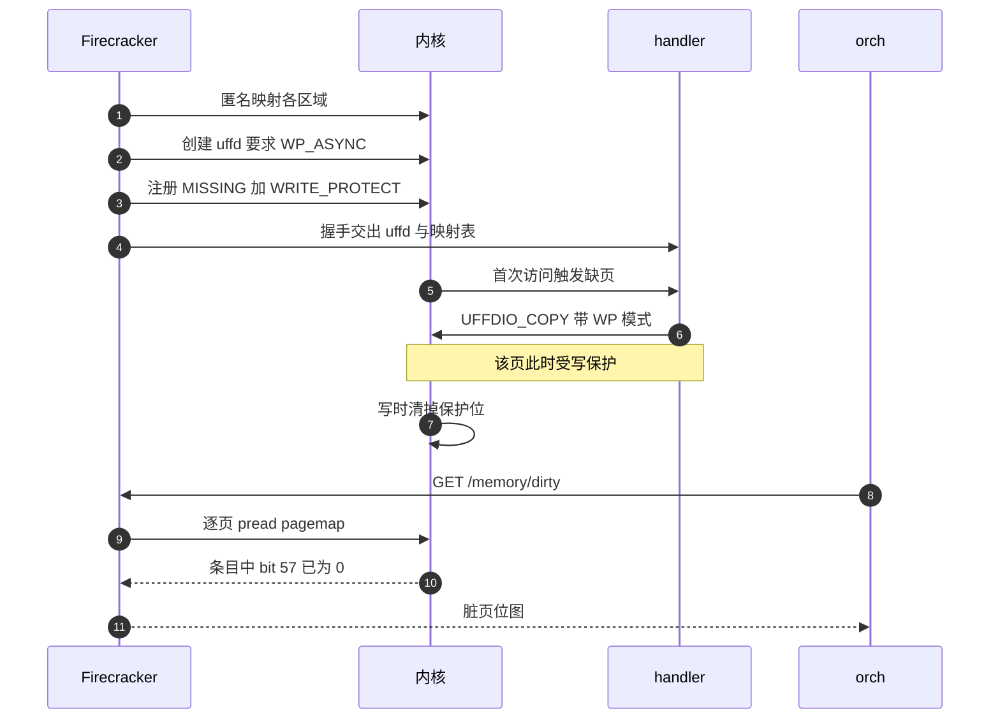

# 53 · uffd 写保护：让脏页判据成立的最后一环

> 上一篇的判据读的是 pagemap 里的一个位：这一页还在不在 userfaultfd 的写保护之下。
> 这个位不会凭空为 1 —— 必须有人在 guest 开始跑之前把每一页保护起来，
> 而且必须选一种「guest 写的时候内核自己放行、不通知任何人」的保护方式，否则每一次首写都要跨进程往返。
> 本篇讲这两件事是怎么做到的，代价是什么，以及为什么它在 aarch64 上不成立。
>
> **读者**：系统工程师。　**预备**：[第 39 篇 · userfaultfd 后端](39-uffd-backend.md)、
> [第 52 篇 · /memory/dirty](52-memory-dirty-api.md)。
> **代码**：`src/vmm/src/persist.rs` 的 `guest_memory_from_uffd()`、`src/vmm/Cargo.toml`、`src/vmm/src/lib.rs`

---

## 0. 本篇要回答的问题

1. 上游只用 `MISSING` 模式注册，为什么这让「哪些页被写过」无从回答？
2. userfaultfd 的同步与异步写保护各是什么，为什么这里必须用异步？
3. 为什么要把 `userfaultfd` crate 换成一个分叉，换不换得到的东西差在哪？
4. 大页区域可以在注册之后立刻写保护，匿名内存为什么不行，那责任落到了谁身上？
5. 这套机制对宿主内核提出了什么硬性要求，不满足时表现是什么？
6. 同一个分叉的另一个分支为什么把这三处改动按架构关掉？

---

## 1. 问题：填过的页此后无声无息

[第 39 篇](39-uffd-backend.md)讲过上游 v1.12.1 的 uffd 后端：
`guest_memory_from_uffd()` 建一片匿名映射，创建 uffd 对象，对每个区域调 `uffd.register()`。
那个便捷方法固定用 `RegisterMode::MISSING`，于是这条路上只有一种事件 —— 访问一个还没有实际内存的页。

一页被 `UFFDIO_COPY` 填上之后，内核就不再对它产生任何通知。guest 之后往里写一万次，
外面的世界一无所知。上游不需要知道：它跟踪脏页靠的是 KVM 的日志（[第 14 篇](14-dirty-page-tracking.md)），
那条路不经过 uffd。

e2b 的 microVM 把 KVM 那条路关掉了（[第 52 篇](52-memory-dirty-api.md)），
判据改成读 pagemap 的 uffd 写保护位。这就要求 guest 内存满足一个起点条件：
**每一页在 guest 开始使用它的时候是被写保护的**。只有这样，「保护已经没了」才等于「被写过」。
提交 `8fc760f61` 做的就是把这个起点建立起来。

值得先说清楚这个起点的形状。它不是「给内存加一道锁」，也不改变 guest 能不能写；
guest 照样写，写完照样继续跑。它改变的只有一件事：这一页的页表项上多了一个位，
而这个位会在第一次写的时候被内核抹掉，于是页表项本身成了一条「写过没有」的记录。
用页表元数据当记录，好处是零维护成本 —— 没有任何数据结构要更新、要加锁、要在两个线程间同步；
代价是这条记录只有一比特，既不带时刻也不带次数，而且一旦被抹掉就无法从内部恢复。

---

## 2. 同步与异步：两种写保护

userfaultfd 的写保护是在 `MISSING` 之外的第二种监视：注册时加上 `UFFDIO_REGISTER_MODE_WP`，
再用 `UFFDIO_WRITEPROTECT` 把某一段地址标成受保护。之后对这段地址里已存在页的写会被拦住。
拦住之后有两种处理方式，差别很大。

**同步模式。** 内核把这次写变成一条 `UFFD_EVENT_PAGEFAULT` 事件（带写保护标志）送给处理进程，
写的那个线程阻塞在原地，直到处理进程用 `UFFDIO_WRITEPROTECT` 解除该页的保护并唤醒它。
好处是外面能看到每一次写的地址与时刻，顺序也是准的。代价是 guest 对每一页的**首次写**
都要付一次跨进程往返，而且处理进程一旦卡住，guest 就卡住。

**异步模式。** 宿主内核 6.7 引入的 `UFFD_FEATURE_WP_ASYNC`：内核遇到对受保护页的写，
不产生事件，直接把该页页表项上的写保护位清掉并放行这次写。写路径上没有任何用户态参与。
代价是外面拿不到事件，只能事后去查 —— 查的地方就是 `/proc/<pid>/pagemap` 的 bit 57。

e2b 选异步。这个选择与它的用法是配套的：它不关心「什么时候写的」「按什么顺序写的」，
只关心暂停之后「哪些页被写过」这一个集合；而 microVM 运行期间任何额外的跨进程往返都会直接落在 guest 的执行时间上。
选择的代价写在提交信息里：宿主内核必须是 6.7 或更新。这就是 e2b 生产环境宿主内核版本下限的由来。

| 项 | 同步写保护 | 异步写保护 |
|---|---|---|
| 内核特性 | `UFFDIO_REGISTER_MODE_WP`，5.7 起 | 再加 `UFFD_FEATURE_WP_ASYNC`，6.7 起 |
| 写发生时 | 产生事件，写线程阻塞 | 内核清位放行，不通知 |
| 用户态读取方式 | 逐条事件 | 事后读 pagemap bit 57 |
| 得到的信息 | 地址、时刻、顺序 | 只有「写过没有」这一个集合 |
| guest 侧开销 | 每页首写一次跨进程往返 | 一次页表项更新 |

---

## 3. 提交 8fc760f61 的四处改动

改动集中在 `guest_memory_from_uffd()` 与它的依赖声明上，代码增量很小，前提条件的变化很大。

### 3.1 换掉 userfaultfd crate

`src/vmm/Cargo.toml` 里 `userfaultfd = "0.8.1"` 变成指向 `e2b-dev/userfaultfd-rs` 的
`feat_write_protection` 分支，并显式打开三个 feature：`linux5_7`、`linux5_13`、`linux6_7`。

这两件事都是必需的，而且理由不同。这个 crate 用 feature 名表示「按哪个内核版本的 UAPI 生成绑定」：
`RegisterMode::WRITE_PROTECT`、`Uffd::write_protect()` 和 `IoctlFlags::WRITE_PROTECT`
在 0.8.1 里都写在 `#[cfg(feature = "linux5_7")]` 后面，而上游 Firecracker 的依赖声明没有打开任何 feature，
所以上游那份代码里这些 API 根本不存在 —— 就算想写 `register_with_mode(… | WRITE_PROTECT)` 也编译不过。
另一半理由是 `FeatureFlags` 这个位集合：0.8.1 的定义里只有 `PAGEFAULT_FLAG_WP`、`EVENT_REMOVE`、
`MISSING_HUGETLBFS` 等九个标志，**没有** `WP_ASYNC`。异步模式是 6.7 的东西，
上游 crate 那个版本还没跟上，所以只能用一个补上了这个标志的分叉。

代价是常规的：一个关键依赖从 crates.io 的固定版本变成了一个 git 分支，
构建的可重复性靠 `Cargo.lock` 里记下的提交哈希维持，升级路径也从此要自己管。

### 3.2 把两个特性变成硬性要求

`require_features()` 的参数从 `EVENT_REMOVE` 变成
`EVENT_REMOVE | MISSING_HUGETLBFS | WP_ASYNC`。

要理解这一行的份量，得看 `require_features()` 的语义：它把这些位填进 `uffdio_api` 结构体里发给内核，
内核若不支持其中任何一个就让 `UFFDIO_API` 失败，`UffdBuilder::create()` 随之返回错误。
所以这不是「有就用、没有就算」，而是一道门：**宿主内核不满足，任何一次 uffd 恢复都会直接失败**，
与这台 microVM 用不用大页、要不要查脏页无关。

第 39 篇引用过上游那段注释，解释 `EVENT_REMOVE` 为什么可以无条件要求（只在 `madvise` 的钩子里被检查）。
那段注释被原样留下了，但结论已经不适用于新加的两个标志：它们是真正改变行为与前提的。

### 3.3 注册时带上写保护模式

`uffd.register()` 换成 `uffd.register_with_mode(…, RegisterMode::MISSING | RegisterMode::WRITE_PROTECT)`。
注册成功只是让这个区域**可以**被写保护，并不等于已经被保护 —— 打开保护是下一步的事。

### 3.4 大页区域立刻整体保护

```rust
if huge_pages.is_hugetlbfs() {
    uffd.write_protect(mem_region.as_ptr().cast(), mem_region.size() as _)
        .map_err(GuestMemoryFromUffdError::WriteProtect)?;
}
```

只有大页走这一支。`GuestMemoryFromUffdError` 为此新增了 `WriteProtect` 变体。

---

## 4. 匿名内存为什么不能在这里保护

代码里的注释给出了理由：对普通匿名内存，在这里写保护不会有任何效果，
因为一页的写保护位会在它第一次缺页时被抹掉；这种情况必须由 uffd 处理器自己处理。

换句话说，`write_protect()` 作用在一段地址上，而匿名内存此刻一页实际内存都没有。
等 guest 第一次访问时，内核走的是 `MISSING` 那条路：处理器用 `UFFDIO_COPY` 填一页进去，
这一页是新建立的页表项，不带写保护。于是恢复时统一打的那一遍保护对它等于没打。
大页那一支之所以可以提前打，是因为 hugetlbfs 区域上的写保护状态不是按这种方式建立的；
推论：内核对两类 VMA 的 uffd-wp 状态保存位置不同，注释只给了结论，没有展开。

结论是责任的转移：**匿名内存上每一页的初始写保护，必须由 uffd 处理器在填页的那一刻一起带上**，
办法是在 `UFFDIO_COPY` 上加 `UFFDIO_COPY_MODE_WP` 标志。
这件事发生在 Firecracker 进程之外，属于调用方的 uffd 处理器，本书不展开，
实现见 [e2b 手册第 31 篇](../e2b-infra/31-uffd-memory-backend.md)。

保护还是一次性的。一页被写过之后，它的写保护就没有了，除非有人再调一次 `UFFDIO_WRITEPROTECT`
把它重新保护起来。Firecracker 这一侧没有提供这个动作：全仓库只有恢复路径上那一处 `write_protect()` 调用，
既没有 API 也没有内部时机去重新加保护。所以 bit 57 记录的是「自这次恢复以来」，
而不是「自上次查询以来」，这正是第 52 篇说那个端点没有清零语义的根源。
要在一台 microVM 的生命周期里做多轮差分，就得补上重新保护这一步，并且承担它的代价：
重新保护意味着下一轮里每一页的首次写都要再更新一次页表项。

这里有一个容易忽略的后果：这个提交**没有**改 `src/firecracker/examples/uffd/` 里的示例处理器。
那几个示例仍然用不带 WP 模式的 `UFFDIO_COPY` 填页。用 e2b 定制版的二进制配上游的示例处理器，
恢复能成功，guest 能跑，但每一页填进去就是没有保护的，
`GET /memory/dirty` 会把所有常驻页都报成脏页 —— 没有任何报错，只是判据失效。
第 52 篇列的四个失效条件里，这是最隐蔽的一个。

下图把一页内存从注册到被判为脏的完整链条串起来。`orch` 是调用方，`handler` 是它的 uffd 处理器进程。



---

## 5. 这套机制对宿主提出了什么

把前面几节的前提集中起来，e2b 定制版的 uffd 恢复路径对宿主的要求是三条：

1. 内核支持 `UFFD_FEATURE_WP_ASYNC`，即 6.7 或更新。不满足时 `UffdBuilder::create()` 失败，
   `PUT /snapshot/load` 报错，microVM 起不来。这是硬失败，容易发现。
2. 内核支持 `UFFD_FEATURE_MISSING_HUGETLBFS`。这个特性年头久得多，实际上不构成额外门槛，
   但它同样被写成了硬性要求。
3. uffd 处理器在填页时带 WP 模式。不满足时不报任何错，只是判据静默失效。这是软失败，不容易发现。

前两条属于部署环境，第三条属于调用方实现。第 52 篇的判据正确性同时依赖这三条与「宿主关闭 swap」。

`src/vmm/src/lib.rs` 里还留着一段说明设计尚在演进的注释：如果处理器已经通过写保护事件跟踪了脏页，
`get_dirty_memory()` 里读 pagemap 的那一整段就可以完全跳过，注释说「目前我们总是读」。
这句话隐含的是另一条路线：改用同步写保护，由处理器逐条收集写事件，
Firecracker 一侧连 pagemap 都不用碰。第 2 节那张表就是这两条路线的取舍对照。

---

## 6. 同一个分叉在另一个分支上把它关掉了

分叉还有一个分支 `firecracker-v1.12-direct-mem-arm64-uffd-fix`，
它比 `a41d3fb` 只多一个提交 `136ef0e01`，做的事是把本篇的三处改动全部用
`#[cfg(target_arch = "x86_64")]` 圈起来：

- 特性集合分成两支，非 x86_64 时只要求 `EVENT_REMOVE | MISSING_HUGETLBFS`，不要 `WP_ASYNC`；
- 注册模式分成两支，非 x86_64 时只有 `MISSING`；
- 大页那次 `write_protect()` 调用整个加上 cfg，在非 x86_64 上根本不生成。

提交信息给的理由是 aarch64 的 Linux 内核不实现 userfaultfd 写保护：
没有 `UFFD_FEATURE_WP_ASYNC`，没有 `UFFDIO_REGISTER_MODE_WP`，也没有 `UFFDIO_WRITEPROTECT` ioctl。
按第 5 节第 1 条，不做这个改动的话，aarch64 上从快照恢复会在创建 uffd 那一步直接失败。
同一个提交还顺手让 `scripts/build.sh` 按 `uname -m` 选目标三元组。

代价是明确的：关掉之后 `MISSING` 那条主路径照常工作，恢复没问题，
但 pagemap 里的 bit 57 永远是 0，`GET /memory/dirty` 在 aarch64 上返回「全部常驻页都是脏页」。
判据没有报错地退化成了第 52 篇对比表里上游 v1.13.0 那一档。
这也是 ARM 适配版必须另找脏页跟踪后端的直接原因 —— 它迁入的是比 `a41d3fb` 更早的
`54a1c1a`，本来就不含本篇这个提交，见[第 57 篇](57-which-fork-commit-and-uffd-wp.md)，
替代方案见[第 65 篇](65-dirty-tracking-backend.md)。

---

## 7. 小结

- 上游的 uffd 后端只注册 `MISSING`，填过的页之后被写多少次都不产生任何可观察的痕迹。
- e2b 的脏页判据需要一个起点：每一页在 guest 用它的时候必须是被写保护的，提交 `8fc760f61` 建立这个起点。
- 写保护有同步与异步两种；异步（宿主内核 6.7 起）由内核清位放行、不通知用户态，代价是只能事后读 pagemap，收益是 guest 侧零往返。
- 换 `userfaultfd` crate 分叉有两个理由：上游依赖没开 `linux5_7`，写保护 API 被 feature 挡着；0.8.1 的 `FeatureFlags` 里没有 `WP_ASYNC`。
- `require_features()` 是硬门槛：宿主内核不支持 `WP_ASYNC` 时，任何一次 uffd 恢复都失败，与是否查脏页无关。
- 注册带上 `WRITE_PROTECT` 只是让区域可被保护；大页区域在注册后立刻整体保护，匿名内存不行。
- 匿名内存上一页的写保护位会在首次缺页时被抹掉，所以初始保护必须由 uffd 处理器在 `UFFDIO_COPY` 时带 WP 模式补上。
- 上游自带的示例处理器没有改，配 e2b 定制版使用时判据会静默失效。
- 判据的正确性同时依赖：宿主内核 6.7、处理器带 WP 模式填页、宿主关闭 swap。前者硬失败，后两者静默失效。
- 分支 `136ef0e01` 把三处改动按架构关掉，因为 aarch64 内核不提供 uffd 写保护；关掉之后恢复正常但判据退化为「常驻即脏」。

---

## 延伸阅读 / 下一篇

- [下一篇：第 54 篇 · 可选 memfile 的快照](54-optional-memfile-snapshot.md)：这条链条上最后一步，e2b 的暂停流程。
- [第 52 篇 · /memory/dirty](52-memory-dirty-api.md)：本篇建立的那个位是怎么被读出来的。
- [第 39 篇 · userfaultfd 后端](39-uffd-backend.md)：握手、事件与示例处理器的完整形态。
- [第 57 篇 · 迁入的版本](57-which-fork-commit-and-uffd-wp.md)、[第 65 篇 · 脏页跟踪后端](65-dirty-tracking-backend.md)：aarch64 上的替代路线。
- 内核文档 `admin-guide/mm/userfaultfd`：写保护模式与 `WP_ASYNC` 的权威描述。
- [e2b 手册第 31 篇](../e2b-infra/31-uffd-memory-backend.md)：调用方的 uffd 处理器如何在填页时带上写保护。
