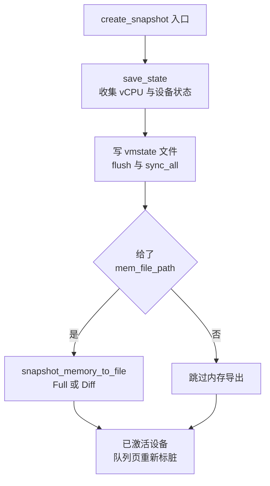
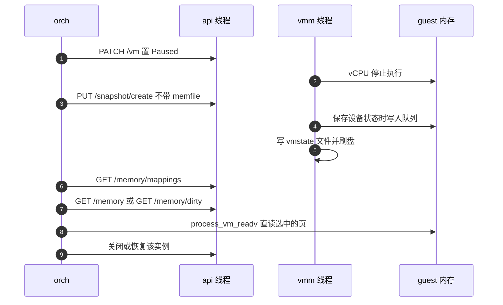

# 54 · 可选 memfile 的快照与 e2b 的暂停流程

> 上游的 `PUT /snapshot/create` 把两件事绑在一起：把 microVM 的状态序列化成文件，
> 把 guest 内存写成另一个文件。e2b 只要前一件。本篇讲这个「把参数改成可选」的小改动，
> 它在 `create_snapshot()` 里留下了什么、去掉了什么，以及由它拼出来的那条暂停流程为什么是现在的顺序。
>
> **读者**：系统工程师。　**预备**：[第 37 篇 · 创建快照](37-snapshot-create.md)、
> [第 50 篇 · /memory/mappings](50-memory-mappings-api.md)、[第 52 篇 · /memory/dirty](52-memory-dirty-api.md)。
> **代码**：`src/vmm/src/vmm_config/snapshot.rs`、`src/vmm/src/persist.rs`、
> `src/vmm/src/rpc_interface.rs`、`src/firecracker/swagger/firecracker.yaml`、
> `tests/integration_tests/functional/test_api.py`

---

## 0. 本篇要回答的问题

1. 为什么 e2b 不愿意让 Firecracker 把 guest 内存写成文件？
2. 把 `mem_file_path` 改成可选，代码上一共动了哪些地方？
3. 不给内存文件路径的 `create` 还做哪些事，哪些事被跳过了？
4. 跳过写内存这一步，对 Diff 快照与两张脏位图的清零语义有什么副作用？
5. e2b 的一次暂停按什么顺序调用哪些接口，这个顺序里哪几步不能交换？
6. 这个改动放弃了上游的哪条保证，代价由谁承担？

---

## 1. 问题：内存导出这一步 e2b 用不上

上游的快照产物是一对文件：状态文件（vmstate）与内存文件（memfile）。
`PUT /snapshot/create` 的请求体里两个路径都是必填，`create_snapshot()` 顺序写出它们
（[第 37 篇](37-snapshot-create.md)）。这套设计假设调用方要的就是这两个文件，
而且要的是「文件」这种形态。

e2b 的假设不同。它的暂停产物不是一个完整的内存文件，而是一个**差分**：
只包含这次运行期间被改写过的那些块，叠在模板的内存文件上。
它还要求这个差分由 orchestrator 自己算、自己组织成带层次的产物格式，
因为「哪一块属于哪一代 build」这件账要记在 orchestrator 的 header 里，Firecracker 不知道也不该知道。

于是上游的两条路都不合适。走 Full：写出的是整个 guest 内存，
一台 4 GiB 的 microVM 每次暂停就要落盘 4 GiB，成本正比于规模而不是正比于改动量。
走 Diff：产物是一个稀疏文件，脏页判据只能用 KVM 的脏页日志，
而 e2b 的 microVM 是从 uffd 后端恢复出来的，大部分页从未被触碰过，
KVM 日志不区分「从未存在」与「存在且干净」——它只回答「有没有被写过」，
覆盖不了 orchestrator 真正要的那个更细的判据（第 51、52 篇）。
更根本的是，两条路都要求 Firecracker 先把数据写进一个文件，orchestrator 再读回来：
同一份内存在暂停的关键路径上过了两趟。

e2b 的做法是把内存导出这一步整个拿走：Firecracker 只负责产出状态文件，
并通过三个只读端点把「内存在宿主进程里的位置」和「哪些页值得导出」告诉 orchestrator，
由 orchestrator 用 `process_vm_readv(2)` 跨进程直读。本篇讲的是这条路径上 Firecracker 一侧的最后一块：
让 `create` 可以不写内存文件。

---

## 2. 改动：一个 `Option` 和一处 `if let`

提交 `03e506146` 把 `src/vmm/src/vmm_config/snapshot.rs` 的 `CreateSnapshotParams`
中的 `mem_file_path` 从 `PathBuf` 改成 `Option<PathBuf>`，并加了
`#[serde(skip_serializing_if = "Option::is_none")]`。字段的文档注释写明了新语义：
不给这个路径，内存就不导出成文件。

`src/vmm/src/persist.rs` 的 `create_snapshot()` 里，原本无条件的一行

```rust
vmm.vm
    .snapshot_memory_to_file(&params.mem_file_path, params.snapshot_type)?;
```

变成一个条件分支：只有 `params.mem_file_path` 是 `Some` 时才调用 `snapshot_memory_to_file()`。
函数的其余三步一行没动。

剩下的改动全是把这个类型变化推平：`src/firecracker/src/api_server/request/snapshot.rs`
与 `src/firecracker/src/api_server/mod.rs` 的单元测试、`src/vmm/src/rpc_interface.rs` 的单元测试、
`src/vmm/tests/integration_tests.rs` 的 `verify_create_snapshot()` 都把 `PathBuf::from(...)`
包成 `Some(...)`。请求体的解析本身不用改：`CreateSnapshotParams` 直接由 serde 从 JSON 反序列化，
`Option<PathBuf>` 天然接受「字段缺席」。

规格文件 `src/firecracker/swagger/firecracker.yaml` 里，`SnapshotCreateParams`
的 `required` 列表删掉了 `mem_file_path`（提交 `5cfd4e39f`），只留 `snapshot_path`。
属性定义本身保留，所以规格上它从「必填」变成「选填」。

这个改动没有引入新的错误分支。给了路径就和上游一样，不给路径就少做一步 ——
没有「路径非法时回退到不写」这类中间语义。

---

## 3. 不写内存文件的 `create` 还做什么

把跳过的那一步拿掉之后，`create_snapshot()` 剩下的三步值得逐一确认，
因为 e2b 的暂停流程正是建立在「这三步仍然发生」之上的。



**第一步 `vmm.save_state()` 照做。** 它按 vCPU 状态、`kvm_state`、架构相关的 `vm_state`、
`device_states`、`acpi_dev_state` 的顺序收集（`src/vmm/src/lib.rs`）。
这里有一个对 e2b 关键的副作用：**保存设备状态会写 guest 内存**。
已激活的 vsock 会被要求发一个传输层重置事件，往事件队列里写描述符并推进 used ring；
已激活的 block 设备会先 `prepare_save()` 排空在途请求并刷盘，异步引擎还要把完成项回填进 used ring
（细节在[第 37 篇 §3](37-snapshot-create.md#3-save_state收集的顺序)）。
这些写发生在 `create_snapshot()` 内部，谁想拿到一份与状态文件自洽的内存，就必须在它返回之后再去读。

**第二步写状态文件照做。** `snapshot_state_to_file()` 用 `create + write + truncate`
打开 `snapshot_path`，序列化后 `flush()` 加 `sync_all()`。
也就是说，即使调用方一个字节的内存都不要，它仍然必须给出一个可写的 `snapshot_path`，
Firecracker 仍然会把状态文件完整落盘并刷盘。这一点在第 6 节还要提。

**第四步队列重新标脏照做。** 遍历所有已激活的 virtio 设备调 `mark_queue_memory_dirty()`。
上游加这一步是为了让下一次 Diff 快照必然包含完整的队列区域（[第 37 篇 §7](37-snapshot-create.md#7-队列为什么要重新标脏)）。
在没有内存文件的路径上它仍然执行，只是意义变了：它标的是**用户态位图**，
而 e2b 判定脏页用的是 pagemap 的写保护位（第 52 篇），两者不是同一张表。
换句话说，这一步在 e2b 的用法下既不产生收益也不产生正确性问题，是被一并继承下来的残留动作。
真正保证队列内容能被 orchestrator 读到的，是上一段说的时序：队列的写发生在 `create` 内部，
orchestrator 在 `create` 返回后才去读页面。

**被跳过的只有 `snapshot_memory_to_file()`。** 于是三件事不会发生：不打开也不 `set_len` 内存文件；
Full 分支的 `dump()` 与两次显式清位图不执行；Diff 分支的 `get_dirty_bitmap()` 与 `dump_dirty()` 不执行。

---

## 4. 一个需要写清楚的副作用：位图没有被清

`snapshot_memory_to_file()` 不只是「写文件」，它还是上游**唯一**清脏位图的地方
（Full 分支显式调 `reset_dirty_bitmap()` 与 `reset_dirty()`，Diff 分支通过
`get_dirty_bitmap()` 与 `dump_dirty()` 内含地清）。跳过它，两张位图都不会被清。

后果分两种情况。

如果 `track_dirty_pages` 是关的，KVM 侧根本没有开启脏页日志，用户态位图也只被队列标脏那一步写入，
没有人读它，不清也没有影响。

如果 `track_dirty_pages` 是开的，而调用方又用 `Diff` 类型且不给内存文件路径，
那么这一次 `create` 结束后，KVM 的脏页日志**仍然保留着上一次清零以来的全部记录**，
guest 页也仍然处于 KVM 的写保护状态。下一次真正带内存文件的 Diff 快照会把这两段区间的脏页合并写出，
产物偏大但不会漏。方向是安全的一侧 —— 多写只是浪费，漏写才是数据损坏 ——
但「一次快照之后脏记录从此刻重新计数」这条上游不变量在这条路径上不成立。
控制面对这种组合没有任何提示：`RuntimeApiController::create_snapshot()`
（`src/vmm/src/rpc_interface.rs`）只检查 `Diff` 类型是否配了 `track_dirty_pages`，
不检查 `mem_file_path` 是否存在，两个 `Diff` 的分支照样各自记 `vmm_diff_create_snapshot` 延迟。

e2b 自己不踩这个坑：orchestrator 建 microVM 时把 `track_dirty_pages` 显式设为 `false`
（`fc/client.go` 的 `setMachineConfig()`），暂停时用的快照类型是 `Full`
（`fc/client.go` 的 `createSnapshot()`）。所以在 e2b 的用法里，KVM 的脏页日志从未被启用，
Diff 分支从未被走到，上一段描述的是一个对别的调用方开放、但 e2b 不使用的组合。

---

## 5. e2b 的暂停流程

把第 50 到 54 篇的四个接口拼起来，就是 e2b 一次暂停在 Firecracker 一侧的全貌。
下图的参与者：`orch` 是 orchestrator 进程，`api` 是 Firecracker 的 API 线程，
`vmm` 是 Firecracker 的 VMM 线程，`mem` 是这台 microVM 的 guest 内存。



顺序里有三处不能交换。

**暂停必须在最前面。** 不是因为 API 层检查了它 —— 控制面没有这条检查 ——
而是因为 vCPU 线程在 `running` 状态下会拒绝 `SaveState` 事件，整条 `create` 调用链失败
（[第 37 篇 §1](37-snapshot-create.md#1-前提暂停由谁强制)）；
`GET /memory/dirty` 则有一条显式检查，实例状态不是 `Paused` 就返回
`OperationNotSupportedWhileRunning`（`rpc_interface.rs` 的 `get_dirty_memory_info()`）。

**`create` 必须在读内存之前。** 理由就是第 3 节那个副作用：保存设备状态会往 guest 内存里写。
如果先读页面再 `create`，读到的队列内容会比状态文件里记录的索引旧，
恢复出来的 guest 驱动会看到一个不自洽的 used ring。
这是把「一次原子的 create」拆成两步之后，顺序约束从 Firecracker 内部转移到了调用方身上的第一处。

**读内存必须在进程还活着的时候。** guest 内存是这个进程的匿名映射或 hugetlbfs 映射，
`process_vm_readv(2)` 只在目标进程存在期间有效。所以 orchestrator 的清理动作必须排在最后，
这与上游「产物是文件，进程死了文件还在」的形态完全不同。

`GET /memory` 与 `GET /memory/dirty` 在流程里是二选一：前者给 resident 与 empty 两张位图，
用于第一次暂停（此前没有 uffd 后端可问）；后者给 pagemap 判出的脏页位图，用于恢复过的实例。
判据本身分别是第 51、52 篇的题目。

---

## 6. 代价

**原子性没有了。** 上游的一次 `create` 同时产出状态与内存，两者出自同一个暂停窗口，
由同一个函数保证先后。改成可选之后，状态由 Firecracker 写、内存由 orchestrator 读，
两者之间隔着三次 HTTP 往返。正确性因此依赖调用方遵守上一节的顺序，
而 Firecracker 一侧没有任何机制去强制它：不带 memfile 的 `create` 与后续的 `GET /memory*`
之间没有握手、没有序号、没有「自上次 create 以来内存未变」的校验。
一个顺序写错的调用方会拿到一份看起来正常、实际不自洽的产物。

**状态文件仍然必须落盘。** 请求体里 `snapshot_path` 依然是必填，而且 Firecracker 会
`sync_all()` 它。orchestrator 明确知道这一点：它在暂停前专门造一个临时文件路径传进去，
代码注释直说这么做只是因为 API 不接受 `/dev/null`
（`internal/sandbox/sandbox.go` 的 `Sandbox.Shutdown()`）。
也就是说，即使调用方只想让 microVM 进入「可被直读」的一致状态，也仍然要付一次状态文件的写入与刷盘。

**暂停窗口的构成变了，但没有变短的保证。** 上游的窗口里是一次大块顺序写；
e2b 的窗口里是一次状态文件写、若干次位图计算（`mincore` 与逐页 `pread`，第 51、52 篇）
和一次跨进程读。哪一边更短取决于工作集与内存大小的比例，本书不给数字。
确定的是：读内存的那一段也在暂停窗口里，因为 guest 必须保持静止。

**失败语义没有被扩展。** `create_snapshot()` 不做回滚，跳过内存导出也不改变这一点。
状态文件写失败就返回错误，磁盘上可能留下一个截断的文件，清理由调用方负责。
而「内存导出失败」这个失败模式现在整个转移到了 orchestrator 一侧，Firecracker 看不到，
也不会在 metrics 里留下痕迹。

---

## 7. 规格与测试跟得上吗

这个改动在 a41d3fb 这个基线上留下了两处不一致，值得读者注意。

**swagger 只改了一半。** `SnapshotCreateParams` 的 `required` 去掉了 `mem_file_path`，
但新增的 `/memory/dirty` 端点在 a41d3fb 的 `firecracker.yaml` 里完全没有定义
（文件里搜不到这个路径）。分叉在 a41d3fb 之后补了两个只改文档的提交
（`doc(swagger): add /memory/dirty endpoint definition` 与
`doc(swagger): make mem_file_path optional in SnapshotCreateParams`），
但 e2b infra 2026.09 钉的版本是 a41d3fb，钉的就是这个规格不全的状态。
后果很具体：orchestrator 的 API 客户端是从这份 swagger 生成的，
`/memory/dirty` 只能手写请求，而 `scripts/build.sh` 又用这份文件里的 `version:` 字段拼版本名（第 55 篇）。

**新增的集成测试没有覆盖这个改动。** `tests/integration_tests/functional/test_api.py`
在分叉里加了 237 行、五个用例，全部是围绕 `/memory/mappings` 与 `/memory` 的：
启动前返回 400、启动后返回 200、映射结构与页大小、位图长度与「empty 是 resident 子集」的不变量，
外加一个标了 `@pytest.mark.nonci` 的基准用例。
**没有一个用例调用不带 `mem_file_path` 的 `PUT /snapshot/create`**，
也没有用例调用 `/memory/dirty`。这条路径上只有 Rust 侧的单元测试被改成了 `Some(...)`，
真正验证「不给路径也能产出可用状态文件」的是生产流量，不是测试。

---

## 8. 小结

- e2b 不要内存文件，因为它的产物是差分，而且要由 orchestrator 自己算判据、自己组织层次；上游的 Full 与 Diff 两条路都会先把数据写进文件再读回来。
- 改动本体是 `CreateSnapshotParams.mem_file_path` 变成 `Option<PathBuf>` 加 `create_snapshot()` 里的一处 `if let`，其余都是类型推平与规格调整。
- 不给路径时，收集状态、写 vmstate 并刷盘、队列重新标脏这三步照旧，只有 `snapshot_memory_to_file()` 被跳过。
- 保存设备状态会写 guest 内存（vsock 重置事件、block 排空刷盘），所以调用方必须在 `create` 返回之后才去读内存。
- 跳过内存导出也跳过了唯一清脏位图的地方：`Diff` 加不带 memfile 的组合会让 KVM 脏页日志跨越多次快照累积，产物偏大但不漏；e2b 用 `Full` 且关掉 `track_dirty_pages`，不走这条组合。
- 暂停流程的顺序是 `PATCH /vm` → 不带 memfile 的 `create` → 查映射 → 查位图 → `process_vm_readv` 直读页面 → 收尾，三处顺序约束都落在调用方身上，Firecracker 不强制。
- 放弃的是「状态与内存出自同一次原子操作」这条保证；换来的是内存不必经过文件系统往返一次。
- a41d3fb 的 swagger 没有 `/memory/dirty` 的定义，新增的集成测试也没有覆盖不带 memfile 的 `create`。

---

## 延伸阅读 / 下一篇

- 下一篇：[第 55 篇 · seccomp、构建发布脚本与合入的上游修复](55-seccomp-build-upload-and-upstream-fixes.md) —— 这一层剩下的非功能改动。
- [第 37 篇 · 创建快照](37-snapshot-create.md) —— 被跳过的那一步原本做什么。
- [第 50 篇 · /memory/mappings](50-memory-mappings-api.md)、[第 51 篇 · /memory](51-memory-resident-empty-api.md)、[第 52 篇 · /memory/dirty](52-memory-dirty-api.md) —— 暂停流程里的三个查询接口。
- [第 49 篇 · 为什么分叉](49-why-e2b-forked.md) —— 这条内存管线的整体动机。
- [第 57 篇 · 迁入的版本](57-which-fork-commit-and-uffd-wp.md) —— ARM 适配版继承这个改动时的取舍。
- [e2b 手册第 37 篇](../e2b-infra/37-pause-and-snapshot.md) —— 调用方一侧的完整暂停流程，含差分产物与 header 合并。
