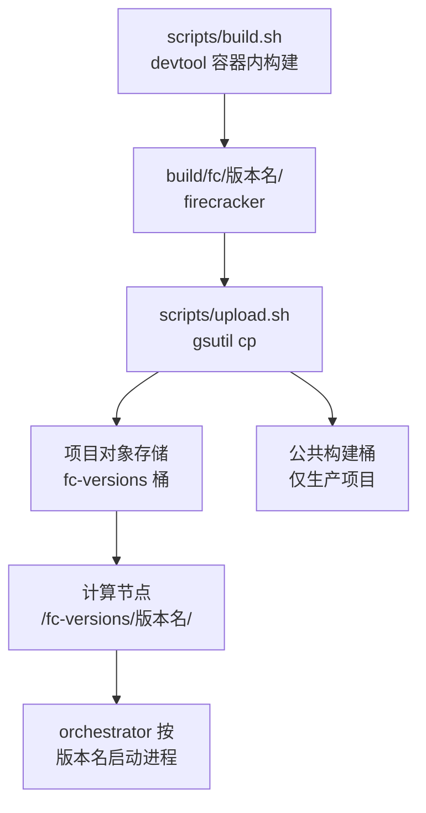

# 55 · seccomp、构建发布脚本与合入的上游修复

> 前六篇讲的是 e2b 定制版加了什么功能。这一篇讲剩下的部分：为了让新增的系统调用穿过 seccomp
> 而改的两张表，为了把二进制送到机器上而加的三个脚本，从上游捡回来的五个修复，
> 以及被删掉的两处 CI。这些改动加起来不到两百行，却决定了这个分叉能不能被维护下去。
>
> **读者**：维护者、运维。　**预备**：[第 42 篇 · seccomp](42-seccomp.md)、
> [第 46 篇 · 代码组织与构建](46-code-organization-and-build.md)、[第 47 篇 · 测试体系](47-testing.md)。
> **代码**：`resources/seccomp/x86_64-unknown-linux-musl.json`、
> `resources/seccomp/aarch64-unknown-linux-musl.json`、`scripts/build.sh`、`scripts/upload.sh`、
> `Makefile`、`tools/test.sh`、`tests/integration_tests/functional/test_shut_down.py`

---

## 0. 本篇要回答的问题

1. 新增的三个查询接口用到哪些系统调用，为什么只有 `vmm` 这一张表需要改？
2. 两个架构的表为什么改得不一样，不对称的后果是什么？
3. uffd 的创建、注册与写保护为什么不需要出现在任何一张表里？
4. `v1.12.1_a41d3fb` 这个版本名是怎么拼出来的，谁在消费它？
5. 分叉从上游捡回了哪五个提交，它们碰了生产代码吗？
6. 分叉删掉了哪两处 CI，代价是什么？

---

## 1. 一个分叉要额外承担什么

一个长期存在的分叉有三件上游不会替你做的事：把新代码需要的权限补进安全策略，
把二进制变成一个能被部署系统识别的产物，以及跟上上游在同一个支持分支上的修复。
这三件事都不产生新功能，做不好却会直接表现为进程被杀、版本对不上、已知问题重复出现。

e2b 定制版在这三件事上的处理各有分寸：seccomp 只补最小集合且只补用得到的架构；
构建与上传写成两个几十行的 shell 脚本，够用即止；上游修复只跟 v1.12 这一条分支，
并且只挑碰得到自己的。本篇按这个顺序逐一看，最后看它删掉了什么。

---

## 2. seccomp：两条系统调用，两张不对称的表

新增的三个只读端点在实现上用到两个上游白名单里没有的系统调用：
`mincore()`（判断页是否常驻，第 51、52 篇）与 `pread64()`（读 `/proc/self/pagemap`，第 52 篇）。

`resources/seccomp/x86_64-unknown-linux-musl.json` 的 `vmm` 段加了两条规则，
注释分别写「用于 `get_memory_dirty_bitmap` 判断内存页是否常驻」与
「用于 `get_dirty_memory` 读 `/proc/self/pagemap` 条目」。
`resources/seccomp/aarch64-unknown-linux-musl.json` 的 `vmm` 段**只加了 `mincore`**。
两条规则都不带参数条件，是纯粹的系统调用放行。

| 表 | 上游 v1.12.1 的 `vmm` 段规则数 | e2b 定制版 | 新增 |
|---|---|---|---|
| x86_64 | 58 | 60 | `mincore`、`pread64` |
| aarch64 | 57 | 58 | `mincore` |

`api` 与 `vcpu` 两段在两个架构上都一条没动。原因在第 42 篇已经讲过：
三张表按线程分，而 `GetMemoryMappings`、`GetMemory`、`GetMemoryDirty`
三个动作都是 API 线程解析成 `VmmAction` 之后交给 VMM 线程执行的
（`src/vmm/src/rpc_interface.rs` 的 `RuntimeApiController::handle_request()`），
系统调用发生在 VMM 线程上。API 线程只做 HTTP 解析与序列化，不碰 `mincore` 也不读 pagemap。

**不对称是有意的，但没有被标注出来。** 分叉只在 x86_64 上构建与运行
（`scripts/build.sh` 的产物路径写死 `x86_64-unknown-linux-musl`，见第 3 节），
aarch64 的表只是顺手补了一半。后果很具体：在 aarch64 上跑这个二进制，
`GET /memory` 可用，`GET /memory/dirty` 会在 VMM 线程第一次 `pread64` 时触发 SIGSYS，
按第 42 篇的处理流程记一次 `seccomp.num_faults` 并让进程以退出码 148 结束。
ARM 适配版把 `pread64` 补进了 aarch64 的表，另外还为回滚路径补了四条 vCPU 相关的 ioctl，见
[第 62 篇 · aarch64 的 seccomp 过滤器](62-aarch64-seccomp-filter.md)。

**uffd 相关的调用不在任何一张表里，这不是遗漏。** 第 53 篇讲的写保护改动引入了
`userfaultfd(2)` 与 `UFFDIO_REGISTER` / `UFFDIO_WRITEPROTECT` 两个 ioctl，
但 `resources/seccomp/` 下的两个文件里找不到它们，上游的表里也没有。
理由是时序：`guest_memory_from_uffd()` 在 `src/vmm/src/persist.rs` 的
`restore_from_snapshot()` 里被调用，创建 uffd、逐区域 `register_with_mode()`、
大页时立刻 `write_protect()`；这一整段做完之后才把 `seccomp_filters` 传给
`build_microvm_from_snapshot()`，由它在构建的最后一步调 `crate::seccomp::apply_filter()`
（`src/vmm/src/builder.rs`）。所有 uffd 操作都发生在过滤器装上之前，因此不需要白名单。
运行期间 Firecracker 不再对 uffd 做任何操作 —— 缺页与写保护事件由外部的 handler 进程处理 ——
所以这条豁免在运行期也成立。

还有一点要提醒读者：这两张 JSON 表不是运行时读取的配置文件。
它们在构建时由 `build.rs` 调 seccompiler 编译成 BPF 程序，经 bincode 序列化后
用 `include_bytes!` 嵌进二进制（[第 42 篇 §3](42-seccomp.md#3-从-json-到二进制)）。
所以「给分叉补一条系统调用」这个动作的最小单位是一次完整的重新构建与重新分发，
不能在机器上改文件了事。这也解释了为什么第 2 节的不对称只能靠 ARM 适配版重新构建来解决。

**另有一处纯格式改动**：x86_64 表里 `getrandom` 那条规则的缩进从 14 空格改成 16 空格，
与文件其余部分对齐。同一次提交还让文件末尾丢掉了换行符。
两者都不影响 seccompiler 的解析（[第 42 篇 §3](42-seccomp.md#3-从-json-到二进制)），
但会让今后与上游的 diff 多出两行噪声。

---

## 3. 构建：版本名从规格文件里长出来

分叉在仓库根加了 `Makefile`、`scripts/build.sh`、`scripts/upload.sh` 三个文件，
外加 `.tool-versions`（记录 `gcloud 534.0.0` 与 `rust 1.85.0`）与 `.gitignore` 里的一行 `.env`。

`scripts/build.sh` 只有十几行，做三件事：

```bash
FC_VERSION=$(awk '/^info:/{flag=1} flag && /^  version:/{print $2; exit}' src/firecracker/swagger/firecracker.yaml)
commit_hash=$(git rev-parse --short=7 HEAD)
version_name="v${FC_VERSION}_${commit_hash}"
```

然后 `tools/devtool -y build --release`，最后把
`build/cargo_target/x86_64-unknown-linux-musl/release/firecracker`
复制到 `build/fc/${version_name}/firecracker`。

版本名的构成值得看一眼：**前半截来自 swagger 规格文件的 `info.version` 字段，后半截是 7 位提交哈希。**
前半截标识「这是哪个上游版本的 API 面」，后半截标识「具体是哪次提交的代码」。
`v1.12.1_a41d3fb` 就是这么来的。

这个选择有一个直接的后果。swagger 的 `version` 字段由上游维护，分叉加了三个端点却没有改它 ——
事实上 a41d3fb 的 swagger 连 `/memory/dirty` 的定义都没有（第 54 篇 §7）。
所以版本名的前半截**不反映这个二进制实际提供的 API 面**，只有后半截能区分。
第 48 篇讲上游版本号与 API 面的关系时给出的判断，在分叉上以更强的形式成立：
要知道一个 `firecracker` 二进制到底支持什么，唯一可靠的依据是提交哈希。

脚本还有两处写死。一是产物路径里的 `x86_64-unknown-linux-musl`，
这就是上一节说的「只在 x86_64 上跑」在构建层的对应物；
ARM 适配版改的正是这一行（[第 58 篇](58-building-and-running-on-aarch64.md)）。
二是构建方式固定走 `tools/devtool`，也就是上游那套容器化构建
（[第 46 篇](46-code-organization-and-build.md)），分叉没有提供不用容器的退路。

`Makefile` 是三个 target 的薄封装：`build` 调 `scripts/build.sh`，
`upload` 调 `scripts/upload.sh $(GCP_PROJECT_ID)`，`build-and-upload` 串起两者；
开头一行 `-include .env` 让项目 id 可以放在本地文件里。

---

## 4. 上传与消费

`scripts/upload.sh` 接一个参数（GCP 项目 id），做三件事：
把 `build/fc/*` 整个目录传到 `gs://${GCP_PROJECT_ID}-fc-versions`；
项目 id 恰好是生产项目时，再传一份到公共构建桶的 `firecrackers/` 前缀下；
最后清空本地的 `build/fc/*`。两次上传都带
`Cache-Control: no-cache, max-age=0`，因为同名对象可能被重新上传。



消费侧只用一句话交代（细节属于 e2b 手册）：orchestrator 从
`FIRECRACKER_VERSIONS_DIR`（默认 `/fc-versions`）下按版本名找二进制，
而 2026.09 的默认版本名钉在 `packages/shared/pkg/feature-flags/flags.go` 的
`DefaultFirecackerV1_12Version = "v1.12.1_a41d3fb"`。
也就是说，从 `git rev-parse --short=7 HEAD` 到 Go 常量，这串哈希原样穿过了整条链路，
中间没有任何一处校验它与二进制的对应关系。改了代码不重新构建、或者构建了不更新常量，
都不会有人报错。

---

## 5. 上游修复：五个提交，全在测试里

分叉在 v1.12.1 之上的 28 个提交里，有五个的作者是上游维护者。
判断一个提交是不是上游的，用 `git branch -r --contains <提交>`：
能同时出现在 `upstream/firecracker-v1.12` 上的就是从上游支持分支合入的。

| 提交 | 改动文件 | 内容 | 来源 |
|---|---|---|---|
| `85ebde70e` | `test_cpu_features_host_vs_guest.py` | 嵌套虚拟化关闭后，若干 AMD 的 CPU 特性与 MSR 改判为 host-only | `upstream/firecracker-v1.12` |
| `21dc66d1a` | `test_cpu_template_helper.py` | 把 `MSR_TSC_RATE` 加进 MSR 例外表 | `upstream/firecracker-v1.12` |
| `13ffca99b` | `test_vulnerabilities.py` | Spectre / Meltdown 检查脚本换一个下载地址 | `upstream/firecracker-v1.12` |
| `7f528b416` | `test_cpu_features_host_vs_guest.py` | 把 `ibpb_exit_to_user` 加为 host-only 特性 | `upstream/firecracker-v1.12` |
| `dbc555204` | `test_shut_down.py` | 删掉 `test_reboot` 里「恰好 6 个线程」的断言 | `upstream/main` 的 `dafee92a9`，单独摘回 |

五个提交的共同点：**一行生产代码都没有碰，全部落在 `tests/` 里。**
对 aarch64 的影响因此是零 —— 前四个只在 x86_64 的 CPU 特性用例上生效，
第五个删掉的断言与架构无关。

第五个值得单独说，因为它常被误当成分叉自己的取舍。上游的 `test_reboot`
原本用 `ps -o nlwp` 数 Firecracker 的线程数并断言等于 6。
上游提交信息给出的原因是：Ubuntu 24.04 的 6.8.0-58 内核回合了一个补丁，
让 NX 大页恢复线程成为 Firecracker 进程的子线程，线程数变成 7。
上游的判断是这个测试本来就不关心线程数，于是把断言整个删掉。
分叉把这个提交摘回来，是因为它自己的 CI 跑在 GitHub 的 `ubuntu-latest` 上，
撞的是同一个内核（第 6 节）。这不是分叉放松了标准，是它把上游的修正提前拿了过来。

顺带纠正一个容易产生的印象：这个断言的消失**不意味着** Firecracker 的线程数不再是六个。
它意味着「用 `ps` 数出来的数字」不再是一个稳定的判据，因为宿主内核可以往这个进程里塞线程。

---

## 6. CI 与测试：分叉的维护姿态

分叉对测试与 CI 的处理，比功能改动更能说明它打算怎么活下去。

**加过一条 PR 流水线，然后删掉了。** 提交 `01f3491fb` 加了
`.github/workflows/pr_tests.yml`：在 `ubuntu-latest` 上挂载 hugetlbfs、预留 1024 个大页，
然后 `./tools/devtool -y test -- integration_tests/functional/` 跑功能测试。
随后三次调整依次是：限定 `-k "not vmlinux-5.10"` 跳过 5.10 内核的参数化用例、
把并发度从 4 降到 2 并删掉一些步骤、最后整个删除文件（`672633819`，提交信息只说「移除不稳定的测试调用」）。
在 a41d3fb 这个基线上，`.github/workflows/` 里只剩四个上游文件，
其中两个是通知、一个是 A/B 测试触发、一个是 lock 文件检查 ——
它们指向的都是上游自己的基础设施。**分叉在这个基线上没有任何自动运行的测试。**

**删掉了依赖检查。** 上游的 `dependency_modification_check.yml` 在每个 PR 上断言
`Cargo.lock` 不在改动集里。分叉把 `userfaultfd` 换成自己的 git 分支（第 53 篇）之后
这条规则必然失败，于是最后一个提交 `a41d3fb53` 把它删了。
这是一个清晰的因果（[第 46 篇 §7](46-code-organization-and-build.md#7-后续各层的差异)已经点过），
代价是失去了对依赖变动的自动提醒。

**测试代码只动了必要的三处。** `tests/framework/http_api.py` 给 `Api` 类加了
`memory_mappings` 与 `memory` 两个 `Resource`（没有加 `memory_dirty`）；
`test_api.py` 加了 237 行、五个用例，覆盖面与缺口在第 54 篇 §7 讨论过；
`tools/test.sh` 把 `[ "$BUILDKITE" == "true" ]` 改成 `[ "${BUILDKITE:-false}" == "true" ]`，
使脚本在没有这个环境变量的机器上不会因 `set -u` 而失败 —— 这正是「不在 Buildkite 上跑」的一个印记。

那条被删掉的流水线还留下一个可读的细节：它在跑测试前要 `mount -t hugetlbfs`
并预留 1024 个 2 MiB 大页。这不是为了跑得快，而是因为分叉新增的用例
（第 54 篇 §7 说的那五个）全部用 `HugePagesConfig.HUGETLBFS_2MB` 配置 microVM ——
`/memory` 返回的位图按区域的页大小折算，用例断言的正是「页大小等于 2 MiB」。
换句话说，这套查询接口在分叉里被验证过的形态只有大页这一种；
匿名内存后备的 microVM 上它能不能给出同样的结果，分叉自己没有测过。

把这三条放在一起看，姿态是明确的：**功能改动配了新用例，维护基础设施没有保留。**
这在分叉存续期短、只服务一个调用方时是合理的取舍；
它把回归检测的责任整个推给了调用方的端到端验证。
本项目的 aarch64 环境连 pytest 层都跑不起来（[第 47 篇 §6](47-testing.md#6-在本项目的环境里还剩什么)），
缺口在那里进一步扩大。

---

## 7. 分叉之后：升级要重放什么

`a41d3fb` 不是分支的末端。它之后还有三个提交：两个只补规格文档 ——
`827b7839e` 给 swagger 加 `/memory/dirty` 的定义、`59b0ad163` 把 `mem_file_path` 标成非必填 ——
一个是 `210cbac11`，改 `src/vmm/src/arch/x86_64/vm.rs`：
恢复 kvmclock 时不再把 `KVM_CLOCK_REALTIME` 传给 `KVM_SET_CLOCK`。
提交信息给出的理由是，带上这个标志会让内核按经过的墙上时间推进 guest 的单调时钟，
这对实时迁移合适，对「很久以前拍的快照」则会让 guest 用户态出问题；
改成由 guest 内的时间同步服务自己处理。
这是三层改动里少见的一处**语义**修复，而 2026.09 钉的版本在它之前。

仓库里另有 `firecracker-v1.13` 与 `firecracker-v1.14-direct-mem` 两条分支，
说明同一套改动已经在更新的上游版本上重放过一次。
对本项目的含义是：这层定制不是一次性的补丁，而是一组需要跟着上游版本反复移植的改动。
要移植的东西可以按本部分的篇目清点 —— 三个查询端点（第 50 至 52 篇）、
uffd 写保护与依赖替换（第 53 篇）、可选 memfile（第 54 篇）、
两张 seccomp 表与三个脚本（本篇），再加上面两个补规格的提交。差异总表在[第 78 篇](78-layer-diff-tables.md)。

清单里还有一项容易漏：`src/firecracker/examples/uffd/` 下的示例 uffd 处理器
在 `8fc760f61` 里**没有**被一起改，仍然用不带写保护模式的 `UFFDIO_COPY` 填页。
移植这层改动时如果只盯着 `src/vmm/`，示例处理器会继续以一个「看起来能跑、脏页判据却恒为全脏」的形态留在仓库里
（[第 53 篇 §4](53-uffd-write-protection.md#4-匿名内存为什么不能在这里保护)）。

---

## 8. 小结

- 新增端点只需要两个系统调用：`mincore` 与 `pread64`，都只加在 `vmm` 段，因为查询动作在 VMM 线程上执行。
- aarch64 的表只补了 `mincore`，因为分叉只在 x86_64 上构建；在 aarch64 上调用 `/memory/dirty` 会触发 SIGSYS 终止进程。
- uffd 的创建、注册与写保护发生在 `vmm` 过滤器安装之前，运行期不再操作 uffd，所以任何一张表里都不需要它们。
- 版本名 `v<swagger 的 info.version>_<7 位哈希>` 里，只有哈希能标识实际的 API 面；规格文件的版本字段没有随分叉的新端点更新。
- 从构建脚本到 orchestrator 的版本常量，这串哈希原样穿过整条链路，中间没有任何校验。
- 五个来自上游的提交全部落在 `tests/` 里，没有碰生产代码；`test_reboot` 删线程数断言是上游对宿主内核变化的修正，不是分叉放松标准。
- 分叉加过一条 PR 流水线又删掉，并删除了 lock 文件检查；a41d3fb 上没有任何自动运行的测试。
- 同一套改动已经在 v1.13 与 v1.14 上重放过，说明这层定制的成本是持续的移植成本，不是一次性的。

---

## 延伸阅读 / 下一篇

- 下一篇：[第 56 篇 · guest 内核](56-guest-kernel-requirements-and-e2b-configs.md) —— 这一层的另一半定制，全部在配置里。
- [第 42 篇 · seccomp](42-seccomp.md) —— 三张表的结构、编译与安装时机。
- [第 46 篇 · 代码组织、依赖与构建](46-code-organization-and-build.md) —— `devtool` 与上游的 CI 生成方式。
- [第 47 篇 · 测试体系](47-testing.md) —— 被分叉裁掉的那套测试原本守什么。
- [第 48 篇 · 发布策略、版本与兼容承诺](48-release-and-compat-policy.md) —— 上游的版本号承诺什么、不承诺什么。
- [第 62 篇 · aarch64 的 seccomp 过滤器](62-aarch64-seccomp-filter.md) —— 补齐不对称的那一层。
