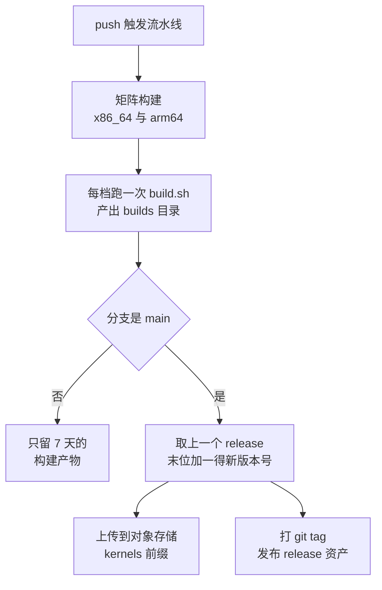

# 56 · guest 内核：Firecracker 的要求与 e2b 的内核配置

> Firecracker 只给 guest 一小组设备，所以 guest 内核必须恰好会用这一小组、并且不去找别的。
> 本篇先讲这组要求由哪些代码和文档确定，再讲 e2b 的内核仓库怎么把它落成两个 config 文件、
> 一个构建脚本和一条发布流水线。这一层的「定制」全部在配置里，没有一行内核源码补丁。
>
> **读者**：系统工程师、运维。　**预备**：[第 11 篇 · builder](11-builder.md)、
> [第 17 篇 · x86_64 平台](17-x86-64-platform.md)、[第 19 篇 · aarch64 平台](19-aarch64-platform.md)。
> **代码**：`src/vmm/src/arch/x86_64/mod.rs`、`src/vmm/src/arch/aarch64/mod.rs`、
> `docs/kernel-policy.md`、`resources/guest_configs/`、`resources/rebuild.sh`；
> fc-kernels 仓库的 `build.sh`、`kernel_versions.txt`、`configs/`

---

## 0. 本篇要回答的问题

1. Firecracker 对 guest 内核的硬要求有哪些，哪些是代码强制的、哪些只是文档建议？
2. 为什么上游只保证自己的 config 用于 Amazon Linux 的 microVM 内核？
3. e2b 的内核仓库长什么样，一次构建到一次发布之间发生了什么？
4. e2b 的 config 相对上游 CI config 改了哪些东西，为什么这么改？
5. 两个架构的 config 差异为什么不对称？
6. 这个仓库里有哪些已经能从代码上看出来的问题？

---

## 1. 问题：设备少，内核就必须配得准

Firecracker 提供给 guest 的硬件是一份很短的清单：若干 virtio-mmio 设备、一个串口、
一个 legacy 中断控制器（x86_64）或 GIC（aarch64），x86_64 上再加几张 ACPI 表
（[第 23 篇](23-bus-and-mmio-device-manager.md)、[第 17 篇](17-x86-64-platform.md)）。
没有 PCI、没有 BIOS、没有 option ROM、没有磁盘控制器。

这份清单的短，是[第 02 篇](02-microvm-design-tradeoffs.md)讲的那组取舍在 guest 一侧的投影：
设备少，攻击面就小、启动就快、VMM 的代码量就少。但它把成本转移了一部分给 guest 内核。

这带来一个不常见的约束：**一个通用发行版内核在这台机器上通常起不来，或者起得很慢。**
它会去枚举不存在的总线、等不存在的设备超时、走不存在的固件接口。
反过来，一个为 Firecracker 裁过的内核在别的机器上也没什么用。
于是「用哪个 guest 内核」不是运维的一个选项，而是 VMM 的一部分 ——
这也是本书把 guest 内核配置放进 Firecracker 手册、而不是放进调用方手册的原因。

---

## 2. Firecracker 的硬要求

要求分三档：代码里强制的、文档列为必需的、文档列为可选的。

**镜像格式是代码强制的。** x86_64 的 `load_kernel()`（`src/vmm/src/arch/x86_64/mod.rs`）
用的加载器是 `linux_loader::loader::elf::Elf`，吃的是未压缩的 ELF，
也就是内核树里的 `vmlinux`；aarch64 的 `load_kernel()`（`src/vmm/src/arch/aarch64/mod.rs`）
用的是 `linux_loader::loader::pe::PE`，吃的是 PE 格式的 `arch/arm64/boot/Image`。
给错格式的后果是 `KernelLoader` 错误，microVM 根本建不起来。这一条第 6 节还要用到。

**引导协议由平台代码决定。** x86_64 走 PVH 或 boot params，由镜像里的 ELF note 决定
（`PvhBootCapability`，[第 17 篇](17-x86-64-platform.md)）；aarch64 没有这套东西，
Firecracker 直接往 guest 内存里写一棵设备树（FDT），内核从 `x0` 拿到它的地址
（[第 19 篇](19-aarch64-platform.md)）。

**设备发现在两个架构上是两条路。** aarch64 全靠 FDT，virtio-mmio 设备是设备树里的节点。
x86_64 上 Firecracker 做了两手准备：`MMIODeviceManager::add_virtio_device_to_cmdline()`
（`src/vmm/src/device_manager/mmio.rs`）往内核命令行追加
`virtio_mmio.device=<大小>@<基址>:<中断号>`，同时 `src/vmm/src/acpi/` 又把同一批设备
写进 DSDT 表。前者要求内核开 `CONFIG_VIRTIO_MMIO_CMDLINE_DEVICES`，后者要求开 `CONFIG_ACPI`。
上游自带的 6.1 config 里**命令行那条是关的、ACPI 是开的**，所以实际走的是 ACPI 这条路。

**根文件系统的来源决定了另一组必需项。** 从 initrd 启动只需要 `CONFIG_BLK_DEV_INITRD`；
从块设备启动则需要 `CONFIG_VIRTIO_BLK`，并且要让内核能找到那个设备 ——
Firecracker 不提供固件层的启动设备选择，根设备只能由内核命令行里的 `root=` 指定，
命令行本身由调用方拼好后经 `PUT /boot-source` 传进来（[第 10 篇](10-vm-resources-and-config.md)）。
按 PARTUUID 指定根设备时还要开 `CONFIG_MSDOS_PARTITION`，否则内核不解析 MBR 分区表，
`root=PARTUUID=...` 找不到目标。

**文档给的配置清单在 `docs/kernel-policy.md`。** 它按功能列出相关项：
串口（`CONFIG_SERIAL_8250_CONSOLE`、`CONFIG_PRINTK`）、initrd（`CONFIG_BLK_DEV_INITRD`）、
virtio 传输层与各设备（`CONFIG_VIRTIO_MMIO`、`CONFIG_VIRTIO_BLK`、`CONFIG_VIRTIO_NET`、
`CONFIG_VIRTIO_VSOCKETS`、`CONFIG_HW_RANDOM_VIRTIO`、balloon 的两项）、
guest 随机数（`CONFIG_RANDOM_TRUST_CPU`），以及两个架构各自的计时与串口驱动
（aarch64 的 `CONFIG_ARM_AMBA`、`CONFIG_RTC_DRV_PL031`、`CONFIG_SERIAL_OF_PLATFORM`；
x86_64 的 `CONFIG_KVM_GUEST`、`CONFIG_PTP_1588_CLOCK_KVM`、`CONFIG_SERIO_I8042`）。

这份清单要对着自带的 config 读，而不是当成硬性最小集。文档在「最小启动要求」一节里写
x86_64 从块设备启动需要 `CONFIG_ACPI=y` 和 `CONFIG_PCI=y`，理由是 guest 内的 ACPI 初始化要用到 PCI 子系统
（文档同时声明 Firecracker 不提供任何 PCI 设备）；但同一个仓库里的
`resources/guest_configs/microvm-kernel-ci-x86_64-6.1.config` 中 `CONFIG_PCI` 是关的，而 `CONFIG_ACPI` 是开的。
两者对不上，以配置为准：v1.12.1 自带的那份 config 不开 PCI 也能从块设备启动，
文档这一条要么是更早版本的遗留，要么描述的是别的内核树。

**内核来源本身是政策的一部分。** `docs/kernel-policy.md` 说明这些 config 是用来构建
Amazon Linux 发布的 microVM 内核的，源码在 `amazonlinux/linux` 仓库的
`microvm-kernel-*` tag 下；这些内核相对同版本的 mainline 有回合的补丁，
上游明确**不保证**拿这些 config 去编 mainline 内核能得到可用的镜像。
支持矩阵目前是 guest 5.10 与 6.1 两档。

---

## 3. 上游自己怎么造：rebuild.sh

`resources/rebuild.sh` 的 `build_al_kernel()` 是这套要求的可执行形式，
读它比读文档更能说明问题。它从 config 文件名里抠出内核版本号，
在 `amazonlinux/linux` 的 clone 里按 `get_tag()` 找到最新的 `microvm-kernel-<版本>.*.amzn2*` tag 并检出，
把一个或多个 config 文件 `cat` 到 `.config`（后面的覆盖前面的，所以 `ci.config`、`debug.config`
这类片段可以叠加），`make olddefconfig` 补全，然后按架构选目标：

```text
x86_64   target=vmlinux   binary_path=vmlinux                  format=elf
aarch64  target=Image     binary_path=arch/arm64/boot/Image    format=pe
```

产物命名为 `vmlinux-<内核发布号>`，同时把最终的 `.config` 一起存下来。
把 config 与二进制成对保存，是因为「这个镜像是用哪份配置编的」在排障时是第一手信息。

---

## 4. e2b 的内核仓库：只有配置

e2b 的 guest 内核来自 `e2b-dev/fc-kernels`，2026.09 对应的是 release `v0.0.8`（commit `b8cea06`）。
整个仓库的内容是：

```text
kernel_versions.txt          要构建的版本清单：6.1.102、6.1.158
configs/6.1.102.config       x86_64 配置的旧路径（与 configs/x86_64/ 下同名文件逐字节相同）
configs/6.1.158.config
configs/x86_64/*.config      x86_64 配置
configs/arm64/*.config       arm64 配置
build.sh                     构建脚本
Makefile                     build 与 build-arm64 两个 target
.github/workflows/           构建与发布流水线
terraform/                   存放产物的对象存储桶
```

**没有 `patches/`，也没有内核源码。** 这一层的定制只有 config。

`build.sh` 在开头就说明自己脱胎于上游的 `resources/rebuild.sh`，流程也基本一致：
装编译依赖（交叉编译 arm64 时多装 `gcc-aarch64-linux-gnu`）、
`git clone --no-checkout --filter=tree:0 https://github.com/amazonlinux/linux`、
对 `kernel_versions.txt` 里的每个版本，把 `configs/<架构>/<版本>.config` 复制成 `.config`、
按同样的 `get_tag()` 规则检出 Amazon Linux 的 tag、`make olddefconfig`、`make vmlinux`，
最后把产物放到 `builds/vmlinux-<版本>/<架构>/vmlinux.bin`；
x86_64 还额外复制一份到不带架构子目录的旧路径，以兼容既有的消费方。

目标架构由环境变量 `TARGET_ARCH` 选择（默认 `x86_64`），`Makefile` 的 `build-arm64`
就是把它设成 `arm64`。宿主不是 aarch64 时自动加上
`ARCH=arm64 CROSS_COMPILE=aarch64-linux-gnu-`。

与上游 `rebuild.sh` 相比少了一件事：**产物旁边不保存那份 `.config`**。
上游把二进制与配置成对存下来，是为了事后能回答「这个镜像里到底开了什么」；
在 fc-kernels 里这个问题只能靠版本号回溯到仓库的某次提交去查。
配置是纯文本、在 git 里有完整历史，所以信息没有丢失，只是查起来多一步，
而且要求发布的版本号与仓库提交之间的对应关系有人维护 —— 下一段说的自增版本号让这件事更难一点。



发布这一段有两个细节值得记住。**版本号是自增的，与内核版本无关**：
流水线读最近一个 release 的 tag，把最后一段数字加一，得到 `v0.0.8` 这样的编号。
所以 release 号只说明「这是第几次发布」，要知道里面是哪个内核版本，得看资产名。
**资产名分两种形态**：`vmlinux-<版本>.bin`（x86_64 的旧命名，不带架构）
与 `vmlinux-<版本>-<架构>.bin`（新命名）。对象存储里的布局则是
`kernels/vmlinux-<版本>/vmlinux.bin` 与 `kernels/vmlinux-<版本>/<架构>/vmlinux.bin`。
新旧两套并存是为了不打断已经按旧路径取内核的部署。

**为什么清单里有两个内核版本。** `kernel_versions.txt` 同时列着 6.1.102 与 6.1.158，
每次流水线跑都把两个都编出来。这不是遗留：模板是按内核版本记录的，
一个已经存在的沙箱模板必须能继续用它当初那个内核恢复，
否则快照里的 guest 状态与新内核对不上（快照的跨内核兼容性本身是上游的一个专门测试维度，
见[第 47 篇](47-testing.md)）。所以内核版本的淘汰节奏由最老的活跃模板决定，
不由「哪个版本更新」决定。默认版本可以往前挪，旧版本要一直构建下去。

e2b infra 一侧只需要一句话：默认内核版本写死在 `packages/api/internal/cfg/model.go` 的
`DefaultKernelVersion = "vmlinux-6.1.158"`，orchestrator 按这个名字到
`HOST_KERNELS_DIR`（默认 `/fc-kernels`）下找 `vmlinux.bin`，
内核命令行由 orchestrator 自己拼（`fc/kernel_args.go`，见[第 63 篇](63-integration-with-e2b-infra.md)）。

---

## 5. 两份 config 改了什么

把 e2b 的 config 与上游同版本的 CI config 逐行比，改动可以完全归类。

**x86_64**（对照 `microvm-kernel-ci-x86_64-6.1.config`，共 88 行差异，去掉编译器版本、
构建标识那类噪声后是七组）：

| 组 | 打开的选项 | 用途 |
|---|---|---|
| 包过滤 | `NF_TABLES` 及其二十余个子项、`NETFILTER_XT_MARK`、`XT_MATCH_COMMENT`、`XT_MATCH_MULTIPORT`、`IP_NF_RAW` | guest 内要能跑 nftables / iptables 规则 |
| 隧道与虚拟网卡 | `WIREGUARD`、`TUN` | guest 内建 VPN 与 tap 设备 |
| 文件系统 | `FUSE_FS` | 用户态文件系统 |
| 网络文件系统 | `NFS_V3`、`NFSD` 全套、`RPCSEC_GSS_KRB5` | guest 既当 NFS 客户端也当服务端 |
| 强制访问控制 | `SECURITY_LANDLOCK`，并把 `landlock` 排进 `CONFIG_LSM` 的首位 | guest 内的进程级沙箱 |
| 分区与自省 | `MSDOS_PARTITION`、`IKCONFIG`、`IKCONFIG_PROC` | 识别 MBR 分区表；从 `/proc/config.gz` 读回配置 |
| 算法 | `CRYPTO_DES` | 兼容旧算法的依赖 |

这组改动的共性很清楚：**它们服务的不是 Firecracker，而是 guest 里跑的用户工作负载。**
一台 e2b 沙箱要能让用户装网络工具、挂 FUSE、起 NFS、用 landlock 自己再关一层，
这些能力只能编进内核。Firecracker 相关的项一条都没动 —— 这也是「没有源码补丁」的另一面：
e2b 对 VMM 与 guest 的接口没有意见，只对 guest 里能做什么有意见。

代价也在这里：每打开一组功能，内核就大一点、攻击面宽一点、启动时要初始化的子系统多一点。
`NFSD` 这一组尤其明显，它是在 6.1.158 这一版才加进来的（6.1.102 的 config 里还是关的），
说明这批开关是随用户需求逐步累加的，不是一次设计出来的。

这里也解释了为什么 e2b 不需要改内核源码：它要的东西全部是 Linux 已经有的功能，
只是上游的 CI config 为了跑测试而把它们关掉了。
真正需要打补丁的场景（例如让 balloon 设备等待 guest 确认）出现在 `v0.0.8` 之后，
不在 2026.09 这个基线的范围里。

**arm64**（对照 `microvm-kernel-ci-aarch64-6.1.config`，共 21 行差异）只有三组：
`WIREGUARD`、NFS 相关（`NFS_V3`、`NFS_SWAP`、`ROOT_NFS`、`NFSD` 全套）、`CRYPTO_DES`。

两个架构的差异**不对称**：arm64 上没有 nftables、没有 `TUN`、没有 `FUSE_FS`、
没有 landlock、没有 `IKCONFIG`、没有 `MSDOS_PARTITION`。
这不是一个技术判断的结果，而是两份 config 各自演进的结果 ——
x86_64 的那份跟着生产需求改了两年，arm64 的那份是后来从上游 CI config 复制过来、
只补了当时手头那几项。对本项目的含义是具体的：同一个用户镜像在 aarch64 上可能因为
内核缺了 `FUSE_FS` 或 nftables 而行为不同，而这件事在 Firecracker 一侧看不出来。
ARM 上的内核文件与部署见[第 61 篇](61-guest-kernel-on-arm.md)。

**一处配置写法上的问题。** `configs/x86_64/6.1.158.config` 里有一行：

```text
CONFIG_NFSD_FAULT_INJECTION=n   # usually off
```

Kconfig 的配置文件格式里「关闭」写作 `# CONFIG_X is not set`，
而且行尾不支持注释。**推论**：这一行不会被当成有效赋值，
`make olddefconfig` 会按该选项的默认值处理它，最终是开是关取决于默认值而不是这行字。
后果不严重（这是一个调试用选项），但它说明这些 config 是手工编辑而不是
`make savedefconfig` 导出的，同类改动今后还可能出现。

---

## 6. v0.0.8 的 arm64 产物不能被 Firecracker 加载

第 2 节说过，aarch64 的 `load_kernel()` 用 PE 加载器，上游的 `rebuild.sh`
在 aarch64 上因此取 `arch/arm64/boot/Image`。而 `v0.0.8`（`b8cea06`）的 `build.sh`
对两个架构都执行 `make $make_opts vmlinux` 并复制内核树根目录下的 `vmlinux`——
那是一个 ELF 文件，不是 PE。

结论是确定的，不是推论：`v0.0.8` 发布的 `vmlinux-<版本>-arm64.bin` 是 ELF `vmlinux`，
aarch64 上的 Firecracker 只认 PE，`load_kernel()` 会返回 `KernelLoader` 错误。
仓库自己后来也承认了这一点 —— 下一个 release `v0.0.9`（提交 `7fa4f34`，提交标题写明
「arm64 build now provides PE format image, instead of ELF, as expected by firecracker」）
把 `build.sh` 在 arm64 分支上改成 `make Image` 并复制 `arch/arm64/boot/Image`。
也就是说，`v0.0.8` 这一版的 arm64 资产在 Firecracker 上是不可用的，
本书说「2026.09 的 e2b 定制版 guest 内核是 `v0.0.8`」时，这条限定适用于 arm64 那一半。
ARM 部署里实际使用的内核文件来自更晚的 release，见[第 61 篇](61-guest-kernel-on-arm.md)。

顺带记一个与之相关的事实：release `v0.0.8` 的提交信息是
「add ARM64 kernel build support, move configs to per-arch dirs」，
也就是说 arm64 这条构建路径在这个 release 里是**刚加上的**，
此前这个仓库只构建 x86_64。一条新加的、在真实目标机器上验证机会有限的路径，
出现上面这种不一致是可以预期的，而它在下一个 release 就被改掉了。

这是这一层的 aarch64 支持普遍不完整的一个例子，另外两处分别在配置和过滤器上：
上一节说的 arm64 config 少开六七组选项，以及 e2b 定制版只给 aarch64 的 seccomp 表补了 `mincore`、
没补 `pread64`（[第 55 篇 §2](55-seccomp-build-upload-and-upstream-fixes.md#2-seccomp两条系统调用两张不对称的表)、
[第 62 篇](62-aarch64-seccomp-filter.md)）。三处的共同成因相同：分叉只在 x86_64 上构建与运行。

---

## 7. 小结

- Firecracker 给 guest 的硬件清单很短，所以 guest 内核必须专门裁配；「用哪个内核」是 VMM 配置的一部分，不是运维选项。
- 代码强制的只有镜像格式：x86_64 要 ELF `vmlinux`，aarch64 要 PE `Image`；其余要求写在 `docs/kernel-policy.md` 里，且与自带 config 有出入（例如 `CONFIG_PCI`）。
- x86_64 上 virtio 设备同时经命令行与 ACPI 两条路暴露，自带 config 关掉了命令行那条，实际走 ACPI；aarch64 全靠 FDT。
- 上游只保证自己的 config 用于 Amazon Linux 的 `microvm-kernel-*` 内核，不保证用于 mainline。
- e2b 的内核仓库只有配置与构建脚本，没有源码补丁；构建流程与上游 `rebuild.sh` 同源。
- release 号自增、与内核版本无关；产物有带架构与不带架构两套命名并存。
- x86_64 config 相对上游多开的七组选项全部服务于 guest 内的用户工作负载，与 Firecracker 接口无关；代价是内核体积与攻击面。
- 两个架构的 config 差异不对称，arm64 缺 nftables、TUN、FUSE、landlock 等；同一镜像在两个架构上可能行为不同。
- `v0.0.8` 的 `build.sh` 在 arm64 上产出的是 ELF `vmlinux`，与 Firecracker aarch64 的 PE 加载器不匹配，这一版的 arm64 资产不可用；`v0.0.9`（`7fa4f34`）改成 `make Image` 后才可用。

---

## 延伸阅读 / 下一篇

- 下一篇：[第 57 篇 · 迁入的版本](57-which-fork-commit-and-uffd-wp.md) —— 第十部分从这里开始。
- [第 17 篇 · x86_64 平台](17-x86-64-platform.md)、[第 19 篇 · aarch64 平台](19-aarch64-platform.md) —— 引导协议与设备发现的两条路。
- [第 11 篇 · builder](11-builder.md) —— 内核加载在构建流程里的位置。
- [第 61 篇 · ARM 上的 guest 内核](61-guest-kernel-on-arm.md) —— 部署中实际使用的内核文件。
- [第 63 篇 · 与 e2b infra 的对接](63-integration-with-e2b-infra.md) —— 内核命令行由谁拼、版本目录怎么组织。
- [e2b 手册第 14 篇](../e2b-infra/14-config-flags-versions.md) —— 默认内核版本在调用方一侧的配置位置。
