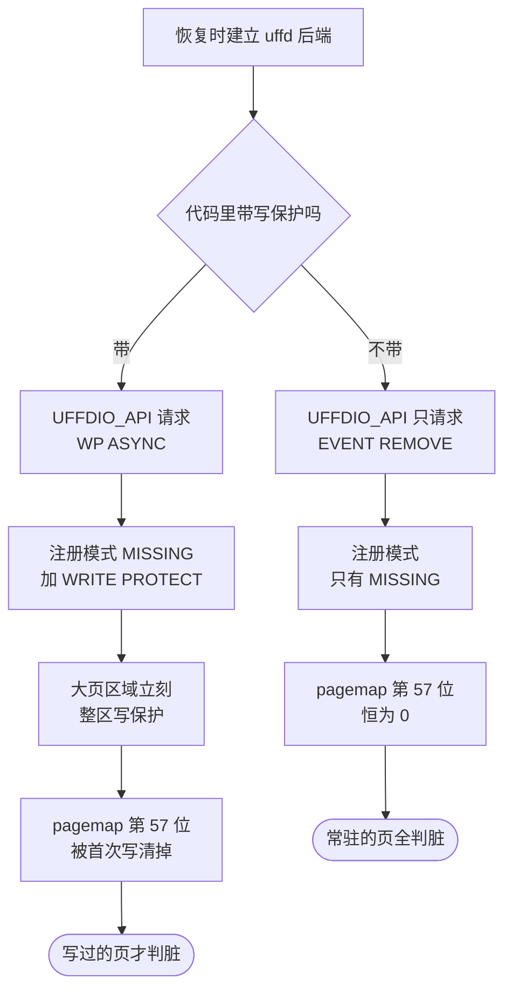

# 57 · 迁入的版本：54a1c1a 与被放弃的 uffd 写保护

> 把一份 Firecracker 分叉搬到另一个仓库、另一套架构上，第一件要说清的事是「搬的是哪一版」。
> ARM 适配版迁入的不是 e2b infra 当时钉的那个提交，而是它前面的一个。
> 这个选择让整套代码能在 aarch64 上跑起来，代价是脏页判据退化。本篇讲这个选择是什么、为什么成立、后果是什么。
>
> **读者**：要维护 ARM 适配版或要把它升级到新上游的工程师。
> **预备**：[第 39 篇 · userfaultfd 后端与缺页处理](39-uffd-backend.md)、[第 52 篇 · /memory/dirty](52-memory-dirty-api.md)、
> [第 53 篇 · uffd 写保护](53-uffd-write-protection.md)。
> **代码**：`src/vmm/src/persist.rs`、`src/vmm/src/lib.rs`、`src/vmm/src/utils/pagemap.rs`、`src/vmm/Cargo.toml`、`Cargo.lock`

---

## 0. 本篇要回答的问题

1. ARM 适配版的 `firecracker/` 目录是从哪个提交来的，怎么在没有 git 历史的情况下确认这一点？
2. 这个提交与 e2b infra 钉的默认版本之间差什么？差的那部分对 aarch64 意味着什么？
3. 如果把写保护那段代码原样带到 aarch64 上，会在哪一行、以什么错误失败？
4. 放弃写保护之后，`/memory/dirty` 还能用吗？它返回的位图变成了什么？
5. 同一个问题还有别的解法吗？各自的代价是什么？

---

## 1. 一份没有历史的拷贝

ARM 适配版不是一个 fork of fork。它把 e2b 分叉的整棵工作树复制进了 KASandbox 仓库的 `firecracker/` 目录，
作为该仓库的普通文件提交。这样做的好处是 Firecracker 与它的调用方在同一次提交里演进，
坏处是 `git log` 到此为止：从 KASandbox 一侧看不到任何上游或 e2b 的提交历史，
也就无法用 `git merge-base` 之类的手段回答「这是哪一版」。

回答这个问题只能靠比对文件内容。把 e2b 分叉在候选提交上的树导出来，
与**迁入那一次提交上**的 `firecracker/` 目录做一次递归比较（后来的改动会叠在上面，所以要拿迁入那一版比）：

```bash
git -C tmp/e2b-book-src/fc-e2b archive 54a1c1a | tar -x -C /tmp/fc54
diff -rq /tmp/fc54 <KASandbox>/firecracker
```

结果只有三处不同，而且都是「少了文件」而不是「内容不同」：
`src/vmm/src/test_utils/mock_resources/` 下的 `test_elf.bin`、`test_noisy_elf.bin`、`test_pe.bin`。
这三个是单元测试用的假内核映像，只被 `vstate/vcpu.rs` 与 `test_utils` 里的测试代码读取，
不参与任何产物的构建。**推论**：迁入时按扩展名过滤掉了二进制文件，
而不是有意删除；后果是这份拷贝的单元测试少了几个用例可跑，功能代码一字未动。

其余文件逐字节相同，因此可以确定：迁入的版本就是 e2b 分叉分支 `firecracker-v1.12-direct-mem` 的 `54a1c1a`。
后续的 ARM 构建修复（[第 58 篇](58-building-and-running-on-aarch64.md)）与
checkpoint / restore 扩展（[第 64 篇](64-checkpoint-extension-overview.md)）都叠加在这个基线上。

整目录拷贝这种迁入方式本身有代价，值得先说清楚，因为后面每一篇都在这个前提下讲。
代价有三层：第一，上游与 e2b 的后续提交不会自动流进来，每一次升级都是一次人工的重新拷贝加重新打补丁；
第二，本项目自己在这份代码上做的改动，从提交记录上看是 KASandbox 的改动，
要把它们与「继承来的部分」分开，只能靠与基线做 diff，这也是本书第十部分反复使用 diff 命令的原因；
第三，上游的开发工具链假设自己在 Firecracker 仓库根下运行，
迁入之后仓库根变成了 KASandbox，`tools/devtool` 这类脚本的路径假设需要额外注意
（[第 58 篇](58-building-and-running-on-aarch64.md)）。
换来的是一件实在的好处：部署脚本、orchestrator 与 VMM 三者的版本在一次提交里锁定，
不会出现「某个节点上的 Firecracker 与配置它的代码对不上」。

这套「靠内容比对确认版本」的做法值得记下来，因为它是可重复的：
以后要判断某个部署里的 Firecracker 源码对应哪一版，同样可以跑一遍 `diff -rq`，
而不是相信目录名或二进制里的版本串。Firecracker 的版本号只描述 API 契约，不描述分叉里加了什么，
这一点在[第 48 篇](48-release-and-compat-policy.md)里已经说过：能唯一标识一份分叉代码的只有提交哈希。

---

## 2. 54a1c1a 与 a41d3fb 之间的两个提交

e2b infra 在 2026.09 钉的默认版本是 `v1.12.1_a41d3fb`。从 `54a1c1a` 到 `a41d3fb` 只有两个提交：

| 提交 | 内容 | 对 aarch64 的意义 |
|---|---|---|
| `8fc760f61` | 在 guest 内存上启用 uffd 写保护 | 决定性的：这段代码在 aarch64 上会失败 |
| `a41d3fb53` | 删掉一个 CI 工作流文件 | 无 |

后一个提交删除的是 `.github/workflows/dependency_modification_check.yml` —— 一个禁止 pull request 改动
`Cargo.lock` 的检查。它之所以要删，正是因为前一个提交必须改 `Cargo.lock`。
这两个提交是一组，只是分了两次提交。

`8fc760f61` 改了四个地方：

- `src/vmm/Cargo.toml`：`userfaultfd` 依赖从 crates.io 的 `0.8.1` 换成 e2b 自己的 git 分叉，
  并打开 `linux5_7`、`linux5_13`、`linux6_7` 三个特性；
- `Cargo.lock`：随之出现 `userfaultfd 0.9.0` 与 `userfaultfd-sys 0.6.0` 两个 git 来源的条目；
- `src/vmm/src/persist.rs` 的 `guest_memory_from_uffd()`：三处实质改动，下一节展开；
- `src/vmm/src/lib.rs`：在 `get_dirty_memory()` 里加了一段注释，说明有了写保护事件之后
  其实可以不读 pagemap，暂时仍然读。

所以从源码看，54a1c1a 与 a41d3fb 的差别可以概括成一句话：**有没有 uffd 写保护**。
其它一切，包括三个内存查询端点、可选 memfile 的快照、seccomp 与构建脚本，两个提交完全一致。

---

## 3. 写保护这段代码在 aarch64 上会怎么失败

`guest_memory_from_uffd()` 是快照恢复时建立 uffd 后端的入口
（整条恢复路径见[第 38 篇 · 加载快照](38-snapshot-load.md)）。它在 `a41d3fb` 上依次做三件与写保护有关的事，
三件都依赖 arm64 内核没有实现的东西。

**第一件**是把 `FeatureFlags::WP_ASYNC` 加进 `UffdBuilder::require_features()`。
`require_features` 并不是一个本地检查：这些位会原样填进 `uffdio_api` 结构的 `features` 字段，
在 `create()` 里随 `UFFDIO_API` ioctl 交给内核。内核只要发现请求了自己不支持的特性位就返回 `EINVAL`，
于是 `create()` 报错，映射成 `GuestMemoryFromUffdError::Create`。
换句话说，失败发生在**建立 uffd 对象**这一步，比注册内存还早。

**第二件**是用 `RegisterMode::MISSING | RegisterMode::WRITE_PROTECT` 调 `register_with_mode()`。
`UFFDIO_REGISTER_MODE_WP` 在 arm64 内核里不存在，注册会失败，映射成 `GuestMemoryFromUffdError::Register`。

**第三件**只在大页配置下发生：对每个区域立刻调一次 `write_protect()`，即 `UFFDIO_WRITEPROTECT` ioctl。
arm64 同样没有这个 ioctl，失败映射成 `GuestMemoryFromUffdError::WriteProtect` ——
这个错误分支本身就是 `8fc760f61` 新加的。

三条路径中任何一条失败，都会让整次快照恢复失败。而 e2b 的运行模式里每一台沙箱都是从模板快照恢复出来的，
所以后果不是「某个功能不可用」，而是「一台 microVM 都起不来」。

回顾[第 53 篇 §6](53-uffd-write-protection.md#6-同一个分叉在另一个分支上把它关掉了)：
同一个分叉的 `firecracker-v1.12-direct-mem-arm64-uffd-fix` 分支（`136ef0e01`）
把上面这三处逐一用 `#[cfg(target_arch = "x86_64")]` 关掉，理由与本节列出的失败点一一对应。
那一篇给出了三处 cfg 的完整清单，这里不重复，只把它作为对照放进下表。

三个版本在这件事上的形态可以并排看：

| 维度 | e2b 定制版 a41d3fb | 分叉的 arm64-uffd-fix 分支 | ARM 适配版（54a1c1a） |
|---|---|---|---|
| `require_features` | 加 `MISSING_HUGETLBFS`、`WP_ASYNC` | 按架构二选一 | 只有 `EVENT_REMOVE` |
| 注册模式 | `MISSING` + `WRITE_PROTECT` | 按架构二选一 | `MISSING`（走 `register()`） |
| 大页整区写保护 | 有 | 仅 x86_64 | 无 |
| `userfaultfd` 依赖 | e2b 的 git 分叉 0.9.0 | 同左 | crates.io 的 0.8.1 |
| x86_64 上的行为 | 有写保护 | 有写保护 | 无写保护 |

两条 aarch64 可行路线的差别只在「x86_64 上还保不保留写保护」。
选旧提交等于把这份代码变成单架构专用；加 `cfg` 门则保留了两架构共用一份源码的可能。
ARM 适配版选了前者。**推论**：迁入时选 54a1c1a 更可能是因为它是分支上最后一个不带写保护的提交，
恰好可用，而不是在两条路线之间做过比较；无论动机如何，结果与打 `cfg` 门在 aarch64 上是等价的。

下图把两条注册路径画在一起。左支是带写保护的版本在 x86_64 上走通时的样子，
在 aarch64 上它止步于第一个方框；右支是 ARM 适配版实际走的。



---

## 4. 后果：脏页判据退化成常驻判据

`/memory/dirty` 的判据在 `src/vmm/src/utils/pagemap.rs` 的 `PagemapEntry` 上，
只有一行：`entry.is_present() && !entry.is_write_protected()`。
第 63 位是 present，第 57 位是「被 userfaultfd 写保护」。
判据成立的前提是**每一页在恢复之初都是写保护的**，这样「不再写保护」才等价于「被写过」
（[第 52 篇](52-memory-dirty-api.md)）。

在 ARM 适配版上这个前提不成立：没有任何一页被写保护过，第 57 位在整个生命周期里恒为 0，
于是判据退化成 `is_present()`。`Vmm::get_dirty_memory()` 又先用 `mincore()` 过滤出常驻页才去读 pagemap，
两层叠加的结果是：**返回的位图等于常驻位图**，也就是 `GET /memory` 已经给出的那张 `resident` 图。

这个退化的方向是安全的。判据的错误有两种：漏记一个被写过的页，恢复时读到旧内容，是静默的数据损坏；
多记一个没写过的页，只是让导出量变大。这里发生的是后者。
所以 ARM 单机版上的暂停仍然能产出正确的快照，只是每次导出的量从「工作集里被改写的部分」放大到「整个工作集」。
uffd 恢复的 microVM 里大部分页从未被触碰过，这层过滤仍然有效，
所以放大的幅度取决于 guest 读了多少内存，而不取决于配置的内存大小。

调用方没有为此改过代码：ARM 一侧的 orchestrator 与上游一样，
在暂停后调 `/memory/dirty` 取差分元数据（`internal/sandbox/uffd/uffd.go` 的 `Uffd.DiffMetadata()`
转发到 `fc/memory.go` 的 `Process.DirtyMemory()`）。
接口不变、语义变宽，这是一处需要读代码才能发现的差异，单看 API 文档看不出来。

还有一个连带问题与写保护无关但同在这条路上：`/memory/dirty` 每页要发一次 `pread`，
而 aarch64 的 seccomp 表在 e2b 定制版里没有放行 `pread64`，第一次调用就会被过滤器杀掉。
补这条规则是 ARM 适配版做的另一件事，见[第 62 篇 · aarch64 的 seccomp 过滤器](62-aarch64-seccomp-filter.md)。
两件事合起来才让这个端点在 aarch64 上真正可用。

要在一台机器上确认自己手里的 Firecracker 属于哪一边，不必读源码：
`GET /memory/dirty` 与 `GET /memory` 在同一时刻取两张位图，
如果脏页位图与常驻位图完全相同，说明写保护没有生效。
这个检查对 x86_64 上误用了不带写保护的构建同样有效 —— 那种情况下判据也会退化，
而 API 不会报任何错，只会安静地多导出数据。
判据退化没有错误码、没有日志、没有 metrics，这是它最需要被写进文档的地方。

判据退化正是后来引入硬件脏页跟踪的动机之一：既然软件写保护这条路在这块硬件上走不通，
就换用处理器自己维护的脏页结构来拿到精确的脏页集合，
见[第 65 篇 · 脏页跟踪后端](65-dirty-tracking-backend.md)与[第 66 篇 · HDBSS](66-hdbss.md)。

---

## 5. 依赖回到上游 crate

`8fc760f61` 之所以要换 `userfaultfd` crate，是因为 crates.io 上的 `0.8.1` 没有暴露带模式的注册与
`UFFDIO_WRITEPROTECT`。不带那个提交，`src/vmm/Cargo.toml` 里就还是一行普通的 `userfaultfd = "0.8.1"`，
`Cargo.lock` 里也只有一份来自 crates.io 的 `userfaultfd` 与 `userfaultfd-sys`。

这件事有两面。一面是收益：构建时不需要访问那个 git 分叉，
`cargo` 不必用 `git-fetch-with-cli` 去拉一个第三方仓库的特定分支，
锁文件里也不再有指向某个分支头的 git 来源 —— git 依赖在 `Cargo.lock` 里记的是一个提交哈希，
但那个分支一旦被强推或删除，构建就不可复现。在一个需要离线构建、交付 RPM 的部署里（[第 63 篇](63-integration-with-e2b-infra.md)），
少一个外部 git 依赖是实打实的简化。

另一面是代价：这条路走下去，ARM 适配版与 e2b 分叉的主线永久分开了。
以后要把 e2b 的新改动合进来，`8fc760f61` 这个提交必须单独处理 —— 要么按 `136ef0e01` 的方式加 `cfg` 门，
要么继续挑不带它的提交。这属于升级时必须重放的改动清单，
全书的差异总表（[第 78 篇](78-layer-diff-tables.md)）把这类条目集中列出。

升级的另一面是能顺带拿到的修复。上游 v1.14.0 给 aarch64 的 virtio-mmio 设备树节点加了
`dma-coherent` 属性，修的是非 FWB 平台上的缓存一致性问题（[第 48 篇](48-release-and-compat-policy.md)）。
这一条直接关系 ARM 适配版的正确性，而 v1.12.1 这条线上没有它 ——
判断要不要跟进上游版本时，这类修复与上面那份重放清单要一起算。

需要说明的是，两个版本都要用 `bindgen` 编译 `userfaultfd-sys`，
所以「回到上游 crate」并没有省掉构建环境对内核头文件与 clang 的依赖，省掉的只是网络上的那个分支。

---

## 6. 小结

- 迁入的是 e2b 分叉的 `54a1c1a`，与工作树逐文件比对可确认，差别只有三个不参与构建的测试用二进制文件。
- `54a1c1a` 到 e2b infra 钉的 `a41d3fb` 之间只有两个提交，源码上的唯一实质差别是有没有 uffd 写保护。
- arm64 内核不实现 uffd 写保护，带写保护的代码在建立 uffd 对象时就会被 `UFFDIO_API` 以 `EINVAL` 拒绝，
  失败路径落在 `GuestMemoryFromUffdError::Create`，后果是快照恢复整体失败。
- 选择不带写保护的提交，与用 `cfg(target_arch = "x86_64")` 关掉三处写保护代码，在 aarch64 上等价；
  差别只在 x86_64 上还保不保留这项能力。
- 没有写保护，pagemap 第 57 位恒为 0，`/memory/dirty` 的判据退化为「常驻即脏」，
  返回的位图等于 `GET /memory` 的常驻位图。
- 判据退化的方向是多记而非漏记，因此不影响快照正确性，只让每次导出的数据量变大。
- 调用方代码没有因此改动，接口不变而语义变宽，这类差异只能从代码里读出来。
- 依赖回到 crates.io 的 `userfaultfd 0.8.1`，构建少一个外部 git 来源，代价是与分叉主线分开、升级时要重放。

---

## 延伸阅读 / 下一篇

- [第 53 篇 · uffd 写保护](53-uffd-write-protection.md)：被放弃的那个提交本身讲了什么。
- [第 52 篇 · /memory/dirty](52-memory-dirty-api.md)：本篇说的「判据」在 x86_64 上是怎么成立的。
- [第 39 篇 · userfaultfd 后端与缺页处理](39-uffd-backend.md)：`MISSING` 模式注册与握手的全过程。
- [下一篇：第 58 篇 · 在 aarch64 上构建与运行](58-building-and-running-on-aarch64.md)。
- [第 65 篇 · 脏页跟踪后端](65-dirty-tracking-backend.md)：替代写保护的那条路。
- Linux 内核文档 `admin-guide/mm/userfaultfd` 的 write-protect 一节给出了 `WP_ASYNC` 与
  `UFFDIO_WRITEPROTECT` 的语义与内核版本要求。
- 调用方一侧怎么使用这张位图，见 [e2b 手册第 37 篇](../e2b-infra/37-pause-and-snapshot.md)。
