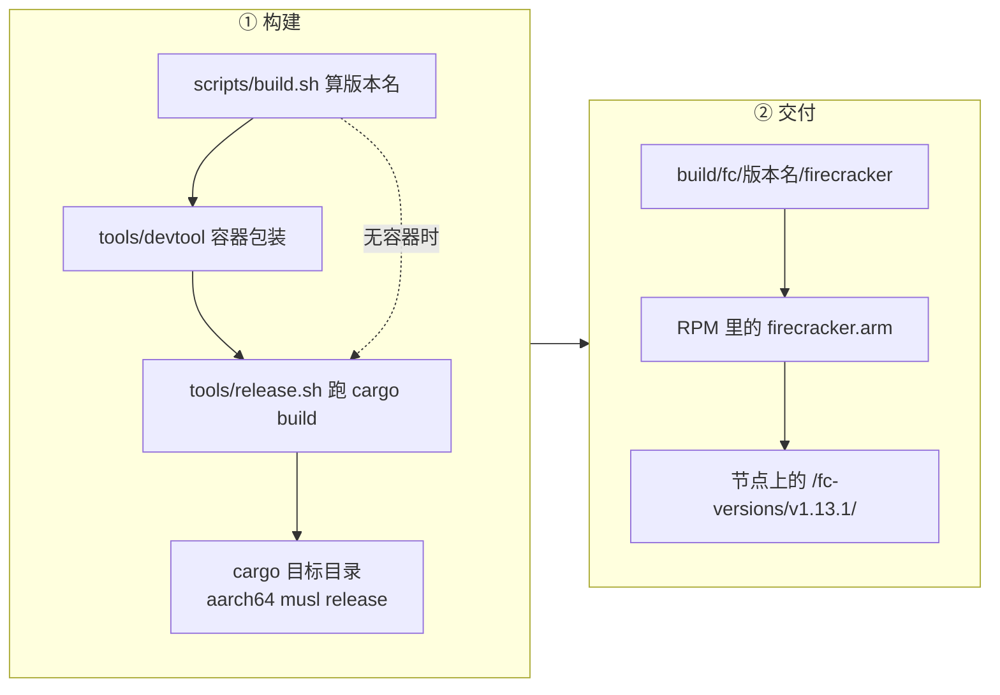

# 58 · 在 aarch64 上构建与运行

> 上游 Firecracker 一直支持 aarch64，但 e2b 的分叉只在 x86_64 上构建、测试和发布过。
> 把它搬到鲲鹏 / openEuler 上需要改的东西不多 —— 两个文件、三十来行 —— 但每一处都说明了
> 一条被 x86_64 隐含满足的假设。本篇讲这条构建链在 aarch64 上哪里断、怎么接上，以及运行起来需要宿主提供什么。
>
> **读者**：要在 ARM 机器上构建、部署或排查 Firecracker 的工程师与运维。
> **预备**：[第 06 篇 · 构建、运行与调试](06-build-run-debug.md)、[第 57 篇 · 迁入的版本](57-which-fork-commit-and-uffd-wp.md)。
> **代码**：`scripts/build.sh`、`tools/devtool`、`tools/release.sh`、`src/firecracker/src/main.rs`、
> `rust-toolchain.toml`、`.cargo/config.toml`

---

## 0. 本篇要回答的问题

1. 从 `scripts/build.sh` 到最终那个静态二进制，架构是在哪一层决定的？哪一层写死了 x86_64？
2. 在 aarch64 上还能用上游那套容器化开发工具吗？不能用时的退路是什么？
3. 为什么 aarch64 上跑不了上游的集成测试层？这留下了什么验证缺口？
4. `resize_fdtable()` 做什么，为什么在这个部署里被整段注释掉，代价是什么？
5. 构建出来的二进制怎么进到目标机器的 `/fc-versions/` 下？
6. 一台机器要满足什么条件，这个二进制才跑得起来？

---

## 1. 一条为单一架构写的构建链

Firecracker 的构建有三层，每一层都可以单独运行：

| 层 | 文件 | 职责 | 架构从哪来 |
|---|---|---|---|
| 分叉入口 | `scripts/build.sh` | 算版本名、调下一层、把产物拷到 `build/fc/<版本名>/` | 拷贝时写死 `x86_64` |
| 容器包装 | `tools/devtool` | 拉起开发容器，在容器里跑下一层，事后修文件属主 | `uname -m` |
| 真正的构建 | `tools/release.sh` | `cargo build --target <arch>-unknown-linux-musl`、strip、静态链接检查 | `uname -m` |

上游自己的两层（`devtool` 与 `release.sh`）从一开始就是架构中立的：
`release.sh` 用 `ARCH=$(uname -m)` 拼出 `CARGO_TARGET=$ARCH-unknown-linux-$LIBC`，
产物落在 `build/cargo_target/$CARGO_TARGET/$PROFILE_DIR/`（`target-dir` 由 `.cargo/config.toml` 指定）。
`rust-toolchain.toml` 里同时声明了 `x86_64-unknown-linux-musl` 与 `aarch64-unknown-linux-musl` 两个目标，
所以工具链一侧也不需要任何改动。

断点只在最上面那一层。e2b 加的 `scripts/build.sh` 做完构建之后要把二进制拷到一个按版本名命名的目录里，
这一行的源路径是写死的：

```bash
cp ./build/cargo_target/x86_64-unknown-linux-musl/release/firecracker "./build/fc/${version_name}/firecracker"
```

在 aarch64 上这条 `cp` 找不到文件，脚本以 `set -e` 退出。
注意此时**编译其实已经成功了**：`cargo` 早就把 aarch64 的二进制放在了正确的位置，
失败的只是搬运。这类「构建本身是中立的，只有脚本里的路径不是」的问题，
在移植工作里占的比例往往比想象中高。

ARM 适配版的修法是把那一行的架构换成运行时算出来的值：

```bash
arch=$(uname -m)
target="${arch}-unknown-linux-musl"
cp "./build/cargo_target/${target}/release/firecracker" "./build/fc/${version_name}/firecracker"
```

e2b 分叉自己的 `firecracker-v1.12-direct-mem-arm64-uffd-fix` 分支也改了同一行，
写法略有不同：它显式列出 `x86_64` 与 `aarch64|arm64` 两种情况，遇到别的架构就报错退出。
两种写法的差别只在遇到意外架构时是早失败还是晚失败。

版本名的算法两边一致：从 `src/firecracker/swagger/firecracker.yaml` 里读出 API 版本，
再接上七位提交哈希，得到 `v1.12.1_<hash>` 这样的串。在 KASandbox 里这个哈希是 KASandbox 的提交哈希，
不是 e2b 分叉的 —— 版本串的前半段描述 API 契约，后半段只在生成它的那个仓库里有意义。

---

## 2. 容器这一环在 aarch64 上的处境

`tools/devtool` 把所有构建动作放进一个固定标签的开发容器里：`public.ecr.aws/firecracker/fcuvm:v79`。
它不做任何架构判断，直接 `docker pull` 这个名字；容器的 Dockerfile 接受一个 `ARCH` 构建参数，
用它决定装哪个 Python seccomp 扩展、哪个交叉编译工具链软链接、哪个 codecov 上传器。
**推论**：这个标签在镜像仓库里是一个多架构清单，Docker 会按宿主架构选对应的那一份；
本书写作环境无法访问该镜像仓库，这一点没有直接验证过。

即使镜像可用，容器这条路在目标环境里也不一定走得通：它要求宿主有可用的 Docker、
要求构建时能访问公网镜像仓库，而交付形态是离线安装的 RPM。
所以实际可用的退路有两条，都不需要容器：

- 直接跑 `tools/release.sh --libc musl --profile release`。它是 `devtool build` 在容器里实际执行的那条命令，
  本身没有任何容器依赖，只要宿主上有对应版本的 Rust 工具链。
- 更低一层，直接 `cargo build --release --target aarch64-unknown-linux-musl --workspace --bins`。
  这样会跳过 strip、静态链接检查与产物校验，但产物是同一个。

不用容器就要自己在宿主上备齐工具链，清单不长但每一项都是硬性的：
`rust-toolchain.toml` 钉的 Rust 1.85.0 与 `aarch64-unknown-linux-musl` 目标；
musl 的 C 库与头文件（`cargo` 链接静态二进制时要用）；
以及 `clang` 和内核 UAPI 头文件 —— `userfaultfd-sys` 用 `bindgen` 在构建时现场生成
`userfaultfd.h` 的绑定，缺了会在依赖编译阶段失败。
`profile.release` 打开了 `lto = true` 与 `codegen-units=1`，构建时间与内存占用都不低，
这在核多但单核性能一般的服务器上比较明显。

产物的形态两架构略有差别，`release.sh` 的最后一步会检查：
x86_64 期望 `static-pie linked`，aarch64 期望 `statically linked`，两者都不允许动态链接。
这条检查的存在说明静态链接是这个项目的硬要求 —— 目标机器上不保证有任何共享库。



---

## 3. 测试层在 aarch64 上只剩一半

Firecracker 的测试分两层：`cargo test` 的单元测试，和 `tests/` 下用 pytest 写的集成测试
（[第 47 篇 · 测试](47-testing.md)）。在 aarch64 的这套环境里，只有第一层可用。

pytest 那一层的入口是 `devtool test`，它在跑之前要满足四个前置条件，逐条看：

1. `ensure_kvm`：检查 `/dev/kvm`。这条在目标机器上没问题。
2. `ensure_devctr`：拉起开发容器。没有容器就到此为止。
3. `ensure_ci_artifacts`：要求宿主装了 AWS CLI，从 `s3://spec.ccfc.min/firecracker-ci/v<版本>/$(uname -m)`
   同步 guest 内核与 rootfs 等制品。离线环境拿不到。
4. `cmd_build --release`：再构建一次，绕回上一节的问题。

即便这些都绕过去，容器内跑的 `tools/test.sh` 还带着若干宿主假设：
它要把 Docker 创建的 cgroup 转成可嵌套的形态（给 `test_jail.py` 用），
而本项目的部署根本不用 jailer（[第 43 篇 · jailer](43-jailer.md)）；
`devtool` 在打印环境信息时会执行 `rpm -q microcode_ctl amd-ucode-firmware linux-firmware`，
这三个包名只在 x86 上存在。

结论是清楚的：**aarch64 上的验证只有单元测试加端到端手工验证两级，中间那一层是空的。**
而单元测试本身也缺了几个用例 —— 迁入时丢掉的三个 mock 内核映像正是它们的输入
（[第 57 篇 §1](57-which-fork-commit-and-uffd-wp.md#1-一份没有历史的拷贝)）。
这个缺口对后面几篇有直接影响：checkpoint / restore 扩展加的每一个端点都没有 pytest 覆盖，
它们的正确性依据是端到端跑一遍真实沙箱的生命周期。写新代码时要把这一点记在心里：
没有集成测试网兜着，回归只会在生产路径上暴露。

---

## 4. 被注释掉的 `resize_fdtable()`

`src/firecracker/src/main.rs` 里有一个函数叫 `resize_fdtable()`，在注册信号处理器之后、
启动 VMM 之前调用一次。它做的事只有一步：把进程的 fd 表一次性撑到 `RLIMIT_NOFILE` 的软限
（没有设限时用 2048，也就是 jailer 通常会设的值），办法是 `dup2(0, limit - 1)` 再立刻 `close()`。

为什么要这么做，上游的注释写得很直白：内核给新进程的 fd 表默认只有 64 项，
装不下就成倍重分配；而一台配置齐全的 microVM 光是设备用的 eventfd 与 timerfd 就远超 64 个，
在这些 fd 已经注册进 epoll 的时候重分配 fd 表，会落在快照恢复这条延迟敏感的路径上。
上游的注释给出了这个开销的量级，本书不转述具体数字；要点是它足够大到值得专门写一个函数规避。

ARM 适配版把这段调用整段注释掉了，函数体保留在文件里。
提交信息记录的现象是 openEuler 24.03 上 Firecracker 进程 coredump。
**推论**：从代码看，唯一可能与环境相关的是 `RLIMIT_NOFILE` 的取值 ——
如果该环境把软限设得极大（而不是无限，无限会被代码换成 2048），
`dup2` 的目标 fd 号就极大，内核要为此分配一张巨大的 fd 表。
提交信息只记了现象、没有记机理，上面这条推测没有在本书写作环境里复现过；
真要定位，需要在该内核上单独跑一次并看 core 文件。

代价有三块，都可以直接说清：

- **收益的丧失**：快照恢复路径上 fd 表按需增长的开销回来了。这条路径正是 e2b 的沙箱创建路径，
  每创建一台沙箱都要走一次。
- **注释而不是删除**带来的连带后果：`resize_fdtable()` 与 `MainError::ResizeFdtable`
  从此没有调用方、没有构造点，`debug!` 的导入也随之不再被使用，
  构建时会多出几条 `dead_code` / `unused_imports` 警告。这是一处明确的技术债：
  下一个读这份代码的人会先看到警告，再去找为什么。
- **可配置性为零**：这不是一个开关，是一段被注释的代码。要在别的环境里恢复这项优化，
  只能改源码重编。用 `#[cfg]` 或一个环境变量都比注释掉更可取。

有一个不改代码的替代方案值得记下：这段逻辑的输入只有 `RLIMIT_NOFILE`，
所以在启动脚本里用 `ulimit -n` 把软限压到一个合理值（例如 jailer 默认的 2048），
既能让 `dup2` 的目标 fd 号落在正常范围，又能保住预扩 fd 表的收益。
**推论**：这条路本书没有在目标机器上验证过。

---

## 5. 产物怎么到目标机器上

构建出来的二进制不走 e2b 的对象存储通道（`scripts/upload.sh` 那条路，见[第 55 篇](55-seccomp-build-upload-and-upstream-fixes.md)），
而是随单机离线版的 RPM 一起交付。链条是：

- `e2b-infra.spec` 把二进制作为 `Source8: firecracker.arm` 收进包，
  并且只在 `%ifarch aarch64` 时安装到 `/opt/e2b-infra/bin/firecracker`（x86_64 的包不含它）；
- 节点初始化脚本 `e2b-deploy/dep/init-client.sh` 把它拷到 `/fc-versions/v1.13.1/firecracker` 并置可执行位；
- orchestrator 按 `/fc-versions/<版本>/firecracker` 寻址启动。

两处细节值得注意。一是拷贝前先 `rm -f` 目标文件：直接覆盖一个正在被运行中的 Firecracker 进程映射的文件会得到
`ETXTBSY`，先删再写可以绕开（旧的 inode 由运行中的进程继续持有）。
二是目录名 `v1.13.1` 与源码的 1.12.1 对不上 —— 这是部署侧的版本号，与二进制自报的版本无关，
来龙去脉在[第 63 篇 · 与 e2b infra 的对接](63-integration-with-e2b-infra.md)。

---

## 6. 跑起来需要宿主提供什么

Firecracker 在 aarch64 上对宿主的要求比 x86_64 少一些，因为它不需要 ACPI、不需要 irqchip 那一套。
按启动顺序，检查项是：

- **`/dev/kvm` 可读写**。部署不使用 jailer，Firecracker 以 orchestrator 给的身份直接运行，
  由 `ip netns exec` 放进网络命名空间（`fc/script_builder.go`）。
  这意味着 jailer 通常提供的 chroot、cgroup 与 uid 隔离在这里都不存在，
  安全边界由部署侧另行提供（[第 43 篇](43-jailer.md)）。
- **七项 KVM 能力**。`src/vmm/src/arch/aarch64/kvm.rs` 的 `DEFAULT_CAPABILITIES` 列出
  `KVM_CAP_IOEVENTFD`、`KVM_CAP_IRQFD`、`KVM_CAP_USER_MEMORY`、`KVM_CAP_ARM_PSCI_0_2`、
  `KVM_CAP_DEVICE_CTRL`、`KVM_CAP_MP_STATE`、`KVM_CAP_ONE_REG`，缺一样就在启动时报错。
  对照之下 x86_64 要求十四项，多出来的都是 irqchip、PIT、CPUID、XSAVE 这类 x86 专有的东西。
- **`KVM_ARM_PREFERRED_TARGET`**。vCPU 的类型不由 Firecracker 挑，而是问宿主内核要
  （`arch/aarch64/vcpu.rs`，[第 18 篇](18-aarch64-vcpu.md)）。宿主换代会换出不同的目标类型，
  这也是快照不能跨机型恢复的根源之一。
- **GIC**。`arch/aarch64/gic/mod.rs` 的 `create_gic()` 在不指定版本时先试 GICv3，失败再退 GICv2；
  用户不能选。GIC 必须在 vCPU 创建之后建立（[第 19 篇 §3](19-aarch64-platform.md#3-gic创建时机与版本回退)）。
- **可选能力 `KVM_CAP_COUNTER_OFFSET`**。有它才复位 guest 的物理计数器，细节在[第 59 篇](59-aarch64-vs-x86-64-runtime-paths.md)。
- **宿主页大小**。Firecracker 不假设宿主页是 4 KiB：`src/vmm/src/arch/mod.rs` 的 `host_page_size()`
  用 `sysconf(_SC_PAGESIZE)` 取值并缓存，`main.rs` 在启动最早期就调一次把它预热。
  依赖它的地方有三处：`mincore` 位图的折算、pagemap 条目的偏移计算、以及 virtio 的 `IovDeque`
  按整页分配环形缓冲。guest 侧的页大小是另一件事，`GUEST_PAGE_SIZE` 是写死的 4096。
  宿主内核用 64 KiB 页时这些代码仍然成立，但 `mincore` 与 pagemap 的粒度随之变粗，
  脏页与常驻页的判定精度下降 —— 这属于宿主环境的选择，见[第 60 篇](60-kunpeng-openeuler-host.md)。
- **seccomp 过滤器**。orchestrator 的启动命令里没有 `--seccomp-filter` 也没有 `--no-seccomp`，
  所以生效的是编译进二进制的默认过滤器，即 `resources/seccomp/aarch64-unknown-linux-musl.json` 编出来的那份。
  它与 x86 表的差别，以及 ARM 适配版往里补的规则，在[第 62 篇](62-aarch64-seccomp-filter.md)。

---

## 7. 小结

- 构建链上真正与架构有关的只有一行拷贝路径；`devtool` 与 `release.sh` 本来就按 `uname -m` 工作，
  工具链文件里两个 musl 目标也都在。
- 修法是用 `uname -m` 拼出 target 三元组；分叉的另一个分支用显式 case 分支做了同一件事。
- 容器化开发工具在离线的 aarch64 环境里不实用，退路是直接调 `tools/release.sh` 或 `cargo build`，
  代价是要自己备齐 Rust 1.85.0、musl 与 `bindgen` 依赖的 clang 与内核头文件。
- pytest 集成测试层在这套环境里跑不起来，卡在容器、S3 制品与若干 x86 专有的宿主假设上；
  验证只剩单元测试与端到端手工验证两级，后面几篇加的新端点都没有集成测试覆盖。
- `resize_fdtable()` 被整段注释掉，原因记录为在该发行版上导致进程异常终止，机理未记录；
  后果是恢复路径重新承担 fd 表增长的开销，外加几条编译警告与一处不可配置的技术债。
- 二进制随 RPM 交付，只在 aarch64 包里，落到 `/fc-versions/v1.13.1/`；拷贝前先删是为了避开 `ETXTBSY`。
- 运行只需要 `/dev/kvm`、七项 KVM 能力、可用的 GIC 与宿主内核报出的首选 vCPU 类型；
  不用 jailer，隔离由部署侧提供。
- 宿主页大小不写死，但 64 KiB 页会让常驻与脏页判定的粒度变粗。

---

## 延伸阅读 / 下一篇

- [第 06 篇 · 构建、运行与调试](06-build-run-debug.md)：上游那套工具链的完整说明。
- [第 46 篇 · 代码组织与构建](46-code-organization-and-build.md)：workspace、profile 与目标三元组。
- [下一篇：第 59 篇 · aarch64 与 x86_64 运行路径的差异清单](59-aarch64-vs-x86-64-runtime-paths.md)。
- [第 60 篇 · 鲲鹏 950 与 openEuler 宿主环境](60-kunpeng-openeuler-host.md)：宿主一侧的能力与页大小。
- [第 63 篇 · 与 e2b infra 的对接](63-integration-with-e2b-infra.md)：版本目录与启动命令行。
- 上游文档 `docs/getting-started.md` 给出了在没有 devtool 的机器上构建的官方说明。
