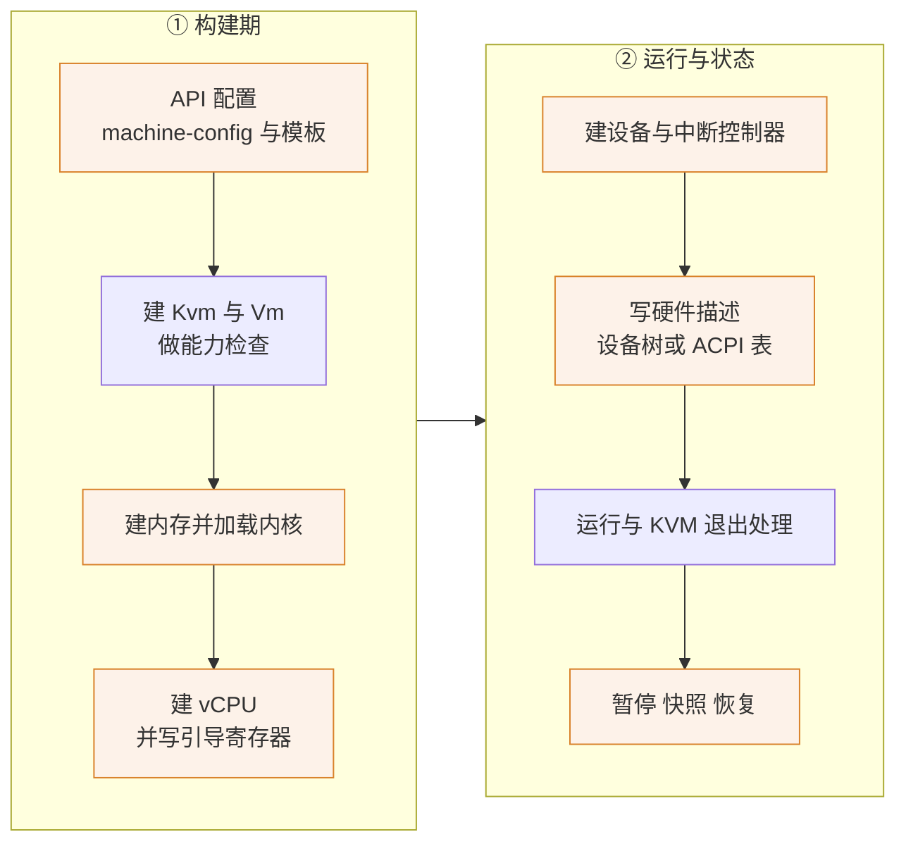

# 59 · aarch64 与 x86_64 运行路径的差异清单

> 前面几部分讲上游时，两套架构的实现是分开讲的：x86_64 在第 16、17 篇，aarch64 在第 18、19 篇。
> 这一篇把它们合起来，按一台 microVM 的生命周期逐阶段列出两者走的不同代码。
> 它是一张索引：读到某个阶段行为不一致时，从这里找到分叉点在哪个文件、哪个函数。
>
> **读者**：读过第三部分、要在 aarch64 上排查问题或移植改动的工程师。
> **预备**：[第 18 篇 · aarch64 vCPU](18-aarch64-vcpu.md)、[第 19 篇 · aarch64 平台](19-aarch64-platform.md)、
> [第 16 篇 · x86_64 vCPU](16-x86-64-vcpu.md)、[第 17 篇 · x86_64 平台](17-x86-64-platform.md)。
> **代码**：`src/vmm/src/arch/`、`src/vmm/src/builder.rs`、`src/vmm/src/vstate/vcpu.rs`、
> `src/vmm/src/device_manager/`、`src/vmm/src/persist.rs`、`resources/seccomp/`

---

## 0. 本篇要回答的问题

1. 架构分叉在代码里有几种形态？哪些地方是两套实现，哪些地方只是一个分支？
2. 一台 microVM 从配置到退出，每个阶段两套架构各走哪段代码？
3. 哪些 API 行为在 aarch64 上直接不可用，返回什么？
4. 上游文档明确写出的 aarch64 限制有哪些？
5. e2b 定制版与 ARM 适配版分别落在这张清单的哪些格子上？

---

## 1. 分叉的两种形态

Firecracker 的架构相关代码集中在 `src/vmm/src/arch/` 下的两棵子树：`x86_64/` 与 `aarch64/`。
`arch/mod.rs` 用 `cfg` 把其中一棵 `pub use` 出来，于是上层代码写 `crate::arch::load_kernel()`
就能拿到当前架构的那一份。这是**第一种形态**：同名不同实现，调用方不感知。
`cpu_config/` 与 `gdb/arch/` 也是这个模式。

**第二种形态**是散落在通用代码里的 `#[cfg(target_arch = …)]`，它们代表「这一步只有一套架构需要做」
或者「两套架构在同一个函数里走不同的分支」。这类分叉在 `src/vmm/src` 下按文件统计，
出现最多的是 `device_manager/mmio.rs` 与 `builder.rs`（各七处）、`persist.rs` 与 `devices/bus.rs`（各六处）、
`device_manager/persist.rs`（六处）、`vstate/vcpu.rs` 与 `lib.rs`（各四处）。
这个分布本身有信息量：分叉集中在**构建**、**设备管理**与**快照**三处，
而不是在数据面。virtio 队列、block、net、vsock 的实现里一条架构分支都没有 ——
数据面完全架构无关，这是 virtio-mmio 抽象带来的直接好处。

一个例外值得单独指出：`I8042Device` 这个类型在两套架构上都会被编译
（`devices/legacy/mod.rs` 的 `mod i8042;` 没有 `cfg`），它也是 `BusDevice` 枚举的一个变体。
只是在 aarch64 上没有任何代码构造它 —— 唯一的构造点在 x86_64 专有的 `PortIODeviceManager` 里。
同理，`ACPIDeviceManager` 两套架构都有，只是 aarch64 上它的 `Aml` 实现没有使用者
（[第 19 篇](19-aarch64-platform.md)）。读代码时不要把「类型存在」当成「功能存在」。

下图标出生命周期上哪些阶段有架构分叉，橙色的是两架构行为不同的阶段。

只有「建 Kvm 与 Vm」与「运行」两个阶段是几乎共用的，而它们各自也有一处小分叉，见下文。

---

## 2. 逐阶段的对照

### 2.1 配置阶段

| 项 | x86_64 | aarch64 | 代码 |
|---|---|---|---|
| SMT | 可配置，`vcpu_count` 需为偶数 | 一律拒绝，返回 `SmtNotSupported` | `vmm_config/machine_config.rs` |
| 静态 CPU 模板 | `C3`、`T2`、`T2S`、`T2CL`、`T2A` | 只有 `V1N1` | `cpu_config/*/static_cpu_templates` |
| 自定义模板内容 | CPUID 与 MSR 修改器 | ARM 寄存器修改器、vCPU 特性 | `cpu_config/templates.rs` |
| `SendCtrlAltDel` | 转成 `VmmAction::SendCtrlAltDel` | 直接返回 400 与说明文本 | `api_server/request/actions.rs` |

`SendCtrlAltDel` 这一条是全书唯一一个在 API 层就按架构拒绝的端点。
拒绝发生在请求解析阶段，不进 VMM 线程，所以它是一个纯粹的 400，不影响 microVM 状态。

### 2.2 KVM 与 Vm 的建立

两架构都走 `Kvm::new()`，差别在 `DEFAULT_CAPABILITIES` 常量：x86_64 要求十四项，aarch64 要求七项。
多出来的七项全是 x86 专有的设施 —— `KVM_CAP_IRQCHIP`、`KVM_CAP_PIT2`、`KVM_CAP_PIT_STATE2`、
`KVM_CAP_ADJUST_CLOCK`、`KVM_CAP_SET_TSS_ADDR`、`KVM_CAP_DEBUGREGS`、`KVM_CAP_XSAVE` 等。
aarch64 这边独有的是 `KVM_CAP_ARM_PSCI_0_2` 与 `KVM_CAP_DEVICE_CTRL`，
后者是创建 GIC 所必需的（GIC 走 KVM 的设备控制接口，不是专门的 ioctl）。

aarch64 还多一个**可选**能力的探测：`Kvm::optional_capabilities()` 检查 `KVM_CAP_COUNTER_OFFSET`，
结果放进一个 `OptionalCapabilities` 结构往下传。它在 2.4 节起作用。
x86_64 一侧没有对应结构，但 `init_arch()` 要做两件 aarch64 不做的事：
申请动态 XSTATE 特性、取一份 `KVM_GET_SUPPORTED_CPUID` 存起来备用。

### 2.3 内存布局与内核加载

| 项 | x86_64 | aarch64 |
|---|---|---|
| DRAM 起点 | 0（低端） | 2 GiB（`DRAM_MEM_START`） |
| DRAM 分段 | 大内存时分两段，中间让出 MMIO 空洞 | 恒为一段 |
| MMIO 窗口 | 4 GiB 以下的高端 768 MiB | 1 GiB 到 2 GiB（`MAPPED_IO_START` 到 DRAM 起点） |
| GSI 范围 | 5 – 23（19 个） | 32 – 128（97 个，即 GIC 的 SPI 号） |
| 内核格式 | ELF（`linux_loader` 的 `Elf`） | PE（`linux_loader` 的 `PE`） |
| 引导协议 | 探测到 PVH 记录就用 PVH，否则 Linux boot | 只有 Linux boot |
| 硬件描述 | mptable + ACPI 表，写进 guest 内存固定区 | 设备树，写在 guest 内存末尾 2 MiB |

GSI 范围的差别有一个实际后果：x86_64 上能挂的设备数被中断号卡在二十个以内，
而 aarch64 的瓶颈不在中断号 —— 上游文档记录的限制是超过 64 个设备后只有前 64 个可用。
本书不展开这个限制的成因，需要时见上游 `docs/device-api.md` 与它引用的 issue。

内核格式的差别对部署是可见的：aarch64 上 Firecracker 要的是 PE 格式的 `Image`，
不是 ELF 的 `vmlinux`；内核构建产物选错了会在加载阶段直接失败（[第 61 篇](61-guest-kernel-on-arm.md)）。

### 2.4 vCPU 的创建与配置

x86_64 的 vCPU 建好就能用；aarch64 的 vCPU 在 `KVM_ARM_VCPU_INIT` 之前任何寄存器操作都会失败，
而 `VCPU_INIT` 需要的目标类型来自 `KVM_ARM_PREFERRED_TARGET`（[第 18 篇](18-aarch64-vcpu.md)）。
这条差别决定了后面所有恢复路径的形状。

引导时写进寄存器的内容也完全不同。x86_64 要设 CPUID、一批 MSR、通用寄存器、段与 GDT / IDT、
初始页表、LAPIC 投递模式；aarch64 只设四个东西：所有 vCPU 的 `PSTATE`，
以及 vCPU 0 的 `PC`、指向设备树的 `X0`，再加一次**物理计数器清零**。

最后这一项值得单独说，因为它是一条只在 aarch64 上存在、且依赖宿主内核版本的路径。
`arch/aarch64/vcpu.rs` 在配置 vCPU 0 时会把 `KVM_REG_ARM_PTIMER_CNT` 写成 0，
目的是不让 guest 直接读到宿主的物理计数器值 —— 否则 guest 一启动就看到一个来历不明的大数，
时间基准与「刚开机」的语义对不上。但这个寄存器只有 6.4 以上的内核允许写，
所以代码用 `optional_capabilities.counter_offset` 做门：
只有宿主支持 `KVM_CAP_COUNTER_OFFSET` 才发这次写。代码注释说明了这个判据的来历 ——
两项能力来自内核同一批补丁，因此可以互相代表。

这条路径有两点要记住。其一，**它是尽力而为的**：老内核上计数器不清零，
guest 读到的值偏大，没有任何报错或日志。其二，注释里明确写了即使清零，
guest 观察到的值也不会是 0 —— 从清零到第一次 `KVM_RUN` 之间有时间流逝。
把这个语义理解成「清零」而不是「从零开始计时」才准确。
只对 vCPU 0 做这一次也是够的：计数器偏移在 KVM 里是每 VM 一份，不是每 vCPU 一份。

x86_64 一侧对应的时钟处理散在三个层次：vCPU 里的 TSC 与 TSC 频率、VM 里的 PIT 与 kvmclock
（[第 17 篇](17-x86-64-platform.md)）。aarch64 没有 VM 级的时钟状态，
架构定时器全部在 vCPU 寄存器里，这也是为什么 aarch64 的 `VmState` 只有内存描述与 `GicState`。

### 2.5 设备与中断控制器

| 项 | x86_64 | aarch64 |
|---|---|---|
| 中断控制器 | irqchip（PIC + IOAPIC）+ PIT，建在 vCPU **之前** | GIC v3 优先、失败退 v2，建在 vCPU **之后** |
| legacy 设备 | 串口走 PIO、i8042 键盘控制器 | 串口走 MMIO（可选）、RTC PL031 |
| PIO 总线 | 有 `PortIODeviceManager` | 没有 |
| virtio 命令行 | `MMIODeviceManager` 往内核命令行追加 `virtio_mmio.device=` | 不追加，设备靠设备树发现 |
| virtio 的 AML | 每个设备生成一段 AML 进 DSDT | 无 |
| vmgenid 的暴露 | ACPI 的 GED 设备 + AML | 设备树的 `vmgenid` 节点 |
| 整机复位入口 | i8042 的复位端口 | PSCI，经 `KVM_EXIT_SYSTEM_EVENT` |

「virtio 命令行」这一行是排查 guest 看不到设备时最值得先看的地方：
两套架构让 guest 发现 virtio-mmio 设备的机制根本不同，
x86 是往命令行塞参数，aarch64 是写设备树节点。orchestrator 拼内核命令行时不需要自己加这些参数，
两边都由 Firecracker 负责（[第 63 篇](63-integration-with-e2b-infra.md)）。

设备树节点按 MMIO 地址排序写出，目的是让 guest 里的设备命名在多次启动之间稳定；
这条性质在回滚校验拓扑时会再次用到（[第 72 篇](72-rollback-devices.md)）。

### 2.6 运行期的 KVM 退出

`handle_kvm_exit()` 的主体是架构无关的，`MmioRead` / `MmioWrite` / `FailEntry` / `InternalError`
两架构共用。差别在两处：

- `VcpuExit::Hlt` 与 `VcpuExit::Shutdown` 实际上只在 x86_64 上出现；aarch64 的关机与重启都以
  `VcpuExit::SystemEvent` 到达，类型为 `KVM_SYSTEM_EVENT_RESET` 或 `KVM_SYSTEM_EVENT_SHUTDOWN`，
  两者都让 vCPU 线程停下、进程退出。Firecracker 不实现重启，所以 guest 里的 reboot 表现为进程结束。
- 兜底分支 `arch_specific_reason` 交给 `run_arch_emulation()`，x86_64 在这里处理 PIO 退出，
  aarch64 的实现把所有未知退出当作错误。

这处差别在排查「guest 里执行了 reboot 之后发生了什么」时很有用。
x86_64 上这条路经过 i8042 的复位端口，是一次 PIO 写，
所以它先以 PIO 退出的形式回到用户态，由设备模型翻译成退出事件；
aarch64 上没有这个设备，guest 内核走的是 PSCI 调用，由 KVM 直接翻译成 `SystemEvent`。
两条路的终点一样 —— vCPU 线程停止、进程以退出码 0 结束 —— 但中间经过的代码完全不同，
留下的痕迹也不同：x86_64 会累加 PIO 退出与 i8042 一侧的 metrics，
aarch64 只有一行 `Received KVM_SYSTEM_EVENT` 的日志。

### 2.7 暂停、快照与恢复

| 项 | x86_64 | aarch64 |
|---|---|---|
| 暂停时的额外动作 | 每个 vCPU 调 `KVM_KVMCLOCK_CTRL`，失败只记 metrics | 无 |
| `VmState` 内容 | 内存描述 + PIT + irqchip + kvmclock | 内存描述 + `GicState` |
| 设备状态 | 无 legacy 设备状态 | `legacy_devices`：串口与 RTC 的 MMIO 布局 |
| 快照魔数 | `0x0710_1984_8664_0000` | `0x0710_1984_AAAA_0000` |
| 恢复前的宿主校验 | `validate_cpu_vendor()` 比对 CPUID vendor | `validate_cpu_manufacturer_id()` 比对 MIDR 厂商域 |
| 恢复时的时钟处理 | 按快照里的 TSC 频率做 TSC scaling | 无 |
| 恢复 VM 状态 | `Vm::restore_state(&vm_state)` | `Vm::restore_state(&mpidrs, &vm_state)` |

快照魔数不同，意味着跨架构加载在读文件头时就被拒绝，不会走到任何反序列化逻辑。
这是一道便宜且可靠的护栏。

`restore_state()` 的签名差别来自 GIC：恢复 GIC 需要知道每个 vCPU 的 MPIDR，
而 MPIDR 存在 vCPU 状态里，所以要先从 `vcpu_states` 里抽出来
（`lib.rs` 的 `construct_kvm_mpidrs()`）再传给 VM 层。
x86_64 的 irqchip 与 PIT 状态不依赖 vCPU，因此不需要这一步。

`legacy_devices` 这一项是 aarch64 独有的快照内容，但它保存的不是设备的运行时状态，
而是设备的 MMIO 地址与中断号 —— 恢复时照着重新注册一遍。串口的内部寄存器状态两架构都不保存
（[第 38 篇](38-snapshot-load.md)）。

### 2.8 周边

- **seccomp**：两张表结构相同、线程划分相同（`vmm`、`api`、`vcpu`），条目数不同。
  上游 v1.12.1 的 vcpu 线程表在 x86_64 上有 43 条、aarch64 上 33 条，差的主要是 x86 专有的 KVM ioctl；
  vmm 线程表两边接近（58 对 57）。三层改动对这两张表的修改在[第 62 篇](62-aarch64-seccomp-filter.md)。
- **gdb**：两架构都支持，只是寄存器描述换成 `gdbstub_arch::aarch64::AArch64`；
  地址翻译（`gdb/arch/`）是两套独立实现（[第 45 篇](45-gdb-tracing-and-kani.md)）。
- **启动期的一次 prctl**：`main.rs` 在 aarch64 上多调一次 `enable_ssbd_mitigation()`，
  用 `PR_SET_SPECULATION_CTRL` 打开推测存储旁路的缓解。x86_64 上没有这一步。

---

## 3. 上游明确写出的 aarch64 限制

上游文档里能查到的、与 aarch64 有关的硬性限制有四条，按影响从大到小：

1. **不支持 `SendCtrlAltDel`**。API 层直接返回 400。
2. **不支持 SMT**。`machine-config` 里 `smt: true` 一律被拒。
3. **设备数超过 64 后只有前 64 个可用**（`docs/device-api.md`）。
4. **启动 initrd 时依赖 `CONFIG_VIRTIO_MMIO`**（`docs/kernel-policy.md`）——
   因为 aarch64 上的串口本身就是 MMIO 设备。

快照的跨机器兼容性限制两架构同样严格：上游文档只保证在 CPU 暴露给 guest 的特性集不变的前提下可恢复，
最稳妥的情形是同型号宿主。aarch64 上这一点更紧，因为寄存器清单由宿主内核的
`KVM_GET_REG_LIST` 决定，内核版本变化就可能让恢复在写寄存器时失败（[第 18 篇](18-aarch64-vcpu.md)）。

需要说明的一点：这些是**上游文档写出来的**限制。文档不是依据，代码才是；
本篇表格里的每一项都对应到了代码位置，而上面这四条只在文档里有出处，
用它们做判断前最好再到代码里确认一次。

---

## 4. 三层改动落在哪几格

这张清单是上游 v1.12.1 的形态。两层改动对它的影响可以概括成三句话：

- **e2b 定制版**没有碰任何架构分叉点。它加的三个内存查询端点、可选 memfile 的快照都是架构无关的，
  唯一与架构沾边的是 seccomp 表的不对称补法（x86 表补 `mincore` 与 `pread64`，aarch64 表只补 `mincore`），
  以及构建脚本里写死的 x86_64 产物路径。
- **ARM 适配版的构建与运行部分**动的是 2.8 节那一类周边：补 seccomp 规则、改构建脚本、
  关掉 `resize_fdtable()`（[第 58 篇](58-building-and-running-on-aarch64.md)），
  外加放弃 uffd 写保护（[第 57 篇](57-which-fork-commit-and-uffd-wp.md)）——
  最后这一项不是架构分叉点，而是一整段功能在 aarch64 上不成立。
- **checkpoint / restore 扩展**恰好落在 2.4、2.5、2.7 三格上：vCPU 的重新初始化、GIC 状态的写回、
  设备拓扑的校验，每一项都要用到本篇列出的 aarch64 性质。
  其中 vCPU 那一项直接依赖「`KVM_ARM_VCPU_INIT` 在已运行的 vCPU 上等于架构定义的复位」这条性质
  （[第 71 篇](71-rollback-vcpu-and-gic.md)）。

反过来看，这张清单也给出了升级上游时的检查面：只要上游改的文件不在
`arch/`、`builder.rs`、`device_manager/`、`persist.rs`、`vstate/vcpu.rs` 这几处，
它对 aarch64 与 x86_64 的影响就是一样的，不需要额外判断。

---

## 5. 小结

- 架构分叉有两种形态：`arch/`、`cpu_config/`、`gdb/arch/` 下的整模块二选一，
  以及通用代码里的 `cfg` 分支；后者集中在构建、设备管理与快照三处。
- 数据面（virtio 队列与各设备）完全没有架构分支，这是 virtio-mmio 抽象的直接收益。
- 类型存在不等于功能存在：`I8042Device` 与 `ACPIDeviceManager` 在 aarch64 上都会被编译，但没有使用者。
- 配置阶段的两条硬拒绝是 SMT 与 `SendCtrlAltDel`，后者在 API 解析阶段就返回 400。
- KVM 能力要求 x86_64 十四项、aarch64 七项；aarch64 另有一项可选能力 `KVM_CAP_COUNTER_OFFSET`，
  有它才把 guest 的物理计数器清零，没有它则静默跳过。
- 引导阶段两架构写的寄存器数量相差一个数量级：x86_64 要建立完整的保护模式环境，aarch64 只设四项。
- 中断控制器的创建时机相反：x86 的 irqchip 在 vCPU 之前，aarch64 的 GIC 在 vCPU 之后。
- guest 发现 virtio 设备的机制不同：x86 靠内核命令行参数，aarch64 靠设备树节点。
- guest 关机与重启在 aarch64 上统一经 `KVM_EXIT_SYSTEM_EVENT` 到达，x86_64 上还可能是 `Hlt` 或 `Shutdown`。
- 快照魔数按架构不同，跨架构加载在读文件头时就被拒；恢复前的宿主校验一个比 CPUID vendor、一个比 MIDR 厂商域。
- aarch64 的 `VmState` 只含内存描述与 GIC 状态，时钟全在 vCPU 寄存器里；
  它的设备状态里多一项 legacy 设备的 MMIO 布局。

---

## 延伸阅读 / 下一篇

- [第 18 篇 · aarch64 vCPU](18-aarch64-vcpu.md) 与 [第 19 篇 · aarch64 平台](19-aarch64-platform.md)：本篇每一格的展开。
- [第 16 篇 · x86_64 vCPU](16-x86-64-vcpu.md) 与 [第 17 篇 · x86_64 平台](17-x86-64-platform.md)：另一侧的展开。
- [下一篇：第 60 篇 · 鲲鹏 950 与 openEuler 宿主环境](60-kunpeng-openeuler-host.md)。
- [第 75 篇 · 代码地图](75-code-map.md)：按文件找篇目。
- [第 78 篇 · 三层差异总表](78-layer-diff-tables.md)：按文件找改动。
- 上游文档 `docs/device-api.md` 与 `docs/kernel-policy.md` 给出了本篇第 3 节引用的限制。
