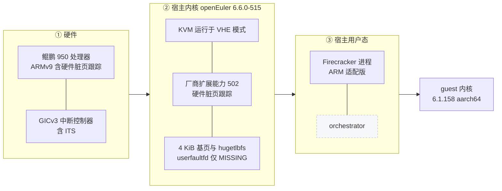

# 60 · 鲲鹏 950 与 openEuler 宿主环境

> Firecracker 的 aarch64 代码路径本身是上游写好的，但它对宿主机有一串隐式假设：KVM 提供哪些能力、
> 中断控制器是哪一代、sysfs 里有什么、页有多大。换一台机器，这些假设要一条一条重新核对。
> 本篇把 ARM 适配版实际运行的那台宿主机——鲲鹏 950 加 openEuler 的定制内核——与代码里的检查点对起来。
>
> **读者**：要在非 AWS 的 aarch64 机器上部署 Firecracker 的系统工程师。
> **预备**：[第 19 篇 · aarch64 平台](19-aarch64-platform.md)、[第 18 篇 · aarch64 vCPU](18-aarch64-vcpu.md)、
> [第 57 篇 · 迁入的版本与被放弃的写保护](57-which-fork-commit-and-uffd-wp.md)。
> **代码**：`src/vmm/src/vstate/kvm.rs`、`src/vmm/src/arch/aarch64/kvm.rs`、`src/vmm/src/arch/aarch64/vm.rs`、
> `src/vmm/src/arch/aarch64/gic/mod.rs`、`src/vmm/src/arch/aarch64/cache_info.rs`、
> `src/firecracker/src/main.rs`、`src/vmm/src/arch/mod.rs`

---

## 0. 本篇要回答的问题

1. Firecracker 在启动的头几毫秒里，到底对宿主机做了哪些硬性检查？哪一项不满足会直接退出？
2. 鲲鹏 950 加 openEuler 定制内核这套组合，与上游 CI 用的 aarch64 宿主相比，差在哪里？
3. 中断控制器、CPU 拓扑信息、SSBD 缓解这三处「读宿主」的代码，在这台机器上分别是什么结果？
4. 宿主内核的哪一个非主线补丁是 checkpoint / restore 扩展的前提？没有它会怎样？
5. 页大小与 huge pages 在这台机器上怎么配置，Firecracker 的哪些常量与之相关？
6. 相比 x86_64 云主机，这台宿主机上「用不上」的功能有哪些？

---

## 1. 问题：宿主机不是上游预设的那一台

上游 v1.12.1 对 aarch64 是一等支持，CI 每天在 aarch64 机器上跑完整测试集。但那些机器是同一类：
AWS 的 Graviton 实例，跑 Amazon Linux 的主线内核，KVM 走标准的 arm64 后端。
上游文档里的宿主机要求（`docs/prod-host-setup.md`）也是按这一类机器写的。

ARM 适配版跑在另一类机器上：国产鲲鹏 950 服务器，操作系统是 openEuler 24.03，
内核不是发行版原版，而是带了若干非主线补丁的 6.6.0-515 变体。
这里的每一处不同都可能让某段代码走到别的分支，或者直接失败：

- CPU 不是 Neoverse，芯片的特性集合与 errata 集合都不同；
- KVM 是 openEuler 分支的 KVM，既少了一些主线的新特性，也**多**了一些主线没有的厂商扩展；
- 发行版的内核配置（页大小、HugeTLB、sysfs 布局）与 Amazon Linux 不一致。

所以这一篇的写法是：把 Firecracker 里所有「读宿主、依赖宿主」的位置列出来，
逐一说明它在这台机器上的结果，以及不满足时的后果。设计动机在别处，这里只讲环境与代码的对应关系。

下图是这套栈的分层，自下而上：硬件、宿主内核、宿主用户态、guest。
虚线框的部分是本书范围之外的组件。

---

## 2. 启动时的硬性检查

Firecracker 进程起来以后，真正碰宿主机的动作集中在三处：`main.rs` 的进程级初始化、
`Kvm::new()` 的能力检查、以及建 microVM 时的 vCPU 与 GIC 创建。

### 2.1 KVM 能力清单

`src/vmm/src/vstate/kvm.rs` 的 `Kvm::new()` 先比对 KVM 的 API 版本，
再用 `check_capabilities()` 逐项调用 `KVM_CHECK_EXTENSION`，
任何一项返回 0 就带着 `KvmError::Capabilities` 退出。清单在 `src/vmm/src/arch/aarch64/kvm.rs` 的
`Kvm::DEFAULT_CAPABILITIES` 里，aarch64 是七项：

| 能力 | 用途 |
|---|---|
| `KVM_CAP_IOEVENTFD` | virtio 的 MMIO 写通知走 ioeventfd |
| `KVM_CAP_IRQFD` | 设备向 guest 注入中断走 irqfd |
| `KVM_CAP_USER_MEMORY` | 用户态内存区域注册（memslot） |
| `KVM_CAP_ARM_PSCI_0_2` | guest 用 PSCI 开关次级 vCPU 与关机 |
| `KVM_CAP_DEVICE_CTRL` | 通过设备控制接口创建 GIC |
| `KVM_CAP_MP_STATE` | 保存与恢复 vCPU 的多处理器状态 |
| `KVM_CAP_ONE_REG` | 按寄存器逐个读写 vCPU 状态，快照的基础 |

这七项在 arm64 上都属于 KVM 的基本盘，openEuler 的内核全部提供。
值得注意的是清单可以被 CPU 模板改写：`combine_capabilities()` 允许模板里的 `KvmCapability::Add`
追加要检查的能力、`Remove` 去掉一项。ARM 适配版没有用到这个机制。

除了硬性清单，还有一项可选能力：`Kvm::optional_capabilities()` 查询 `KVM_CAP_COUNTER_OFFSET`，
结果记在 `OptionalCapabilities.counter_offset` 里，供 vCPU 配置阶段决定是否重置 guest 的计数器偏移。
查不到时不报错，只是走另一条分支。

### 2.2 vCPU 的目标类型

aarch64 没有 x86 那种「先枚举 CPUID 再过滤」的路子。`src/vmm/src/arch/aarch64/vcpu.rs` 的
`KvmVcpu::default_kvi()` 直接问内核要一份首选目标：调 `VmFd::get_preferred_target()`
（对应 `KVM_ARM_PREFERRED_TARGET` ioctl）填好 `kvm_vcpu_init`，再打开 `KVM_ARM_VCPU_PSCI_0_2` 特性位。
换句话说，guest 看到的 CPU 类型由宿主内核决定，Firecracker 不挑。
在鲲鹏上这一步返回的是该芯片对应的通用目标，`init_vcpu()` 与 `finalize_vcpu()` 随后按这份结构体初始化。

这条路径在回滚时还会再走一遍，原因见[第 71 篇](71-rollback-vcpu-and-gic.md)。

### 2.3 GIC 的版本回退

`src/vmm/src/arch/aarch64/gic/mod.rs` 的 `create_gic()` 在没有指定版本时，
先尝试 `GICv3::create()`，失败再退到 `GICv2::create()`。鲲鹏 950 提供 GICv3（带 ITS），
所以走的是第一条分支，`GICDevice::V3`。

这件事的影响不止于中断。GIC 的版本决定了写进设备树的 `compatible` 字符串
（`src/vmm/src/arch/aarch64/fdt.rs` 的 `create_gic_node()` 用 `gic_device.fdt_compatibility()`），
也决定了快照里 `GicState` 的内容与长度。一台机器上的快照拿到 GIC 版本不同的机器上恢复不会成功，
这是 aarch64 上快照可移植性的一条硬边界。

### 2.4 读 sysfs 的地方：CPU 缓存拓扑

`src/vmm/src/arch/aarch64/cache_info.rs` 的 `HostCacheStore` 把
`/sys/devices/system/cpu/cpu0/cache` 当作数据源，逐级读 `level`、`type`、`size`、
`number_of_sets`、`coherency_line_size`、`shared_cpu_map`，再把结果写进 guest 的设备树缓存节点。

这段代码对缺失是宽容的：缺 `level` 或 `type` 会放弃整条缓存项，
缺可选属性只打一条 `warn` 日志并把该属性留空，不会让启动失败。
openEuler 在鲲鹏上导出的是标准的 arm64 cacheinfo 布局，这里不需要改动。
代价是 guest 看到的缓存拓扑直接复制宿主机的，与分给它的 vCPU 数量不一定自洽。

### 2.5 SSBD 缓解

`src/firecracker/src/main.rs` 里有一段只在 aarch64 编译的 `enable_ssbd_mitigation()`，
在注册信号处理器之后立刻调用。它用 `prctl(PR_SET_SPECULATION_CTRL, PR_SPEC_STORE_BYPASS,
PR_SPEC_FORCE_DISABLE)` 把当前进程的推测性存储旁路关掉，这样后续创建的 vCPU 线程也继承这个设置。

失败不致命：返回负值时只打 `error` 日志，`EINVAL` 时额外提示「宿主不支持通过 prctl 做 SSBD 缓解」，
进程继续跑。所以在一台内核没有这条 prctl 的机器上，Firecracker 仍然能起，只是少了一层缓解。
推论：鲲鹏 950 上这条 prctl 的实际返回值取决于该芯片是否被内核判定为受影响，
本书没有在目标机器上采集这条日志，不下结论。

### 2.6 一处被关掉的初始化

同一个 `main.rs` 里，上游用来预扩 fd 表的 `resize_fdtable()` 调用被整段注释掉了。
这是 ARM 适配版为了绕开在这套宿主环境上的崩溃做的处理，属于构建与运行部分的改动，
细节与后果在[第 58 篇](58-building-and-running-on-aarch64.md)。

---

## 3. 脏页跟踪所依赖的宿主前提

这台宿主机与普通 aarch64 机器最实质的差别，是 KVM 里多了一个厂商扩展能力：
硬件脏页跟踪（HDBSS，hardware dirty bit state structure）。
它不是主线特性，而是 openEuler 内核带的补丁，能力号 502，宏名 `KVM_CAP_ARM_HW_DIRTY_STATE_TRACK`。

`src/vmm/src/arch/aarch64/vm.rs` 的 `enable_hdbss()` 在 VM fd 上发 `KVM_ENABLE_CAP`，
`args[0]` 传缓冲区的分配阶数。调用方是 `src/vmm/src/vstate/vm.rs` 的 `setup_dirty_tracking()`：
只有在内存区域带位图（即打开了 `track_dirty_pages`）时才尝试使能，
成功就把后端记为 `DirtyTrackingBackend::Hdbss`，失败则打一条日志退回 `KvmWriteProtect`，
除非环境变量 `FC_HDBSS_REQUIRED` 要求必须成功。阶数由 `FC_HDBSS_ORDER` 控制，默认 1。
机制本身见[第 66 篇](66-hdbss.md)，后端选择见[第 65 篇](65-dirty-tracking-backend.md)。

从宿主环境的角度，这条路要走通需要四件事同时成立：

| 前提 | 不满足时的表现 |
|---|---|
| CPU 实现该特性 | 内核拒绝使能，`ioctl` 返回错误 |
| 内核编译进了对应代码 | `KVM_CHECK_EXTENSION` 返回 0，能力号形同不存在 |
| KVM 运行在 VHE 模式 | 内核实现明确拒绝在非 VHE 下使能 |
| memslot 打开了脏页日志 | Firecracker 侧由 `track_dirty_pages` 保证 |

前三条都是宿主机的属性，Firecracker 看不见也管不了，只能通过 `ioctl` 的返回值间接知道结果。
所以代码里的姿态是「试一次，失败就退回软件路线」，而不是提前探测。
代价是这项能力是否真的生效，只能从日志里那行 `HDBSS enabled` 判断；
好处是同一个二进制可以在带补丁和不带补丁的内核上都跑起来。

需要强调的是语义边界：使能之后，Firecracker 取脏页位图的方式一点没变，
仍然是 `KVM_GET_DIRTY_LOG`。硬件采集只是换掉了「脏位从哪来」，没有换掉接口。

---

## 4. 内存：页大小、huge pages 与 userfaultfd

### 4.1 页大小

Firecracker 里有两个页大小的概念，不要混。
`src/vmm/src/arch/mod.rs` 的 `GUEST_PAGE_SIZE` 是编译期常量 4096，用在 initrd 放置、
gdb 的内存读写切分这类与 guest 地址空间对齐相关的地方。
同一文件的 `host_page_size()` 则在运行期用 `sysconf(_SC_PAGESIZE)` 问宿主内核，
结果缓存在一个 `LazyLock` 里；`main.rs` 在初始化日志之后立刻调一次，把这个值固定下来。

`host_page_size()` 的使用点决定了宿主页大小的影响面：
`src/vmm/src/utils/pagemap.rs` 用它把虚拟地址换算成 pagemap 的条目下标，
`src/vmm/src/vstate/vm.rs` 用它把 `mincore()` 返回的宿主页粒度向量折算成 guest 页粒度的位图，
`src/vmm/src/devices/virtio/iov_deque.rs` 用它给环形缓冲区算页对齐的长度。
这几处都是按运行期取到的值算的，没有写死 4 KiB。

arm64 内核的基页大小是编译期选项，可以是 4 KiB、16 KiB 或 64 KiB。
推论：目标宿主机跑的是 4 KiB 基页的内核——`src/vmm/src/vstate/vm.rs` 的
`setup_dirty_tracking()` 在注释里把脏页缓冲区的阶数 1 记成 8 KiB，正好是两个 4 KiB 页。这一点对[第 51 篇](51-memory-resident-empty-api.md)与[第 52 篇](52-memory-dirty-api.md)讲的那两个按页统计的端点有直接影响：
宿主页越大，`mincore` 与 pagemap 的粒度就越粗，位图的精度越低。

### 4.2 huge pages

Firecracker 的 `HugePageConfig` 只有两个取值：不用大页，或者 2 MiB 的 hugetlbfs
（`src/vmm/src/vmm_config/machine_config.rs`）。后者的 `mmap_flags()` 返回
`MAP_HUGETLB | libc::MAP_HUGE_2MB`，是写死的 2 MiB，不跟随宿主的默认大页尺寸。

宿主侧的准备工作在部署脚本里：`e2b-deploy/dep/init-client.sh` 挂一个 hugetlbfs 到
`/mnt/hugepages`，读 `/proc/meminfo` 的 `Hugepagesize` 决定每页多大，
再按可用内存的比例往 `/proc/sys/vm/nr_hugepages` 写预留数量，并明确不开透明大页。
也就是说，大页池是开机时一次性预留的，Firecracker 只是从这个池子里 mmap。

### 4.3 userfaultfd

`src/vmm/src/persist.rs` 的 `guest_memory_from_uffd()` 在 ARM 适配版里只要求一项特性：
`FeatureFlags::EVENT_REMOVE`，注册区域时用默认模式，也就是只有缺页（MISSING）这一路。
这是 aarch64 内核能提供的部分。

不能提供的是写保护那一路：arm64 的 userfaultfd 没有异步写保护。
e2b 定制版依赖写保护来实现 `/memory/dirty` 的脏页判据，那条判据在这台机器上不成立，
这也是为什么脏页判据要回到 KVM 日志一侧、进而引入硬件采集。
完整的来龙去脉在[第 57 篇](57-which-fork-commit-and-uffd-wp.md)，
uffd 后端本身在[第 39 篇](39-uffd-backend.md)。

---

## 5. 与 x86_64 云主机的对照

把这台机器和一台跑 e2b 定制版的 x86_64 云主机并排放，差别可以归成四类。

**一、平台描述方式不同。** x86_64 上 Firecracker 会生成 ACPI 表，
aarch64 上没有这一套，设备、中断、时钟、PSCI 全部写进 FDT
（`src/vmm/src/arch/aarch64/fdt.rs`）。对宿主的要求因此少了一项：不需要任何固件。
对 guest 的要求则多了一项：内核必须打开设备树支持，见[第 61 篇](61-guest-kernel-on-arm.md)。

**二、CPU 规整能力基本用不上。** x86_64 有成套的 CPUID 与 MSR 规整（[第 21 篇](21-x86-64-cpuid-msr-normalization.md)），
aarch64 侧只有一个静态模板 `StaticCpuTemplate::V1N1`
（`src/vmm/src/cpu_config/aarch64/static_cpu_templates/`），
它的作用是把 Neoverse-V1 的特性位屏蔽成 Neoverse-N1 的样子，
屏蔽项写死在 `v1n1()` 返回的寄存器修改列表里。
这个模板是为特定芯片对写的，鲲鹏用不上；能用的只有自定义模板那条路（[第 22 篇](22-aarch64-templates-and-helper.md)）。
后果是这套部署里没有做 CPU 特性归一化，快照不能指望在异构机器之间迁移。

**三、脏页跟踪的手段相反。** x86_64 上 e2b 定制版靠 uffd 写保护加 pagemap，
把脏页判定放在用户态；这台机器上没有写保护，判定回到 KVM 日志，
再用厂商扩展把日志的采集成本压下来。同一个目标，两条完全不同的实现路径。

**四、可用的宿主缓解手段不同。** x86 侧有一整套 Spectre 相关的宿主检查，
aarch64 侧在 Firecracker 内部只剩那一次 `prctl`，其余靠宿主内核自己。

| 维度 | x86_64 云主机 | 鲲鹏 950 加 openEuler |
|---|---|---|
| 平台描述 | ACPI 表 | FDT |
| 中断控制器 | 用户态 PIC 或内核 irqchip | GICv3 |
| CPU 模板 | 成套静态模板 | 仅 V1N1，与该芯片不匹配 |
| 脏页判据 | uffd 写保护加 pagemap | KVM 脏页日志，硬件采集 |
| 宿主内核 | 主线，6.7 以上 | openEuler 6.6.0-515，带非主线补丁 |

这张表也解释了为什么第十部分要单独存在：不是「同一份代码换个架构编译」，
而是有一串假设需要换一套实现来顶上。

---

## 6. 小结

- Firecracker 在 aarch64 上对宿主的硬性要求是七项 KVM 能力，缺任何一项都无法启动；
  鲲鹏加 openEuler 的组合全部满足。
- guest 看到的 CPU 类型由宿主内核的 `KVM_ARM_PREFERRED_TARGET` 决定，Firecracker 不做挑选。
- GIC 的创建是先试 GICv3 再退 GICv2；这台机器走 GICv3，而 GIC 版本同时决定了设备树内容与快照里的 GIC 状态，
  是快照跨机器可移植性的一条硬边界。
- 读宿主 sysfs 的只有缓存拓扑一处，缺数据只降级不失败；SSBD 缓解失败也只打日志。
- 硬件脏页跟踪是这台机器独有的前提：能力号 502 来自 openEuler 的非主线补丁，
  需要 CPU、内核编译选项、VHE 模式三者同时成立；Firecracker 的姿态是试一次、失败就退回软件路线。
- 宿主页大小在运行期读取而不是写死，但大页配置写死为 2 MiB；大页池由部署脚本在开机时预留。
- aarch64 的 userfaultfd 只有缺页一路可用，没有写保护，这是整个第十部分后半段的出发点。
- 相比 x86_64 云主机，这套部署没有 ACPI、没有可用的静态 CPU 模板、没有 CPU 特性归一化。

---

## 延伸阅读 / 下一篇

- [第 58 篇 · 在 aarch64 上构建与运行](58-building-and-running-on-aarch64.md)：宿主条件之外，构建侧要改什么。
- [第 59 篇 · aarch64 与 x86_64 运行路径的差异清单](59-aarch64-vs-x86-64-runtime-paths.md)：按 microVM 生命周期排的完整对照。
- [第 61 篇 · ARM 上的 guest 内核](61-guest-kernel-on-arm.md)：宿主之上，guest 侧要什么。
- [第 66 篇 · HDBSS](66-hdbss.md)：这台机器上那项厂商扩展的机制与代价。
- [第 19 篇 · aarch64 平台](19-aarch64-platform.md)：FDT、GIC 与内存布局的上游实现。
- e2b 手册讲 orchestrator 如何使用宿主的大页池与内存管线：[e2b 手册第 31 篇](../e2b-infra/31-uffd-memory-backend.md)。
