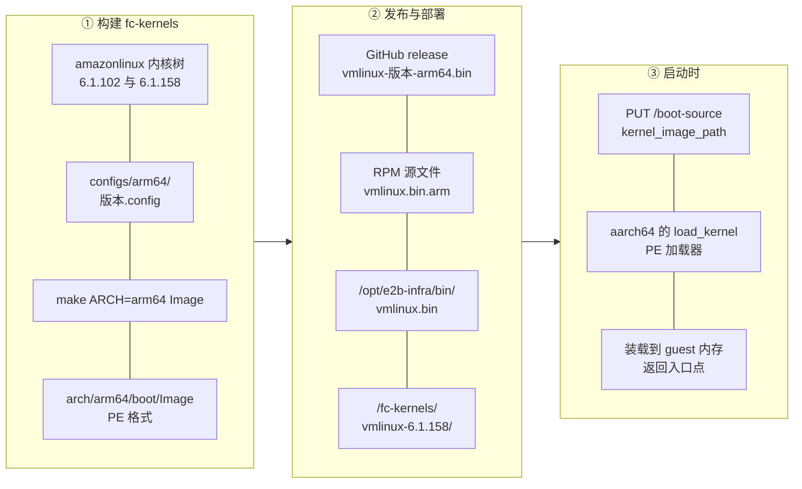

# 61 · ARM 上的 guest 内核：arm64 配置与部署中的内核文件

> 在 aarch64 上跑 microVM，guest 内核不能直接拿 x86_64 那份来用，也不能简单地「换个架构编译一遍」——
> Firecracker 的 aarch64 加载器只认一种镜像格式，而最早一版 arm64 构建产出的正好是另一种。
> 本篇讲 guest 内核这一侧：配置里有什么、产物是什么格式、部署时那个文件从哪来、落在哪。
>
> **读者**：要在 aarch64 上准备 microVM guest 内核的系统工程师。
> **预备**：[第 56 篇 · guest 内核：Firecracker 的要求与 e2b 的内核配置](56-guest-kernel-requirements-and-e2b-configs.md)、
> [第 19 篇 · aarch64 平台](19-aarch64-platform.md)。
> **代码**：`src/vmm/src/arch/aarch64/mod.rs`、`src/vmm/src/arch/aarch64/fdt.rs`、
> fc-kernels 的 `build.sh`、`configs/arm64/6.1.158.config`、`kernel_versions.txt`、
> `e2b-infra/e2b-infra.spec`、`e2b-infra/e2b-deploy/dep/init-client.sh`

---

## 0. 本篇要回答的问题

1. Firecracker 在 aarch64 上要求 guest 内核是什么格式？x86_64 上为什么不一样？
2. arm64 的内核配置相对上游 CI 的参考配置改了什么？相对同一套里的 x86_64 配置差在哪？
3. guest 内核里的串口为什么不是 PL011？virtio 设备是靠内核命令行发现的吗？
4. 部署包里的 `vmlinux.bin.arm` 是哪个版本、什么格式，怎么判断？
5. 这个文件装到宿主机的什么位置，为什么同一个二进制要放两份？
6. 内核命令行在两个架构上的差别是什么？

本篇不讲内核源码，只讲配置、产物与部署。ARM 适配版对 guest 内核**没有任何源码改动**。

---

## 1. 问题：加载器只认一种格式

x86_64 与 aarch64 的 guest 内核在 Firecracker 里是从不同的加载器进去的。
`src/vmm/src/arch/x86_64/mod.rs` 用 `linux_loader::loader::elf::Elf`，
`src/vmm/src/arch/aarch64/mod.rs` 用 `linux_loader::loader::pe::PE`，
两边的 `load_kernel()` 除了加载器类型不同，其余结构一样：
把文件克隆一份（读会改变文件偏移），装载到 `get_kernel_start()` 给出的 guest 地址，
返回入口点。aarch64 的启动协议记作 `BootProtocol::LinuxBoot`。

这个差别来自 Linux 自己：x86 的 `vmlinux` 是一个可以直接被解析的 ELF，
而 arm64 的内核镜像是 `arch/arm64/boot/Image`，带一个 PE 头（文件头四个字节是 `MZ`），
用来同时满足 EFI stub 与 arm64 启动协议。arm64 的 `vmlinux` 虽然也是 ELF，
但它不是 arm64 启动协议规定的可引导镜像。

结果是：**在 aarch64 上，给 Firecracker 一个 ELF 格式的内核，会在装载这一步失败。**
这正是第一版 arm64 构建脚本踩的坑，下一节展开。

---

## 2. fc-kernels 的 arm64 支持

回顾[第 56 篇](56-guest-kernel-requirements-and-e2b-configs.md)：
e2b 的 guest 内核来自 e2b-dev/fc-kernels 仓库，它从 amazonlinux 的内核树里
按 `kernel_versions.txt` 列出的版本（6.1.102 与 6.1.158）取源码，
套上仓库里的配置文件编译，产物发到 GitHub release。arm64 支持是 e2b 自己加的。

### 2.1 v0.0.8：目录按架构分开

提交 `b8cea06`（release `v0.0.8`，2026 年 2 月）做了三件事：
把原来平铺在 `configs/` 下的配置移到 `configs/x86_64/`，
新增 `configs/arm64/` 下的两份配置，
并给 `build.sh` 加上 `TARGET_ARCH` 环境变量（默认 `x86_64`）。

`build.sh` 里与架构相关的逻辑有三处：
依赖安装在交叉编译时追加 `gcc-aarch64-linux-gnu`；
`make` 参数在目标为 arm64 时加 `ARCH=arm64`，宿主不是 aarch64 时再加 `CROSS_COMPILE=aarch64-linux-gnu-`；
产物一律拷到 `builds/vmlinux-<版本>/<架构>/vmlinux.bin`，x86_64 额外再拷一份到不带架构子目录的旧路径，
以免破坏已有的下载方。发布流程改成按架构的矩阵构建，产物合并后一起发 release。

这一版的构建命令是 `make vmlinux`，产物是 `vmlinux`——对 arm64 来说是 ELF。
也就是说，v0.0.8 的 arm64 产物虽然能编出来，但**不能被 Firecracker 的 aarch64 加载器装载**。

### 2.2 v0.0.9：改出 PE 镜像

提交 `7fa4f34`（release `v0.0.9`，2026 年 3 月）只改了 `build.sh` 十几行，
把 arm64 分支的构建目标换成 `make Image`，产物从 `arch/arm64/boot/Image` 拷出，
提交信息写得很直白：arm64 构建现在产出 Firecracker 期望的 PE 格式镜像而不是 ELF。
x86_64 分支不变。

值得注意的是产物的**文件名没有变**，仍然叫 `vmlinux.bin`。
这个名字从此只是一个约定的路径名，与文件的实际格式无关：
在 x86_64 上它是 ELF `vmlinux`，在 arm64 上它是 PE `Image`。
后面判断部署里那个文件的来源时，这一点很重要。

### 2.3 v0.0.8 到 v0.0.12 之间还改了什么

本项目部署用的内核来自 `f371098`（release `v0.0.12`）。
`b8cea06` 与 `f371098` 之间只动了三个文件：`build.sh`、`README.md`，
以及一个新增的一次性迁移脚本。**两份 arm64 配置一字未改。**
`build.sh` 的改动除了上面那个格式修复，还有版本标签查找的整理、
依赖列表改成数组，以及把产物目录名从 `x86_64` 规范成 `amd64`——
后者在 release 的资产名上能直接看出来：
v0.0.8 发的是 `vmlinux-6.1.158-x86_64.bin`，v0.0.12 发的是 `vmlinux-6.1.158-amd64.bin`，
两版的 arm64 资产名都是 `vmlinux-6.1.158-arm64.bin`。

---

## 3. arm64 的内核配置

### 3.1 相对上游参考配置：只加了三类东西

上游 v1.12.1 在 `resources/guest_configs/` 下自带 CI 用的参考配置，
其中 `microvm-kernel-ci-aarch64-6.1.config` 就是 aarch64 的那一份。
把它与 `configs/arm64/6.1.158.config` 逐行比，差异只有十几行，归成三类：

| 类别 | 配置项 | 为什么加 |
|---|---|---|
| 版本标识 | `CONFIG_BUILD_SALT` 与首行注释 | 版本号不同，非功能差异 |
| 网络 | `CONFIG_WIREGUARD` | guest 内要能建加密隧道 |
| 文件系统 | `CONFIG_NFS_V3`、`CONFIG_NFS_SWAP`、`CONFIG_ROOT_NFS`、`CONFIG_NFSD` 及其 v3 / v4 子项 | guest 内既要能挂 NFS 也要能当服务端 |
| 加密 | `CONFIG_CRYPTO_DES` | NFS v4 安全标签相关依赖 |

对照之下，x86_64 那份配置相对它的参考配置差了八十多行。
两边不对称的原因是历史顺序：x86_64 的配置是一路加东西加出来的，
arm64 的配置是在加 arm64 支持时直接从上游参考配置起步、只补上当时已知需要的几项。
`configs/arm64/6.1.102.config` 与参考配置的差异更小，只有 WireGuard 与 NFS 客户端那几项。

这份「只加了三类东西」的清单反过来也是一份缺口清单：x86_64 那份配置里为 guest 内的沙箱运行时
打开的 nftables、`TUN`、`FUSE_FS` 与 landlock，arm64 这份都没有开
（[第 56 篇](56-guest-kernel-requirements-and-e2b-configs.md)逐项列出了两边的不对称）。
同一个 rootfs 镜像跑在两个架构上，guest 内能用的内核能力因此并不相同，
而这件事在 Firecracker 一侧看不出来。

这也说明这一层的「定制」仍然只有配置，没有内核补丁。

### 3.2 相对 x86_64 配置：架构决定的部分

两个架构的配置文件在选项名层面就差了一千多项，绝大多数是架构本身带来的。
与 Firecracker 直接相关的几项值得单独看：

| 方面 | arm64 配置 | 说明 |
|---|---|---|
| 页大小 | `CONFIG_ARM64_4K_PAGES=y` | 与宿主一致的 4 KiB 基页 |
| 地址位宽 | `CONFIG_ARM64_VA_BITS=48`、`CONFIG_ARM64_PA_BITS=48` | |
| 中断控制器 | `CONFIG_ARM_GIC_V3=y`、`CONFIG_ARM_GIC_V3_ITS=y` | 对应宿主创建的 GICv3 |
| 电源与 CPU 上线 | `CONFIG_ARM_PSCI_FW=y` | Firecracker 只提供 PSCI，没有别的开核方式 |
| 设备树 | `CONFIG_OF=y`、`CONFIG_OF_EARLY_FLATTREE=y` | 平台信息全部来自 FDT |
| 实时钟 | `CONFIG_RTC_DRV_PL031=y` | 对应 aarch64 上的 legacy RTC 设备 |
| 镜像格式相关 | `CONFIG_EFI=y` | x86_64 那份是关的 |
| CPU 特性 | `CONFIG_ARM64_SVE=y`、`CONFIG_ARM64_PTR_AUTH=y`、`CONFIG_ARM64_HW_AFDBM=y` | |

有两处容易想当然，实际不是那样。

**一、串口不是 PL011。** arm64 平台上常见的串口是 PL011，配置里 `CONFIG_SERIAL_AMBA_PL011`
恰恰是关的；打开的是 `CONFIG_SERIAL_8250` 与 `CONFIG_SERIAL_8250_CONSOLE`，
再加上 `CONFIG_SERIAL_OF_PLATFORM=y` 让 8250 驱动能从设备树里认到设备。
原因在 Firecracker 一侧：`src/vmm/src/arch/aarch64/fdt.rs` 的 `create_serial_node()`
把串口的 `compatible` 写成 `ns16550a`，也就是说 aarch64 上的串口设备与 x86_64 用的是同一个
16550 兼容实现，只是挂在 MMIO 上而不是端口 I/O 上。
这直接决定了内核命令行里写 `console=ttyS0` 而不是 `ttyAMA0`。
同一个文件里的 `create_rtc_node()` 写的 `compatible` 是 `arm,pl031`，
所以 RTC 那一侧确实是 PL011 家族的 PL031——两件事不要混。

**二、virtio 设备不靠命令行发现。** `CONFIG_VIRTIO_MMIO=y` 是必须的，
但 `CONFIG_VIRTIO_MMIO_CMDLINE_DEVICES` 在两个架构的配置里都是关的。
x86_64 上 Firecracker 通过 ACPI 表描述 virtio-mmio 设备，
aarch64 上则由 `fdt.rs` 的 `create_virtio_node()` 写一个 `compatible = "virtio,mmio"` 的节点，
带上地址与中断号。两条路都不需要 `virtio_mmio.device=` 这类命令行参数。

### 3.3 启动必须的那几项

把上面两张表合起来，可以列出一份「aarch64 上 guest 内核不打开就起不来」的清单。
判断依据是 Firecracker 在 aarch64 上给 guest 准备了什么：
`src/vmm/src/arch/aarch64/fdt.rs` 生成的设备树里有内存节点、CPU 节点与缓存节点、
`arm,armv8-timer` 的定时器节点、`arm,psci-0.2` 的电源节点、GIC 节点、
一个 `ns16550a` 串口节点、一个 `arm,pl031` 的 RTC 节点、若干 `virtio,mmio` 节点，
以及写着内核命令行的 `chosen` 节点。除此之外什么都没有：没有 ACPI 表，没有固件，没有 PCI 总线。

对应到内核配置，就是这几项必须为 `y`：

- `CONFIG_OF` 与 `CONFIG_OF_EARLY_FLATTREE`——所有平台信息只能从设备树来；
  关掉它，内核连内存范围都不知道。
- `CONFIG_ARM_PSCI_FW`——次级 vCPU 的上线与 guest 的关机重启都走 PSCI；
  Firecracker 没有提供第二种开核方式。
- `CONFIG_ARM_GIC_V3`——中断控制器的驱动要与宿主实际创建的那一版对上。
  宿主上 GIC 的版本是探测出来的（[第 60 篇](60-kunpeng-openeuler-host.md)），
  所以在只支持 GICv3 的机器上，guest 内核也只需要 GICv3 驱动。
- `CONFIG_VIRTIO_MMIO`——块设备、网卡、熵源、vsock 全部是 virtio-mmio 设备。
- `CONFIG_SERIAL_8250` 与 `CONFIG_SERIAL_OF_PLATFORM`——串口控制台。

这份清单与 x86_64 那边的差别，本质上就是「平台信息从哪来」和「怎么把第二个核开起来」两件事。
其余的选项——文件系统、cgroup、namespace、网络——两边是同一套需求，
因为 guest 里跑的是同一套沙箱运行时。

### 3.4 一张图：从配置到运行

下面这张图把内核从源码到 microVM 里运行的整条路串起来，
左列是构建，中列是发布与部署，右列是启动时的装载。



---

## 4. 部署里的内核文件

### 4.1 这个文件是什么

单机离线版的 RPM 里带三个 guest 内核相关的源文件（`e2b-infra/e2b-infra.spec`）：
`vmlinux.bin.arm`、`vmlinux.bin.x86`、`vmlinux.bin.arm.openeuler`。
aarch64 构建只安装第一个和第三个，x86_64 构建只安装第二个。

`vmlinux.bin.arm` 的身份可以从文件本身读出来，不必依赖任何记录：

```bash
file e2b-infra/vmlinux.bin.arm
strings e2b-infra/vmlinux.bin.arm | grep "Linux version"
```

第一条给出「ARM64 boot executable Image, little-endian, 4K pages」，
文件头是 `MZ`，确认是 PE 格式的 arm64 `Image`，而且是 4 KiB 页配置。
第二条给出版本串：内核 6.1.158，用 Ubuntu 22.04 的 `aarch64-linux-gnu-gcc` 11.4.0 交叉编译，
构建时间是 2026 年 4 月 10 日。这个时间与 fc-kernels release `v0.0.12` 的发布时间相差不到一分钟，
构建工具链也与该仓库的 GitHub Actions 一致，因此可以判定它就是 `v0.0.12` 的 `vmlinux-6.1.158-arm64.bin`。

反过来也印证了第 2 节的结论：这个文件是 PE 格式，所以它不可能来自 v0.0.8——
那一版的 arm64 产物是 ELF。

`vmlinux.bin.arm.openeuler` 是另一个内核：版本串显示是 openEuler 12.3.1 工具链编出的 6.6.0 内核。
它作为备用变体存在，本书不讲它。

顺带说明这套做法的代价。内核二进制是作为 RPM 的源文件**预先放进去**的，
不是在目标机器上从源码构建的，spec 里也没有记下它对应哪个 release。
好处是部署侧不需要内核构建环境，装包即可用，离线环境下尤其省事；
代价是这个文件与 fc-kernels 的哪一次构建对应，只能像上面那样从二进制里反推。
要换内核版本，得重新打包 RPM，而不是改一行配置。

### 4.2 装到哪里

RPM 把这两个文件装到 `/opt/e2b-infra/bin/vmlinux.bin` 与 `/opt/e2b-infra/bin/vmlinux.bin.openeuler`。
真正决定 Firecracker 能不能找到内核的是节点初始化脚本
`e2b-deploy/dep/init-client.sh`：它在 `/fc-kernels/` 下建目录，把同一个二进制拷进去。

```text
/opt/e2b-infra/bin/vmlinux.bin
        ├─> /fc-kernels/vmlinux-6.1.158/vmlinux.bin
        └─> /fc-kernels/vmlinux-6.1.102/vmlinux.bin
/opt/e2b-infra/bin/vmlinux.bin.openeuler
        └─> /fc-kernels/vmlinux-6.6.0-132.0.0/vmlinux.bin
```

同一个文件放两份，不是冗余，是**寻址**。orchestrator 按
`<内核目录>/<内核版本>/vmlinux.bin` 拼路径，其中的版本字符串来自建模板请求；
请求没带就用编译进 API 的默认值 `vmlinux-6.1.158`。
早先建的模板里记着 `vmlinux-6.1.102`，它们恢复时会去找那个目录。
所以目录名在这里只是一个标签，两个标签指向同一份内核二进制，
代价是「模板记录的内核版本」与「实际运行的内核版本」可能对不上，
好处是老模板不会因为目录不存在而在建模板的第一步就失败。

这一步的失败方式也值得记住：目录不存在时，Firecracker 侧不会报「内核格式不对」这类错误，
而是建模板在准备沙箱那一步就失败，因为 orchestrator 拼出来的路径根本打不开。
排查时先看 `/fc-kernels/` 下有没有模板记录的那个版本目录，再看文件格式。

Firecracker 版本目录的布局与 `firecracker.arm` 的安装在
[第 63 篇](63-integration-with-e2b-infra.md)，这里不展开。

---

## 5. 内核命令行

内核命令行由 orchestrator 拼好，通过 `PUT /boot-source` 的 `boot_args` 交给 Firecracker
（`packages/orchestrator/internal/sandbox/fc/process.go`）。两个架构共用的部分包括
`quiet`、`loglevel`、`init`、IPv4 与 IPv6 配置、`panic=1`、`reboot=k`。

按架构分支的只有一处：仅当运行在 x86 上时才追加
`pci=off`、`i8042.nokbd`、`i8042.noaux`、`random.trust_cpu=on`、`clocksource=kvm-clock`。
这几项都是针对 x86 平台设备的：aarch64 上根本没有 i8042 控制器，
PCI 在两份内核配置里都是关的，时钟源也不是 kvm-clock 而是 ARM 架构定时器
（Firecracker 在 FDT 里写的是 `arm,armv8-timer`）。

需要打开 guest 内核日志时，两个架构都用 `console=ttyS0`，
并把 `quiet` 去掉、`loglevel` 提到 5。第 3.2 节解释了为什么 aarch64 上这个名字是对的。
默认情况下 guest 内核日志是关的：`quiet` 加 `loglevel=1` 能省掉一部分启动时间，
代价是出问题时第一现场没有日志，要重建一个打开日志的沙箱才能看。

命令行里没有 `virtio_mmio.device=` 这类参数，第 3.2 节已经解释过原因。
也没有 `root=`：rootfs 由 Firecracker 作为第一个 virtio-block 设备提供，
guest 的 init 路径由 `init=` 指定。

---

## 6. 小结

- Firecracker 的 aarch64 加载器是 PE 加载器，只接受 arm64 的 `Image`；
  x86_64 侧是 ELF 加载器。产物文件名都叫 `vmlinux.bin`，名字不表示格式。
- fc-kernels 的 arm64 支持在 `b8cea06`（v0.0.8）加入，但那一版构建的是 ELF `vmlinux`；
  `7fa4f34`（v0.0.9）改成 `make Image` 之后产物才可用。
- v0.0.8 到 v0.0.12 之间两份 arm64 配置一字未改，改的只有构建脚本与资产命名。
- arm64 配置相对上游 CI 参考配置只多了 WireGuard、NFS 客户端与服务端、一个加密算法，
  没有内核补丁。
- guest 里的串口是 8250 而不是 PL011，因为 Firecracker 在 FDT 里把它声明为 `ns16550a`；
  RTC 才是 PL031。virtio 设备由 FDT 描述，不需要 `virtio_mmio.device=` 命令行参数。
- 部署里的 `vmlinux.bin.arm` 是 PE 格式、4 KiB 页、6.1.158，构建时间与 v0.0.12 的发布时间吻合。
- 同一个内核二进制被铺到 `/fc-kernels/` 下的两个版本目录，目录名只是 orchestrator 的寻址标签。
- 内核命令行只有 x86 专有的五项按架构分支，`console=ttyS0` 两边通用。

---

## 延伸阅读 / 下一篇

- [第 56 篇 · guest 内核：Firecracker 的要求与 e2b 的内核配置](56-guest-kernel-requirements-and-e2b-configs.md)：
  fc-kernels 仓库的整体结构与 x86_64 侧的配置差异。
- [第 60 篇 · 鲲鹏 950 与 openEuler 宿主环境](60-kunpeng-openeuler-host.md)：宿主一侧的前提条件。
- [第 62 篇 · aarch64 的 seccomp 过滤器](62-aarch64-seccomp-filter.md)：下一篇。
- [第 63 篇 · 与 e2b infra 的对接](63-integration-with-e2b-infra.md)：版本目录、RPM 与完整的启动参数。
- [第 19 篇 · aarch64 平台](19-aarch64-platform.md)：FDT 里那些节点是怎么生成的。
- orchestrator 侧如何选择内核版本与建模板：[e2b 手册第 69 篇](../e2b-infra/69-guest-kernel-for-arm.md)。
