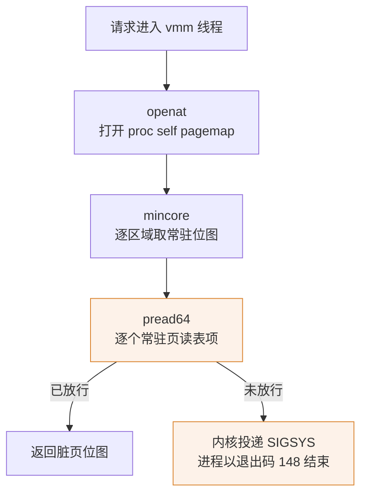

# 62 · aarch64 的 seccomp 过滤器

> 系统调用白名单是全书里最容易被忽略、也最容易把一台机器变成「功能全都对、就是跑不起来」的地方。
> aarch64 有自己的一张表，两层改动各自往这张表里加过规则，加的位置与理由都不一样。
> 本篇讲 aarch64 表的形状、它与 x86_64 表差在哪里、两层各加了什么、一条规则怎么写、以及怎么验证一张表。
>
> **读者**：系统工程师、运维。　**预备**：[第 42 篇 · seccomp](42-seccomp.md)、
> [第 19 篇 · aarch64 平台](19-aarch64-platform.md)。　**代码**：
> `resources/seccomp/aarch64-unknown-linux-musl.json`、`resources/seccomp/x86_64-unknown-linux-musl.json`、
> `src/firecracker/build.rs`、`src/vmm/src/signal_handler.rs`、`src/vmm/src/utils/pagemap.rs`、
> `src/vmm/src/lib.rs`
>
> 本篇的仓库相对路径以 firecracker 仓库根为基准（在 ARM 适配版里即 `firecracker/` 目录）。

---

## 0. 本篇要回答的问题

1. 同一套语义为什么要按目标三元组分成两张表，两张表的差别具体落在哪一层？
2. aarch64 表的三类线程各有多大，它与 x86_64 表的差异是系统调用名的差异还是参数的差异？
3. e2b 定制版为什么只给 aarch64 加了 `mincore`，而给 x86_64 加了 `mincore` 与 `pread64` 两条？
4. 少一条 `pread64` 的后果是什么，在哪一次 API 调用上暴露，表现成什么？
5. ARM 适配版为什么必须往 `vcpu` 表里加四条 `KVM_SET_*` / `KVM_ARM_VCPU_*` 规则？
6. 一条带参数条件的 `ioctl` 规则里那个十进制 `val` 是怎么来的，自己加一条时怎么算？
7. 在一台没有测试容器的 aarch64 机器上，怎么确认一张表是对的？

---

## 1. 问题：白名单不能跨架构共用

[第 42 篇](42-seccomp.md)讲过这条链路：`resources/seccomp/<target>.json` 在构建时由
`src/firecracker/build.rs` 交给 seccompiler 编译成 BPF，序列化后嵌进二进制，运行时由三类线程各自装上。
`build.rs` 取的是 `TARGET` 环境变量，拼出的路径是 `../../resources/seccomp/{target}.json`；
文件不存在就退化成空表 `unimplemented.json`，只打一条构建警告。

「按目标三元组分文件」不是为了整洁，是因为白名单在两个层面上都与架构绑定。

**第一层是系统调用集合本身。** aarch64 的 Linux ABI 里没有 `open`、没有 `stat`，
对应能力由 `openat` 与 `newfstatat` 提供。这解释了两张表在系统调用名上的**全部**差异：
`vmm` 表里 aarch64 独有 `openat` 与 `newfstatat`、x86_64 独有 `open` 与 `stat`，
`api` 与 `vcpu` 表里则只差 `openat` 与 `open` 这一对。除此之外，两张表覆盖的系统调用名是一样的。

**第二层，也是差异真正所在的一层，是 `ioctl` 的请求码。** 白名单对 `ioctl` 不是整条放行，
而是对第 1 个参数（请求码）做等值比较，一个请求码一条规则。KVM 的请求码是按
`_IOW` / `_IOR` 宏从「参数结构体大小 + 魔数 + 序号」编出来的，取值随架构而变；
更重要的是两个架构根本不调用同一组 `ioctl`。x86_64 的 `vmm` 表里有
`KVM_GET_IRQCHIP`、`KVM_GET_CLOCK`、`KVM_GET_PIT2`，对应的是 in-kernel irqchip、
kvmclock 与 PIT 的状态读取；aarch64 的同一张表里这三条不存在，取而代之的是
`KVM_SET_DEVICE_ATTR` 与 `KVM_GET_DEVICE_ATTR` —— GIC 的状态就是通过设备属性接口
逐组读写的（[第 19 篇](19-aarch64-platform.md)）。

所以这两张表是同一份语义在两套硬件抽象上的两次落地。把 x86_64 的表编译出来喂给 aarch64 的二进制，
或者反过来，结果不是报错，而是进程跑到某条路径上被杀。

---

## 2. aarch64 表的形状

上游 v1.12.1 的 aarch64 表与 x86_64 表的规模对比如下。规则数是 `filter` 数组的长度，
系统调用数是去重后的名字个数；两者不等是因为 `futex`、`mmap`、`ioctl` 这类系统调用有多条并列规则，
条件之间是「或」的关系。

| 线程 | aarch64 规则 / 系统调用 | x86_64 规则 / 系统调用 | 其中 `ioctl` 规则数 |
|---|---|---|---|
| `vmm` | 57 / 43 | 58 / 43 | 7 vs 8 |
| `api` | 35 / 29 | 35 / 29 | 1 vs 1 |
| `vcpu` | 33 / 23 | 43 / 23 | 5 vs 15 |

`api` 线程两架构完全同形：它只服务一个 Unix socket 上的 HTTP 端点，唯一的 `ioctl`
是把 socket 设成非阻塞的 `FIONBIO`，与虚拟化毫无关系。

`vcpu` 表的 5 对 15 是全书里最能说明两个架构差别的一组数字。x86_64 的 vCPU 状态按
「一类状态一个 ioctl」读出来：`KVM_GET_REGS`、`KVM_GET_SREGS`、`KVM_GET_MSRS`、
`KVM_GET_CPUID2`、`KVM_GET_XSAVE` 等十二条；aarch64 把几乎所有寄存器统一到
`KVM_GET_ONE_REG` 一个接口上，按寄存器 id 逐个读，再加一条 `KVM_GET_REG_LIST`
列出这台 vCPU 支持的寄存器 id 集合（[第 18 篇 · aarch64 vCPU](18-aarch64-vcpu.md)）。
于是 aarch64 的 `vcpu` 表只有五条 `ioctl`：`KVM_RUN`、`KVM_GET_MP_STATE`、
`KVM_GET_ONE_REG`、`KVM_GET_REG_LIST`、`TUNSETOFFLOAD`。

这里同样保持着上游的那条不变量：**`vcpu` 表里一条 `KVM_SET_*` 都没有。**
vCPU 的寄存器只在引导前配置与从快照恢复这两个时刻被写入，两次都发生在 vmm 线程上、
且都早于 vCPU 线程装上自己的过滤器。第 4 节会看到，这条不变量是 ARM 适配版必须打破的。

---

## 3. 第一层：e2b 定制版加了什么

e2b 定制版在两张表上都只动了 `vmm` 一类线程，加的是内存查询 API 需要的系统调用。
用 `git -C tmp/e2b-book-src/fc-e2b diff v1.12.1 a41d3fb -- resources/seccomp/` 看，
源码上的改动只有两处（另有几行缩进与行尾修正）：

| 目标 | 新增规则 | JSON 里的注释 |
|---|---|---|
| aarch64 | `mincore` | 检查内存页是否常驻 |
| x86_64 | `mincore`、`pread64` | 常驻判定；读 `/proc/self/pagemap` 的表项 |

两个架构不对称，是因为 e2b 定制版加的三个只读端点用到的判据不一样。

`GET /memory` 走 `src/vmm/src/vstate/vm.rs` 的 `get_memory_info()`：对每个内存区域调一次
`libc::mincore()` 拿常驻位图，再对常驻页逐页比对零缓冲区判断是否全零。整条路径上只多用了一个
`mincore`，两个架构都需要，所以两张表都加了它。

`GET /memory/dirty` 走 `src/vmm/src/lib.rs` 的 `Vmm::get_dirty_memory()`，它比前者多一步：
先用 `mincore` 把常驻页筛出来，再对每个常驻页读一次 `/proc/self/pagemap` 的表项，
看「present 且 userfaultfd 写保护位为 0」是否成立 —— 这就是 e2b 的脏页判据。
读表项的实现在 `src/vmm/src/utils/pagemap.rs` 的 `PagemapReader::is_page_dirty()`，
用的是 `libc::pread()` 按偏移定位读，不是 `read()` 加 `lseek()`。定位读对应的系统调用是
`pread64`，它与白名单里已有的 `read` 是两个不同的号。

x86_64 的表里加了 `pread64`，aarch64 的表里没加。这个不对称本身有一个合理的解释：
e2b 定制版跑在 x86_64 上，`GET /memory/dirty` 的脏页判据依赖 userfaultfd 写保护位，
而 arm64 内核不提供写保护那一套（[第 57 篇](57-which-fork-commit-and-uffd-wp.md)），
所以 aarch64 上这个端点即使能跑，返回的也是「所有常驻页都算脏」。
**推论**：`mincore` 两边都加、`pread64` 只加 x86 这一处不对称，是按「哪一层在哪个架构上真正要用」来加的，
而不是按「代码里有哪些调用点」来加的。代码里 `get_dirty_memory()` 是没有 `cfg` 分叉的，
两个架构都会走到 `pread`。

---

## 4. 第二层：ARM 适配版加了什么

ARM 适配版对这张表的改动来自两个提交，分别对应两件不同的事。用
`git -C KASandbox diff b8e85c3 3863c76 -- firecracker/resources/seccomp` 可以看到全部改动；
构建修复那一段（`9e880db..b8e85c3`）没有碰过 seccomp 目录。

### 4.1 `vmm` 线程补 `pread64`

上一节留下的缺口在 ARM 适配版上必须补。原因不是判据变精确了，而是这条端点在
ARM 单机部署的模板构建流程里是必经之路：建模板的最后一步要暂停 microVM 并把内存差分导出，
orchestrator 走的就是 `GET /memory/dirty`（[第 63 篇](63-integration-with-e2b-infra.md)）。

缺这一条规则的后果不是端点返回错误，而是进程被杀。下图是这次调用在 aarch64 上经过的系统调用，
以及每一条在各层白名单里的状态。



| 系统调用 | 在 aarch64 表里由哪一层放行 | 用途 |
|---|---|---|
| `openat` | 上游 v1.12.1，无条件放行 | 打开 `/proc/self/pagemap` |
| `mincore` | e2b 定制版 | 取常驻位图，筛掉不必读表项的页 |
| `pread64` | ARM 适配版（e2b 定制版只加进了 x86_64 表） | 按偏移读 pagemap 表项 |

三点值得说明。

第一，**它跑在 `vmm` 线程上**。API 线程只负责解析 HTTP 请求并把 `VmmAction` 发进通道，
真正执行的是 vmm 线程事件循环里的 `ApiServerAdapter::process()` →
`RuntimeApiController::handle_request()`（`src/firecracker/src/api_server_adapter.rs`）。
所以规则要加进 `vmm` 表，加进 `api` 表没有用。

第二，**失败发生在第一次调用**。`get_dirty_memory_info()` 先检查 VM 处于 `Paused`，
再进入逐页循环；第一个常驻页的 `pread` 就会撞上过滤器。按
`src/vmm/src/signal_handler.rs` 的 `sigsys_handler`，这条路径记一次 `seccomp.num_faults`、
打印被拒绝的系统调用号、刷写 metrics，然后以 `FcExitCode::BadSyscall`（148）结束进程。
从调用方看到的是 HTTP 请求没有响应、socket 断开、Firecracker 进程消失。

第三，**这是一个没有中间态的失败**。过滤器与代码版本必须配套这条规律在这里表现得很直接：
同一份 Firecracker 源码，带这条规则的二进制能建出模板，不带的一定建不出来，
而且失败点在暂停之后、导出之前，此时 microVM 已经停住。

JSON 里新增的这一条本身很朴素，它没有参数条件：

```json
{
    "syscall": "pread64",
    "comment": "GET /memory/dirty reads /proc/self/pagemap positionally to tell dirty pages from clean ones; without it the endpoint trips seccomp and the VM is shut down with BadSyscall"
}
```

值得注意的是它**没有也不可能有路径条件**。`openat` 在三类线程里都是无条件放行的，
seccomp 只能比较寄存器里的标量，不能解引用指针去看路径字符串。
换句话说，放行 `pread64` 等于允许这个线程对它能打开的任何文件做定位读，
而不只是对 `/proc/self/pagemap`。这道边界的能力上限在[第 42 篇](42-seccomp.md)已经讲过，
在没有 jailer 的部署里它的后果会更直接一些（[第 63 篇](63-integration-with-e2b-infra.md)）。

### 4.2 `vcpu` 线程新增四条写入类 `ioctl`

另一处改动打破了第 2 节那条不变量。原地回滚要在一台**还活着**的 microVM 上把 vCPU 状态写回去，
写回动作发生在 vCPU 线程自己身上，而那个线程早就装好了只读的过滤器。
于是 `vcpu` 表多了四条 `ioctl` 规则：

| 请求码常量 | JSON 里的 `val` | 这一步做什么 |
|---|---|---|
| `KVM_ARM_VCPU_INIT` | 1075883694 | 按架构定义复位这个 vCPU |
| `KVM_ARM_VCPU_FINALIZE` | 1074048706 | 复位后重新定型 SVE 等可选特性 |
| `KVM_SET_ONE_REG` | 1074835116 | 逐个写回寄存器 |
| `KVM_SET_MP_STATE` | 1074048665 | 写回多处理器状态 |

加完之后 aarch64 的 `vcpu` 表是 37 条规则、23 个系统调用，`ioctl` 从 5 条变成 9 条；
`vmm` 表是 59 条规则、45 个系统调用。`api` 表三层都没有动过。

这四条规则的**顺序本身是路径的说明**：回滚没有选择「只写寄存器」，而是先做一次架构定义的
`KVM_ARM_VCPU_INIT` 复位、再 `FINALIZE`、再写回全部寄存器与 MP 状态。
两种做法的取舍与内核侧那部分状态为什么覆盖不到，在[第 71 篇](71-rollback-vcpu-and-gic.md)讲；
每一条不加会在哪一步 SIGSYS，在[第 73 篇](73-failure-model-faulted-and-seccomp.md)讲。
这里只需要记住一个结构性的结论：**过滤器把「vCPU 状态只在构建期被写」这条不变量编码了进去，
所以任何想在运行期写 vCPU 状态的扩展，都必然要改这张表。** 白名单在这里起的作用与其说是防护，
不如说是把一条设计假设变成了运行时可以检验的事实。

回滚还要重设 GIC，走的是 `KVM_SET_DEVICE_ATTR`。这一条**不需要新加** ——
它本来就在 aarch64 的 `vmm` 表里（快照保存与恢复 GIC 状态时就要用），
而 GIC 阶段跑在 vmm 线程上。

### 4.3 一条没有出现在表里的 `ioctl`

第十部分还加了一处 KVM 调用，却没有在这张表里留下任何痕迹：启用硬件脏页跟踪用的
`KVM_ENABLE_CAP`（[第 66 篇](66-hdbss.md)）。查遍三张 aarch64 表都找不到它，
而这不是遗漏：这次 ioctl 发生在**构建期**，排在 VMM 线程装过滤器那一步之前，
过滤器还没生效，自然不需要放行。

这与 uffd 的创建和注册发生在装过滤器之前是同一种口径（[第 39 篇](39-uffd-backend.md)），
也解释了为什么 aarch64 的 `vmm` 表里既没有 `userfaultfd` 也没有 `UFFDIO_*`。
代价是这条性质只存在于代码的调用顺序里，没有任何机制守着它：
把启用动作挪到运行期、或者将来加一个「运行期重新协商能力」的端点，
第一次调用就会以 SIGSYS 结束进程，而不是返回一个错误。
这类隐含依赖值得在改动构建顺序时专门检查一遍。

---

## 5. 一条规则怎么写

规则的结构在[第 42 篇](42-seccomp.md)讲过：`syscall` 加可选的 `args`，
`args` 里每个条件有 `index`、`type`、`op`、`val` 四项，条件之间是「与」，
同名系统调用的多条规则之间是「或」。`comment` 字段解析时被忽略，但默认表里几乎每条都写了。

自己加一条带请求码条件的 `ioctl` 规则时，唯一需要动手算的是 `val`。
JSON 里写的是十进制，而代码与内核头文件里给的是 `_IOW` / `_IOR` 宏。展开后是一个 32 位的位域：

```text
KVM_SET_ONE_REG = _IOW(KVMIO, 0xac, struct kvm_one_reg) = 0x4010_aeac = 1074835116

  位 31-30   dir  = 01        写方向，_IOW
  位 29-16   size = 0x0010    参数结构体 16 字节，struct kvm_one_reg
  位 15-8    type = 0xae      KVM 的 ioctl 魔数 KVMIO
  位  7-0    nr   = 0xac      序号

同族的另外三条：
  KVM_SET_MP_STATE      = _IOW(KVMIO, 0x99, struct kvm_mp_state)   = 0x4004_ae99 = 1074048665
  KVM_ARM_VCPU_INIT     = _IOW(KVMIO, 0xae, struct kvm_vcpu_init)  = 0x4020_aeae = 1075883694
  KVM_ARM_VCPU_FINALIZE = _IOW(KVMIO, 0xc2, int)                   = 0x4004_aec2 = 1074048706
```

`size` 字段把参数结构体的大小编进了请求码，所以**同一个常量在不同架构上未必同值**，
抄另一张表里的数字是不安全的；正确的做法是在目标架构上展开宏或者从 `kvm-ioctls` 的绑定里取。

`type` 一律写 `dword`。这不只是位宽声明：`SeccompCondition::to_scmp_type()` 对
`op` 为 `eq` 且 `type` 为 `dword` 的条件生成的是掩码为 `0x00000000FFFFFFFF` 的掩码相等比较，
而不是一次 64 位相等比较。代码注释给的理由是 musl 的 `ioctl` 包装会在请求码参数的高 32 位
留下未清零的残留，按 64 位比较会莫名其妙地不匹配。写成 `qword` 的 `ioctl` 规则大概率永远不命中，
而不命中的表现是进程被杀，不是规则失效那么温和。

注释写法上跟着默认表的惯例即可：说清「谁在用这个系统调用」，参数条件的注释写常量名。
读这些注释是理解一张表的最快途径，也是下一个人升级上游版本时判断某条规则还要不要保留的唯一线索。

---

## 6. 怎么验证一张表

上游的验证手段是 `tests/integration_tests/security/` 下的三个测试：
`test_seccomp.py` 验证违规时进程以 148 退出，`test_custom_seccomp.py` 验证
`--seccomp-filter` 与 `--no-seccomp` 的行为，`test_seccomp_validate.py` 把 seccompiler
编出来的 BPF 反序列化，再用 python 的 `seccomp` 绑定独立编译一遍做逐条比对。
这一层在 aarch64 上跑不起来（没有可用的测试容器，见[第 58 篇](58-building-and-running-on-aarch64.md)），
所以在目标机器上验证一张表要靠下面这条手工回路。

1. **编译**。改完 JSON 后重新构建即可 —— `src/firecracker/build.rs` 声明了
   `cargo:rerun-if-changed`，指向 JSON 与 seccompiler 源码目录，改动会触发重新编译。
   注意必须是 release 构建：debug 构建会被 `build.rs` 换成空表 `unimplemented.json`，
   这时任何白名单问题都不会暴露。
2. **单独编译一张表看它能不能过**。`seccompiler-bin`（`src/seccompiler/src/bin.rs`）接
   `--target-arch`、`--input-file`、`--output-file`，可以在不构建整个 Firecracker 的前提下
   验证 JSON 的语法与系统调用名对目标架构是否有效。
3. **用自定义过滤器加载跑一遍**。`--seccomp-filter` 收的是**已经编译好的二进制**，不是 JSON。
   加载时会校验线程类别恰好是 `vmm`、`api`、`vcpu` 三个，少一类直接启动失败。
4. **把真正要走的 API 路径都跑一遍**。白名单问题只在代码路径被执行时才暴露，
   起一台 microVM 是不够的：暂停、创建快照、查脏页、恢复、回滚，每条路径各跑一次。
5. **看证据**。`seccomp.num_faults` 在 metrics 里（[第 44 篇](44-logging-and-metrics.md)），
   进程退出码是 148，日志里有一行被拒绝的**系统调用号**。号不是名字，
   要按 aarch64 的系统调用表自己反查 —— 两个架构的编号不同，拿 x86_64 的表查会得到错误的答案。

一个容易被忽略的点：第 4 步里「恢复」与「回滚」这两条路径分别落在不同线程上，
一条走 vmm 线程、一条同时用到 vmm 与 vCPU 两类线程的白名单。只跑其中一条不能说明另一条没问题。

---

## 7. 小结

- 过滤器按目标三元组分文件，差异在两层：系统调用名上只差 `open` / `stat` 与 `openat` / `newfstatat`，
  真正的差异在 `ioctl` 请求码 —— x86_64 读 irqchip / clock / PIT，aarch64 读写 GIC 的设备属性。
- aarch64 的 `vcpu` 表只有 5 条 `ioctl`，因为它的 vCPU 状态统一走 `KVM_GET_ONE_REG` 按 id 逐个读；
  x86_64 是一类状态一个 ioctl，共 15 条。
- e2b 定制版只改 `vmm` 表：两个架构都加 `mincore`，只有 x86_64 加了 `pread64`。
- 缺 `pread64` 时 aarch64 上的 `GET /memory/dirty` 在第一个常驻页就触发 SIGSYS，
  进程以 `FcExitCode::BadSyscall`（148）结束，而不是返回错误；这个端点是 ARM 单机部署
  建模板的必经之路，所以 ARM 适配版补上了它。
- 这条端点由 vmm 线程执行（API 线程只投递 `VmmAction`），所以规则要加进 `vmm` 表。
- ARM 适配版还往 `vcpu` 表加了 `KVM_ARM_VCPU_INIT`、`KVM_ARM_VCPU_FINALIZE`、
  `KVM_SET_ONE_REG`、`KVM_SET_MP_STATE` 四条，因为原地回滚要在运行中的 vCPU 上写状态；
  GIC 用的 `KVM_SET_DEVICE_ATTR` 本来就在 `vmm` 表里，不需要加。
- 启用硬件脏页跟踪的 `KVM_ENABLE_CAP` 三张表里都没有，因为它发生在装过滤器之前；
  这是一条只靠调用顺序维持、没有机制保护的隐含依赖。
- 三层之后 aarch64 表是 `vmm` 59 条 / `api` 35 条 / `vcpu` 37 条规则；`api` 表三层都没动过。
- `ioctl` 的 `val` 是 `_IOW` / `_IOR` 展开后的 32 位位域，`size` 字段把结构体大小编了进去，
  跨架构抄数字不安全；`type` 必须写 `dword`，因为 `eq` + `dword` 生成的是掩码比较，
  用来绕开 musl 在请求码高 32 位留下的残留。
- aarch64 上跑不了上游的 pytest 验证层，验证要靠手工回路：release 构建、`seccompiler-bin` 编译、
  `--seccomp-filter` 加载、逐条 API 路径实跑、查 `seccomp.num_faults` 与退出码。

---

## 延伸阅读 / 下一篇

- [第 63 篇 · 与 e2b infra 的对接](63-integration-with-e2b-infra.md)：谁在调这些端点，以及不用 jailer 之后这道边界承担了什么。
- [第 55 篇 · seccomp、构建发布脚本与合入的上游修复](55-seccomp-build-upload-and-upstream-fixes.md)：e2b 定制版这一层的完整改动。
- [第 73 篇 · 失败模型、Faulted 状态与 seccomp 白名单](73-failure-model-faulted-and-seccomp.md)：四条 vCPU 规则每一条不加会在哪一步失败。
- [第 71 篇 · 回滚的 vCPU 与 GIC](71-rollback-vcpu-and-gic.md)：为什么回滚要先复位再写寄存器。
- [第 57 篇 · 迁入的版本与被放弃的 uffd 写保护](57-which-fork-commit-and-uffd-wp.md)：aarch64 上脏页判据失去写保护位支撑的来龙去脉。
- 上游文档 `docs/seccomp.md`、`docs/seccompiler.md`。
