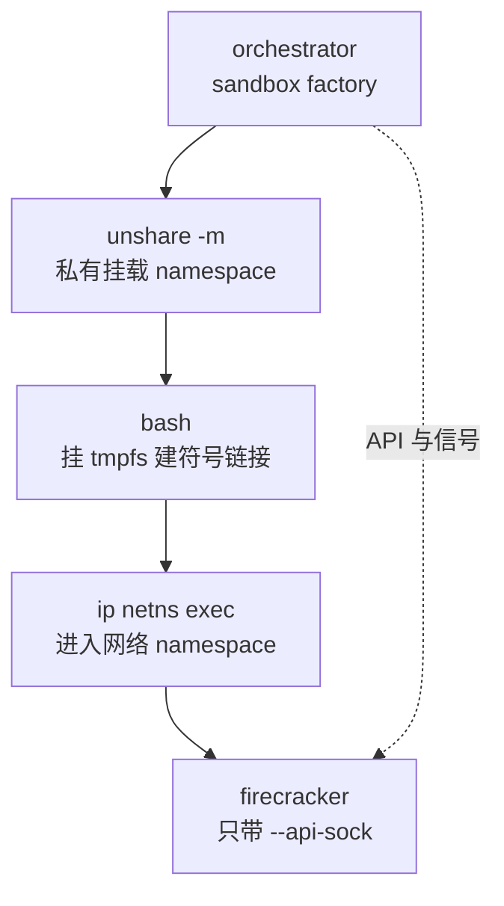

# 63 · 与 e2b infra 的对接：版本目录、内核参数与 RPM

> Firecracker 不是被人手工启动的，它由 orchestrator 用一条 shell 命令拉起，命令行上只有一个参数。
> 本篇从 Firecracker 进程的角度看它的调用方：谁启动它、以什么身份启动、二进制与内核从哪个目录取、
> 启动之后收到的 API 调用是哪几条、以及在不使用 jailer 的部署里，jailer 本来提供的那些性质由谁接手。
>
> **读者**：系统工程师、运维。　**预备**：[第 43 篇 · jailer](43-jailer.md)、
> [第 62 篇 · aarch64 的 seccomp 过滤器](62-aarch64-seccomp-filter.md)。　**代码**：
> `packages/orchestrator/internal/sandbox/fc/`（orchestrator 侧）、
> `e2b-infra.spec`、`e2b-deploy/dep/init-client.sh`（部署侧）、
> `src/vmm/src/vmm_config/machine_config.rs`、`src/vmm/src/arch/aarch64/fdt.rs`（Firecracker 侧）

---

## 0. 本篇要回答的问题

1. 一个 Firecracker 进程是怎么被拉起来的，命令行上到底有什么、没有什么？
2. 不使用 jailer 之后，文件系统边界、网络隔离、身份、资源限额分别由谁提供，哪一项其实没人提供？
3. Firecracker 在一次冷启动与一次快照恢复里分别收到哪些 API 调用，顺序为什么是这个顺序？
4. 内核命令行里哪些参数是 x86_64 专有的，aarch64 上为什么 `console=ttyS0` 仍然成立？
5. 二进制与内核在宿主磁盘上的位置是怎么约定的，`/fc-versions/v1.13.1/` 这个版本号是什么意思？
6. 从一份 Firecracker 源码到装进机器的 RPM，中间经过哪几步？

---

## 1. 谁启动 Firecracker

启动命令由 orchestrator 的 `fc/script_builder.go` 用模板拼出来，
再由 `fc/process.go` 的 `NewProcess()` 交给 `unshare` 执行：

```bash
unshare -m -- bash -c '
mount --make-rprivate / &&
mount -t tmpfs tmpfs /fc-vm -o X-mount.mkdir &&
ln -s <宿主上的 rootfs 链接> /fc-vm/rootfs.ext4 &&
mkdir -p /fc-vm/<内核版本目录> &&
ln -s <宿主上的内核文件> /fc-vm/<内核版本目录>/vmlinux.bin &&
ip netns exec <网络命名空间> /fc-versions/<版本>/firecracker --api-sock /tmp/fc-<沙箱 id>-<随机 id>.sock'
```

这条命令说明了四件事。

**第一，Firecracker 的命令行上只有 `--api-sock`。** 没有 `--seccomp-filter`、没有 `--no-seccomp`、
没有 `--config-file`、没有 `--log-path`、没有 `--metrics-path`。所有配置都走 API；
日志与 metrics 走进程的标准输出，由 `fc/process.go` 的 `configure()` 接到结构化日志里。
没有 `--no-seccomp` 意味着**嵌入的默认过滤器是生效的** —— 前提是二进制用 release 构建，
debug 构建会被换成空表（[第 62 篇](62-aarch64-seccomp-filter.md)）。

**第二，`unshare -m` 加 `mount --make-rprivate /` 给了它一个私有的挂载 namespace。**
随后挂上的那块 tmpfs 与两个符号链接只在这个 namespace 里可见，沙箱之间互不干扰，
进程退出时挂载点随 namespace 一起消失。这解决的是「每台 microVM 都要在固定路径上看到自己的 rootfs 与内核」
这个问题 —— Firecracker 的 API 里 `boot-source` 与 `drives` 收的是路径，
用固定路径加 per-sandbox namespace 比给每台沙箱生成不同路径要简单。

**第三，`ip netns exec` 把进程放进一个预先建好的网络 namespace。**
tap 设备、地址与路由都在这个 namespace 里由 orchestrator 的网络槽位准备好，
Firecracker 只负责按名字打开 tap。这一项与 jailer 的 `--netns` 参数是同一种做法。

**第四，整条链最终只剩一个进程。** `p.cmd.Process.Pid` 拿到的是 `unshare` 那个直接子进程的 PID，
而这个 PID 被两处使用：停机时 `Stop()` 往它发 SIGTERM、十秒不退再发 SIGKILL；
暂停后导出内存时 `fc/memory.go` 的 `ExportMemory()` 把它交给跨进程内存读取。
后者要求这个 PID 就是 Firecracker 本身。**推论**：`bash -c` 与 `ip netns exec` 都在链的末端
把自己 `exec` 成下一个程序，所以 `unshare` 的子进程最终就是 Firecracker 进程。

Firecracker 自己不注册 SIGTERM 处理函数（`src/vmm/src/signal_handler.rs`），
所以 SIGTERM 走的是内核的默认动作，进程直接终止，不做 guest 侧的有序关机。



---

## 2. 不用 jailer 之后，这些性质由谁提供

[第 43 篇](43-jailer.md)把 jailer 的职责拆成了五类。两层改动都没有修改 `src/jailer/` 的代码，
但两层的部署都不使用它。下表把每一类对照着看。

| 性质 | jailer 的做法 | 这套部署的做法 |
|---|---|---|
| 文件系统边界 | `pivot_root` 进 jail 目录并卸载旧根，进程再也看不到宿主文件树 | **没有等价物**。挂载 namespace 只隔离挂载点，不缩小可见范围；进程能 `openat` 宿主上任何它有权限打开的文件 |
| 设备节点 | jail 内 `mknod` 出 `/dev/kvm`、`/dev/net/tun`、`/dev/urandom`、`/dev/userfaultfd` | 直接用宿主的设备节点 |
| 身份 | `exec` 时切到非特权 uid/gid | **不降权**。进程继承 orchestrator 的身份 |
| 资源限额 | `--cgroup` 写属性并把 PID 加进去；`--resource-limit` 设 rlimit | cgroup 放置的代码在 ARM 适配的 orchestrator 里被整段注释掉了；rlimit 没有等价物 |
| 网络隔离 | `--netns` 加入预建的网络 namespace | 同样的做法，用 `ip netns exec` |
| 系统调用边界 | 与 jailer 无关，由 Firecracker 自己装 | 不变，默认过滤器照常生效 |

有两行需要展开。

**文件系统边界这一行是空的。** [第 62 篇](62-aarch64-seccomp-filter.md)提到过，
`openat` 在三类线程里都是无条件放行的，seccomp 不能按路径过滤。jailer 在的时候，
这条放行规则的实际影响被 chroot 后那棵只有几个节点的树限住了；jailer 不在，
这条规则就是字面意义上的「能打开进程有权限打开的任何文件」。而这个进程还没有降权。
换句话说，**第 43 篇里那句「两道边界叠起来才构成那道边界」，在这套部署里只剩了一道。**
这是一个如实要说清楚的取舍：收益是启动路径短、路径布置简单、不必为每台沙箱复制一份二进制与内核；
代价是 microVM 逃逸之后的第二道防线只剩 seccomp。

需要同时说清楚的是这道缺口的**边界**：它只在「攻击者已经在 Firecracker 进程里执行任意代码」
这个前提之后才起作用。guest 里的代码本身仍然被 KVM 关着，网络仍然被网络 namespace 关着，
一台沙箱看不到另一台沙箱的 tap 与地址。真正被削弱的是纵深：上游的威胁模型假设了两层，
这里只剩一层，而那一层（seccomp）按设计就不管「作用于哪些对象」这件事。
把这条写进文档而不是留给下一个人去发现，是这一节存在的理由。

**资源限额这一行的状态需要精确描述。** 上游 e2b 的 orchestrator 在
`fc/process.go` 的 `configure()` 里用 `CLONE_INTO_CGROUP` 把子进程原子地放进一个 per-sandbox 的
cgroup v2 目录；ARM 适配的 orchestrator 把这段代码整段注释掉了，同时
`internal/sandbox/cgroup/manager.go` 把「宿主没有 cgroup v2」从错误降级成了一条日志加空实现。
两处改动合起来的后果是：在这套部署里 Firecracker 进程不进任何 per-sandbox cgroup，
单台沙箱的 CPU 与内存用量不受进程级限额约束。这是为了让服务能在 cgroup v1 的宿主上跑起来而付的代价，
属于明确的技术债。

---

## 3. Firecracker 看到的 API 调用序列

orchestrator 通过 Unix socket 上的 HTTP 与 Firecracker 说话，客户端在 `fc/client.go`。
两条路径的调用序列如下，「客户端函数」一列给的是 `fc/client.go` 里的函数名。

| 阶段 | 方法与路径 | 客户端函数 |
|---|---|---|
| 冷启动 ① | `PUT /boot-source` | `setBootSource` |
| 冷启动 ② | `PUT /drives/rootfs` | `setRootfsDrive` |
| 冷启动 ③ | `PUT /network-interfaces/<id>` 与 `PUT /mmds/config` | `setNetworkInterface` |
| 冷启动 ④ | `PUT /machine-config` | `setMachineConfig` |
| 冷启动 ⑤ | `PUT /entropy` | `setEntropyDevice` |
| 冷启动 ⑥ | `PUT /actions`（`InstanceStart`） | `startVM` |
| 恢复 ① | `PUT /snapshot/load`（uffd 后端，`resume_vm=false`） | `loadSnapshot` |
| 恢复 ② | `PATCH /vm`（`Resumed`） | `resumeVM` |
| 恢复 ③ | `PUT /mmds` | `setMmds` |
| 暂停 ① | `PATCH /vm`（`Paused`） | `pauseVM` |
| 暂停 ② | `PUT /snapshot/create`（只给 `snapshot_path`） | `createSnapshot` |
| 暂停 ③ | `GET /memory` 或 `GET /memory/dirty` | `memoryInfo` / `dirtyMemory` |
| 暂停 ④ | `GET /memory/mappings` | `memoryMapping` |

几个约束值得单独指出，它们都是 Firecracker 侧的规则在调用方身上留下的痕迹。

**顺序不是习惯，是 Preboot 状态机的要求。** `PUT /actions` 之后 microVM 进入 Runtime 状态，
`boot-source`、`drives`、`network-interfaces`、`machine-config` 这些配置端点都不再接受写入
（[第 09 篇 · rpc_interface](09-rpc-interface.md)）。`PUT /mmds/config` 必须在网络接口存在之后调用，
因为它要按接口 id 指定哪些接口上提供元数据服务；而 `PUT /mmds`（写数据）在恢复路径上排在
`PATCH /vm` 之后，因为数据里带着这次恢复才知道的沙箱标识。

**`PUT /snapshot/create` 只给 `snapshot_path`。** 不给 `mem_file_path`，
所以这次调用不写内存文件，只序列化 vmstate 并把块设备排空刷盘；内存由 orchestrator 随后自己从进程里读走。
这是 e2b 定制版给 `create` 加的可选内存文件语义，[第 54 篇](54-optional-memfile-snapshot.md)详讲。

**`GET /memory/dirty` 与 `GET /memory` 二选一，取决于这台沙箱是不是从快照拉起的。**
前者读 `/proc/self/pagemap` 判脏，后者只用 `mincore` 判常驻。在 aarch64 上前者需要
`pread64` 在白名单里，这就是[第 62 篇](62-aarch64-seccomp-filter.md)那条规则存在的原因。

**API 是同步的，一次一条。** Firecracker 的 API 线程只负责解析并把 `VmmAction` 投进通道，
真正执行的是 vmm 线程；vmm 线程一次处理一个请求，处理期间事件循环不转。
对调用方的含义是：上表里每一条都是阻塞调用，而其中几条的耗时正比于内存大小
（`PUT /snapshot/create` 要序列化 vmstate，`GET /memory/dirty` 要逐页读 pagemap）。
orchestrator 因此把「暂停 microVM」与「导出内存」拆成了两段：前一段调 API，
后一段用跨进程读绕开 Firecracker，不让导出的开销落在 vmm 线程上。

**这套部署不开 KVM 的脏页日志。** `setMachineConfig()` 根本不设置 `track_dirty_pages` 字段，
`loadSnapshot()` 传的是 `EnableDiffSnapshots: false`。脏页的真相在 userfaultfd 与 pagemap 一侧，
不在 KVM 的日志一侧。这个选择在 checkpoint / restore 扩展里被改变（[第 65 篇](65-dirty-tracking-backend.md)）。

### 3.1 machine-config 上的两处架构差异

`setMachineConfig()` 在 ARM 适配的 orchestrator 里与上游版本有两处不同，都能追到 Firecracker 的代码。

一是 `smt` 从 `true` 改成 `false`。`src/vmm/src/vmm_config/machine_config.rs` 的
`MachineConfig::update()` 里有一个 `#[cfg(target_arch = "aarch64")]` 分支：
`smt` 为真直接返回 `MachineConfigError::SmtNotSupported`。传 `true` 的话 microVM 根本配不起来。

二是 `track_dirty_pages` 字段被整个去掉，不再显式传 `false`。这一处是等价改写：
字段省略时序列化不会出现在请求体里，Firecracker 保留它当前的值，而默认值就是 `false`。

### 3.2 内核命令行

内核命令行是一张 `map[string]string`：`fc/kernel_args.go` 只定义了 `KernelArgs` 这个类型
与把它拼成按键排序字符串的 `String()`，参数本身在 `fc/process.go` 里逐条填进去，
再通过 `PUT /boot-source` 的 `boot_args` 传给 Firecracker。
按架构分支的代码也在 `fc/process.go`，ARM 适配的 orchestrator 把其中五项挪进了这个分支：

| 参数 | 作用 | 这套部署里的条件 |
|---|---|---|
| `pci=off` | 关闭 PCI 扫描 | 仅 x86_64 |
| `i8042.nokbd`、`i8042.noaux` | 关闭 i8042 键鼠探测 | 仅 x86_64 |
| `random.trust_cpu=on` | 信任 CPU 的随机数指令 | 仅 x86_64 |
| `clocksource=kvm-clock` | 指定时钟源 | 仅 x86_64 |
| `ip=…`、`init=…`、`panic=1`、`reboot=k`、`quiet`、`loglevel` | 网络、init、故障行为、日志 | 两个架构相同 |

前四项都对应 x86_64 才有的平台设施：Firecracker 的 aarch64 上没有 PCI、没有 i8042
（legacy 设备只有一个 RTC 与串口，见[第 19 篇](19-aarch64-platform.md)）、也没有 kvm-clock
这个 para-virtual 时钟源，aarch64 用的是架构定时器。留着它们不会报错，但都是空转。

打开内核日志时加的 `console=ttyS0` 两个架构共用，这一项**在 aarch64 上也是对的**：
Firecracker 在 aarch64 上给串口生成的 FDT 节点里写的
`compatible` 是 `ns16550a`（`src/vmm/src/arch/aarch64/fdt.rs` 的 `create_serial_node()`），
也就是说它模拟的仍是 16550 兼容串口，不是 PL011，guest 内核枚举出来的设备名因此是 `ttyS0`。
这也解释了为什么 arm64 的 guest 内核配置必须带 8250 驱动。

---

## 4. 宿主磁盘上的布局

Firecracker 二进制与内核文件的位置是 orchestrator 与部署脚本之间的一份约定：
orchestrator 按「目录名即版本名」拼路径（`fc/config.go` 的 `FirecrackerPath()` 与 `HostKernelPath()`），
部署脚本负责把文件铺到那些目录里。

```text
/fc-versions/<FirecrackerVersion>/firecracker      ← 可执行文件，来自 RPM
/fc-kernels/<KernelVersion>/vmlinux.bin            ← guest 内核，来自 RPM
/fc-vm/                                            ← 每台沙箱一块 tmpfs（挂在私有挂载 namespace 里）
    rootfs.ext4                                    ← 符号链接，指向宿主上的 COW 文件
    <KernelVersion>/vmlinux.bin                    ← 符号链接，指向 /fc-kernels 下的同名文件
/tmp/fc-<沙箱 id>-<随机 id>.sock                    ← API socket
/tmp/uffd-<沙箱 id>-<随机 id>.sock                  ← uffd 后端的 socket
/mnt/hugepages                                      ← hugetlbfs 挂载点，大页内存从这里来
```

`<FirecrackerVersion>` 与 `<KernelVersion>` 都是随建模板请求传下来的字符串，
最终落在模板元数据里（`internal/template/metadata/template_metadata.go` 的 `FirecrackerVersion` 字段），
恢复一台沙箱时按元数据里的版本名去找二进制。请求没带就用编译进去的默认值。
**目录名只是寻址用的标签，它与二进制里真正的版本没有任何机制保证一致** —— 下一节就是这件事。

`/fc-vm` 这块 tmpfs 与两个符号链接的组合让 Firecracker 在每台沙箱里看到的路径完全相同，
代价是 rootfs 与内核都多一层符号链接，而 Firecracker 打开它们时是跟随链接的。

---

## 5. 版本号这件事

这套部署里「版本」出现在四个地方，四个地方的值并不一致：

| 位置 | 值 | 来源 |
|---|---|---|
| 源码 | v1.12.1 加两层改动 | `src/firecracker/swagger/firecracker.yaml` 的 `info.version` 是 `1.12.1` |
| 构建产物目录名 | `v1.12.1_<7 位提交哈希>` | `scripts/build.sh` 把 swagger 里的版本号与 `git rev-parse --short=7 HEAD` 拼起来 |
| 部署目录名 | `/fc-versions/v1.13.1/` | `e2b-deploy/dep/init-client.sh` 里写死的 `FIRECRACKER_VERSION=1.13.1` |
| 调用方默认值 | `v1.13.1` | ARM 适配的 orchestrator 把 `packages/shared/pkg/feature-flags/flags.go` 里的 `DefaultFirecackerV1_12Version` 从 `v1.12.1_a41d3fb` 改成了 `v1.13.1` |

后两处必须相等，否则 orchestrator 找不到二进制，建模板会在第一步失败；
它们与前两处不需要相等，因为没有任何一段代码去核对。这件事的来龙去脉在
[e2b 手册第 70 篇](../e2b-infra/70-firecracker-fork.md)讲过，这里只留一个对读者有用的结论：

**在这套体系里，版本号标识的是「宿主上的哪一个目录」，不是「哪一套 API 面」。**
一个叫 `v1.13.1` 的目录里放的可能是 1.12.1 源码加两层补丁的产物，
而这个产物比上游 v1.13.1 多两个端点、少一个特性。真正能标识 API 面的只有提交哈希：
上游用它，e2b 定制版的 `v1.12.1_a41d3fb` 也用它，唯独部署目录名把它丢掉了。
升级时唯一可靠的核对手段是 `GET /version` 与二进制的构建来源，不是目录名。

这件事对升级的影响是具体的。换一个 Firecracker 二进制进 `/fc-versions/v1.13.1/` 不需要动任何代码，
也不会触发任何检查；已经存在的模板元数据里记的还是同一个版本名，恢复时会用上新的二进制。
如果新旧二进制的快照格式不兼容，失败点会出现在 `PUT /snapshot/load`，
而不是出现在部署的那一刻（[第 41 篇](41-snapshot-tools-and-compat.md)）。
安全的做法是给新产物换一个目录名并同步改默认值，让新旧两份并存，
而不是原地替换 —— 这也是上游把提交哈希放进版本名的原因。

---

## 6. 从源码到机器

单机离线部署把 Firecracker 当成一个预编译产物随 RPM 分发，链路是这样的：

1. **构建**。在 aarch64 机器上跑 `scripts/build.sh`，产出
   `build/fc/v1.12.1_<hash>/firecracker`（release 构建，静态链接 musl）。
2. **入包**。产物以 `firecracker.arm` 的名字作为 `e2b-infra.spec` 的 `Source8`；
   `%install` 段里用 `%ifarch aarch64` 把它装到 `/opt/e2b-infra/bin/firecracker`。
   `%files` 段里这一项同样带 `%ifarch aarch64` —— **x86_64 的包里不含定制 Firecracker**。
   同一段还装了 `vmlinux.bin`（`Source4`，arm64 guest 内核）与一个 openEuler 6.6 的内核变体（`Source6`）。
3. **铺开**。`init-client.sh` 在每台 client 节点上跑：建 `/fc-versions/v1.13.1/`，
   把 `/opt/e2b-infra/bin/firecracker` 拷进去；建 `/fc-kernels/` 下的几个版本目录，
   把同一个内核二进制拷成几份（目录名是给 orchestrator 寻址用的标签，见[第 61 篇](61-guest-kernel-on-arm.md)）；
   挂 hugetlbfs 到 `/mnt/hugepages`。

第 3 步里有一个细节值得记住。重新部署时上一轮的沙箱进程可能还在执行那个二进制，
直接 `cp` 覆盖会得到 `ETXTBSY`：内核不允许以写方式打开正在被执行的文件。
脚本的做法是先 `rm -f` 再 `cp` —— unlink 只是删掉目录项，正在运行的老进程继续用旧 inode，
新文件写到新 inode，两者互不影响。这是一个通用的替换手法，代价是旧 inode 的磁盘空间
要等最后一个执行它的进程退出才释放。

另有一条基于 XFS 与 reflink 取磁盘差分的部署路线，Firecracker 侧只少
`PUT /snapshot/save-dirty-bitmap` 一个端点，其余完全相同（[第 68 篇](68-save-dirty-bitmap-api.md)）。

---

## 7. 小结

- Firecracker 由 `unshare -m -- bash -c '… && ip netns exec <ns> firecracker --api-sock <path>'` 拉起，
  命令行上只有 `--api-sock`，所以嵌入的默认 seccomp 过滤器生效，其余配置全部走 API。
- 挂载 namespace 里的一块 tmpfs 加两个符号链接，让每台沙箱在相同路径上看到自己的 rootfs 与内核。
- 整条链最后只剩一个进程，orchestrator 拿到的 PID 就是 Firecracker 的 PID，
  停机时对它发 SIGTERM（Firecracker 不注册该信号，走内核默认动作），暂停后用它跨进程读内存。
- 不用 jailer 之后：网络隔离与系统调用边界不变，文件系统边界没有等价物，进程不降权，
  cgroup 放置的代码在 ARM 适配的 orchestrator 里被注释掉、cgroup v2 缺失被降级成空实现，
  所以进程级资源限额实际上没有人提供。
- 冷启动六步、恢复三步、暂停四步；顺序由 Preboot / Runtime 状态机与设备依赖决定。
- `PUT /snapshot/create` 只给 `snapshot_path`，内存由调用方自己从进程里读走；
  这套部署不开 KVM 脏页日志，脏页判据在 pagemap 与 uffd 一侧。
- aarch64 上 `smt` 必须为 `false`（`MachineConfig::update()` 的 cfg 分支会拒绝 `true`）；
  `pci=off`、`i8042.*`、`random.trust_cpu`、`clocksource=kvm-clock` 被挪进 x86_64 分支；
  `console=ttyS0` 在 aarch64 上仍然成立，因为 FDT 里串口的 `compatible` 是 `ns16550a`。
- `/fc-versions/<版本>/firecracker` 与 `/fc-kernels/<版本>/vmlinux.bin` 是调用方与部署脚本之间的约定，
  目录名只是寻址标签。
- 部署目录名 `v1.13.1` 与源码版本 1.12.1 无关：版本号在这里标识目录，不标识 API 面；
  能标识 API 面的只有提交哈希。
- RPM 只在 aarch64 上打包定制 Firecracker；`init-client.sh` 用「先 unlink 再复制」绕开 `ETXTBSY`。

---

## 延伸阅读 / 下一篇

- [第 64 篇 · checkpoint / restore 扩展总览](64-checkpoint-extension-overview.md)：本部分后半段的起点，调用序列会再长出两个端点。
- [第 61 篇 · ARM 上的 guest 内核](61-guest-kernel-on-arm.md)：`/fc-kernels/` 下那几个目录里到底是什么。
- [第 43 篇 · jailer](43-jailer.md)：本篇第 2 节对照的那一套。
- [e2b 手册第 28 篇](../e2b-infra/28-firecracker-process-management.md)：orchestrator 侧的进程管理全貌。
- [e2b 手册第 70 篇](../e2b-infra/70-firecracker-fork.md)：分叉版本与版本号约定的由来。
- [e2b 手册第 71 篇](../e2b-infra/71-orchestrator-arm-fc-changes.md)：ARM 适配对 orchestrator 侧的全部改动。
- [checkpoint / restore 手册第 09 篇](../../e2b-infra-docs/rollback/docs/09-firecracker-api-contract.md)：扩展端点的调用契约。
