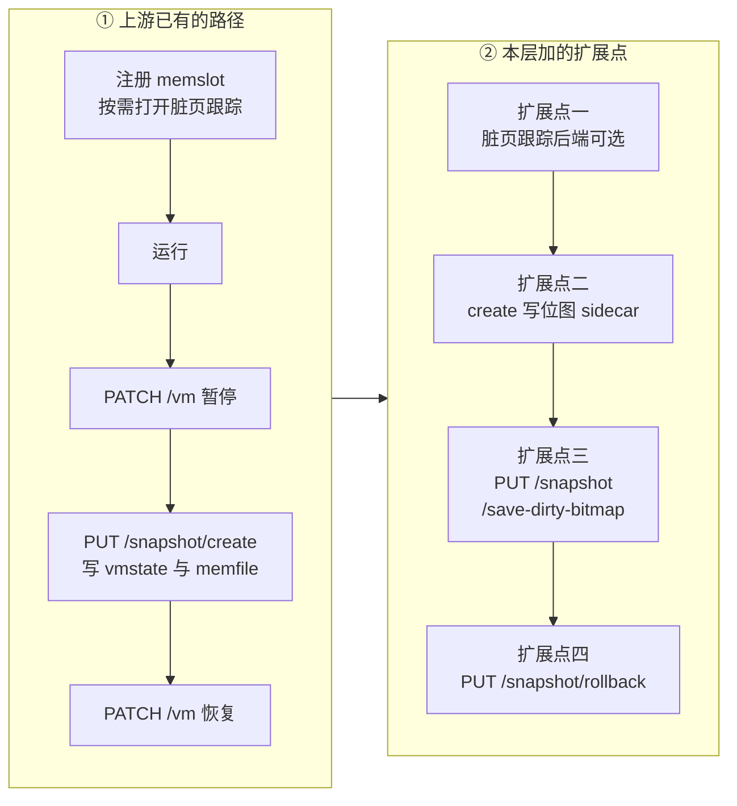
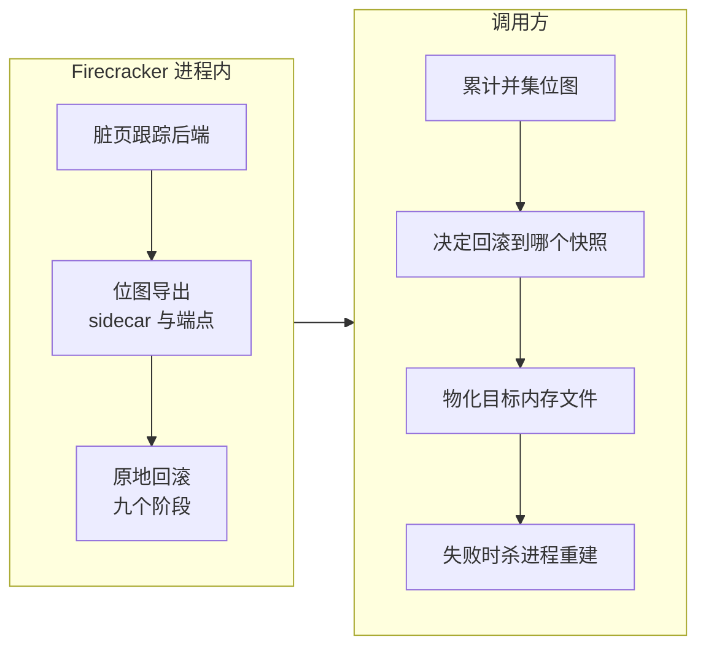

# 64 · checkpoint / restore 扩展总览：目标、四个扩展点与分工

> 上游的快照只有两个方向：把一台运行中的 microVM 写成文件，或者从文件里造一台新的 microVM。
> 本部分要讲的扩展加了第三个方向：让一台**已经在跑的** microVM 退回到自己过去的某个时刻，
> 进程、KVM fd、内存映射、tap 全部留在原地。本篇给出这条路线的成本论证、四个扩展点的位置，
> 以及哪些事情 Firecracker 做、哪些留给调用方。
>
> **读者**：系统工程师。　**预备**：[第 36 篇 · 快照总览](36-snapshot-overview-and-format.md)、
> [第 37 篇 · 创建快照](37-snapshot-create.md)、[第 38 篇 · 加载快照](38-snapshot-load.md)、
> [第 14 篇 · 脏页跟踪](14-dirty-page-tracking.md)。
> **代码**：`src/vmm/src/rollback.rs`、`src/vmm/src/vstate/vm.rs`、`src/vmm/src/vstate/memory.rs`、
> `src/vmm/src/rpc_interface.rs`、`src/vmm/src/vmm_config/snapshot.rs`

---

## 0. 本篇要回答的问题

1. 「从快照重建一台 microVM」的成本由哪几块构成，哪一块随虚机规模增长？
2. 原地回滚想把成本函数改成什么形状，为此必须保住哪些宿主资源？
3. ARM 适配版在 Firecracker 上加了哪四个扩展点，它们分别落在快照生命周期的哪个位置？
4. 这些扩展一共改了哪些文件，各自对应本部分的哪一篇？
5. 它和 e2b 定制版那三个只读的内存查询端点是什么关系，两套接口会不会打架？
6. 哪些事情这一层**不做**，留给调用方或干脆不支持？

---

## 1. 问题：恢复的成本随虚机规模走，而不是随改动量走

上游 v1.12.1 提供的恢复路径只有一条：`PUT /snapshot/load`，在一个**新的** Firecracker 进程里
按状态文件重建整台 microVM（[第 38 篇](38-snapshot-load.md)）。这条路径要付的代价可以拆成四块：

1. **进程与内核对象**：新进程、`/dev/kvm` 打开、`KVM_CREATE_VM`、每个 vCPU 一次 `KVM_CREATE_VCPU`、
   GIC 创建与配置、memslot 注册。
2. **设备重建**：按 `DeviceStates` 逐个造出 block、net、rng 对象，重新申请 eventfd，
   重新向 KVM 注册 irqfd 与 ioeventfd，重新打开磁盘文件，重新绑定 tap。
3. **宿主侧资源重新接线**：新的 fd 号、新的映射地址、新的 netns 内套接字，
   调用方那边所有指向旧进程的引用都要换。
4. **工作集回填**：guest 内存或者从内存文件 mmap 进来，或者交给 userfaultfd 按需填
   （[第 39 篇](39-uffd-backend.md)）。前者把成本推给缺页，后者把成本推给用户态填页服务，
   但两者都要在 guest 重新跑起来之后把**整个工作集**再摸一遍。

前三块与虚机规模基本无关，第四块与规模强相关。于是「恢复一台 8 GiB 的沙箱」和
「恢复一台 512 MiB 的沙箱」差别很大，而与「这台沙箱自上次快照以来改了多少东西」几乎无关。

对一个只想把沙箱退回几秒钟前的调用方来说，这个成本函数是错的。它付的是**虚机有多大**，
而它真正想付的是**世界偏离了多少**。两者之间往往差几个数量级：一台跑着语言运行时的沙箱，
一秒钟里被写过的页可能只有几千页，而它的工作集是几十万页。

---

## 2. 目标：把成本函数换成「偏离量」

原地回滚的做法是不换进程。VMM 进程、`/dev/kvm` 与 VM fd、vCPU fd、guest 内存的 mmap、
eventfd 与 irqfd / ioeventfd 注册、tap、磁盘 fd 全部保持原样，只把**偏离的部分**写回去：
脏页、vCPU 寄存器与内核侧 vCPU 状态、GIC 状态、设备的逻辑状态。
这段论证写在 `src/vmm/src/rollback.rs` 的文件头注释里。

代价换来的是三个新的前提条件，它们贯穿第 69 到 73 篇：

- **拓扑必须一致。** 状态要写到活着的对象上，所以目标快照描述的 vCPU 数、内存大小、
  设备集合与激活状态必须与当前进程完全对得上，否则没有对象可写。重建路径没有这个约束。
- **必须知道哪些页偏离了。** 写回量取决于一张位图，而这张位图的正确性是安全性质：
  少一页就是静默的数据损坏。第 3 节的前三个扩展点都是在解决这张位图从哪来。
- **中途失败没有回头路。** 一旦开始往 guest 内存写，虚机就同时含有两个时刻的状态，
  再往下任何一步失败都不能「算了不回滚」。这催生了一个新的虚机状态 `Faulted`（第 73 篇）。

还有一个容易被忽略的收益：调用方一侧不需要重新接线。进程还是那个进程，
API socket 还是那个 socket，netns 里的 tap 还是那个 tap，沙箱的网络连接、
挂在上面的监控与代理都不必知道刚刚发生过一次回滚。重建路径则相反 ——
新进程意味着新的 fd、新的 socket 路径、新的 PID，调用方那一侧的记账要跟着换一遍。
这部分成本不在 Firecracker 内部，但在一个要频繁做 checkpoint 的系统里是真实存在的。

另外一条与成本无关但同样重要：回滚之后 guest 的时间被拨回去了，
而 guest 内部的随机数种子、UUID 缓存之类的东西并不知道。
`src/vmm/src/devices/acpi/vmgenid.rs` 新增的 `refresh_generation()` 就是用来通知它的（第 72 篇）。

---

## 3. 四个扩展点

下图把四个扩展点放回快照的生命周期里。左列是上游本来就有的动作，右列是这一层加的。

### 3.1 扩展点一：脏页跟踪后端可选

上游只有一种脏页来源：给 memslot 打上 `KVM_MEM_LOG_DIRTY_PAGES`，由 KVM 写保护每一个干净页，
guest 第一次写就陷出一次（[第 14 篇](14-dirty-page-tracking.md)）。
在 aarch64 上这是唯一可用的来源 —— e2b 定制版那条基于 `/proc/self/pagemap` 与 uffd 写保护位的判据
在这个架构上不成立（第 52 篇、第 57 篇）。

`src/vmm/src/vstate/vm.rs` 新增 `DirtyTrackingBackend` 与 `Vm::setup_dirty_tracking()`，
把后端做成三选一：关闭、KVM 写保护、鲲鹏的硬件脏页跟踪 HDBSS（hardware dirty bit state structure）。
三者向上给出的是同一张 KVM 位图，区别只在采集方式。见[第 65 篇](65-dirty-tracking-backend.md)
与[第 66 篇](66-hdbss.md)。

### 3.2 扩展点二：`create` 顺手写出一张位图 sidecar

`CreateSnapshotParams` 加了可选字段 `dirty_bitmap_path`（`src/vmm/src/vmm_config/snapshot.rs`）。
给了它，`snapshot_memory_to_file()` 在写完内存文件之后，把「这次快照实际写进内存文件的页集合」
序列化成一个独立的小文件。页索引按内存文件偏移算，与内存区域在文件里的平铺顺序一致，
调用方因此不需要知道 guest 的物理地址布局。Full 快照产出的是一张全 1 的位图，语义一致：所有页都写了。
见[第 67 篇](67-dirty-bitmap-sidecar.md)。

### 3.3 扩展点三：`PUT /snapshot/save-dirty-bitmap`

只导出位图，不导出内存。用于调用方在两次快照之间把「当前这一段里脏了哪些页」取走，
累计成回滚需要的那张并集位图。实现在 `src/vmm/src/rollback.rs` 的 `save_dirty_bitmap()`，
要求虚机处于 Paused。它维持了一条与快照路径相同的不变量：
`KVM_GET_DIRTY_LOG` 的读取是破坏性的，所以读完先折叠进用户态位图，信息不会因为这次导出而丢失
（[第 14 篇 §4](14-dirty-page-tracking.md#4-合并dump_dirty)）。见[第 68 篇](68-save-dirty-bitmap-api.md)。

### 3.4 扩展点四：`PUT /snapshot/rollback`

主体。`rollback.rs` 的 `rollback_snapshot()` 在 VMM 线程上、虚机 Paused 的前提下执行，
世界是冻结的：没有 vCPU 在跑，没有设备事件在处理，没有人能观察到中间状态。
代码注释把它编号成十个阶段：校验拓扑、设备静默、取脏页位图并求并集、写回内存、写回 vCPU、
写回 GIC、写回设备逻辑状态、刷新 VMGenID、重置脏页基线，最后一个阶段是重新踢一遍设备队列 ——
它不在 `rollback_snapshot()` 里，而是落在随后那次 `resume_vm()` 上，因为每一次恢复都无条件踢。
第三阶段结束处是提交点（commit point），之前失败无副作用，之后失败置 `Faulted`。
响应里带回写页数、字节数与七段计时。
见[第 69 篇](69-rollback-api-and-phases.md)到[第 72 篇](72-rollback-devices.md)。

### 3.5 附带的两样东西

一是虚机状态多了 `VmState::Faulted`（`src/vmm/src/vmm_config/instance_info.rs`），
`resume_vm()`、`pause_vm()` 与 `create_snapshot` 都会拒绝它（第 73 篇）。
二是 `InstanceInfo` 多了 `dirty_tracking` 字段，把当前用的是哪个后端上报出去，
让调用方可以在「这台机器真的开了硬件跟踪」这个前提上做门控，而不是事后从延迟曲线里猜。

---

## 4. 改动清单

下表按主题把改动归组。行数取自 `git diff --stat`，含注释与单元测试。

| 主题 | 主要文件 | 规模 | 篇目 |
|---|---|---|---|
| 脏页跟踪后端 | `vstate/vm.rs`、`arch/aarch64/vm.rs`、`builder.rs`、`vmm_config/instance_info.rs` | 约 +190 | 65、66 |
| 位图 sidecar 与格式 | `vstate/memory.rs`、`vmm_config/snapshot.rs`、`persist.rs` | 约 +300 | 67 |
| 回滚主体与导出端点 | `rollback.rs` 新文件 | +656 | 68–72 |
| 控制面接线 | `rpc_interface.rs`、`api_server/request/snapshot.rs`、`parsed_request.rs` | 约 +95 | 68、69 |
| vCPU 原地写回 | `vstate/vcpu.rs`、`arch/aarch64/vcpu.rs`、`arch/x86_64/vcpu.rs`、`lib.rs` | 约 +110 | 71 |
| 设备原地写回 | `devices/virtio/persist.rs`、`net/device.rs`、各设备 `persist.rs`、`acpi/vmgenid.rs` | 约 +100 | 72 |
| seccomp 与 API 文档 | `resources/seccomp/aarch64-unknown-linux-musl.json`、`swagger/firecracker.yaml` | +66 / +95 | 73 |

合计约 +1660 行，分布在 27 个文件上；其中一个文件是新增的 `rollback.rs`，其余都是在既有路径上挂钩子。
这个比例本身说明了设计取向：回滚尽量复用上游的保存 / 恢复代码，
新代码集中在「怎么把已有的状态写到活着的对象上」这一件事上。

---

## 5. 与 e2b 定制版三个只读端点的关系

e2b 定制版加的 `GET /memory/mappings`、`GET /memory`、`GET /memory/dirty`
（第 50、51、52 篇）全部保留，没有被改动。它们和本部分的扩展面向两种不同的取数方式：

| 维度 | e2b 的三个只读端点 | 本层的位图与回滚接口 |
|---|---|---|
| 内存数据怎么出去 | 调用方按宿主虚拟地址自己读进程内存 | Firecracker 自己写内存文件 |
| 脏页判据 | `/proc/self/pagemap` 的软脏位与写保护位 | KVM 脏页日志（∪ 用户态位图） |
| 在 aarch64 上 | 判据退化，见[第 57 篇](57-which-fork-commit-and-uffd-wp.md) | 可用，且可由硬件采集 |
| 恢复方向 | 无 | `PUT /snapshot/rollback` |

这两套接口对应两种部署形态。e2b 定制版的做法是把 Firecracker 当成一个内存的只读窗口：
暂停之后由调用方按宿主虚拟地址把脏块读走，Firecracker 自己不写内存文件
（[第 54 篇](54-optional-memfile-snapshot.md)）。本层的做法相反，
把内存文件与位图的产出都交回给 Firecracker，因为回滚要把文件里的页读回 guest 内存，
这件事只有 Firecracker 进程做得到 —— 它是那段映射的持有者。

两套接口共存但不共享判据，所以不会互相污染。要注意的只有一点：
`GET /memory/dirty` 与 `save-dirty-bitmap` 都读脏页信息，但前者读 pagemap、不动 KVM 日志，
后者读 KVM 日志且读完即清。混用时位图的归属要由调用方自己算清楚（第 68 篇）。

---

## 6. 分工：原语在这里，策略在调用方

这一层只提供原语，不做决策。下图是边界。

具体说：Firecracker 不知道快照之间的血缘关系，不维护差分树，不合并内存文件，
不判断「该不该回滚」，也不在回滚失败后自救。它要求调用方交给它一个**完整**的目标内存文件，
和一张**覆盖了所有偏离页**的位图；这两个前提任何一个不成立，回滚都会产生静默错误而不是报错。
这条契约以及调用方一侧的实现在 checkpoint / restore 手册里，本书只在延伸阅读中链接。

这条分工线的位置不是任意的。判断「应该回滚到哪一代快照」需要知道快照之间的血缘、
每一代的存储位置与有效期，这些信息只存在于调用方的账本里；而「把一页从文件读进 guest 内存」
需要持有那段映射的进程来做。把决策放在有信息的一侧、把执行放在有能力的一侧，
是这一层所有接口形状的由来：每个新端点都是「给我一个已经算好的输入，我在原地执行」。

反过来，`Faulted` 状态的存在本身就是这个分工的产物：Firecracker 能做的只是把损坏如实标出来、
拒绝一切会掩盖它的操作，剩下的由调用方杀进程重建。

---

## 7. 明确不支持的部分

如实列出边界，避免读者按印象使用：

- **balloon 与 vsock**：`validate_topology()` 直接拒绝 —— 快照里有，或者当前虚机里有，都拒绝。
  balloon 的页面归还语义与内存写回冲突，vsock 有跨越回滚面的宿主侧连接。
- **vhost-user 块设备**：设备状态里 `virtio_state()` 返回 `None`，无法原地写回，校验阶段即拒绝。
  这与上游 v1.12.1 快照本来就不含 vhost-user 块设备是同一个原因（第 29 篇）。
- **x86_64**：`restore_state_in_place()` 在 x86 一侧只是转发到既有的 `restore_state()`，
  代码能编译，但本项目不在 x86 上部署，未验证。
- **HDBSS 缓冲区溢出计数**：内核侧没有向用户态暴露接口，Firecracker 看不见（第 66 篇）。
- **大页与 userfaultfd 后备内存下的回滚**：写回是 VMM 进程的普通写，与这两种后备的交互见第 70 篇。

### 7.1 已知的技术债

这一层留下了几处「代码能跑、但下一个读的人会被误导」的地方，如实列在这里，后面各篇各自展开：

- `VcpuEvent::RestoreState` 的文档注释还写着「由一个标志在两种做法之间选择」，
  而这个事件实际上只携带一个 `Arc<VcpuState>`，不带任何标志：写回路径已经收敛成一条，
  注释停留在收敛之前（第 71 篇）。
- 几个错误变体的名字与它们现在承担的语义对不上（例如 `SaveVcpuState` 也被回滚的写回路径复用），
  改名会动到对外的错误文本，所以沿用了旧名（第 73 篇）。
- `Vm::get_dirty_bitmap()` 里那条计时日志没有开关、也没有进 metrics 体系，属于定型后应当收敛的诊断手段（第 65 篇）。
- 硬件脏页跟踪的两个参数用环境变量而不是 API 字段，不可按虚机配置、不可观测（第 65 篇）。

---

## 8. 小结

- 上游恢复路径的成本 = 进程与内核对象重建 + 设备重建 + 宿主资源重新接线 + 工作集回填；只有最后一块随虚机规模走，却往往是最大的一块。
- 原地回滚保住全部宿主资源，只写回偏离部分，把成本换成与脏页量成正比。
- 换来的三个前提是：拓扑必须一致、必须有一张覆盖全部偏离页的位图、越过提交点后失败不可逆。
- 四个扩展点分别解决：脏页从哪采（65、66）、快照顺手告诉调用方写了哪些页（67）、
  不导内存也能取走脏页集合（68）、把状态写回活着的虚机（69–72）。
- 附带两样东西：`VmState::Faulted` 让损坏不可掩盖，`InstanceInfo.dirty_tracking` 让后端可被门控。
- 约 +1660 行分布在 27 个文件，其中 `rollback.rs` 一个新文件占 656 行，其余是在既有路径上挂钩子。
- e2b 定制版的三个只读端点原样保留，与本层的位图接口判据不同、互不污染，但混用时位图归属要调用方算清。
- Firecracker 只提供原语：差分树、回滚决策、目标内存文件的物化、失败后的重建都在调用方。
- 明确不支持 balloon、vsock、vhost-user 块设备；x86_64 一侧代码存在但未验证。
- 已知技术债集中在四处：一条过时的事件文档注释、几个名实不符的错误变体、一条无开关的计时日志、两个环境变量开关。

---

## 延伸阅读 / 下一篇

- 下一篇：[第 65 篇 · 脏页跟踪后端](65-dirty-tracking-backend.md) —— 四个扩展点中最底层的那个。
- [第 69 篇 · PUT /snapshot/rollback](69-rollback-api-and-phases.md) —— 九个阶段的完整展开。
- [第 73 篇 · 失败模型与 Faulted](73-failure-model-faulted-and-seccomp.md) —— 提交点之后的错误怎么处理。
- [第 57 篇 · 迁入的版本与被放弃的 uffd 写保护](57-which-fork-commit-and-uffd-wp.md) —— 为什么脏页判据必须回到 KVM 一侧。
- [第 38 篇 · 加载快照](38-snapshot-load.md) —— 本篇第 1 节拆解的那条重建路径。
- checkpoint / restore 手册 [`11-in-place-rollback.md`](../../e2b-infra-docs/rollback/docs/11-in-place-rollback.md)、
  [`09-firecracker-api-contract.md`](../../e2b-infra-docs/rollback/docs/09-firecracker-api-contract.md)：调用方一侧的契约与实现。
