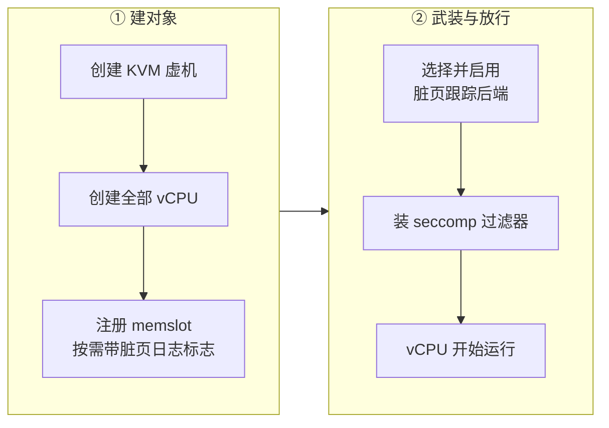

# 65 · 脏页跟踪后端：KVM 写保护与 HDBSS

> 差分快照与原地回滚都建立在「哪些页脏了」这个判断上，而上游只给了一种采集方式：
> 让 KVM 写保护每一个干净页，用陷出换信息。本篇讲 ARM 适配版怎么把这个采集方式抽象成可替换的后端，
> 什么时候武装它、怎么在硬件跟踪不可用时退回软件路线，以及为什么「退回」这件事必须能被上层看见。
>
> **读者**：系统工程师。　**预备**：[第 14 篇 · 脏页跟踪](14-dirty-page-tracking.md)、
> [第 13 篇 · guest 内存](13-guest-memory.md#4-注册给-kvm一个区域一个-memslot)、
> [第 64 篇 · checkpoint / restore 扩展总览](64-checkpoint-extension-overview.md)。
> **代码**：`src/vmm/src/vstate/vm.rs`、`src/vmm/src/arch/aarch64/vm.rs`、`src/vmm/src/builder.rs`、
> `src/vmm/src/lib.rs`、`src/vmm/src/vmm_config/instance_info.rs`

---

## 0. 本篇要回答的问题

1. 在 aarch64 上，脏页判据为什么只剩 KVM 日志这一条路？
2. `DirtyTrackingBackend` 的三个取值分别对应什么，它们对上层的输出有区别吗？
3. 「是否武装脏页跟踪」这个判断的依据是什么，为什么不直接看配置项？
4. 后端选择发生在哪两条路径的哪个位置，为什么必须是那个位置？
5. 硬件跟踪不可用时会发生什么，`FC_HDBSS_REQUIRED` 改变了什么？
6. 用环境变量做开关的代价是什么？

---

## 1. 问题：一个架构上少了两条判据

一台 microVM 的脏页信息在上游 v1.12.1 有两个来源：KVM 的脏页日志与 Firecracker 自己的用户态位图
（[第 14 篇](14-dirty-page-tracking.md)）。e2b 定制版在旁边加了第三条，
用 `/proc/self/pagemap` 的软脏位配合 uffd 写保护位，让调用方不经过快照路径就能问出脏页
（第 52 篇、第 53 篇）。

这第三条在 aarch64 上不成立。ARM 适配版迁入的那个版本没有带 uffd 写保护那一段，
原因是 arm64 内核不提供写保护模式的 userfaultfd（第 57 篇）。
没有写保护，pagemap 里那一位恒为 0，判据退化成「常驻即脏」，对差分毫无价值。
于是在这个架构上，脏页信息重新收敛回 KVM 日志一侧。

问题随之变成：KVM 日志这一侧本身贵不贵。上游的采集方式是给 memslot 打上
`KVM_MEM_LOG_DIRTY_PAGES`，KVM 在 stage-2 页表里把干净页设成只读，
guest 第一次写就陷出一次，KVM 在陷出处理里标脏并放开写权限。
信息是准的，代价是每个干净页的第一次写都要付一次 VM exit。
对一个「快照一次就把位图清一次」的系统来说，每个 checkpoint 周期里这笔账都要重付一遍。

鲲鹏 950 提供的硬件脏页跟踪 HDBSS（hardware dirty bit state structure）正是针对这一点：
由 CPU 自己把脏页记下来，不再需要写保护与逐页陷出。它的机制与内核接口在
[第 66 篇](66-hdbss.md)。本篇讲 Firecracker 这一侧怎么把两种采集方式放进同一个位置。

---

## 2. 三种后端

`src/vmm/src/vstate/vm.rs` 新增了枚举 `DirtyTrackingBackend`，有三个取值，
并在 `VmCommon` 里加了字段 `dirty_tracking` 记录当前用的是哪一个：

| 取值 | `as_str()` | 含义 | 采集方式 |
|---|---|---|---|
| `Off` | `off` | 没有武装脏页跟踪 | 无 |
| `KvmWriteProtect` | `kvm-wp` | KVM 写保护跟踪 | 干净页只读，首次写陷出 |
| `Hdbss` | `hdbss` | 硬件脏页跟踪 | CPU 写入每 vCPU 的缓冲区，VM exit 时由 KVM 收集 |

关键一点：**三者对上层的输出完全一样**。HDBSS 不提供独立的位图接口，
它记录的内容最终仍然汇入同一张 KVM memslot 脏页位图，
Firecracker 仍然用 `Vm::get_dirty_bitmap()` 里的 `KVM_GET_DIRTY_LOG` 把它取出来，
`dump_dirty()` 的合并逻辑一个字都不用改（[第 14 篇 §4](14-dirty-page-tracking.md#4-合并dump_dirty)）。
后端之间的差别只表现在运行时开销上。

这个性质是这套抽象成立的前提，也是它最大的风险，第 5 节回到这一点。

---

## 3. 什么时候武装：看区域有没有位图

`Vm::setup_dirty_tracking()` 做的第一件事不是读配置，而是看内存区域：

```rust
let armed = self
    .guest_memory()
    .iter()
    .any(|region| region.bitmap().is_some());

if !armed {
    self.common.dirty_tracking = DirtyTrackingBackend::Off;
    return Ok(());
}
```

判据选在这里是有理由的。`register_memory_region()` 决定一个 memslot 要不要带
`KVM_MEM_LOG_DIRTY_PAGES`，用的正是同一个表达式 `region.bitmap().is_some()`
（[第 13 篇 §4](13-guest-memory.md#4-注册给-kvm一个区域一个-memslot)）。
换句话说，「区域带用户态位图」和「memslot 开了 KVM 脏页日志」是同一件事的两面，
而 HDBSS 只有在 memslot 开了脏页日志时才有意义 —— 它是那条链路的加速器，不是替代品。
用同一个表达式判定，两者不会错位。

反过来说，如果直接去读 `track_dirty_pages` 配置项，就得在两条构建路径上各读一次，
还要处理「配置说开、但内存区域因为别的原因没带位图」这种不一致。看内存区域的实际形态更可靠。

代价是 `setup_dirty_tracking()` 必须在内存区域注册之后调用，这是一条顺序约束，见下一节。

不武装的后果同样值得说清楚：没有开脏页跟踪的沙箱不会被分配 HDBSS 缓冲区。
这个缓冲区是**每 vCPU 一份**的连续物理内存，让不做回滚的沙箱白占是一笔可观的浪费。

这个默认值在实际部署里是生效的：[第 63 篇 §3](63-integration-with-e2b-infra.md#3-firecracker-看到的-api-调用序列)
说过，那条基线上的 orchestrator 调 `PUT /machine-config` 时根本不传 `track_dirty_pages`，
`PUT /snapshot/load` 传的是 `enable_diff_snapshots: false`。
两处合起来的结果是内存区域不带用户态位图，`setup_dirty_tracking()` 走的是上面那条早退分支，
后端就是 `Off`，硬件跟踪根本不会被尝试。
换句话说，**本篇讲的选择逻辑要等调用方先把脏页跟踪打开才会进入**；
打开它是 checkpoint 形态的部署要做的第一件事，而不是这一层能自己决定的。

---

## 4. 在哪里调用

调用点在 `src/vmm/src/builder.rs`，两条路径各一处，都紧跟在 `register_memory_regions()` 之后：

- `build_microvm_for_boot()`：冷启动。
- `build_microvm_from_snapshot()`：从快照恢复。

两条都要接，因为 HDBSS 是绑定在 KVM VM 对象上的能力，不随快照继承：
从快照恢复会创建一个新的 VM 与新的一组 vCPU，能力必须重新启用。
对 e2b 形态的沙箱来说第二条才是常走的路 —— 沙箱几乎总是从模板快照起来的。

这个位置同时满足了内核侧对启用时序的三条要求（第 66 篇会展开）：



图中每一列内部的顺序都不能换。vCPU 在 `create_vmm_and_vcpus()` 里就已经创建，早于内存注册；内存注册决定了脏页日志标志；
`setup_dirty_tracking()` 排在两者之后、vCPU 启动之前。
另外它也早于 VMM 线程装 seccomp 过滤器那一步（`builder.rs` 里注释明确写着过滤器是构建的最后一步），
所以启用能力用的那个 ioctl 不需要出现在过滤器白名单里。
这与 userfaultfd 的注册发生在装过滤器之前是同一个模式（第 39 篇）。

---

## 5. 选择与回退

aarch64 一侧的逻辑是「先试，失败看策略」：

```rust
match self.enable_hdbss(order) {
    Ok(()) => { /* 记 Hdbss */ }
    Err(err) if required => return Err(VmError::HdbssRequired(err)),
    Err(err) => { /* 记日志，退回 KvmWriteProtect */ }
}
```

x86_64 一侧没有分支，武装了就是 `KvmWriteProtect`。

`required` 来自环境变量 `FC_HDBSS_REQUIRED`，取 `true` 或 `1` 时为真。
置了它，启用失败就是启动失败，错误一路变成 `VmError::HdbssRequired`；
没置，就打一条日志退回写保护跟踪。

为什么要有这个开关，要回到第 2 节那条性质：**两种后端的位图语义完全一致**。
退化之后功能正常、结果正确、接口不变，唯一的变化是每个干净页的首次写多一次陷出。
这类退化最难发现 —— 它不报错，不改变任何一个可见的返回值，
只在负载曲线上表现为「比预期慢一些」，而一条慢一些的曲线有太多别的解释。
把它变成一次明确的启动失败，是用可用性换可观测性：
一台本该用硬件跟踪的机器如果配置没生效，宁可起不来，也不要静悄悄地跑在慢路径上。

代价也要说清楚：这个开关是全进程一刀切的，
一台宿主机上如果既有需要回滚的沙箱又有不需要的，就只能按最严的那一档配，
或者根本不配。这是环境变量这种开关形式带来的限制，见下一节。

---

## 6. 两个环境变量的代价

除了 `FC_HDBSS_REQUIRED`，还有 `FC_HDBSS_ORDER` 决定每 vCPU 缓冲区的大小档位，默认 1。
两个都是环境变量，不是 API 字段。如实说，这是权宜做法，代价有三条：

1. **不可按虚机配置。** Firecracker 的其它资源参数都走 `PUT /machine-config` 之类的 API，
   可以每台 microVM 一套。环境变量在进程启动时就固定了，一台机器上所有沙箱共用一套取值。
2. **不可观测。** API 面上查不到当前进程用的是哪个档位。
   只有 `dirty_tracking` 这一个结果被上报出去，输入参数不上报。
3. **传递链条长。** 调用方要在拉起 Firecracker 的那一层把环境变量塞进去；
   如果中间隔着 jailer 或别的包装脚本，环境变量能不能原样传到位是另一件要验证的事。

换来的是改动面小：不需要动 `machine-config` 的结构体、序列化、API 校验与快照兼容性。
对一个只在特定机型上部署、参数还在调的特性来说，这个取舍是说得通的；
参数定下来之后它应该变成配置字段。

---

## 7. 结果上报：`dirty_tracking`

`InstanceInfo` 新增字段 `dirty_tracking: Option<String>`
（`src/vmm/src/vmm_config/instance_info.rs`），值就是 `DirtyTrackingBackend::as_str()`。
它不是静态存下来的，而是在 `src/vmm/src/lib.rs` 的 `Vmm::instance_info()` 里每次动态注入：

```rust
let mut info = self.instance_info.clone();
info.dirty_tracking = Some(self.vm.dirty_tracking().as_str().to_string());
```

有两个细节值得注意。一是字段带 `skip_serializing_if = "Option::is_none"`，
而 `GET /` 在启动前由 `PrebootApiController` 应答、返回的是它自己那份没有注入过的副本，
所以**启动之前这个字段根本不出现**，启动之后才出现。
`GET /` 的响应结构因此在两个阶段不同，调用方解析时要按可选字段处理。
二是这个字段没有进快照：它描述的是当前进程的运行时形态，恢复到另一台机器上就不再成立。

它的用处是让调用方把「这台沙箱能不能做低成本回滚」这件事建立在一个查得到的事实上，
而不是建立在「我们给这台机器配过环境变量」这个假设上。

---

## 8. 对既有路径的影响

除了新增的选择逻辑，本层对脏页读取路径只动了一处：`Vm::get_dirty_bitmap()` 里加了一个
`Instant` 计时，读完打一条日志。它不改变返回值，也不改变 `KVM_GET_DIRTY_LOG`
读取即清零的语义（[第 14 篇 §2.2](14-dirty-page-tracking.md#22-kvm_get_dirty_log-是取走不是查看)）。

代价是每次快照、每次回滚、每次导出位图都多一条日志。
这是为了让两种后端的采集开销在现场可比而留下的诊断钩子；
它没有开关，也没有进 metrics 体系（`latencies_us` 里没有对应项），
属于可以在定型后收敛的临时手段。

### 8.1 一个容易误判的地方

后端字段记的是「启用动作有没有成功返回」，不是「硬件确实在记录脏页」。
启用能力的 ioctl 成功只说明内核接受了这次请求并分配了缓冲区；
从那一刻到 guest 真的写出一个脏位之间还隔着 stage-2 页表的设置与 VM exit 时的收集。
Firecracker 这一层没有办法核对后半段，也不该假装能核对。
要确认整条链路通了，方法是做一次差分快照并检查产物里的页集合是否符合预期，
这属于集成验证的范围（推论：从代码只能看出启用成功与否，数据面的正确性只能由端到端的行为反推）。

---

## 9. 代价与边界

- 硬件跟踪只在鲲鹏 950 配特定内核上可用，别的机器一律走写保护路线；后端抽象本身是跨平台的，可用性不是。
- 两种后端语义一致，意味着单靠功能测试无法区分它们；验证「硬件跟踪真的生效了」要看 `dirty_tracking` 字段与内核日志。
- `Off` 不只是「没开跟踪」，它同时意味着 Diff 快照会被控制面拒绝、回滚拿不到 live 位图；这两件事的判据都在别处，这里只是如实记录状态。
- 缓冲区大小的取值目前靠环境变量，没有自适应；写压力超出缓冲区容量时的行为由内核决定，Firecracker 看不见（第 66 篇）。

---

## 10. 小结

- aarch64 上没有 uffd 写保护，pagemap 判据退化，脏页信息只能回到 KVM 日志一侧，于是这一侧的开销变成了关键问题。
- `DirtyTrackingBackend` 把采集方式抽象成 `Off` / `KvmWriteProtect` / `Hdbss` 三选一，记录在 `VmCommon.dirty_tracking`。
- 三种后端对上层输出完全一致：都汇入同一张 KVM 位图，`get_dirty_bitmap()` 与 `dump_dirty()` 不需要感知差别。
- 是否武装看的是「有没有区域带用户态位图」，与 memslot 是否带 `KVM_MEM_LOG_DIRTY_PAGES` 用同一个表达式，两者不会错位。
- 不武装就不分配硬件缓冲区；缓冲区是每 vCPU 一份的连续物理内存，不做回滚的沙箱不该付这笔钱。
- 调用点在 `builder.rs` 的冷启动与快照恢复两条路径上，都紧跟内存注册之后：满足内核的时序要求，且早于 seccomp 过滤器安装。
- 硬件跟踪启用失败默认退回写保护，`FC_HDBSS_REQUIRED` 把它变成启动失败；理由是语义一致的退化只表现为性能差，最难被发现。
- 两个环境变量是权宜之计，代价是不能按虚机配置、参数不可观测、依赖调用方正确传递。
- `InstanceInfo.dirty_tracking` 动态注入，启动前不出现、不进快照，给调用方一个可查的事实做门控。

---

## 延伸阅读 / 下一篇

- 下一篇：[第 66 篇 · HDBSS](66-hdbss.md) —— 硬件机制、KVM 能力号与启用时序的细节。
- [第 14 篇 · 脏页跟踪](14-dirty-page-tracking.md) —— 两张位图的语义与合并，本篇假定读者已经读过。
- [第 57 篇 · 迁入的版本与被放弃的 uffd 写保护](57-which-fork-commit-and-uffd-wp.md) —— 第 1 节那条判据为什么在 aarch64 上不成立。
- [第 67 篇 · dirty_bitmap_path](67-dirty-bitmap-sidecar.md)、[第 68 篇 · save-dirty-bitmap](68-save-dirty-bitmap-api.md) —— 采到的位图怎么交出去。
- [第 62 篇 · aarch64 的 seccomp 过滤器](62-aarch64-seccomp-filter.md) —— 哪些 ioctl 在哪个线程上被放行。
- checkpoint / restore 手册 [`07-dirty-page-tracking.md`](../../e2b-infra-docs/rollback/docs/07-dirty-page-tracking.md)：调用方一侧怎么使用这些位图。
