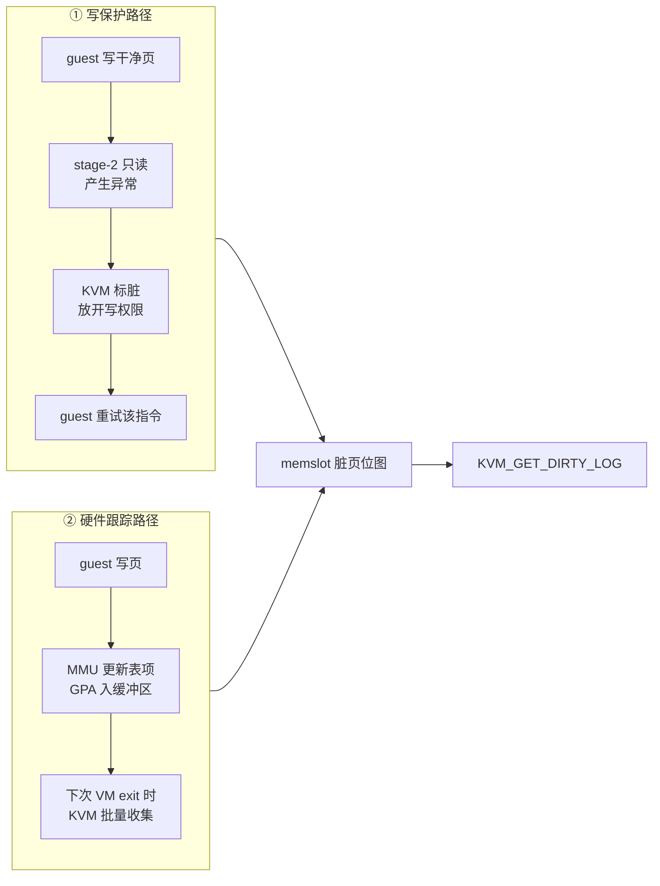

# 66 · HDBSS：鲲鹏硬件脏页跟踪与 KVM 能力

> 脏页跟踪的传统做法是把干净页写保护起来，用一次陷出换一位信息。ARM 的硬件脏页跟踪把这件事
> 交给 CPU：写发生时由硬件把地址追加进一个缓冲区，不再需要写保护，也不再有逐页陷出。
> 本篇讲这个机制的工作方式、它在 KVM 一侧的接口，以及 ARM 适配版怎么用四十行代码接上它、
> 为什么那四十行要绕开封装好的 crate。
>
> **读者**：系统工程师、对 aarch64 虚拟化感兴趣的读者。
> **预备**：[第 65 篇 · 脏页跟踪后端](65-dirty-tracking-backend.md)、
> [第 14 篇 · 脏页跟踪](14-dirty-page-tracking.md)、[第 03 篇 · 本书用到的 KVM API](03-kvm-api-primer.md)。
> **代码**：`src/vmm/src/arch/aarch64/vm.rs`、`src/vmm/src/vstate/vm.rs`

---

## 0. 本篇要回答的问题

1. 写保护式脏页跟踪的开销具体花在哪里，为什么它随「干净页数量」而不是「写入量」增长？
2. 硬件脏页跟踪把这条路径改成了什么，脏页信息最后仍然从哪个接口出来？
3. 内核与硬件要满足哪些前提，Firecracker 能检查其中的哪几条？
4. 启用它用的是哪个 KVM 接口，参数是什么意思？
5. 为什么这段代码直接调 `libc::ioctl` 而不用封装好的方法，那个 ioctl 号是怎么算出来的？
6. 启用的时机为什么必须卡在创建 vCPU 之后、vCPU 运行之前？
7. 缓冲区放不下的时候会发生什么，Firecracker 能观察到吗？

---

## 1. 问题：写保护跟踪的账

回顾[第 14 篇](14-dirty-page-tracking.md)：打开脏页跟踪，就是给 memslot 加上
`KVM_MEM_LOG_DIRTY_PAGES`。KVM 收到这个标志后，把该 memslot 在第二阶段页表
（stage-2，即 GPA 到宿主物理地址那一层）里的表项设成只读。
guest 往一个干净页写，MMU 在 stage-2 上撞到只读权限，产生一次异常，控制权交回 KVM，
KVM 在处理里把对应位置进 memslot 的脏页位图，然后放开写权限，再让 guest 重试那条指令。

这条路径的信息是准的，账也很清楚：**每一个干净页的第一次写付一次陷出**。
注意计费单位是「干净页的数量」，不是「写入的字节数」——
往同一页写一百万次只付一次，往一百万个页各写一个字节要付一百万次。

对一次性的热迁移来说这笔钱付得起：整个迁移过程里每页最多付一次。
对一个反复做 checkpoint 的系统就不一样了。每取走一次位图，KVM 的读是破坏性的，
表项重新变回只读（[第 14 篇 §2.2](14-dirty-page-tracking.md#22-kvm_get_dirty_log-是取走不是查看)），
于是下一个周期里，同一批页的第一次写又要各付一次陷出。
周期越短、checkpoint 越频繁，这笔钱重复得越快，而这恰恰是本部分想要的使用方式（[第 64 篇](64-checkpoint-extension-overview.md)）。

---

## 2. 硬件怎么做

鲲鹏 950 支持 ARM 的硬件脏页跟踪 HDBSS（hardware dirty bit state structure）。
思路是把「标脏」从异常处理里挪到 MMU 里：
stage-2 表项不再被写保护，而是打开 dirty bit management；
guest 写入时硬件自己更新表项，并把那一页的 GPA 追加进一个缓冲区。
缓冲区是每个 vCPU 一份，由内核在启用能力时分配。
到下一次 VM exit（任何原因的退出都行）时，KVM 遍历这个缓冲区，把里面的地址逐个标进
memslot 的脏页位图。

从 VMM 的角度看，出口没有变：仍然是 `KVM_GET_DIRTY_LOG`，仍然是每 memslot 一张位图。
硬件跟踪不提供独立的位图接口，它只是这条链路上换了一个数据来源。
下图把两条路径并排放在一起。



需要强调的是，两条路径给出的**信息是等价的**：都是页粒度，都记在同一张位图里，
没有一条比另一条更精确或更模糊。差分快照的产物因此不会因为换了后端而变大或变小。
这也意味着，单看快照产物无法分辨当前用的是哪条路径（[第 65 篇](65-dirty-tracking-backend.md)因此才要把后端上报出去）。

两条路径的差别集中在一点：写保护路径的代价与干净页数量成正比且**同步**发生在 guest 的执行流里，
硬件路径的代价变成一次批量的缓冲区扫描，**异步**发生在本来就要有的退出点上。

代价不是零。每个 vCPU 要占一块连续物理内存做缓冲区；
guest 写得太快、缓冲区在两次退出之间被写满时，硬件需要一条兜底路径把控制权交给内核，
这条路径本身也是开销。缓冲区大小因此是一个要调的参数，见第 4 节。

---

## 3. 前提条件

这个特性能用，要同时满足几条（依据仓库根的 HDBSS 调研文档与内核配置项）：

| 层次 | 条件 | 谁能检查 |
|---|---|---|
| 硬件 | CPU 实现了硬件脏页跟踪 | 内核 |
| 内核编译 | `CONFIG_ARM64_HDBSS=y` | 部署时检查内核配置 |
| 内核运行态 | KVM 运行在 VHE 模式 | 内核日志；非 VHE 下内核拒绝启用 |
| KVM 版本 | 带该厂商扩展补丁的内核（openEuler 的 6.6 分支），不是主线 | 能力号是否存在 |
| 虚机配置 | memslot 带 `KVM_MEM_LOG_DIRTY_PAGES` | Firecracker（[第 65 篇](65-dirty-tracking-backend.md)） |
| 互斥项 | 不同时使用 KVM 的 dirty ring | Firecracker 不使用 dirty ring |

Firecracker 只直接管最后两条。前四条它无法逐项核实，也没有必要：
启用动作本身会在任何一条不满足时失败，失败就按策略回退或拒绝启动（第 65 篇）。
这是一个合理的简化 —— 与其在用户态复刻一遍内核的检查逻辑，不如让内核给出唯一权威的答案。

---

## 4. KVM 接口

这个能力是厂商扩展，不在主线 KVM 里，能力号是 **502**，
在 `arch/aarch64/vm.rs` 里以本地常量 `KVM_CAP_ARM_HW_DIRTY_STATE_TRACK` 的形式写死。
启用方式是标准的 `KVM_ENABLE_CAP`，作用在 **VM fd** 上（不是系统 fd，也不是 vCPU fd），
参数结构是 `kvm_enable_cap`，只用两个字段：

```text
struct kvm_enable_cap {          偏移   长度
    __u32 cap;                     0      4     能力号，这里是 502
    __u32 flags;                   4      4     0
    __u64 args[4];                 8     32     args[0] = 缓冲区大小档位
    __u8  pad[64];                40     64     0
};                                       ----
                                          104
```

`args[0]` 不是字节数，是一个档位：在 4 KiB 页的宿主上，内核把它直接当作页分配的 order，
所以档位 1 是两页 8 KiB，档位 2 是 16 KiB，逐档翻倍，档位 9 是 2 MiB。
每个 vCPU 一份，且需要连续物理内存 —— 档位调大，分配失败的风险与内存浪费同步上升。
Firecracker 这边的默认值是 1，可以用环境变量 `FC_HDBSS_ORDER` 改（第 65 篇讲了这个开关的代价）。

---

## 5. 代码：四十行与一个写死的 ioctl 号

`ArchVm::enable_hdbss(order)` 构造 `kvm_enable_cap`，填能力号与档位，
然后**直接调 `libc::ioctl`**，成功返回 `Ok(())`，失败把 `errno` 包成
`vmm_sys_util::errno::Error` 返回给调用者。整个函数不做任何策略判断：
失败算不算致命，由 `Vm::setup_dirty_tracking()` 决定，因为那取决于部署策略，
而不是这个函数能看到的任何东西。

为什么不用 `kvm-ioctls` 提供的 `VmFd::enable_cap()`？因为在这个版本上它不存在于 aarch64。
`kvm-ioctls` 0.21.0 里那个方法带着
`#[cfg(any(target_arch = "x86_64", target_arch = "s390x", target_arch = "powerpc"))]`，
aarch64 不在列。绕开封装不是为了避开某个常量 —— 常量在本地定义一行就有了 ——
而是因为封装本身在这个架构上没有被编译出来。

于是 ioctl 号也要自己写：代码里是 `0x4068_AEA3`。这个数字可以逐段验证。
Linux 的 ioctl 编号由方向、参数长度、类型字与序号四段拼成：

```text
bit 31..30  方向      _IOW = 01          → 0x4000_0000
bit 29..16  参数长度  104 = 0x68         → 0x0068_0000
bit 15..8   类型字    KVMIO = 0xAE       → 0x0000_AE00
bit  7..0   序号      KVM_ENABLE_CAP     → 0x0000_00A3
                                          ------------
                                           0x4068_AEA3
```

参数长度 104 正是上一节那个结构体的大小，`kvm-bindings` 0.11.1 的 aarch64 绑定里有一条
编译期断言把它钉死在 104 字节。所以这个写死的号码不是魔数，是可以复算的。
代价仍然存在：它绕过了类型系统，换 crate 版本或换内核 ABI 时不会有任何编译错误提醒，
只会在运行时变成一个 `EINVAL`。

还有一处工程细节：这次 ioctl 发生在 VMM 线程装 seccomp 过滤器之前（第 65 篇 §4），
所以 aarch64 的过滤器里没有、也不需要有 `KVM_ENABLE_CAP` 这一条。
这是一个隐含依赖：如果将来有人把启用动作挪到运行期，它会立刻变成一次 `SIGSYS`。

---

## 6. 探测与回退

代码没有先做 `KVM_CHECK_EXTENSION` 探测，而是直接启用、失败即回退。
`kvm-ioctls` 在系统 fd 上是有 `check_extension_raw()` 可以用的，所以这是一个选择而不是限制。

两种做法的差别：先探测能把「内核根本没有这个能力」和「有能力但这次启用失败」区分开，
日志会更精确；直接启用则少一次系统调用、少一段代码，且结果一样 ——
能力号不存在时 ioctl 以 `EINVAL` 失败，走的是同一个回退分支。
本层选了后者，并把 `errno` 原样打进日志，让现场还能分辨失败原因。

---

## 7. 时序：为什么必须在创建 vCPU 之后

内核在启用这个能力时，只为**调用当时已经存在的** vCPU 分配缓冲区。
所以下面这个顺序是错的：建虚机、启用能力、再创建 vCPU —— 后创建的 vCPU 没有缓冲区。

正确顺序是：建虚机 → 创建全部 vCPU → 注册带脏页日志标志的 memslot → 启用能力 → 启动 vCPU。
Firecracker 的两条构建路径天然满足前两步（vCPU 在 `create_vmm_and_vcpus()` 里创建，
早于 `register_memory_regions()`），第三、四步由 `setup_dirty_tracking()` 的调用位置保证。
从快照恢复的路径也必须接上，因为能力绑定在 KVM VM 对象上，不随快照继承（第 65 篇 §4）。

这条时序约束在 Firecracker 上不难满足，因为它不支持 vCPU 热插拔：
vCPU 的数量在虚机配置阶段就定死了，构建期一次性创建完，运行期不再增减。
一个支持热插拔的 VMM 在这里会遇到真正的麻烦 —— 新插入的 vCPU 没有缓冲区，
而接口没有提供「为这一个 vCPU 补分配」的方式（推论：由「只遍历已存在的 vCPU」这一行为推得）。

---

## 8. 语义边界与看不见的部分

- **位图接口不变。** 启用之后 `KVM_GET_DIRTY_LOG` 的返回形式、破坏性读取的语义、
  与用户态位图合并的方式都不变。上层代码零改动正是靠这一点。
- **缓冲区溢出。** guest 写得比收集快时缓冲区会满。内核有兜底路径保证脏页信息不丢，
  代价是额外的退出（推论：由「满了触发异常交给内核」的机制推得；Firecracker 一侧看不到这条路径）。
- **溢出次数不可见。** 内核没有向用户态导出这个计数，Firecracker 也就没法把它做成 metrics。
  现场只能从内核日志侧面判断。这是一个已知的可观测性缺口。
- **档位没有自适应。** 写压力大的负载需要更大的缓冲区，但 Firecracker 不知道负载形态，
  也没有运行期调整接口；只能按部署经验事先设定。
- **启用成功不等于数据面正确。** 能力启用成功只说明内核接受了请求，
  端到端的正确性要靠一次差分快照的产物来验证（第 65 篇 §8.1）。

还有一条与代码无关但影响部署的边界：这个能力来自厂商分支的内核补丁，不在主线。
换一个内核版本、换一个发行版，能力号可能不存在，也可能存在但语义不同。
Firecracker 一侧的防线只有回退与 `FC_HDBSS_REQUIRED` 两条，
真正的约束要落在部署侧 —— 哪一台机器装哪个内核，这件事必须被管起来（第 60 篇、第 63 篇）。

---

## 9. 小结

- 写保护式脏页跟踪的成本单位是「干净页的数量」，且每取走一次位图就要重付一轮；checkpoint 越频繁越贵。
- 硬件脏页跟踪把标脏挪进 MMU：stage-2 表项不再写保护，GPA 由硬件追加进每 vCPU 的缓冲区，KVM 在 VM exit 时批量收集。
- 出口不变，仍然是 memslot 脏页位图与 `KVM_GET_DIRTY_LOG`；上层代码因此零改动。
- 前提有硬件、内核编译选项、VHE 模式、带补丁的 KVM、memslot 带脏页日志标志几条；Firecracker 只管最后一条，其余交给启用动作的成败来回答。
- 能力号 502 是厂商扩展、不在主线；启用走 `KVM_ENABLE_CAP`，作用在 VM fd 上，`args[0]` 是缓冲区大小档位而非字节数。
- 档位在 4 KiB 页宿主上就是页分配 order：1 为 8 KiB，逐档翻倍；每 vCPU 一份连续物理内存，调大有分配失败与浪费的风险。
- 直接调 `libc::ioctl` 的真实原因是 `kvm-ioctls` 0.21.0 的 `enable_cap()` 没有在 aarch64 上编译；写死的 `0x4068_AEA3` 可由方向、长度 104、类型字 `0xAE` 与序号 `0xA3` 复算出来。
- 启用发生在装 seccomp 过滤器之前，所以过滤器里不需要放行这个 ioctl；把它挪到运行期会立刻触发 `SIGSYS`。
- 内核只为已存在的 vCPU 分配缓冲区，因此启用必须排在创建全部 vCPU 与注册 memslot 之后、vCPU 运行之前，两条构建路径都要接。
- 缓冲区溢出的处理在内核里，溢出次数没有用户态接口，这是一个明确的可观测性缺口。

---

## 延伸阅读 / 下一篇

- 下一篇：[第 67 篇 · dirty_bitmap_path](67-dirty-bitmap-sidecar.md) —— 采到的脏页怎么交给调用方。
- [第 65 篇 · 脏页跟踪后端](65-dirty-tracking-backend.md) —— 本篇讲的启用动作被放在哪个决策里。
- [第 60 篇 · 鲲鹏 950 与 openEuler 宿主环境](60-kunpeng-openeuler-host.md) —— 宿主侧的能力清单与检查方法。
- [第 14 篇 · 脏页跟踪](14-dirty-page-tracking.md) —— 位图的语义与合并。
- [第 19 篇 · aarch64 平台](19-aarch64-platform.md) —— 这个架构上 KVM 对象的创建顺序。
- checkpoint / restore 手册 [`19-kunpeng-platform.md`](../../e2b-infra-docs/rollback/docs/19-kunpeng-platform.md)：平台侧的验证与部署要求。
