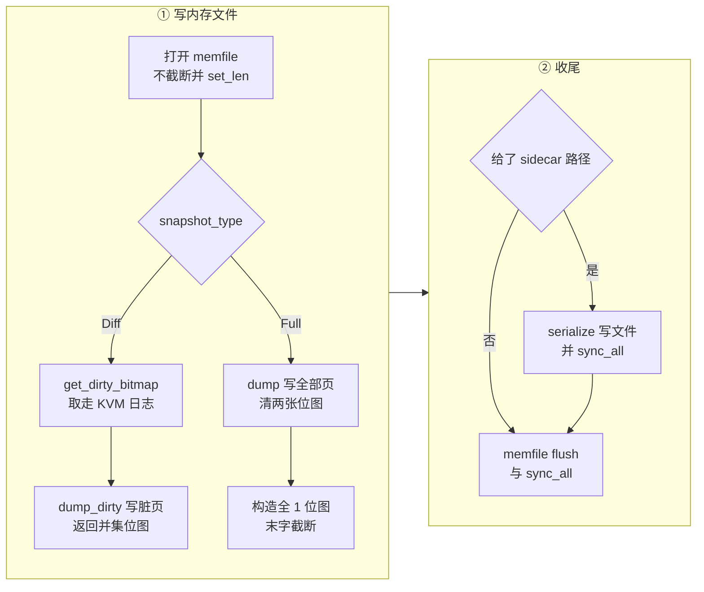

# 67 · dirty_bitmap_path：sidecar 与 FCDB 格式

> 一个 Diff 内存文件是稀疏的：它写了哪些页，文件本身并不直接告诉你。上游把这个信息在
> `dump_dirty()` 返回的那一刻就丢掉了，因为上游的使用场景里没人需要它。
> 需要高频 checkpoint 的调用方需要：它要把一轮轮的脏页集合并成一张累计表，才能决定一次原地回滚要写回哪些页。
> 本篇讲 ARM 适配版怎么把这份信息补出来 —— 一个可选的 sidecar 文件、一种四字节魔数的格式，
> 以及为此对 `dump_dirty()` 做的那处改动。
>
> **读者**：系统工程师、调用方的开发者。　**预备**：[第 14 篇 · 脏页跟踪](14-dirty-page-tracking.md)、
> [第 37 篇 · 创建快照](37-snapshot-create.md)、[第 64 篇 · checkpoint / restore 扩展总览](64-checkpoint-extension-overview.md)。
> **代码**：`src/vmm/src/vmm_config/snapshot.rs`、`src/vmm/src/vstate/memory.rs`、
> `src/vmm/src/vstate/vm.rs`、`src/vmm/src/persist.rs`

---

## 0. 本篇要回答的问题

1. 调用方为什么不能自己从内存文件里看出这次差分写了哪些页？
2. `dirty_bitmap_path` 是怎样一个参数，它与 `mem_file_path` 的依赖关系由谁检查、在什么时候检查？
3. `dump_dirty()` 返回的那张扁平位图，索引的是什么空间？为什么不是客户机物理地址？
4. Full 快照的 sidecar 里写的是什么，末尾那一个字为什么要截断？
5. FCDB 文件的字节布局是什么，解析时校验哪几件事？
6. sidecar 的写出时机与 `fsync` 顺序说明了什么样的取舍？它有哪些不能承担的用途？

---

## 1. 问题：稀疏文件不是一份可靠的页清单

回顾[第 37 篇](37-snapshot-create.md)：Diff 快照的内存文件是靠 `seek` 跳过干净页产生的，
干净页的位置从未被写过，在支持稀疏的文件系统上是空洞。于是一个很自然的想法是：
调用方用 `lseek(fd, off, SEEK_DATA)` 与 `SEEK_HOLE` 走一遍文件，把有数据的区间抠出来，
那不就是本轮的脏页集合吗。

这个想法有三处不成立。

第一，空洞与数据的边界是文件系统的实现细节，不是写入行为的忠实记录。
分配单位可能大于一页，一次写入可能让整个 extent 都变成「有数据」；
文件系统也可以出于自己的理由把一段全零的数据块折叠成空洞。
`SEEK_DATA` 给出的是「这里可能有数据」，不是「这一页被本轮写过」。

第二，Diff 允许就地合并进一个已经存在的全量内存文件（第 37 篇 §4）。
这种用法下整个文件从头到尾都是数据，`SEEK_HOLE` 一个空洞也找不到，本轮写了哪些页无从谈起。

第三，即使前两条都绕开了，得到的也只是「本轮」。做高频 checkpoint 的调用方要回答的问题是
「从第 k 个检查点到现在，一共有哪些页偏离了」—— 那是若干轮脏页集合的并集，
需要一份可以逐轮累加的数据结构，而不是一次文件系统扫描的结果。

结论是这份信息只有 Firecracker 自己知道，而且只在 `dump_dirty()` 逐页判定的那一瞬间知道。
上游的 `dump_dirty()` 返回 `Result<(), MemoryError>`，判定结果用完就扔。
ARM 适配版把它改成返回这张位图，再让 `snapshot_memory_to_file()` 按调用方的要求写进一个文件。

---

## 2. 参数：`dirty_bitmap_path`

`src/vmm/src/vmm_config/snapshot.rs` 的 `CreateSnapshotParams` 多了一个可选字段：

```json
{
  "snapshot_type": "Diff",
  "snapshot_path": "/snap/vmstate.k",
  "mem_file_path": "/snap/mem.k",
  "dirty_bitmap_path": "/snap/mem.k.bitmap"
}
```

字段带 `#[serde(default)]`，不传就是 `None`，行为与上游完全一致 ——
这是这一层所有扩展的共同形态：新能力挂在可选字段上，不改变原有请求的语义。

它对 `mem_file_path` 有硬依赖。位图描述的是「本次内存导出写了哪些页」，
没有内存导出时它没有可描述的对象。e2b 定制版把 `mem_file_path` 改成了可选
（[第 54 篇](54-optional-memfile-snapshot.md)），所以这个组合是可以被请求出来的，
`src/vmm/src/persist.rs` 的 `create_snapshot()` 因此加了一处检查，
不满足时返回 `CreateSnapshotError::DirtyBitmapWithoutMemFile`。

这处检查的位置值得留意：它在 `snapshot_state_to_file()` **之后**。
也就是说，一个只给了 `dirty_bitmap_path` 而没给 `mem_file_path` 的请求，
会先把状态文件完整地写到磁盘上，然后才失败返回。API 返回的是 400，
磁盘上却留下了一个完整的 vmstate 文件。这与[第 37 篇 §8](37-snapshot-create.md#8-代价与边界)
描述的上游行为是一致的 —— `create_snapshot()` 从不清理自己产生的中间文件 ——
但对一个纯粹的参数校验错误来说，把检查放在第一行本可以避免这个副作用。

---

## 3. 扁平位图：索引的是文件偏移，不是客户机物理地址

`dump_dirty()` 的签名改成返回 `Result<Vec<u64>, MemoryError>`。
返回的 `Vec<u64>` 是一张**扁平**位图：第 `i` 位对应内存文件里偏移 `i * page_size` 的那一页，
一个 `u64` 覆盖 64 页，字内按小端位序（第 `i` 位是 `1u64 << (i % 64)`）。

「扁平」这个词要对照第 13 篇讲的区域布局来理解。guest 内存由若干个区域组成，
区域在客户机物理地址空间里可以不连续 —— x86_64 上 4 GiB 以下与以上之间隔着 MMIO 窗口。
但它们在内存文件里是**顺序平铺**的：第二个区域紧接着第一个区域的末尾，中间没有空洞。
扁平位图用的就是后一个空间。函数内部维护 `writer_offset`（前面各区域长度之和），
每标一位都算一次 `flat_page = writer_offset / page_size + (i * 64) + j`。

选文件偏移空间而不是客户机物理地址空间，是为调用方省事：拿到位图的一方要做的事是
「按位号 `pread` 内存文件的对应位置」与「把若干张位图按位求或」，两件事都只关心文件。
它不需要知道这台 microVM 的内存被切成几段、每段的客户机物理基址是多少 ——
那些信息在 vmstate 文件里，解析它意味着调用方要跟着 Firecracker 的快照格式版本走。

代价是这张位图离开这台 microVM 就没有意义：两台内存大小不同、或者区域切分不同的 microVM，
同一个位号指的不是同一页。第 5 节讲的格式头因此要带上页大小与页数，第 69 篇的回滚入口也要逐项核对它们。

顺带修掉的一处是循环边界。KVM 位图按 64 页对齐地取整，一个页数不是 64 倍数的区域，
它的最后一个字里有若干位落在区域之外。上游的循环不区分这些位，因为它们在 KVM 侧恒为 0，
用户态位图的 `dirty_at()` 越界也只是返回 false，多跑几次空转不影响结果。
加了扁平位图之后它们变得有害：`flat_page` 会算进下一个区域的位号范围里去。
所以循环里补了一句 `if page_offset >= region.len() { break; }`。

---

## 4. Full 快照的位图

Full 快照不看位图、把每一页都写出去，所以它的「本次写了哪些页」是全集。
`src/vmm/src/vstate/vm.rs` 的 `snapshot_memory_to_file()` 在 Full 分支里直接构造这张全 1 位图：

```rust
let mut all = vec![u64::MAX; total_pages.div_ceil(64)];
if total_pages % 64 != 0 {
    if let Some(last) = all.last_mut() {
        *last = (1u64 << (total_pages % 64)) - 1;
    }
}
```

末字要截断，是因为位图的字数按 64 向上取整，而页数未必是 64 的倍数。
留着那些多余的 1 会让调用方把不存在的页也算进并集，回滚时按位号去 `pread` 内存文件会读到文件末尾之外。
把多余的位清零，位图的「置位数」就恒等于「本次写出的页数」，这个不变量对调用方的账本是有用的。

两个分支合起来的语义因此可以一句话概括：**sidecar 描述的是本次调用向内存文件写入的页集合**。
Full 是全部页，Diff 是两张脏位图的并集。它不是「自某个时刻以来脏过的页」，
也不是「内存文件中有内容的页」—— 后两者要由调用方自己用若干张 sidecar 求并集得到。

---

## 5. FCDB 格式

序列化与反序列化都在 `src/vmm/src/vstate/memory.rs`：`serialize_dirty_bitmap()` 与
`deserialize_dirty_bitmap()`。格式一共 24 字节头加一段位图字，全部小端：

```text
偏移  长度  内容
0     4     magic  = "FCDB"           (DIRTY_BITMAP_MAGIC)
4     4     version u32 = 1           (DIRTY_BITMAP_VERSION)
8     8     page_size u64             宿主页大小，字节
16    8     num_pages u64             内存文件覆盖的总页数
24    8*N   bitmap  u64 x N           N = ceil(num_pages / 64)
                                      字 w 的第 i 位 => 页 w*64+i
```

`deserialize_dirty_bitmap()` 返回 `(page_size, num_pages, words)`，在返回之前校验四件事：
长度至少 24 字节且前四字节是 `FCDB`；版本号等于 1，否则报
「unsupported dirty bitmap version」；`num_pages` 能转成 `usize`；
文件总长度**恰好**等于 `24 + N * 8`。最后一条是等号而不是不小于，
这样一个被截断或被追加过的文件不会被当成合法输入解析出一张短了一截的位图 ——
位图短一截意味着末尾那些页被当成干净页，而漏一页在回滚语境里就是数据损坏。

格式里没有校验和，也没有这张位图属于哪台 microVM、哪个快照的标识。
`page_size` 与 `num_pages` 只能挡住「拿错了内存大小完全不同的一份」，
挡不住「拿错了同规格的另一台 microVM 的一份」。这是一个明确的取舍：
sidecar 是调用方自己产生、自己保管、自己送回来的私有产物，
配对关系由调用方的账本维护，Firecracker 只负责让明显损坏的输入失败得干脆。

版本号留了升级空间，但目前只有 1，而且 `deserialize` 对其它版本一律拒绝，
不做向前兼容的降级读取。对一个产生者与消费者总是同时部署的格式来说这是合适的选择。

---

## 6. 写出的时机

下图是 `snapshot_memory_to_file()` 里 sidecar 的位置。



两处细节。

**sidecar 先于内存文件落盘。** 写 sidecar 的那一段用 `create + write + truncate(true)` 打开文件，
写完立刻 `sync_all()`，然后才轮到内存文件的 `flush()` 与 `sync_all()`。
顺序反过来也不会更安全：这两个文件之间没有可以靠顺序建立的约束，
真正要保证的是「`PUT /snapshot/create` 返回时两者都已落盘」，而这一点由两次 `sync_all()` 共同保证。
代价是一次快照多一次 `fsync`，落在暂停时长里。

**sidecar 的失败等同于快照的失败。** 三个错误分支（`open_bitmap`、`write_bitmap`、`sync_bitmap`）
都用 `CreateSnapshotError::MemoryBackingFile` 返回，整个 `create_snapshot()` 失败。
此时内存文件已经写完但还没 `sync`，状态文件已经落盘 —— 又一次「中间态留在磁盘上」。
调用方看到 `create` 失败就必须把这一轮的三个文件全部作废，不能只重试 sidecar。

**位图的清零已经发生。** 无论 sidecar 写成功还是失败，`dump_dirty()` 早已在成功路径上调过
`reset_dirty()`，KVM 侧也在 `get_dirty_bitmap()` 那一刻被取走。
换句话说，sidecar 写失败时这一轮的脏页信息已经不可重建 —— 内存文件里有内容，但没有描述它的位图。
这正是上面那条「三个文件一起作废」的原因：能作废的只有整轮，
而下一轮必须是 Full 快照，或者接受回滚时用一张不完整的累计位图。

---

## 7. 契约与边界

`src/vmm/src/vstate/memory.rs` 的两个单元测试把契约固定了下来。

`test_dump_dirty_returns_merged_flat_bitmap` 构造两个各两页的区域，中间在客户机物理地址空间里
隔一页，然后喂进一张 KVM 位图：区域 0 的第 0 页与区域 1 的第 1 页脏。
断言返回的位图是 `0b1001` —— 也就是扁平页 0 与扁平页 3。客户机物理地址空间里那一页的间隔不占位号，
这就是第 3 节说的「文件偏移空间」在测试里的样子。测试接着把这张位图序列化再反序列化，
断言三个字段原样回来，并断言截断的输入与被改坏魔数的输入都被拒绝。

`test_restore_dirty_is_dump_dirty_inverse` 用同样的布局验证逆操作：
按位图 `0b1001` 从文件写回，只有扁平页 0 与 3 的内容变成文件里的值，另外两页原样不动。
两个测试合起来说明的是同一件事：**sidecar 的位号空间与内存文件的偏移空间是同一个空间**，
写出与写回用的是同一套索引。写回那一侧是[第 70 篇](70-rollback-memory.md)的内容。

几条边界：

- **粒度是宿主页大小**，取自 `crate::utils::get_page_size()`。即使 guest 内存用 2 MiB 大页背，
  sidecar 也是 4 KiB 粒度，与[第 14 篇 §6](14-dirty-page-tracking.md#6-代价与边界)说的差分粒度一致。
  注意这与 e2b 定制版 `GET /memory/dirty` 的粒度不同，后者用的是
  `machine_config.huge_pages.page_size()`（[第 52 篇](52-memory-dirty-api.md)）。
  两个接口的位图不能混用。
- **Diff 的 sidecar 与内存文件必须成对保存。** 位图描述的是这一层差分写了什么，
  离开对应的那个内存文件（或者那次就地合并之后的全量文件）就无法解释。
- **它不提供累计集合。** 每次 `create` 得到的是本轮，累加是调用方的事；
  需要在两次 `create` 之间单独取一次累计增量时，用[第 68 篇](68-save-dirty-bitmap-api.md)的端点。
- **swagger 已更新。** `src/firecracker/swagger/firecracker.yaml` 的 `SnapshotCreateParams`
  里有 `dirty_bitmap_path` 及其「requires mem_file_path」的说明，与代码一致。

---

## 8. 小结

- 稀疏内存文件不能反推出「本轮写了哪些页」：`SEEK_DATA` 的粒度由文件系统决定，就地合并的用法更是连空洞都没有。
- `CreateSnapshotParams.dirty_bitmap_path` 是可选字段，不传时行为与上游一致；它要求同时给出 `mem_file_path`，否则 `DirtyBitmapWithoutMemFile`。
- 这处检查在状态文件写出之后才做，失败时磁盘上会留下一个孤立的 vmstate 文件。
- `dump_dirty()` 改为返回两张脏位图的并集，形式是一张按**内存文件偏移**索引的扁平位图，区域顺序平铺，客户机物理地址空间的空隙不占位号。
- 为此在逐页循环里补了区域末尾的边界判断，否则最后一个字里的越界位会污染下一个区域的位号。
- Full 分支直接构造全 1 位图并截断末字，使「置位数 = 本次写出的页数」成立。
- FCDB 是 24 字节头加位图字：魔数、版本、页大小、页数；解析时校验魔数、版本、页数可转换与文件长度精确匹配。
- 格式里没有校验和与快照标识，配对关系由调用方的账本负责；`page_size` 与 `num_pages` 只能挡住规格明显不符的输入。
- sidecar 在内存文件 `sync` 之前写出并单独 `fsync`；它的失败让整次 `create` 失败，而这一轮的脏位图已经被清掉，无法只重试 sidecar。
- 位图描述的是「本次写了什么」，不是「自某时刻以来脏了什么」；累计由调用方求并集完成。

---

## 延伸阅读 / 下一篇

- 下一篇：[第 68 篇 · PUT /snapshot/save-dirty-bitmap](68-save-dirty-bitmap-api.md) —— 不导出内存、只取一次脏位图的端点。
- [第 14 篇 · 脏页跟踪](14-dirty-page-tracking.md) —— 两张脏位图各自覆盖哪些写路径，合并发生在哪里。
- [第 37 篇 · 创建快照](37-snapshot-create.md) —— sidecar 挂在这条路径的哪一步上。
- [第 13 篇 · guest 内存](13-guest-memory.md) —— 区域、memslot 与「文件里顺序平铺」这条约定。
- [第 70 篇 · 回滚的内存写回](70-rollback-memory.md) —— 同一套位号空间的逆向使用。
- [第 76 篇 · API 端点总表](76-api-reference.md) —— `PUT /snapshot/create` 三层参数的对照。
- [checkpoint / restore 手册第 08 篇](../../e2b-infra-docs/rollback/docs/08-memory-diff-tree.md) —— 调用方怎么把一轮轮的 sidecar 累加成差分树。
