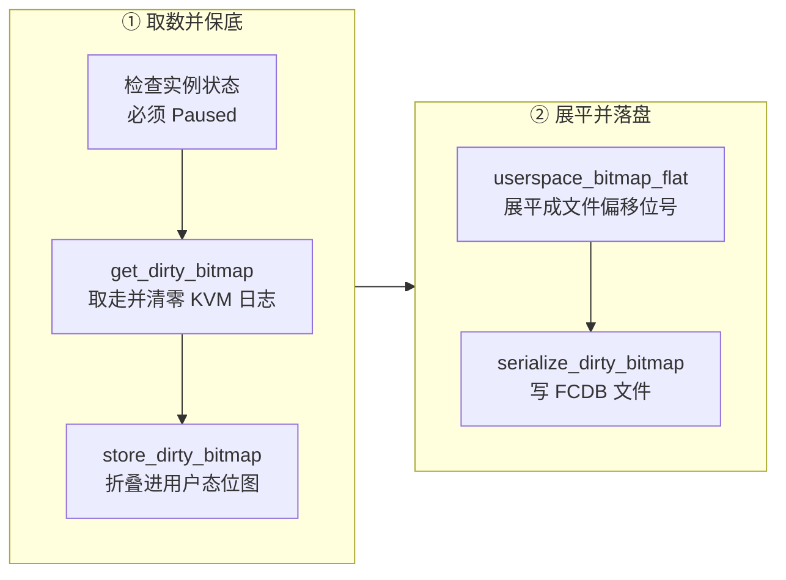

# 68 · PUT /snapshot/save-dirty-bitmap

> 快照把两件事绑在一起：导出内存，以及报告导出了哪些页。做高频 checkpoint 的调用方常常只要后者 ——
> 它想知道「从上一个检查点到现在，guest 碰了多少页」，据此决定这一轮要不要真的写一份差分。
> 上游没有这样的接口，因为上游的脏页读取是破坏性的：想看一眼就等于把记录取走了。
> 本篇讲 ARM 适配版怎么用一个端点解决这个矛盾，以及那条让「看一眼」变得安全的不变量。
>
> **读者**：系统工程师、调用方的开发者。　**预备**：[第 14 篇 · 脏页跟踪](14-dirty-page-tracking.md)、
> [第 67 篇 · dirty_bitmap_path](67-dirty-bitmap-sidecar.md)、[第 09 篇 · rpc_interface](09-rpc-interface.md)。
> **代码**：`src/vmm/src/rollback.rs`、`src/vmm/src/rpc_interface.rs`、
> `src/firecracker/src/api_server/request/snapshot.rs`、`src/vmm/src/vmm_config/snapshot.rs`

---

## 0. 本篇要回答的问题

1. 已经有了快照 sidecar，为什么还需要一个单独取脏位图的端点？
2. 这个端点接受什么参数、在什么状态下允许调用、返回什么？
3. 「KVM 的读是破坏性的」这条性质在这里造成了什么困难，代码用哪一步化解？
4. 连续调用两次，第二次拿到的是什么？中间插一次 `PUT /snapshot/create` 又会怎样？
5. 它与 `create` 的 sidecar、与 e2b 定制版的 `GET /memory/dirty` 分别差在哪里？
6. 它有哪些陷阱：脏页跟踪没开时会怎样、失败时怎么报、可观测性如何？

---

## 1. 问题：只想读数，不想导出

回顾[第 67 篇](67-dirty-bitmap-sidecar.md)：`PUT /snapshot/create` 带上 `dirty_bitmap_path`
就能拿到「本次写了哪些页」。但这条路径的前提是真的写了一份内存文件 ——
Full 要写全部内存，Diff 要写全部脏页，两者都要 `fsync`，全部落在暂停时长里。

做高频 checkpoint 的调用方有一类操作用不着这些。它维护一本账：
从某个基准快照起，每一轮记下这一轮脏了哪些页，需要回滚时把这些轮次求并集，
得到「相对那个基准，现在有哪些页偏离了」。[第 69 篇](69-rollback-api-and-phases.md)的原地回滚
就是拿这个并集当输入。要维护这本账，它必须在一些**不导出内存**的时刻也能把当前的脏页集合取走 ——
例如决定「这一轮变化太少，跳过写盘」的时候，或者两次真正的 checkpoint 之间做一次中途记账的时候。

上游没有提供这种「取走读数」的接口，而且直接照搬也做不出来。原因是[第 14 篇 §2.2](14-dirty-page-tracking.md#22-kvm_get_dirty_log-是取走不是查看)
讲过的那条性质：`KVM_GET_DIRTY_LOG` 是取走并清零。任何一次「看一眼 KVM 的脏页」都会把内核侧的记录抹掉，
如果只是写进文件就结束，那么下一次 Diff 快照会漏掉这些页 —— 内存文件里没有它们的新内容，
位图里也不再有它们，恢复出来的 microVM 读到过期数据且没有任何报错。

所以这个端点要解决的不是「怎么读」，是「读完之后那些信息去哪儿」。

---

## 2. 端点

`PUT /snapshot/save-dirty-bitmap`，请求体只有一个字段：

```json
{ "path": "/snap/epoch-7.bitmap" }
```

解析在 `src/firecracker/src/api_server/request/snapshot.rs`：`parse_put_snapshot()`
按路径第二段分派，`"save-dirty-bitmap"` 走 `parse_put_snapshot_save_dirty_bitmap()`，
反序列化成 `SaveDirtyBitmapParams`，包成 `VmmAction::SaveDirtyBitmap`。
`SaveDirtyBitmapParams`（`src/vmm/src/vmm_config/snapshot.rs`）带 `#[serde(deny_unknown_fields)]`，
多给一个字段就是 400。

| 项 | 取值 |
|---|---|
| 方法与路径 | `PUT /snapshot/save-dirty-bitmap` |
| `VmmAction` | `SaveDirtyBitmap(SaveDirtyBitmapParams)` |
| Preboot | 不允许，返回 `OperationNotSupportedPreBoot` |
| Runtime 前置状态 | 必须 `Paused`；`Faulted` 与 `Running` 都拒绝 |
| 成功响应 | 204 No Content，文件写在 `path` |
| 失败响应 | 400，body 是 `fault_message` |

`VmmAction::SaveDirtyBitmap` 与 `RollbackSnapshot`、`CreateSnapshot` 一起列在
`PrebootApiController::handle_preboot_request()` 的「Operations not allowed pre-boot」分支里，
所以启动前调它得到的是那条固定的错误，而不是一个空位图。

写出的文件就是[第 67 篇 §5](67-dirty-bitmap-sidecar.md#5-fcdb-格式) 的 FCDB 格式，
页大小与页数两个头字段的含义也完全一样。两个来源的位图可以直接按位求或，
这是整套账本得以成立的基础。

---

## 3. 实现：四步

`src/vmm/src/rollback.rs` 的 `save_dirty_bitmap()` 只有四步。



**第一步是状态检查。** `vmm.instance_info.state` 必须是 `Paused`：
`Faulted` 返回 `RollbackError::Faulted`，其它一律 `RollbackError::NotPaused`。
要求暂停的理由与快照相同 —— 运行中的 guest 每时每刻都在制造新的脏页，
一份「取走的瞬间就已经过时」的位图对账本没有意义，更糟的是它会让调用方以为某些页是干净的。

**第二步取 KVM 的日志**，`Vm::get_dirty_bitmap()`，逐 memslot 一次 `KVM_GET_DIRTY_LOG`。
这一步之后内核侧的记录被清空，那些页重新回到写保护状态。

**第三步是这个端点的关键**：`GuestMemoryExtension::store_dirty_bitmap()`
把刚取回来的 KVM 位图逐位折叠进各区域的用户态 `AtomicBitmap`。
这个函数上游本来只在「写内存文件失败」的补救路径上用（第 14 篇 §5），
这里把它用在了正常路径上，理由是同一条：**KVM 侧的信息一旦取走，用户态位图就是它唯一的归宿**。
折叠之后，无论后面发生什么 —— 文件写失败、调用方再调一次、下一次 `create` ——
「这些页脏过」这件事都还在。

**第四步展平并序列化。** `userspace_bitmap_flat()` 遍历各区域的用户态位图，
按区域顺序累加页号，得到一张以内存文件偏移为索引的扁平位图；
`serialize_dirty_bitmap()` 加上 24 字节头；`std::fs::write()` 落盘。

注意第四步读的只有**用户态位图**，因为第三步之后它已经是两侧的并集。
这和 `dump_dirty()` 逐页取或的写法在结果上等价，但顺序相反：
`dump_dirty()` 先判定再清，这里先合并再读。

同样这三步也出现在原地回滚的开头。[第 69 篇](69-rollback-api-and-phases.md)的阶段三
做的正是「取 KVM 日志 → 折叠 → 展平」，然后把结果与调用方给的累计位图求或当作回滚集合。
这意味着**回滚之前不必特意调一次本端点**：当前这一轮的脏页总是被自动并进去的，
调用方需要提供的只是更早那些轮次的累计部分。把同一段逻辑写在两处而不是抽成一个函数，
代价是两边要一起改；收益是两条路径各自的错误分类可以不同 ——
本端点的位图读取失败只是一次读数失败，回滚里的同一步失败则要参与「是否越过提交点」的判断。

---

## 4. 语义：位图不清零

`save_dirty_bitmap()` 全程没有调 `reset_dirty()`。这不是遗漏，是这个端点的定义：
它报告的是「自上一次**清零事件**以来脏过的页」，而不是「自上一次调用本端点以来」。

清零事件只有三个：Full 快照（显式清两侧）、Diff 快照成功（`dump_dirty()` 末尾 `reset_dirty()`）、
原地回滚成功（第 69 篇的最后一个阶段）。于是：

- **连续调用两次**，第二次拿到的是第一次的超集：第一次的全部位，加上两次之间 guest 与设备新写的页。
  调用方不能把两次之差当成「这段时间的增量」而不做别的处理 —— 它本来就是累计量。
- **中间插一次 Diff `create`**，`create` 的 sidecar 里会包含本端点刚刚折叠进去的那些页
  （它们还在用户态位图里），内存文件里也会有它们的新内容；`create` 成功后位图清零，
  再调本端点拿到的就是 `create` 之后的新脏页。两个接口因此是可以任意交错的，
  代价只是同一页可能被记进多轮账目 —— 求并集的操作对重复不敏感。
- **`create` 失败**时 `dump_dirty()` 走的是回填分支，位图也不会丢，语义仍然连续。

这条「宁可多记」的方向与第 14 篇一致：重复记账让回滚多写几页，漏记一页则是数据损坏。

「不清零」还有一层设计上的考虑。如果这个端点顺手把位图清了，它就成了第四个清零事件，
而清零事件的语义是「此刻的内存内容已经被完整地保存在某处」。本端点什么都没保存，
它只写了一份页号清单。一旦让它清零，清单之后、下一次 `create` 之前发生的写入固然还会被记录，
但清单所列的那些页从此没有任何一次快照会再写出它们的内容 ——
账上说这些页脏过，却找不到能把它们回退到的那份数据。
把清零权留给三个真正产生数据的操作，接口的含义才是自洽的。

下表把三个取脏页的接口放在一起。

| 维度 | `create` 的 sidecar | `save-dirty-bitmap` | e2b 的 `GET /memory/dirty` |
|---|---|---|---|
| 判据 | KVM 日志 ∪ 用户态位图 | 同左 | `mincore` 预过滤后读 `/proc/self/pagemap`：present 且 uffd 写保护位已清 |
| 是否导出内存 | 是 | 否 | 否 |
| 是否清零 | 是（成功后） | 否 | 否 |
| 粒度 | 宿主页 | 宿主页 | `machine-config` 的页大小 |
| 位号空间 | 内存文件偏移 | 内存文件偏移 | 区域顺序拼接的页序 |
| 结果去向 | 文件（FCDB） | 文件（FCDB） | HTTP 响应体 |

第一列与第二列的位图可以直接求或，第三列不能与它们混用：粒度与判据都不同。
`GET /memory/dirty` 的细节见[第 52 篇](52-memory-dirty-api.md)。

---

## 5. 代价与陷阱

**脏页跟踪没开时不报错。** `userspace_bitmap_flat()` 对 `region.bitmap()` 为 `None` 的区域
直接跳过，`get_dirty_bitmap()` 在没有 `KVM_MEM_LOG_DIRTY_PAGES` 的 memslot 上也拿不到有效位。
于是 `track_dirty_pages` 为 false 时，这个端点返回 204，文件里是一张全 0 的合法 FCDB 位图。
对比[第 14 篇 §6](14-dirty-page-tracking.md#6-代价与边界)讲的 `create`：请求 Diff 而没开跟踪会被控制面明确拒绝。
本端点没有对应的检查，静默给出「零个脏页」。调用方若据此认为 guest 什么都没写，
后续的回滚会漏掉全部偏离页。这是使用这个端点时最需要外部纪律的一处。

**开销正比于内存总量，不是脏页数。** `userspace_bitmap_flat()` 是对每一页调一次 `dirty_at()` 的线性扫描，
`store_dirty_bitmap()` 也是逐位遍历 KVM 位图。两者都与 guest 内存大小成正比，
与这一轮脏了多少页无关。它落在暂停时长里，所以「调一次很便宜」这个直觉只在内存不大时成立。

**写文件不是原子的，也不 `fsync`。** 第四步用 `std::fs::write()`：
以截断方式打开目标路径、写完就返回，不做 `sync_all()`。这与 `create` 的 sidecar 形成对比 ——
那一条路径显式 `sync` 过。后果有两点：写到一半失败会在目标路径上留下一个被截断的半份文件
（`deserialize_dirty_bitmap()` 的长度精确匹配会把它认出来，所以不会被误用）；
以及进程或宿主机异常终止时，这份位图可能没有落盘。
对一台异常终止之后本来就要重建的 microVM 来说，后一条影响有限。

**错误类型是借用的。** 失败时 `RuntimeApiController::save_dirty_bitmap()`
把 `RollbackError` 包进 `VmmActionError::RollbackSnapshot`，而这个变体的 `displaydoc` 文本是
「Rollback snapshot error: …」。也就是说一次 `save-dirty-bitmap` 的失败在 API 响应与日志里
会自称回滚错误。两个端点共用一套错误枚举是合理的（它们共享状态前置条件与位图逻辑），
但错误文本没有跟着区分，排查时要以请求路径为准。

**没有任何计时与日志。** `create`、`load`、`pause`、`resume` 与回滚都往
`latencies_us` 写一个值并打一行日志（[第 44 篇](44-logging-and-metrics.md)），
本端点两样都没有。它在 metrics 里唯一的痕迹是 `put_api_requests` 的通用计数。
一台跑在高频 checkpoint 模式下的 microVM，如果暂停时长变长，
从 metrics 里看不出有多少时间花在了这个端点上，只能靠调用方自己在外部计时。

**只有一条路线需要它。** 用 XFS + reflink 做磁盘与内存差分的那条部署路线不使用这个端点：
那条路线从文件系统的块级引用关系直接拿到差分，不需要 Firecracker 报告页级的累计集合，
Firecracker 侧的其余扩展则完全相同（细节以
[checkpoint / restore 手册第 18 篇](../../e2b-infra-docs/rollback/docs/18-ext4-vs-xfs.md)为准）。

**swagger 没有它。** `src/firecracker/swagger/firecracker.yaml` 在这一层加了
`/snapshot/rollback` 与 `dirty_bitmap_path` 的定义，却没有加 `/snapshot/save-dirty-bitmap`。
接口描述文件与实现在这一点上不一致，以代码为准；生成客户端的使用者要自己补。

---

## 6. 小结

- 这个端点回答的是「只想读数、不想导出内存」这个需求；它是调用方维护累计脏页账本的取数口。
- 上游不能直接提供它，因为 `KVM_GET_DIRTY_LOG` 取走即清零，读一次就等于让下一次 Diff 漏页。
- 化解办法是读完立刻 `store_dirty_bitmap()` 折叠进用户态位图：KVM 侧的信息被取走后，用户态位图成为它唯一且完整的归宿。
- 四步：状态检查 → 取 KVM 日志 → 折叠 → 展平序列化写 FCDB 文件；第四步只读用户态位图，因为它此时已是并集。
- 端点要求 `Paused`，Preboot 不允许，成功返回 204，失败一律 400。
- 它不清零位图，报告的是「自上一次 Full 快照、成功的 Diff 快照或成功的回滚以来」的累计集合；连续两次调用的结果是包含关系。
- 与 `create` 的 sidecar 共用 FCDB 格式与位号空间，两者可以任意交错、按位求或；与 `GET /memory/dirty` 的判据和粒度都不同，不能混用。
- `track_dirty_pages` 关闭时它不报错，给出一张全 0 的合法位图 —— 与 `create` 对 Diff 的明确拒绝形成反差。
- 开销正比于 guest 内存总量而不是脏页数，且计入暂停时长。
- 写文件不 `fsync`；失败时借用回滚的错误类型与文本；没有专属的延迟 metric 与日志行。
- swagger 里缺少这个端点的定义。

---

## 延伸阅读 / 下一篇

- 下一篇：[第 69 篇 · PUT /snapshot/rollback：阶段、参数与响应](69-rollback-api-and-phases.md) —— 这张位图的消费者。
- [第 67 篇 · dirty_bitmap_path](67-dirty-bitmap-sidecar.md) —— FCDB 格式与扁平位号空间。
- [第 14 篇 · 脏页跟踪](14-dirty-page-tracking.md) —— 两张位图的语义与 `store_dirty_bitmap()` 的原始用途。
- [第 65 篇 · 脏页跟踪后端](65-dirty-tracking-backend.md) —— 位图从哪个后端来，HDBSS 怎么让取位图这一步变便宜。
- [第 73 篇 · 失败模型、Faulted 状态与 seccomp 白名单](73-failure-model-faulted-and-seccomp.md) —— `RollbackError` 的全貌与 `Faulted` 的传播。
- [第 76 篇 · API 端点总表](76-api-reference.md) —— 三层端点的完整对照。
- [checkpoint / restore 手册第 09 篇](../../e2b-infra-docs/rollback/docs/09-firecracker-api-contract.md) —— 调用方这一侧的调用序列与约定。
