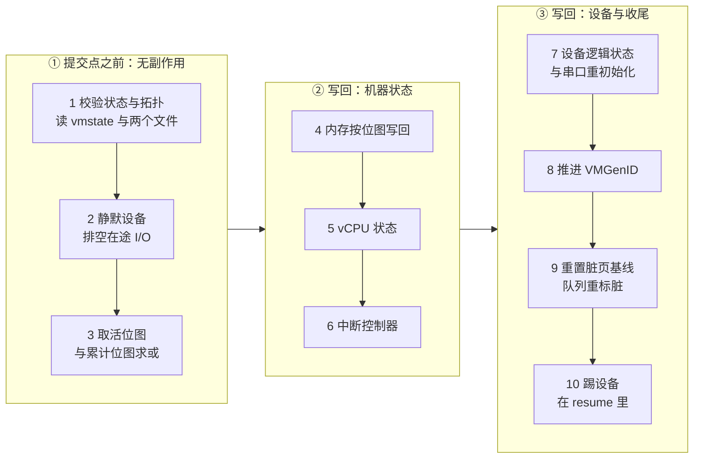

# 69 · PUT /snapshot/rollback：阶段、参数与响应

> 上游让一台 microVM 回到过去的唯一办法是杀掉进程、从快照重建一台。这条路的成本与 microVM 的规模成正比，
> 与「它偏离得有多远」无关。原地回滚换了一个成本函数：进程、KVM 的 fd、vCPU、中断控制器、设备对象、
> 内存映射全部保留，只把偏离的部分写回去。本篇讲这个端点的参数、响应、十个阶段的顺序，
> 以及它对失败与计时的处理；每个阶段的内部细节在后面四篇。
>
> **读者**：系统工程师。　**预备**：[第 38 篇 · 加载快照](38-snapshot-load.md)、
> [第 67 篇 · dirty_bitmap_path](67-dirty-bitmap-sidecar.md)、[第 68 篇 · save-dirty-bitmap](68-save-dirty-bitmap-api.md)。
> **代码**：`src/vmm/src/rollback.rs`、`src/vmm/src/rpc_interface.rs`、
> `src/vmm/src/vmm_config/snapshot.rs`、`src/vmm/src/lib.rs`

---

## 0. 本篇要回答的问题

1. 原地回滚与「加载快照」相比，保留了什么、重建了什么，成本分别正比于什么？
2. 这个端点的请求与响应长什么样，哪些字段是可选的，各自的默认行为是什么？
3. 十个阶段的顺序是什么，为什么提交点划在第三与第四阶段之间？
4. 回滚在哪个线程、什么状态下执行？执行期间谁可能观察到中间状态？
5. 响应里的七个计时字段各自覆盖哪一段？哪些工作没有被任何一个字段计入？
6. 失败之后 microVM 处于什么状态，调用方怎么区分「可以重试」与「必须重建」？

---

## 1. 问题：重建一台 microVM 的成本构成

[第 38 篇](38-snapshot-load.md)讲的 `PUT /snapshot/load` 做的是完整的重建：
新建 KVM 的 VM fd 与 vCPU fd，重新注册 memslot，重建 GIC，
按快照里的 `DeviceStates` 重新构造每一个设备对象并重新登记 irqfd 与 ioeventfd，
重新打开磁盘文件与 tap。这些工作的量由 microVM 的配置决定 —— 几个 vCPU、几块盘、多大内存 ——
与「这台 microVM 相对目标快照改动了多少」毫无关系。
恢复之后 guest 还要把工作集重新缺页填回来，这一笔同样正比于工作集大小。

需要以很高的频率回到检查点的场景里，两次检查点之间 guest 可能只改了很小一部分内存。
这时重建的成本几乎全是固定开销。原地回滚把成本函数换成另一个形状：

| 维度 | `PUT /snapshot/load` | `PUT /snapshot/rollback` |
|---|---|---|
| 进程与 KVM fd | 新建 | 保留 |
| vCPU fd | 新建并 `KVM_ARM_VCPU_INIT` | 保留，在原 fd 上写回状态 |
| memslot 与内存映射 | 重新注册 | 保留 |
| 设备对象与 host 资源 | 重新构造，重开 tap 与磁盘 | 保留，只写回逻辑状态 |
| guest 内存内容 | 整份换成快照的后备 | 只写回位图指定的页 |
| 主要成本正比于 | microVM 规模与工作集 | 偏离页数 |
| 对拓扑的要求 | 无，按快照重建 | 必须与运行中的 microVM 一致 |
| 失败后的状态 | 原 microVM 不受影响 | 可能进入 `Faulted` |

最后两行是代价的所在。重建能处理任意快照，因为它不依赖现场；原地写回则要求快照描述的就是这台机器 ——
设备数量、类型、id 与激活状态都要对得上，否则要写回的对象根本不存在。
而且一旦开始写 guest 内存，这台 microVM 就处在「一半是过去、一半是现在」的状态，
中途失败没有退路。这两点决定了这个端点的全部形状。

---

## 2. 请求与响应

请求体是 `RollbackSnapshotParams`（`src/vmm/src/vmm_config/snapshot.rs`），带 `deny_unknown_fields`：

```json
{
  "snapshot_path": "/snap/base.vmstate",
  "mem_file_path": "/snap/base.mem",
  "revert_bitmap_path": "/snap/cumulative.bitmap",
  "resume_vm": true
}
```

| 字段 | 必需 | 含义 |
|---|---|---|
| `snapshot_path` | 是 | 目标快照的状态文件，提供 vCPU、GIC 与设备的逻辑状态 |
| `mem_file_path` | 是 | 目标快照的**全量**内存视图，长度必须等于 guest 内存总大小 |
| `revert_bitmap_path` | 否 | FCDB 格式的累计位图，标出更早那些轮次里脏过的页 |
| `resume_vm` | 否，默认 false | 成功后是否顺带 resume |

`mem_file_path` 要的是全量视图而不是一层差分：写回是按页从文件里 `pread` 的，
位图指到哪一页，文件的对应偏移就必须有那一页在目标时刻的内容。
调用方如果维护的是差分链，就得先把链合并成一份全量文件再交过来（差分怎么合并见[第 41 篇](41-snapshot-tools-and-compat.md)）。
入口处对此只有一条长度检查：文件长度不等于 guest 内存总大小就拒绝。
文件长度对但内容是别的时刻的，Firecracker 分辨不出来。

`revert_bitmap_path` 的可选性容易误读。**当前这一轮的脏页总是被自动并进回滚集合的**
（第 4 节的阶段三），所以不给这个字段时，回滚集合等于「自上一次清零事件以来脏过的页」。
只有当目标快照恰好就是上一次清零事件时，这个集合才够用。
目标快照更早时，中间那些轮次的脏页必须由调用方用[第 68 篇](68-save-dirty-bitmap-api.md)
与 sidecar 攒出来的累计位图补上 —— 这是 Firecracker 无法自己检查的契约，
给错了位图的后果是若干页停留在未来的内容上，而 API 会返回成功。

成功返回 200，body 是 `RollbackResponse`：

```json
{
  "restored_pages": 18342,
  "restored_bytes": 75128832,
  "timings_us": {
    "validate": 0, "quiesce": 0, "memory": 0,
    "vcpus": 0, "gic": 0, "devices": 0, "total": 0
  }
}
```

`restored_pages` 是回滚集合里的置位数，`restored_bytes` 就是它乘以宿主页大小。
这是上游全部端点里少有的带数据响应的 `PUT`（其余的快照类操作都返回 204），
因为调用方需要这两个数来更新自己的账本与判断这次回滚值不值。

**swagger 与代码不一致。** `src/firecracker/swagger/firecracker.yaml` 的
`SnapshotRollbackParams` 里还留着一个 `vcpu_route` 字段（枚举 `reinit` / `registers`）。
代码里没有这个字段，而 `deny_unknown_fields` 会把带上它的请求判成 400。
按照接口描述文件生成客户端的使用者会撞上这一点。vCPU 的写回路线现在固定为
「先做一次架构定义的复位再整体写回」，另一条只写寄存器的路线在两种做法比较之后被移除了，
理由与细节在[第 71 篇](71-rollback-vcpu-and-gic.md)。

---

## 3. 执行环境

`RuntimeApiController::rollback_snapshot()`（`src/vmm/src/rpc_interface.rs`）是外层包装，
它做四件事：记下起始时刻、锁住 `Vmm`、调 `rollback::rollback_snapshot()`、按结果收尾。

因此整个回滚在 **VMM 线程**上、**持有 `Vmm` 互斥锁**的情况下一次跑完。
API 线程此时发来的任何请求都要排队等锁；vCPU 线程停在 `Paused` 状态的 `recv()` 上，
只有阶段五会去唤醒它们；设备的 epoll 循环属于 VMM 线程，
它正在执行这段代码，不会去处理任何设备事件。世界是静止的 —— 这是
[第 37 篇](37-snapshot-create.md)讲快照时那句「只对 guest 侧成立」的静止在这里被加强了一层：
连 VMM 自己的事件循环都不转。

**成功之后**，如果 `resume_vm` 为真就立刻调 `Vmm::resume_vm()`。这一步顺带完成了阶段十：
`resume_vm()` 的第一行是 `mmio_device_manager.kick_devices()`，无条件踢一遍所有设备，
让它们按刚刚写回的队列索引重新扫描。回滚不需要为此写专门的代码，
因为上游的 resume 本来就这么做。代价是 `resume_vm: false` 的调用方要自己记得
后面总要有一次 resume 才能让设备动起来。

`resume_vm()` 若失败，错误按 `VmmActionError::InternalVmm` 返回，
此时回滚其实已经完整成功，但 `RollbackResponse` 拿不到了，
而且这条路径不会把实例置成 `Faulted`（推论：因为失败发生在回滚之外，
`resume_vm()` 自己的失败语义与普通 resume 相同）。

**计时用的是 `latencies_us.vmm_pause_vm`。** 包装函数在起点取一次单调时钟，
成功后用 `update_metric_with_elapsed_time()` 把耗时写进这个字段，并打一行
「'rollback snapshot' VMM action took N us.」的日志。没有为回滚新开 metric 字段。
后果有三条，使用这套指标的人都要知道：

1. 这个字段在开了回滚的部署里混了两种语义。看到一个很大的 `vmm_pause_vm`，
   不能断定是暂停慢，要去日志里看最后一次写它的是 `pause` 还是 `rollback`。
2. `latencies_us` 是 `SharedStoreMetric`，只保留最后一次的值（[第 44 篇 §6](44-logging-and-metrics.md#6-latencies_us)）。
   一次 `pause` 加一次 `rollback` 之间只要没刷 metrics，先发生的那个读数就被覆盖了。
3. 起点取在**加锁之前**，所以这个数包含了等 `Vmm` 锁的时间，而 `timings_us.total` 不包含。
   两个数的差值是排队开销，与第 44 篇讲的「API 级与 VMM 级之差」是同一类信息。

响应里的 `timings_us` 因此是排查回滚本身的主要依据，metrics 只能当粗粒度的旁证。

---

## 4. 十个阶段

`rollback::rollback_snapshot()` 的主体是十个按顺序执行的阶段，中间有一条提交点。



| 阶段 | 代码 | 做什么 | 失败后果 |
|---|---|---|---|
| 1 | `rollback_snapshot()` 开头与 `validate_topology()` | 实例必须 `Paused`；读出 `MicrovmState`；核对 vCPU 数、内存大小、设备集合、memfile 长度与位图头字段 | 可 resume |
| 2 | `quiesce_devices()` | block 排空异步引擎并刷盘；net 把 tap 缓冲的帧读掉丢弃 | 可 resume |
| 3 | `get_dirty_bitmap()` + `store_dirty_bitmap()` + `userspace_bitmap_flat()` | 取活脏位图、折叠进用户态位图、与文件位图求或 | 可 resume |
| 4 | `GuestMemoryExtension::restore_dirty()` | 按位图从 memfile 成批写回 guest 内存 | `Faulted` |
| 5 | `Vmm::restore_vcpu_states_in_place()` | 给每个 vCPU 线程发 `RestoreState` 并等回执 | `Faulted` |
| 6 | `Vm::restore_state()` | 在现有的 GIC 设备 fd 上重设状态 | `Faulted` |
| 7 | `apply_device_states()` 与 `emulate_serial_init()` | 写回队列、特性与中断状态；补写串口 IER | `Faulted` |
| 8 | `VmGenId::refresh_generation()` | 让 guest 知道时间被回拨 | `Faulted` |
| 9 | `reset_dirty_bitmap()`、`reset_dirty()`、`mark_queue_memory_dirty()` | 把这一刻定为新的脏页基线 | `Faulted` |
| 10 | `resume_vm()` 里的 `kick_devices()` | 让设备按写回的索引重新扫描队列 | 属于 resume |

几处顺序上的理由。

**静默排在取位图之前。** `quiesce_devices()` 会让 block 设备把完成项回填进 used ring
（`prepare_save()`，与[第 37 篇 §3](37-snapshot-create.md#3-save_state收集的顺序) 里保存前做的是同一件事），
那是对 guest 内存的写。放在取位图之前，这些写才会进入回滚集合；
放在之后就会留下一批既不在位图里、又与目标快照不一致的页。

**提交点划在阶段三与四之间。** 前三个阶段读文件、读位图、读设备状态，
对 guest 内存与 KVM 状态没有任何改动 —— 唯一的例外是阶段二对 used ring 的写与阶段三对 KVM 位图的清零，
两者都不破坏「这台 microVM 还是刚才那台，可以 resume 继续跑」这个性质。
从阶段四的第一个 `read_exact_volatile()` 开始就不同了：内存里有一部分是目标快照的内容、
另一部分是现在的内容，vCPU 寄存器还停在现在，谁也说不出这是哪一时刻的机器。

**内存写回排在 vCPU 与设备之前。** 队列的索引存在设备对象里，环的内容存在 guest 内存里，
两者必须属于同一时刻才能配成一对。按「内存先、对象后」的顺序，阶段四写完环、阶段七写完索引，
结束时两边都是目标快照的那一刻。顺序反过来，阶段七刚写好的索引会被阶段四覆写的环内容抛在后面，
设备读到的是两个时刻拼起来的队列。阶段八的 VMGenID 也遵循同一条规则：
`refresh_generation()` 写的是一个新的、既不属于现在也不属于目标快照的代号，
所以它必须排在内存写回**之后**，否则会被覆盖掉。

**阶段九把这一刻定为新基线。** 两张位图都清零，然后把所有已激活设备的队列页重新标脏 ——
理由与[第 37 篇 §7](37-snapshot-create.md#7-队列为什么要重新标脏) 完全相同：
运行期的队列写不经过位图，不补这一下，队列页会从此消失在所有后续差分里。
这一步让回滚点成为一个干净的差分起点，下一次 Diff 快照相对的就是刚恢复出来的这个状态。

阶段一至九的细节分在后面四篇：内存写回在[第 70 篇](70-rollback-memory.md)，
vCPU 与 GIC 在[第 71 篇](71-rollback-vcpu-and-gic.md)，
设备状态与 net 的 RX 缓存在[第 72 篇](72-rollback-devices.md)，
拓扑校验的完整规则与失败模型在[第 73 篇](73-failure-model-faulted-and-seccomp.md)。

---

## 5. 计时字段的实际口径

`RollbackTimings` 有七个 `u64`，但它们与上面的十个阶段不是一一对应。读代码里 `Instant` 的设置点可以看出：

| 字段 | 实际覆盖 |
|---|---|
| `validate` | 阶段一 |
| `quiesce` | 阶段二 |
| `memory` | **阶段三加阶段四** —— 计时起点在取活位图之前 |
| `vcpus` | 阶段五 |
| `gic` | 阶段六 |
| `devices` | 阶段七与阶段八，含串口重初始化与 VMGenID |
| `total` | 从函数入口到阶段九结束 |

两处要留意。`memory` 不是纯粹的写回耗时：取 KVM 位图（在大内存上是一次线性的位图搬运，
在没有硬件脏页跟踪时还伴随重新写保护）与两张位图求或都算在里面。
排查「回滚为什么慢」时，如果 `memory` 远大于 `restored_pages` 所能解释的量，
先要怀疑的是取位图这一步而不是磁盘。第 65、66 篇讲的脏页跟踪后端正是影响这一段的因素。

其次，阶段九不属于任何一个分段字段，但计入 `total`。所以七个分段之和小于 `total`，
差值主要是阶段九（两次清位图加一次队列重标脏，都正比于内存大小或设备数量）。
分段之和与 `total` 对不上不是 bug。

所有数都用 `Instant::elapsed()` 取微秒，溢出时饱和到 `u64::MAX`。

---

## 6. 失败模型

`RollbackError` 有十二个变体，`faults_vm()` 把它们分成两组：
`NotPaused`、`Faulted`、`SnapshotFile`、`Validation`、`RevertBitmap`、`MemoryFile`、
`DirtyBitmap`、`BitmapWrite` 不污染 guest 状态；`Memory`、`Vcpu`、`Gic`、`Devices` 污染。
后一组出现时，包装函数把 `instance_info.state` 置成 `VmState::Faulted`。

`Faulted` 是这一层新增的实例状态（`src/vmm/src/vmm_config/instance_info.rs`）。
它一旦置上就不再撤销：`Vmm::resume_vm()` 与 `Vmm::pause_vm()` 的第一行都检查它并返回
`VmmError::VmFaulted`，`create_snapshot()` 在控制面层拒绝（「the microVM is faulted」），
`GET /` 的 `state` 字段能看到它。能做的只剩查询与退出。
这是一个刻意不给恢复路径的设计：一台内存与设备状态分属两个时刻的 microVM，
任何「再试一次」都只会在损坏之上叠加损坏，正确的动作是让调用方杀掉进程、按常规路径重建一台。

有一处对调用方不友好：**所有错误的 HTTP 状态码都是 400**
（`parsed_request.rs` 里除 MMDS 的 413 之外一律 `BadRequest`）。
一次「位图页数对不上」和一次「写回内存到一半 EIO」在状态码上没有区别，
要靠响应 body 里的错误文本或者随后一次 `GET /` 才能分辨。
对一个必须据此决定「重试还是重建」的调用方来说，这意味着不能只看状态码。

另一处是[第 68 篇](68-save-dirty-bitmap-api.md)已经提过的：`save-dirty-bitmap`
与回滚共用 `RollbackError` 与 `VmmActionError::RollbackSnapshot`，
所以日志里的「Rollback snapshot error」也可能来自前者。

---

## 7. 小结

- 原地回滚保留进程、KVM fd、vCPU fd、memslot、设备对象与全部 host 资源，只写回偏离的部分；成本正比于偏离页数而不是 microVM 规模。
- 代价是它要求快照与运行中的 microVM 拓扑一致，且一旦开始写内存就没有退路。
- 请求必须给状态文件与**全量**内存文件；`revert_bitmap_path` 可选，补的是更早轮次的累计脏页，当前轮次总是自动并入。
- 位图给少了会让部分页停在未来的内容上，而 API 返回成功 —— 这是 Firecracker 检查不了的契约。
- 响应是 200 加 `restored_pages` / `restored_bytes` / 七个阶段计时，是快照类端点里唯一带数据的 `PUT`。
- swagger 里残留的 `vcpu_route` 字段在代码中已不存在，`deny_unknown_fields` 会让带它的请求变成 400。
- 回滚在 VMM 线程上持锁一次跑完，vCPU 停着、事件循环不转，除阶段五唤醒 vCPU 线程外没有并发。
- 十个阶段的提交点在「取位图」与「写内存」之间；静默设备排在取位图之前，VMGenID 排在写内存之后，队列重标脏排在最后。
- 计时字段的 `memory` 实际包含取活位图这一步；阶段九不计入任何分段但计入 `total`，所以分段之和小于 `total`。
- 耗时复用 `latencies_us.vmm_pause_vm`，与暂停混用同一个只保留最后一次值的字段，且包含等锁时间；排查以响应里的 `timings_us` 为准。
- 失败分两类：提交点之前可以 resume 继续跑，提交点之后置 `Faulted` 且不可撤销。两类的 HTTP 状态码都是 400。

---

## 延伸阅读 / 下一篇

- 下一篇：[第 70 篇 · 回滚的内存写回](70-rollback-memory.md) —— 阶段三与四的内部。
- [第 71 篇 · 回滚的 vCPU 与 GIC](71-rollback-vcpu-and-gic.md)、[第 72 篇 · 回滚的设备状态](72-rollback-devices.md) —— 阶段五至八。
- [第 73 篇 · 失败模型、Faulted 状态与 seccomp 白名单](73-failure-model-faulted-and-seccomp.md) —— `RollbackError` 全表与 seccomp 的配套改动。
- [第 38 篇 · 加载快照](38-snapshot-load.md) —— 被它替代的那条路径。
- [第 44 篇 · 日志与 metrics](44-logging-and-metrics.md) —— `latencies_us` 的存储语义与刷写时机。
- [第 76 篇 · API 端点总表](76-api-reference.md)、[第 77 篇 · 配置与 metrics 总表](77-config-cli-env-metrics-reference.md) —— 端点与字段的完整对照。
- [checkpoint / restore 手册第 11 篇](../../e2b-infra-docs/rollback/docs/11-in-place-rollback.md)、[第 14 篇](../../e2b-infra-docs/rollback/docs/14-failure-semantics.md) —— 调用方一侧的回滚决策与失败处理。
