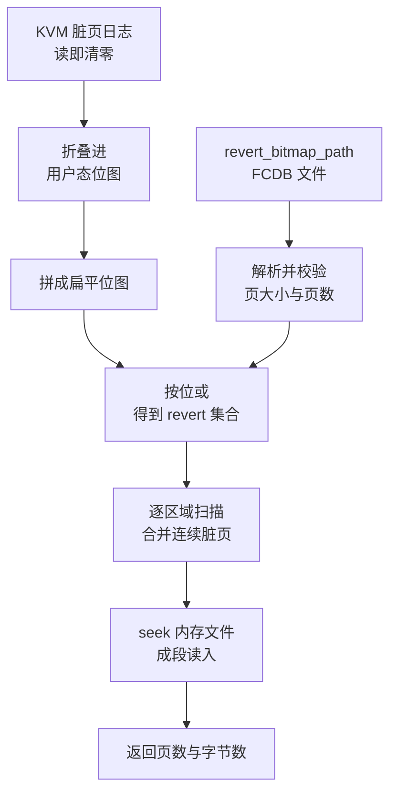

# 70 · 回滚的内存写回

> 原地回滚里最重的一步是把 guest 内存倒回快照时刻。做法不是重新映射整块内存，
> 而是挑出「自目标快照以来被改过的页」，从内存文件里把它们读回原处。
> 本篇讲这个页集合从哪来、写回怎么成批进行、写回之后脏页基线如何重置，以及这套做法的正确性前提。
>
> **读者**：需要理解回滚代价构成、或要为回滚准备位图的开发者。
> **预备**：[第 14 篇 · 脏页跟踪](14-dirty-page-tracking.md)、[第 67 篇 · dirty_bitmap_path](67-dirty-bitmap-sidecar.md)、
> [第 69 篇 · PUT /snapshot/rollback](69-rollback-api-and-phases.md)。
> **代码**：`src/vmm/src/rollback.rs`、`src/vmm/src/vstate/memory.rs`、`src/vmm/src/vstate/vm.rs`

---

## 0. 本篇要回答的问题

1. 回滚要写回哪些页，这个集合由谁决定？
2. 位图里的「第 i 页」指的是哪一页——GPA 还是文件偏移？
3. `restore_dirty()` 怎么把一张位图变成对内存文件的若干次读？
4. 为什么读 KVM 脏页日志之前要先把它折叠进用户态位图？
5. 写回之后，下一次 Diff 快照的基线是什么？
6. 这套做法对调用方提出了哪些不写在代码里的契约？

---

## 1. 问题：把内存倒回去要写多少页

从快照恢复一台 microVM（[第 38 篇](38-snapshot-load.md)）时，guest 内存是重新建的：
按快照里的区域列表重新 `mmap`，再由内核从内存文件私有映射里填页，或者由 userfaultfd 处理器按需填。
这条路径的代价与 microVM 的内存规模成正比，因为不管 guest 实际改过多少页，
整个地址空间都要重新建立映射，工作集也要重新缺页填回来。

原地回滚换了一个代价函数。进程不换、映射不换、memslot 不换，guest 内存这块 `mmap` 区域
从头到尾是同一块。要做的只是把「与目标快照不一致的那些页」的内容改回去。
这个代价与**偏离量**成正比，而不是与内存规模成正比：一台 4 GiB 的 microVM 如果自快照以来
只改了几千页，回滚就只写这几千页。

于是整件事收敛成一个问题：哪些页偏离了？这个集合宁可大不可小。多写回一页，
代价是一次多余的拷贝，结果仍然正确——因为写回的内容本来就是那一页在快照时刻的内容。
少写回一页，那一页就停留在「未来」的内容上，而 vCPU 与设备状态却被倒回了过去，
guest 会看到一份自相矛盾的内存。所以这一步的设计原则是：宁可把不确定的页也算进去。

## 2. 偏离集合的两个来源

`src/vmm/src/rollback.rs` 的 `rollback_snapshot()` 在第三阶段构造这个集合，它是两个来源的并集。

**第一个来源是当前活着的脏页位图。** 这是 Firecracker 本来就维护的两张位图
（[第 14 篇 §1](14-dirty-page-tracking.md#1-问题guest-内存有两个写者)）：KVM 侧的脏页日志记录 guest 自己写过的页，
用户态位图记录 VMM 进程代 guest 写过的页。代码先调 `Vm::get_dirty_bitmap()` 取 KVM 日志，
立刻用 `GuestMemoryExtension::store_dirty_bitmap()` 把它折叠进用户态位图，
然后由 `userspace_bitmap_flat()` 把各区域的用户态位图拼成一张扁平位图。

先折叠再读，是因为 `KVM_GET_DIRTY_LOG` 的读是破坏性的：读出来的同时内核就把对应的位清掉了
（[第 14 篇 §2](14-dirty-page-tracking.md#2-kvm-侧一份读一次就消失的日志)）。
如果只把 KVM 位图当作一个临时变量用完就丢，而回滚在后面某一步失败，
「这些页曾经脏过」这条信息就永久消失了，之后任何一次 Diff 快照或回滚都会漏掉它们。
折叠进用户态位图之后，这条信息就沉淀在 Firecracker 自己的数据结构里，
不管后面发生什么都还在。`rollback.rs` 里另一个端点 `save_dirty_bitmap()`
（[第 68 篇](68-save-dirty-bitmap-api.md)）维护的是同一条不变量。

**第二个来源是调用方给的累计位图。** `RollbackSnapshotParams.revert_bitmap_path` 是可选参数，
指向一份 FCDB 格式的位图文件（格式见[第 67 篇](67-dirty-bitmap-sidecar.md)）。
代码读进来、`deserialize_dirty_bitmap()` 解析、校验页大小与页数与本机一致，
然后按字逐个与前一张位图做按位或。

为什么需要第二张位图，要从「活着的位图记的是什么」说起。两张活位图只覆盖**最近一次清零以来**的写。
每做一次快照或一次回滚，基线就被重置一次。假设一台 microVM 依次拍了快照 A、B、C，
现在要回滚到 A：活位图里只有「C 之后改的页」，而「A 到 B」与「B 到 C」之间改过的页
已经在各自的快照动作里被清掉了。这些页现在的内容也许仍然偏离 A，必须一起写回。
把它们找回来的办法，就是让调用方在每次快照时用 `dirty_bitmap_path` 把当轮的位图存成 sidecar，
需要回滚时把从 A 之后的各轮位图并起来，作为 `revert_bitmap_path` 传进来。

这两个来源的分工写在参数的文档注释里：活位图总是被并进去，文件位图补的是**更早那些轮次**的页。
不给文件位图时，唯一正确的用法是回滚到当前这一轮的起点。这条不写在代码里、
也无法由 Firecracker 校验的约束，是回滚 API 最重要的一条契约：
**位图必须覆盖全部偏离页**，由调用方保证。Firecracker 能校验的只有位图的页大小与页数，
校验不了它的语义正确性。



## 3. 位图的坐标系：扁平页序

位图里的「第 i 位」指的不是第 i 个 guest 物理页，而是**内存文件里第 i 个页**。
这个区别在多区域的机器上才看得出来。

guest 物理地址空间可能有空洞：x86_64 上 4 GiB 以下要给 MMIO 留窗口，
大内存的 microVM 因此被切成两个区域（[第 13 篇 §2](13-guest-memory.md#2-地址空间的形状)）。
但内存文件里各区域是**依次平铺**的，空洞不占文件空间。
位图沿用文件这一侧的坐标：区域按顺序拼接，每 4 KiB 一位，每 64 页一个小端 `u64` 字。

```text
GPA 空间（两个区域，中间有空洞）
  region 0                    region 1
  |p0|p1|          .....      |p0|p1|

内存文件 / 位图的扁平页序
  |0 |1 |2 |3 |
   ^     ^
   |     region 1 的第 0 页 = 扁平页 2
   region 0 的第 0 页 = 扁平页 0
```

`userspace_bitmap_flat()` 做的就是这个换算：维护一个 `region_start_page` 累加器，
逐区域遍历，把区域内第 `page` 页映射到扁平页 `region_start_page + page`。
`dump_dirty()` 在 ARM 适配版里返回的合并位图（[第 67 篇](67-dirty-bitmap-sidecar.md)）用的是同一套坐标，
`restore_dirty()` 读的也是同一套坐标。三者共用一个坐标系，
好处是调用方可以把不同时刻拿到的位图直接按位或，不必知道 guest 的物理内存布局；
代价是位图与「这台 microVM 的区域切分」绑定，区域数或区域大小一变，旧位图就不再可用——
这正是回滚前要做拓扑校验的理由之一（[第 72 篇](72-rollback-devices.md)）。

`src/vmm/src/vstate/memory.rs` 里的单元测试 `test_dump_dirty_returns_merged_flat_bitmap`
就是拿一台「两个区域、各两页、中间隔一页空洞」的机器来验证这个坐标系的：
脏的是区域 0 的第 0 页与区域 1 的第 1 页，合并位图是 `0b1001`，即扁平页 0 与 3。

## 4. `restore_dirty()`：从位图到成段的读

写回本身在 `src/vmm/src/vstate/memory.rs` 的 `GuestMemoryExtension::restore_dirty()`，
它是 `dump_dirty()` 的逆操作，签名对称：一个实现了 `ReadVolatile + Seek` 的读者、一张扁平位图、页大小，
返回写回的页数与字节数。

算法是一个两层循环。外层按区域走，维护 `region_start_page`；
内层按区域内页号走，用 `bitmap[flat / 64] >> (flat % 64) & 1` 判断这一页在不在集合里。
连续的脏页被攒成一个批次（`batch_start_page` 与 `batch_pages`），
遇到第一个不脏的页就把攒下的批次刷出去。区域扫完再刷一次尾批。

刷一个批次做三件事：按 `(region_start_page + start_page) * page_size` 算出文件偏移并 `seek`；
用 `region.get_slice()` 取出这一段 guest 内存的 `VolatileSlice`；
`read_exact_volatile()` 一次把整段读进去。这里的关键是批次机制：
如果逐页做，一段 1 MiB 的连续脏区要 256 次 `seek` 加 256 次 `read`；
成批之后是 1 次 `seek` 加 1 次 `read`。`dump_dirty()` 在写出方向上用的是同一个手法
（[第 37 篇 §6](37-snapshot-create.md#6-dump_dirty逐页判定与成批写)），两边的代价结构因此对称。

`get_slice()` 返回的 `VolatileSlice` 带着该区域的用户态位图切片，
而 vm-memory 对 `File` 的 `read_exact_volatile()` 实现在读完之后会把目标切片标脏。
换句话说，**回滚自己的写回也会被记进用户态位图**。这不是副作用而是必需的：
如果回滚在后面某一步失败，这些刚被改写过的页必须仍然算作「偏离」。

返回值 `restored_bytes` 是 `restored_pages * page_size` 直接算出来的，
不是实际 `read` 的字节数累加。两者在正常情况下相等；
它的含义是「写回了多少页内存」，不是「从文件读了多少字节」。
这两个数字会连同各阶段耗时一起进 `RollbackResponse`（[第 69 篇](69-rollback-api-and-phases.md)）。

单元测试 `test_restore_dirty_is_dump_dirty_inverse` 给出了一个最小例子：两个区域各两页，
内存文件里四页分别填 10、11、12、13，活内存里填的是别的内容，位图给 `0b1001`，
写回之后扁平页 0 与 3 变成文件里的内容，页 1 与 2 原样不动。

## 5. 校验、提交点与失败

写回前的校验分布在两处，都在回滚的第一阶段，也就是**提交点之前**。

第一处是内存文件本身：`File::open()` 之后立刻取 `metadata().len()`，
要求它恰好等于当前 guest 内存的总字节数。这条检查把一类错误挡在门外：
传进来的必须是目标快照的**完整内存视图**，不能是一份 Diff 快照的稀疏产物。
Diff 快照的内存文件只含当轮写过的页，其余位置是稀疏空洞，读出来是零；
拿它当回滚源，落在空洞上的页会被写成全零。文件长度这一条检查拦不住「长度对但内容是空洞」的情况——
Diff 快照的内存文件长度同样等于内存大小——所以真正的保障仍在调用方那一侧：
必须先把差分链合并成完整视图再回滚。这是上一节那条契约的另一半。

第二处是位图文件：`deserialize_dirty_bitmap()` 校验 magic、版本与字数，
`rollback_snapshot()` 再校验它描述的页大小与页数与本机一致，不一致直接返回 `RevertBitmap` 错误。

这些检查全部无副作用，失败时 guest 内存一个字节都没被改，microVM 仍然是 `Paused` 状态，可以继续 resume。
从 `restore_dirty()` 的第一次写开始，情况反过来：内存已经是「一部分过去、一部分现在」的混合体，
再失败就只能把 microVM 标成 `Faulted`。`RollbackError::faults_vm()` 这张表就是这条界线的代码形式，
`Memory` 这一项落在「会污染」的一侧。失败模型的完整讨论在[第 73 篇](73-failure-model-faulted-and-seccomp.md)。

## 6. 写回之后：重置脏页基线

回滚成功之后，这个时刻就应当成为新的脏页基线——下一次 Diff 快照要相对于「刚被恢复出来的状态」计算，
而不是相对于更早的某个时刻。`rollback_snapshot()` 的最后一个阶段做三件事：

1. `Vm::reset_dirty_bitmap()`：对每个 memslot 调一次 `get_dirty_log` 并丢弃结果。
   利用的正是「读即清零」这个性质——目的不是取位图，而是清零。
2. `GuestMemoryExtension::reset_dirty()`：清空每个区域的用户态位图。
   这一步必须做，因为上一节说过，回滚自己的写回把这些页在用户态位图上标脏了。
3. 重新给已激活的 virtio 设备的队列内存标脏：遍历设备，对每个 `is_activated()` 的设备调
   `mark_queue_memory_dirty()`。

第三步的理由与创建快照时完全相同：virtio 队列的 used ring 是由 VMM 通过裸指针写的，
既不经过 KVM（所以 KVM 日志看不见），也不经过 `GuestMemory` 的写接口（所以用户态位图也看不见）。
唯一的补救是在每次清零之后，把队列所在的那几页无条件重新标脏
（[第 37 篇 §7](37-snapshot-create.md#7-队列为什么要重新标脏)）。
上游在 `persist.rs` 里对快照做同一件事，回滚照抄了这段逻辑。

## 7. 与 userfaultfd 后备内存的交互

e2b 的沙箱是从快照恢复起来的，内存后端是 userfaultfd：guest 内存是匿名映射，
只按 `MISSING` 模式注册，首次访问由外部处理器进程填页
（[第 39 篇 §3](39-uffd-backend.md#3-只注册-missing-模式)）。回滚的写回发生在 VMM 线程，
写的是同一块匿名映射，因此同样受这套机制约束：写到一页还没被填过的内存上，
会产生一次 `UFFD_EVENT_PAGEFAULT`，VMM 线程阻塞到处理器把页填好为止。

推论：实际上这几乎不会发生。进入 revert 集合的页要么是 guest 写过的（那它必定已经缺页填过），
要么是更早轮次里 guest 写过的（同一个进程，同样填过）。
换句话说，revert 集合是「已填过的页」的子集，写回不会引入新的缺页。
这条推论依赖「回滚全程在同一个进程里、映射从未被撤销」这个前提，代码没有显式表达它。

大页是另一个边界。回滚的位图粒度固定是 `get_page_size()` 返回的宿主基本页大小，
与 microVM 是否配了 2 MiB 大页无关；脏页跟踪本身也是按基本页粒度做的
（[第 13 篇 §7](13-guest-memory.md#7-大页收益与限制)）。
所以写回的粒度不会因为大页而放大。但缺页填充的粒度会：真的碰上一次 `MISSING`，
处理器要填的是整个 2 MiB。这条路径在本项目的部署里没有被验证过（推论：按上一段的理由，正常流程走不到）。

## 8. 代价与边界

- 代价正比于 revert 集合的页数，与 microVM 内存规模无关。集合越接近真实偏离集，回滚越便宜；
  调用方为了保守而把位图放大，代价就直接体现在这一阶段的耗时上。
- 写回是纯 `pread` 式的顺序读加 `memcpy`，没有并行。单线程处理一大段脏内存时，
  这一阶段是整个回滚里最长的一段（各阶段耗时在响应的 `timings_us` 里分开报，见[第 69 篇](69-rollback-api-and-phases.md)）。
- 内存文件必须是完整视图且必须与当前 microVM 的内存大小一致；前者靠调用方保证，后者有代码检查。
- 位图必须覆盖全部偏离页；漏一页的后果是 guest 内存里留下一处静默的不一致，没有任何机制能事后发现它。
- 区域切分必须没变。位图与文件偏移都建立在「区域按顺序平铺」之上，
  这也是回滚拒绝内存大小不同的快照的原因。
- balloon 设备被回滚整体拒绝（[第 72 篇 §2](72-rollback-devices.md#2-拓扑校验把写回限制在能写回的形状上)）。它会通过 `madvise` 把页还给宿主，
  使「内存文件里有内容、映射里没有页」成为常态，与这里的写回模型不相容。

## 9. 小结

- 原地回滚的内存代价正比于偏离页数，而不是内存规模；这是它与「从快照重建进程」在成本函数上的根本区别。
- 偏离集合是两个来源的并集：当前活着的两张脏页位图，以及调用方给的累计位图文件。
- KVM 脏页日志读一次就清零，所以取出来之后必须立刻折叠进用户态位图，否则一次失败就会永久丢失信息。
- 活位图只覆盖最近一次基线重置以来的写；回滚到更早的快照必须靠调用方把各轮 sidecar 位图并起来。
- 位图的坐标是内存文件里的页序（各区域依次平铺），不是 GPA；这让不同时刻的位图可以直接按位或。
- `restore_dirty()` 把连续脏页攒成批次，一批一次 `seek` 加一次读，与 `dump_dirty()` 的写出方式对称。
- 回滚自己的写回会被记进用户态位图，因此最后必须显式清两张位图，并重新给队列内存标脏。
- 内存文件长度与位图的页大小、页数有代码检查；「文件是完整视图」「位图覆盖全部偏离页」没有，
  是调用方的契约。
- 内存写回是提交点：在它之前失败 microVM 仍可 resume，从它开始失败只能置 `Faulted`。

---

## 延伸阅读 / 下一篇

- [第 71 篇 · 回滚的 vCPU 与 GIC](71-rollback-vcpu-and-gic.md)：内存之后的下一个阶段。
- [第 67 篇 · dirty_bitmap_path：sidecar 与 FCDB 格式](67-dirty-bitmap-sidecar.md)：位图文件的格式与产出时机。
- [第 68 篇 · PUT /snapshot/save-dirty-bitmap](68-save-dirty-bitmap-api.md)：不导出内存、只取位图的那个端点。
- [第 14 篇 · 脏页跟踪](14-dirty-page-tracking.md)与[第 37 篇 · 创建快照](37-snapshot-create.md)：本篇复用的两张位图与成批写手法。
- [第 65 篇 · 脏页跟踪后端](65-dirty-tracking-backend.md)：位图从哪一种硬件机制来。
- [checkpoint / restore 手册第 09 篇](../../e2b-infra-docs/rollback/docs/09-firecracker-api-contract.md) —— 调用方一侧的账本与差分链合并。
