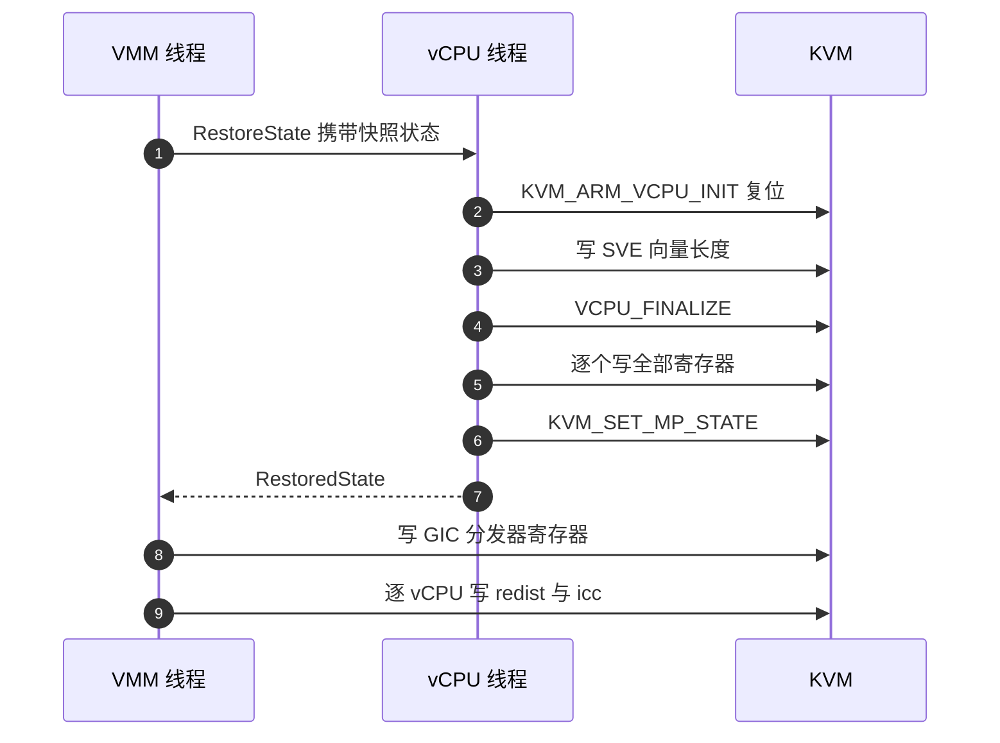

# 71 · 回滚的 vCPU 与 GIC

> 内存倒回去之后，处理器与中断控制器也要跟着倒回去。上游只会把 vCPU 状态写进一个**刚创建**的 vCPU，
> 原地回滚要写进一个**已经跑过**的 vCPU。本篇讲这件事怎么做、为什么要绕到 vCPU 线程里去做、
> 「复位后整体写回」与「只写寄存器」这两种做法的取舍，以及 GIC 一侧的写回与顺序约束。
>
> **读者**：需要理解回滚为什么这样切分阶段、或要把回滚移植到别的架构上的开发者。
> **预备**：[第 15 篇 · vCPU 线程与状态机](15-vcpu-threads-and-state-machine.md)、
> [第 18 篇 · aarch64 vCPU](18-aarch64-vcpu.md)、[第 19 篇 · aarch64 平台](19-aarch64-platform.md)。
> **代码**：`src/vmm/src/rollback.rs`、`src/vmm/src/vstate/vcpu.rs`、`src/vmm/src/arch/aarch64/vcpu.rs`、
> `src/vmm/src/lib.rs`、`src/vmm/src/arch/aarch64/vm.rs`

---

## 0. 本篇要回答的问题

1. 把 vCPU 状态写回一个已经运行过的 vCPU，与写进一个新建的 vCPU 有什么不同？
2. 为什么这件事必须在 vCPU 线程里做，而不是由控制面直接调 ioctl？
3. aarch64 的写回序列是什么，`KVM_ARM_VCPU_INIT` 在其中扮演什么角色？
4. 「先复位再整体写回」与「只写寄存器」这两种做法各自的收益与代价是什么？
5. GIC 的状态写回与从快照重建时有何不同，为什么要排在内存与 vCPU 之后？
6. 这一段对 seccomp 过滤器提出了什么新要求，不满足会怎样？

---

## 1. 问题：往一颗跑过的处理器里写状态

从快照恢复（[第 38 篇](38-snapshot-load.md)）时，vCPU 是新建的：
`KVM_CREATE_VCPU` 出来的 fd 干干净净，还没执行过一条 guest 指令，
`restore_state()` 把快照里的寄存器灌进去，这颗 vCPU 的全部可观察状态就完全由快照决定。

原地回滚没有这个便利。vCPU fd 是 microVM 启动时创建的那一个，
自目标快照以来它跑过成千上万条指令：通用寄存器变了，系统寄存器变了，
架构定时器的比较值变了，可能还有挂起的中断与异常。
现在要让它回到快照时刻的样子，而且不能换掉这个 fd——换掉 fd 就意味着重新注册 irqfd、
重新建立与 GIC 的关联，那正是原地回滚想省掉的那部分开销。

问题因此变成：有没有一个操作序列，能让一个跑过的 vCPU 的可观察状态**只由快照决定**，
而与它中途跑过什么无关？在 aarch64 上答案是有的，而且它已经写在上游代码里了。

## 2. 事件走到 vCPU 线程

第一个设计决定与状态无关，与线程有关。

Firecracker 的每颗 vCPU 独占一个线程，控制面要它做任何事都靠往它的通道里发事件
（[第 15 篇 §4](15-vcpu-threads-and-state-machine.md#4-三个状态与它们接受的事件)）。
ARM 适配版在这套机制上加了一个事件：`src/vmm/src/vstate/vcpu.rs` 的
`VcpuEvent::RestoreState`，携带一份 `Arc<VcpuState>`；对应的应答是 `VcpuResponse::RestoredState`。

事件在 `paused()` 分支里被处理：调 `KvmVcpu::restore_state_in_place()`，
成功回 `RestoredState`，失败把错误包进 `VcpuResponse::Error`，两种情况下线程都留在 paused 状态。
`running()` 分支不接受它——这里代码把 `RestoreState` 与 `SaveState` 合并进了同一个 match 臂，
共用同一句拒绝理由「save/restore unavailable while running」。
两者的理由确实是同一条：一颗正在 `KVM_RUN` 里的 vCPU，它的寄存器既读不出一致的值，也不能被写。

为什么不让控制面线程直接对 vCPU fd 发这些 ioctl？技术上可行——fd 是共享的，
`Vmm` 结构里就能拿到。真正的约束来自 seccomp。Firecracker 给不同线程装不同的过滤器
（[第 42 篇 §4](42-seccomp.md#4-三张表三个安装时机)），写 vCPU 寄存器用到的那几个 `KVM_SET_*` ioctl
只出现在 vCPU 线程的白名单里。控制面线程去调，会在第一次 ioctl 上撞 seccomp。
把动作放回 vCPU 线程，一方面沿用了「所有 vCPU 状态操作都在自己的线程里做」这条既有约定，
另一方面把新增的 ioctl 权限限制在本来就该有这些权限的线程上，而不是扩大控制面的权限面。

`src/vmm/src/lib.rs` 的 `Vmm::restore_vcpu_states_in_place()` 是发收两端的包装，
结构与上游的 `save_state()` 一模一样：

1. 先比对状态个数与 vCPU 句柄个数，不等直接返回错误；
2. 给每个句柄发一个 `RestoreState` 事件，**全部发完**再开始收；
3. 逐个 `recv_timeout(RECV_TIMEOUT_SEC)` 收应答，30 秒超时；
4. 按应答类型分派：`RestoredState` 通过，`Error` 与 `NotAllowed` 各自转成 `MicrovmStateError`，
   其余一律算意外应答。

第 2 步的先发后收让各 vCPU 的写回在各自线程里并行进行，总耗时接近单颗的耗时而不是累加。
第 3 步的 30 秒超时沿用上游的口径：它是死锁探测器，不是正常等待时长。

有两处命名值得如实指出：个数不匹配返回的是 `UnexpectedVcpuResponse`，
而这时一个应答都还没收；vCPU 报错时包的是 `MicrovmStateError::SaveVcpuState`，
而这里做的是恢复。两者都是沿用上游枚举的结果，不影响行为，但会让日志里的错误名与实际动作对不上。

图中第 2 到 6 步在每颗 vCPU 的线程里各走一遍；第 8、9 步在 VMM 线程里对 GIC 设备 fd 做，
因为 GIC 是整机一份的设备，不属于任何一个 vCPU 线程。

## 3. aarch64 的写回序列

`src/vmm/src/arch/aarch64/vcpu.rs` 的 `restore_state_in_place()` 只有一行：转调上游的 `restore_state()`。
这一行是本篇的核心结论，理由在[第 18 篇 §6](18-aarch64-vcpu.md#6-保存与恢复)已经铺好：

`restore_state()` 的序列是「装回快照里的 `kvm_vcpu_init` → `KVM_ARM_VCPU_INIT` →
（若有）写 SVE 向量长度伪寄存器 → `KVM_ARM_VCPU_FINALIZE` → 写其余全部寄存器 → `KVM_SET_MP_STATE`」。
序列的第一个实质动作就是 `KVM_ARM_VCPU_INIT`，而**这个 ioctl 对一颗已经运行过的 vCPU 的语义，
就是架构定义的复位**。上游之所以在恢复路径里调它，是因为新建的 vCPU fd 在 `VCPU_INIT` 之前
根本不接受寄存器写入，而且特性位只能通过这个 ioctl 表达；
它顺带具备的「复位一颗跑过的 vCPU」这个性质，正好是原地回滚需要的。

所以在恢复语境下，`KVM_ARM_VCPU_INIT` 只被调用一次，就在 `restore_state()` 里面。
引导路径上的 `KvmVcpu::init()` 不在这条路上——那是另一条路径，
回滚不会走到它，也不需要它。这一点在读代码时容易搞混：`init()` 与 `restore_state()`
都会发 `KVM_ARM_VCPU_INIT`，但两者互斥地出现在引导与恢复两条路径上。

序列跑完之后，这颗 vCPU 的架构可见状态是「复位状态」叠加「快照里的每一个寄存器」。
中途执行过什么，不会留下痕迹——这正是第 1 节要的那个性质。

## 4. 两种做法的取舍

把状态写回一颗活着的 vCPU，有两种画法。

**只写寄存器。** 跳过 `VCPU_INIT` 与 `FINALIZE`，直接把快照里的寄存器逐个 `KVM_SET_ONE_REG` 写回去，
再补一次 `KVM_SET_MP_STATE`。这条路少两次 ioctl，而且不触发内核里的复位逻辑。

**先复位再整体写回。** 就是上一节那条序列，也是代码最终保留的那一条。

| 维度 | 只写寄存器 | 复位后整体写回 |
|---|---|---|
| 覆盖面 | 只覆盖 `KVM_GET_REG_LIST` 枚举得到的那些寄存器 | 寄存器之外，内核为这颗 vCPU 维护的内部状态一并回到复位值 |
| 对「中途跑过什么」的依赖 | 有：未被寄存器表达的状态原样留下 | 无：终态只由快照决定 |
| 特性位（SVE、PSCI 版本） | 无法表达，只能沿用当前值 | 由快照里的 `kvm_vcpu_init` 重新表达 |
| ioctl 次数 | 每 vCPU 少两次 | 每 vCPU 多两次，且复位本身有内核侧开销 |
| seccomp 面 | 只需放行 `KVM_SET_ONE_REG` 与 `KVM_SET_MP_STATE` | 还要放行 `KVM_ARM_VCPU_INIT` 与 `KVM_ARM_VCPU_FINALIZE` |
| 与上游代码的关系 | 需要一条新写的序列 | 直接复用上游的 `restore_state()` |

决定性的是第一行与第二行。一颗 vCPU 的状态并不全是寄存器：
挂起的虚拟中断与异常、定时器在内核侧的挂起标记、PMU 的内部计数状态、
SVE 上下文是否已 finalize，这些要么没有对应的寄存器 ID，要么不能靠写寄存器达到想要的值。
只写寄存器的做法把这些状态留在「被丢弃的那条时间线」上，
于是回滚之后的 vCPU 是「快照的寄存器」加「现在的内核内部状态」的混合体——
和内存写回漏页是同一类错误，只是发生在处理器一侧，而且更难被发现：
它可能表现为回滚后不久的一次意外中断或一次异常，与回滚动作隔着很远。

复位路线的代价是实打实的：每颗 vCPU 多两次 ioctl，内核要重新走一遍 vCPU 初始化，
SVE 机器还要重新 finalize。换来的是一条可以用一句话说清的不变量——
**回滚之后 vCPU 的状态只是快照的函数**。这条不变量让 vCPU 阶段不必再单独论证正确性，
也让整条回滚路径复用上游久经使用的恢复序列，而不是维护一条自己写的序列。

代码里只保留了复位路线；`VcpuEvent::RestoreState` 的注释还留着「两条路线由一个标志选择」的字样，
但事件本身不带任何标志。这是一处残留注释，会误导读代码的人，行为上没有影响。

x86_64 一侧的 `restore_state_in_place()` 同样只是转调 `restore_state()`，
但理由不同：x86_64 的恢复序列本来就不重建 vCPU，直接对现有 fd 写 CPUID、MSR、各类寄存器结构，
两条路线在那里本来就是同一条。本项目只在 aarch64 上运行，这条路径没有被验证过。

## 5. GIC：写进一个已经存在的设备

vCPU 之后是中断控制器。`src/vmm/src/rollback.rs` 的 GIC 阶段只有一个调用：
`Vm::restore_state(&mpidrs, &state.vm_state)`，与从快照重建时调的是同一个函数
（[第 19 篇 §5](19-aarch64-platform.md#5-gic-的状态与快照)）。它往下走到
`GICDevice::restore_device()`，再到 `gicv3/regs` 的 `restore_state()`：
先写分发器寄存器，再校验 MPIDR 个数与快照里的 vCPU 数一致，
最后逐 vCPU 写重分发器与 CPU 接口寄存器。

与重建路径的区别只有一条，但很关键：**GIC 设备不是新建的**。
`build_microvm_from_snapshot()` 会先 `setup_irqchip()` 造一个新的 GIC 再灌寄存器；
回滚直接对现有的 GIC 设备 fd 写。这带来两个好处：
GIC 版本不可能不一致（还是原来那个设备），设备与 vCPU 的关联、irqfd 注册也都不用重建。
`InconsistentVcpuCount` 这个检查在回滚路径上永远不会触发，因为 vCPU 数已经在拓扑校验里比对过了
（[第 72 篇](72-rollback-devices.md)）。

MPIDR 列表由 `src/vmm/src/lib.rs` 的 `construct_kvm_mpidrs()` 从**快照里的** `VcpuState` 算出来，
而不是从活着的 vCPU 上读。代码在把 `vcpu_states` 交给 vCPU 阶段之前先算好这份列表，
所以 GIC 阶段用的亲和值与刚写回 vCPU 的那一份严格同源。

顺序上有三条约束值得说明：

- **内存必须在 GIC 之前。** GICv3 的 LPI 挂起状态不在寄存器里，而在 guest 内存的一张表中。
  保存时要靠 `KVM_DEV_ARM_VGIC_SAVE_PENDING_TABLES` 把它刷回 guest RAM 才能随内存文件一起保存；
  回滚时这部分状态自然是随内存写回一起回来的。如果 GIC 排在内存之前，
  内存写回会把已经恢复好的这张表再改一次。
- **vCPU 必须在 GIC 之前。** 推论：`KVM_ARM_VCPU_INIT` 复位的是一颗 vCPU 的架构状态，
  其中包含该 vCPU 私有的中断（SGI 与 PPI），而这些状态由重分发器持有。
  先复位 vCPU 再写重分发器寄存器，顺序才不会被复位抹掉。代码没有为这条顺序写注释，
  但阶段划分与之一致。
- **回滚一侧不需要刷 pending 表。** `save_pending_tables()` 只在保存方向调用；
  写回方向没有对应动作，也不需要。

GIC 阶段与 vCPU 阶段在响应里各占一项耗时（`timings_us` 的 `vcpus` 与 `gic`），
分开计量的用意是让「回滚慢了」这件事能定位到具体阶段（[第 69 篇](69-rollback-api-and-phases.md)）。

## 6. seccomp：四条新规则

复位路线需要的 ioctl 比上游的 vCPU 线程过滤器允许的多。
`resources/seccomp/aarch64-unknown-linux-musl.json` 的 vCPU 线程段因此新增四条规则，
都是对 `ioctl` 的第二个参数做等值匹配：

| ioctl | 用在序列的哪一步 |
|---|---|
| `KVM_ARM_VCPU_INIT` | 复位 |
| `KVM_ARM_VCPU_FINALIZE` | SVE 两阶段初始化的第二阶段 |
| `KVM_SET_ONE_REG` | 逐个写寄存器 |
| `KVM_SET_MP_STATE` | 写 MP 状态 |

上游的 vCPU 线程过滤器只放行读方向的那几个（保存快照要用），
因为在上游的世界里，写 vCPU 状态这件事只发生在进程刚起来、过滤器还没装上的时候。
原地回滚把这个动作挪到了运行期，过滤器就必须跟着改。

缺规则的后果比一般的错误更重。seccomp 违规在 Firecracker 里是 `SIGSYS`，
处理函数直接让进程以 `BadSyscall` 退出（[第 42 篇 §6](42-seccomp.md#6-违规之后)），
不会变成一个可以处理的 `Err`。而 vCPU 阶段位于回滚的提交点之后，
所以少一条规则不是「回滚失败、microVM 置 `Faulted`」，而是「进程直接消失」。
两者对调用方是不同的事件，处理方式也不同。完整的失败模型与规则清单在
[第 73 篇](73-failure-model-faulted-and-seccomp.md)。

需要说明的是，能走到这一步已经意味着这四条规则齐全：
它们在同一个提交里与回滚代码一起加进过滤器表，缺失只会发生在「用了旧的过滤器表」这种配置错误上。

## 7. 这一段没有覆盖的

- **x86_64 未验证。** 两个 `restore_state_in_place()` 都是转调，x86_64 那条从未在本项目里跑过。
- **vCPU 状态的完整性依赖上游的 `KVM_GET_REG_LIST` 口径。** 快照里存的是内核在保存时枚举出来的
  全部寄存器；内核换版本后新增的寄存器会自动进快照，但一份旧快照回滚到新内核上时，
  新增寄存器不会被写回。这与上游快照跨内核版本的限制是同一条，
  只是回滚场景下两端必定是同一台机器、同一个内核，所以这条限制在实践中不构成问题（推论）。
- **中断的在途状态。** 回滚发生在暂停状态，vCPU 不执行、设备事件不触发；
  但 irqfd 上可能已经有被内核记下的、尚未注入的中断。这部分状态既不在 `VcpuState` 里，
  也不在 `GicState` 里，回滚不处理它（推论：代码里没有相关动作）。
  设备一侧对在途 I/O 的处理在[第 72 篇](72-rollback-devices.md)。

## 8. 小结

- 原地回滚要把 vCPU 状态写进一个已经运行过的 fd；能这么做，靠的是
  `KVM_ARM_VCPU_INIT` 对已运行 vCPU 的语义就是架构定义的复位。
- 因此 aarch64 的写回序列直接复用上游的 `restore_state()`，新增代码只有一行转调。
- 恢复语境下 `KVM_ARM_VCPU_INIT` 只被调用一次，就在这条序列的开头；引导路径上的 `init()` 不在这条路上。
- 动作经由 `VcpuEvent::RestoreState` 在 vCPU 线程里执行：一是沿用「状态操作在自己线程里做」的约定，
  二是相关 ioctl 只在 vCPU 线程的 seccomp 白名单里。
- `RestoreState` 与 `SaveState` 共用运行态的拒绝分支，理由相同：运行中的 vCPU 寄存器既读不一致也不能写。
- 「复位后整体写回」相对「只写寄存器」多两次 ioctl，换来的是「终态只由快照决定」这条不变量；
  只写寄存器覆盖不到寄存器之外的内核侧 vCPU 状态。
- 控制面先给所有 vCPU 发事件再统一收应答，写回在各线程并行；30 秒超时是死锁探测器。
- GIC 阶段对**现有**设备 fd 写寄存器，不新建设备；MPIDR 列表取自快照，与刚写回的 vCPU 同源。
- 阶段顺序是内存 → vCPU → GIC：LPI 挂起表随内存回来，vCPU 复位会影响重分发器持有的私有中断。
- vCPU 线程过滤器新增四条 ioctl 规则；缺规则的后果是进程被 `SIGSYS` 直接终止，而不是一次可处理的失败。

---

## 延伸阅读 / 下一篇

- [第 72 篇 · 回滚的设备状态](72-rollback-devices.md)：GIC 之后的最后一个阶段。
- [第 70 篇 · 回滚的内存写回](70-rollback-memory.md)：本篇之前的那个阶段，也是提交点所在。
- [第 18 篇 · aarch64 vCPU](18-aarch64-vcpu.md)：`restore_state()` 序列的逐步解释与 SVE 的两阶段约束。
- [第 19 篇 · aarch64 平台](19-aarch64-platform.md)：`GicState` 的结构与保存方向的 pending 表刷写。
- [第 62 篇 · aarch64 的 seccomp 过滤器](62-aarch64-seccomp-filter.md)与
  [第 73 篇 · 失败模型、Faulted 状态与 seccomp 白名单](73-failure-model-faulted-and-seccomp.md)。
- 内核文档 `Documentation/virt/kvm/api.rst` 的 `KVM_ARM_VCPU_INIT` 一节，
  以及 `Documentation/virt/kvm/devices/arm-vgic-v3.rst` 里 MPIDR 的编码规则。
