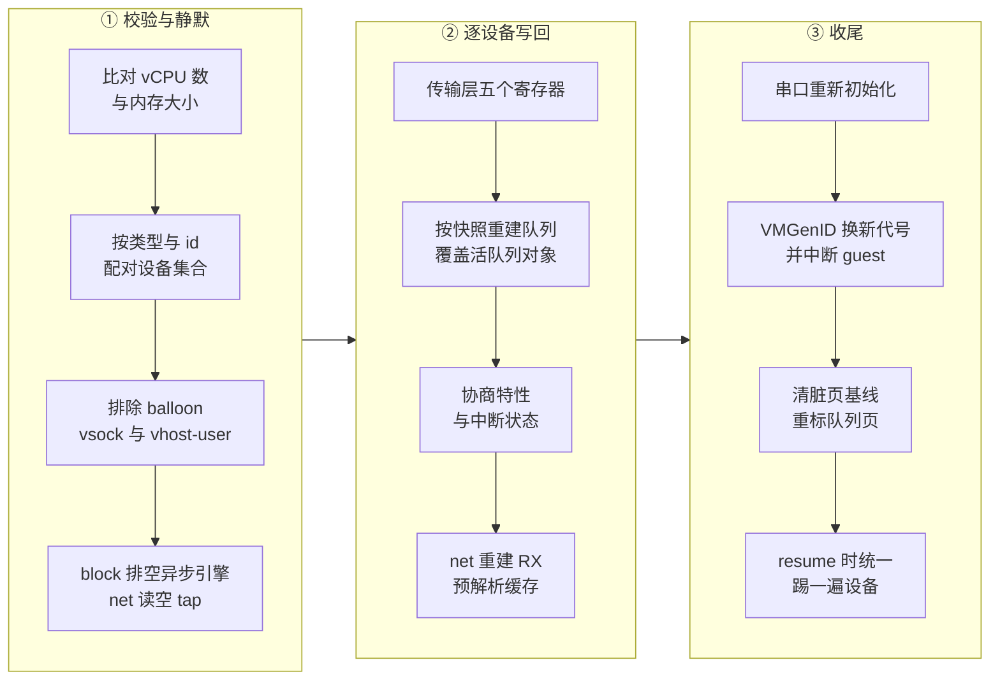
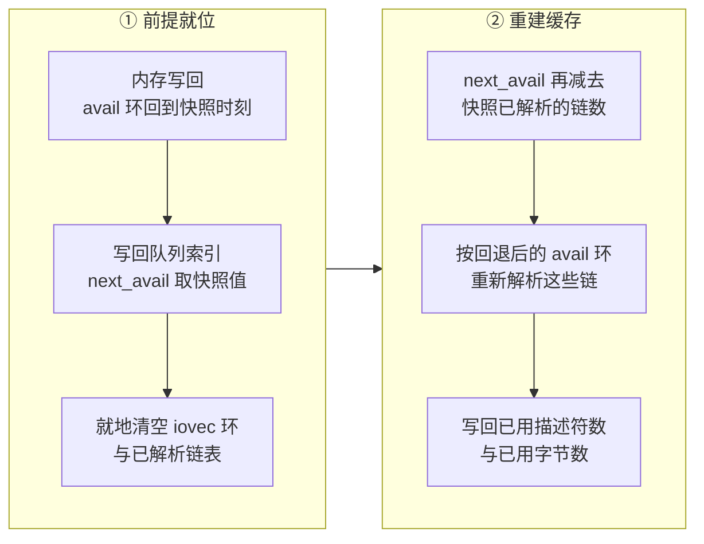

# 72 · 回滚的设备状态

> 原地回滚不重建设备对象，只把快照里的逻辑状态写回仍然活着的设备。
> 本篇讲这条路径要先校验什么、要先让什么安静下来、到底写回哪些字段，
> 以及 net 设备为什么必须额外重建一份不在快照里的缓存。
>
> **读者**：要读懂或修改 `rollback.rs` 设备阶段的工程师。
> 　**预备**：[第 25 篇](25-virtio-device-model-and-transport.md)、[第 30 篇](30-virtio-net.md)、[第 40 篇](40-device-persist.md)。
> 　**代码**：`src/vmm/src/rollback.rs`、`src/vmm/src/devices/virtio/persist.rs`、`src/vmm/src/devices/virtio/net/device.rs`、`src/vmm/src/devices/acpi/vmgenid.rs`

---

## 0. 本篇要回答的问题

1. 设备对象不重建，意味着回滚必须先确认什么？这个确认为什么不能依赖设备的排列顺序？
2. 为什么 balloon、vsock 与 vhost-user 的块设备被挡在原地回滚之外？
3. 写回一个 virtio 设备，到底写了哪几样东西，哪些东西被刻意不写？
4. net 设备为什么比别的设备多一步，不做这一步会出现什么故障？
5. VMGenID 为什么要在内存写回之后换一个**新**值，而不是恢复快照里的那个值？
6. 设备阶段结束之后还欠下什么，由谁补上？

---

## 1. 问题：设备对象必须留在原地

从快照重建一台 microVM 时（[第 38 篇](38-snapshot-load.md)），设备是**造**出来的：
按快照里的路径重新打开磁盘文件、按接口名重新打开 tap、向 KVM 重新登记
ioeventfd 与 irqfd、在总线上按存下来的地址重新落位。造完之后，设备对象的每一个字段
都来自快照，没有历史包袱。

原地回滚的全部收益恰恰来自不做这件事。进程没换，宿主侧资源一样没换：
磁盘 fd、tap fd、每条队列的 ioeventfd、每个设备的 irqfd、这些 fd 在 KVM 与 epoll 里的登记、
guest 内存的映射。它们都不需要重新申请，也就不需要为重新申请付出代价。
留下来的工作只剩一件：把设备对象里那些**描述「处理到哪儿了」的字段**改回快照里的值。

这个替换有三个直接后果，本篇的前三节各处理一个。

第一，快照描述的设备集合与当前活着的设备集合必须能一一对应。
写回是往一个已存在的对象里写，对象不存在就无从写起，而重建路径可以凭空造一个。

第二，写回之前不能有在途的宿主侧 I/O。重建路径不担心这个 —— 新对象本来就没有在途请求；
写回路径面对的是一个刚刚还在工作的设备，它的异步磁盘请求可能随时完成，
tap 的接收缓冲里可能还压着几帧。

第三，设备对象里有一部分状态**不在快照里**，它是运行时从 guest 内存里派生出来的缓存。
重建路径靠「新对象的缓存是空的」这个前提把它重算出来；写回路径没有这个前提。

下图是设备相关的三步在整个回滚里的位置。内存写回、vCPU 与 GIC 三个阶段在它之前，
分别见[第 70 篇](70-rollback-memory.md)与[第 71 篇](71-rollback-vcpu-and-gic.md)。

其中 ① 的前两步发生在整条回滚流程的最前面（提交点之前），第三步紧随其后；
② 与 ③ 在提交点之后。这个分界的意义在[第 73 篇](73-failure-model-faulted-and-seccomp.md)。

---

## 2. 拓扑校验：把写回限制在能写回的形状上

`rollback.rs` 的 `validate_topology()` 是整条流程的第一道闸。它比的是三样东西。

**规模。** 快照里的 `vcpu_states` 数量必须等于 `vmm.vcpus_handles` 的长度；
快照 `vm_info.mem_size_mib` 换算出的字节数必须等于当前各内存区长度之和。
这两项对不上，后面的 vCPU 与内存阶段都无从下手 —— 内存那一侧还有一层理由：
回滚位图与内存文件偏移都建立在「区域按顺序平铺」之上，区域切分一变，位号就不再指向同一页
（[第 70 篇 §3](70-rollback-memory.md#3-位图的坐标系扁平页序)）。

**不受支持的设备类型。** 快照里只要带 balloon 或 vsock 的状态就拒绝，
当前 microVM 里只要存在这两类设备也拒绝。代码只做拒绝，没有写明理由。
推论：balloon 的状态有一半在 guest 之外 —— 已经被 `MADV_DONTNEED` 还给宿主的页
不会因为回滚而回来（[第 34 篇](34-balloon.md)）；vsock 的连接本来就不跨快照保存，
重建路径靠一条 `VIRTIO_VSOCK_EVENT_TRANSPORT_RESET` 事件让 guest 重连
（[第 33 篇](33-vsock.md)、[第 40 篇](40-device-persist.md)），而原地回滚没有对应的补偿动作。
挡住它们是取舍：放弃两类设备，换来不必为它们设计额外语义。
e2b 的 orchestrator 本来就不配置 balloon，vsock 也不在这条路径上使用。

**设备集合的逐个配对。** 校验先用上游的 `for_each_virtio_device()`
（`src/vmm/src/device_manager/mmio.rs`）把当前所有 virtio 设备收成一张
`(类型号, id, 是否已激活)` 的列表，再拿快照里的块设备、网卡、熵源逐个去这张表里
**按类型号与 id 查找**：找不到就报「快照里的设备在 microVM 中不存在」，
找到但 `activated` 标志不一致也报错。最后比一次总数，快照描述的设备数必须等于活设备数。

这里有一个容易写错的细节。[第 40 篇](40-device-persist.md)指出，
`for_each_device()` 遍历的是一张 `HashMap`，顺序不稳定，所以同一台 microVM 连续存两次，
`DeviceStates` 里 `block_devices` 的元素次序都可能不同。
校验如果按下标配对，就会在有两块磁盘时随机失败。代码的做法是按 `(类型, id)` 查找加总数比较，
对两边的排列顺序都不敏感。要区分清楚的是：guest 看到的设备次序是稳定的 ——
aarch64 上 `create_fdt()` 按 MMIO 地址排序写设备节点（[第 19 篇 §4](19-aarch64-platform.md#4-设备树create_fdt-写了什么)）——
不稳定的只是快照里 `DeviceStates` 各数组的元素次序。这也是回滚全程认设备身份的唯一依据 —— 与恢复路径认地址与 id
的做法（[第 23 篇 §7](23-bus-and-mmio-device-manager.md#7-恢复地址精确匹配中断号不重放)）一致。

`activated` 必须一致，理由在 virtio 的激活语义里：激活是一次性的，
设备拿到 guest 内存引用之后就不再交还（`reset` 在 v1.12.1 是一条走不通的路径，
见[第 25 篇 §6](25-virtio-device-model-and-transport.md#6-reset一条走不通的路径)）。
一个已激活的活设备无法被写回成「未激活」，反过来也一样。

**vhost-user 的块设备**在这里被单独挡掉。`BlockState` 在 ARM 适配版里新增了一个
`virtio_state()` 访问器（`src/vmm/src/devices/virtio/block/persist.rs`），
对 `BlockState::Virtio` 返回内层的 `VirtioDeviceState`，对 `BlockState::VhostUser` 返回 `None`；
校验拿到 `None` 就报「vhost-user 块设备不能原地回滚」。
理由是这类设备的状态根本不在 Firecracker 进程里 —— 队列由后端进程直接访问，
Firecracker 只做配置与传输层转发（[第 29 篇](29-vhost-user-block.md)）。
原地写回够不到另一个进程的内存。这与上游的口径是连贯的：v1.12.1 的快照保存
遇到 vhost-user 块设备本来就是打一条 warn 跳过，并不真正保存它的状态。

---

## 3. 静默：让在途的 I/O 落地或消失

`quiesce_devices()` 同样走 `for_each_virtio_device()`，只对两类设备动手。

**块设备**调上游的 `Block::prepare_save()`（`src/vmm/src/devices/virtio/block/device.rs`），
也就是快照保存前用的那个函数：排空并刷写文件引擎，异步引擎还要再收一遍完成队列
（[第 28 篇](28-io-uring-engine.md)）。这样做的理由与快照一致，
但在回滚语境里更尖锐：一条在提交点之后完成的磁盘请求，会把完成信息写进一个已经被回退的 used 环，
而那条请求属于正在被丢弃的时间线。

**网卡**的处理更直接：拿 `net.tap` 的裸 fd，用 `libc::read` 反复读进一个 64 KiB 出头的栈缓冲并丢弃，
直到返回值不为正，或者读满 4096 次。tap 是非阻塞打开的，缓冲读空时返回 EAGAIN，循环自然结束。
被丢掉的帧是宿主网络发给「即将不存在的那个时间线」的数据，让它们在回滚后浮上来，
就等于把未来的包交给过去的 guest 处理。

这一步有两处代价要如实说。一是 4096 这个上限是经验值不是证明：
如果 tap 在这段时间里持续收到流量，循环会在读满次数后退出，缓冲里仍可能剩下帧（推论）。
二是被丢弃的帧是真实的网络数据，没有任何重传机制在 Firecracker 这一侧，
上层协议自己负责（TCP 会重传，UDP 不会）。

熵源、MMDS 与 legacy 设备不在这一步处理：它们没有跨越提交点的宿主侧在途状态。
整个遍历的回调错误类型是 `Infallible`，结果直接 `unwrap()`，
也就是说这一步在类型层面就不会失败。

---

## 4. 写回：五个寄存器、一组队列、两个标量

`apply_device_states()` 按块设备、网卡、熵源的顺序遍历快照里的 `DeviceStates`，
每个设备调一次 `apply_one_device()`。后者做四件事。

**定位。** 用 `MMIODeviceManager::get_device(DeviceType::Virtio(ty), id)` 从总线上取出
`BusDevice`，再 `mmio_transport_mut()` 拿到可变的 `MmioTransport`。
两步任一失败都报错 —— 但拓扑校验已经确认过设备存在，这里的失败属于不该发生的情况。

**传输层寄存器。** ARM 适配版给 `MmioTransport` 加了 `apply_state()`
（`src/vmm/src/devices/virtio/persist.rs`），把 `MmioTransportState` 的五个字段
`features_select`、`acked_features_select`、`queue_select`、`device_status`、`config_generation`
原样写进活着的传输层。这是五次普通的字段赋值：设备引用、guest 内存句柄、中断线
一个都不动（[第 25 篇 §3](25-virtio-device-model-and-transport.md#3-mmiotransport寄存器到-trait-调用的翻译)）。

**队列。** 这里复用上游的 `VirtioDeviceState::build_queues_checked()`：
传入**当前的** guest 内存、设备类型号、活设备当前的队列条数、活设备第一条队列的 `max_size`，
拿回一组按快照重建的 `Queue` 对象，再逐个覆盖 `device.queues_mut()` 里的活队列。
用当前 guest 内存是安全的，因为内存写回已经在前一阶段完成，
环的内容与快照里的索引属于同一个时刻。上游那四道校验（类型、特性子集、队列数、
`max_size` 与合法性）一条不少地跑在回滚路径上，
细节见[第 40 篇 §4](40-device-persist.md#4-virtiodevicestate所有-virtio-设备共用的那一段)。

**两个标量。** `set_acked_features()` 写回驱动协商过的特性位，
`interrupt_status()` 用 `SeqCst` 序写回 MMIO 中断状态寄存器的值 —— 这个字段是原子量，
因为设备线程与 vCPU 线程都会碰它。

同样重要的是**没有**写回什么。块设备的磁盘路径、缓存类型、文件引擎类型，
网卡的 MAC、tap 名字、offload 标志，各设备的速率限制器状态，MMDS 的数据仓版本 ——
这些在重建路径上都要从快照里取，在回滚路径上一律不碰。
理由是它们描述的是**配置**而不是**进度**，而进程没换，配置就还是那一份。
代价是配置的变更不会被回滚撤销：如果在目标快照之后用
`PATCH /drives/{id}` 换过后端文件、或用 `PATCH /network-interfaces/{id}` 改过限速，
回滚之后生效的仍然是改过之后的值。这与「回滚只回退 guest 可见的状态」的定位是一致的，
但调用方需要知道这条边界。

---

## 5. net 的 RX 预解析缓存：写回之外的一步

virtio-net 的接收路径需要提前握有一批解析好的可写缓冲区，
所以设备对象里有一份 `RxBuffers`：一个 iovec 环加一份分段索引，全部是宿主虚拟地址
（[第 30 篇 §3](30-virtio-net.md#3-rx为什么需要一个预解析缓存)）。
这些地址没法序列化，快照里只存三个计数：已从 guest 解析出多少条链、
用掉了多少个描述符、用掉了多少字节。

重建路径的手法是「回退再重放」：把 RX 队列的 `next_avail` 减去已解析的链数，
让这些链重新变成可用的，再跑一次 `parse_rx_descriptors()`。
这个手法有一个隐含前提 —— 目标设备的缓存是**空的**，重解析出来的就是全部。
新造的设备满足这个前提，正在跑着的设备不满足。

`apply_net_rx_cache()` 因此在写回队列之后立刻调 `Net::rollback_rx_buffers()`
（`src/vmm/src/devices/virtio/net/device.rs`，ARM 适配版新增），把前提补上：

注意第三步是**就地清空**而不是换一个新的 `RxBuffers`。代码注释给出了理由：
新建 `RxBuffers` 会 mmap 一个新的 `IovDeque`，而那需要 `memfd_create`，
VMM 线程的 seccomp 表里没有这条规则 —— 这个系统调用在上游只发生在过滤器装载之前
（[第 42 篇](42-seccomp.md)）。这是一个 seccomp 反过来约束实现写法的例子：
安全边界一旦划定，运行期就不能再走那条路，只能把数据结构原地擦干净复用。

不做这一步的后果，注释与提交记录都写得很具体：旧时间线上解析出来的那些链的头描述符 id，
在回退后的 avail 环里不再是链头。回滚之后第一帧收完，设备往 used 环里写的是一个陈旧的 id，
guest 侧的驱动判定它不是链头并拒绝，接收方向从此不再前进。
这类故障不会立刻表现为崩溃，而是「guest 还在跑，网络不通」，排查成本很高。
本篇第 8 节讲的诊断日志就是为它加的。

顺序上这一步有两个硬约束：必须在内存写回之后（avail 环的内容得先回到快照时刻），
也必须在 `apply_one_device()` 之后（队列索引得先回到快照值，`rollback_rx_buffers()`
是在这个值的基础上再减）。

---

## 6. 串口与 VMGenID

设备写回之后还有两个补偿动作，它们不属于任何一个 virtio 设备。

**串口。** 串口的内部状态（中断使能寄存器等）不在快照里，
重建路径靠 `Vmm::emulate_serial_init()` 补写（[第 24 篇](24-legacy-devices.md)）。
回滚原样调用同一个函数，理由相同。

**VMGenID。** 这是一段 guest 可读的 128 位标识加一条中断线，
guest 内核用它判断「这台机器是不是被从某个更早的时刻复制或回退过」，
据此重新播种随机数发生器、作废缓存的 UUID（[第 35 篇](35-entropy-vmgenid-rate-limiter.md)）。
ARM 适配版给它加了 `refresh_generation()`（`src/vmm/src/devices/acpi/vmgenid.rs`）：
生成一个**新**值，写进 guest 内存的固定地址，更新设备里的副本，再触发一次中断。

两个设计点值得说明。第一，写的是新值而不是快照里的那个值。
guest 判断「世界变了」的依据是这个值与它上次读到的**不同**；
把它恢复成快照里的旧值，对 guest 而言等于什么都没发生，正好丢掉了这次通知。
第二，这一步排在内存写回之后。反过来的话，新写进去的值会被内存写回覆盖掉。

如果这台 microVM 没有配置 VMGenID 设备，代码打一条日志说明 guest 不会被告知这次回退，
然后继续。后果是 guest 内的随机数与 UUID 有可能跨回滚重复，这是调用方要承担的风险。

---

## 7. 收尾：脏页基线与谁去踢设备

设备阶段结束后，回滚还要把脏页跟踪归零，让回滚点成为下一次差分快照的基线：
`Vm::reset_dirty_bitmap()` 清 KVM 侧，`guest_memory().reset_dirty()` 清用户态侧
（细节在[第 70 篇](70-rollback-memory.md)）。

清完之后立刻有一件事必须补回来：再遍历一次所有**已激活**的 virtio 设备，
调上游的 `VirtioDevice::mark_queue_memory_dirty()`
（`src/vmm/src/devices/virtio/device.rs`）把各条队列占用的 guest 内存页重新标脏。
理由是这些页由设备在运行期直接写，既不经过 vCPU（所以 KVM 的日志看不见），
也不经过用户态位图的记账路径。上游在 `create_snapshot()` 之后做的是同一件事
（`src/vmm/src/persist.rs`），回滚只是把这个已有的不变量维持住。

最后一件事回滚**没有**做：把设备踢一遍。
暂停与状态回退期间，队列里可能已经有 guest 放进来、但对应的 ioeventfd 通知已经被消化掉的请求，
需要人为触发一次队列处理才会被扫到。回滚没有单独调 `kick_devices()`，
因为 `Vmm::resume_vm()` 每次恢复的第一件事就是调它
（[第 23 篇 §6](23-bus-and-mmio-device-manager.md#6-遍历运行时改配置与快照都靠它)）。
含义是：请求里 `resume_vm` 为假时，被回退的队列要等到调用方真正恢复这台 microVM 才会被重新扫描。
在此之前 microVM 是暂停的，没有人观察得到差别。

---

## 8. 队列诊断日志：为一种难复现的故障付的固定开销

`log_queue_diagnostics()` 对每个已激活的 virtio 设备打印一行 `info` 日志，
内容是逐条队列的四个数：guest 写进 avail 环的生产位置 `avail_ring_idx_get()`、
设备的消费位置 `next_avail`、设备写 used 环的位置 `next_used`、当前可取的链数 `len()`；
net 设备再追加 RX 缓存的三个计数。这些值全部从（已经回退过的）guest 内存里读，
读法与设备自己读的完全相同。

它有两个调用点：一个在设备写回之后，一个在 `Vmm::pause_vm()` 的开头
（`src/vmm/src/lib.rs`，紧跟在 `Faulted` 检查之后、给 vCPU 发 `Pause` 事件之前）。
选 pause 作为第二个点的理由是它是运行期唯一一个由 VMM 线程主动经过、
而状态还没有被任何回退动作改动过的观察窗口 —— 挂死的 microVM 被暂停时，
这行日志留下的就是它卡住时的生产与消费位置。代价是此刻 vCPU 尚未停下，
读到的索引是「即将被暂停的那一刻」的值，可能与随后真正暂停时相差一两个位置。

代价要如实记：每次 pause 都要读一遍所有活跃队列的环索引并格式化字符串，
设备多、checkpoint 频繁时这是一笔固定开销，而且它加在 pause 的耗时里，
与 `latencies_us.vmm_pause_vm` 记的时间混在一起（[第 44 篇](44-logging-and-metrics.md)）。
这是一段为排查偶发故障而保留的诊断代码，它的收益与代价都随部署规模变化，
读者接手时应当按当时的故障率重新判断要不要留。

---

## 9. 小结

- 原地回滚的设备阶段把 `Persist::restore()` 的「重建」语义换成「写回」语义：宿主侧资源一律保留，只改描述处理进度的字段。
- 拓扑校验按 `(类型号, id)` 配对加总数比较，对两边的排列顺序都不敏感 —— 快照里设备的次序本来就不稳定，因为保存时遍历的是一张 `HashMap`。
- `activated` 标志两边必须一致，因为 virtio 的激活不可逆。
- balloon 与 vsock 两边都被拒绝，vhost-user 的块设备因为状态在另一个进程里而被拒绝；后者与上游快照本来就跳过它的口径一致。
- 静默阶段排空块设备的异步引擎、读空并丢弃 tap 缓冲里的帧；丢掉的帧没有重传补偿，4096 次的读上限是经验值。
- 一个 virtio 设备被写回的只有四样：传输层五个寄存器、按快照重建并覆盖的队列、协商特性位、中断状态寄存器。
- 磁盘路径、tap 名字、MAC、速率限制器这类**配置**一律不写回；后果是回滚不会撤销回滚点之后的 `PATCH` 变更。
- net 多一步：就地清空 RX 预解析缓存再按「回退 `next_avail` 加重解析」重建。不做这一步，回滚后第一帧就会带着陈旧的描述符 id 进 used 环，guest 驱动拒绝之后接收方向永久卡死。
- 缓存必须就地清空而不是重建，因为重建要 `memfd_create`，而 VMM 线程的 seccomp 表里没有这条规则。
- VMGenID 写的是新值而不是快照里的旧值，并且必须排在内存写回之后，否则通知会被覆盖或失效。
- 收尾时清脏页基线，并把队列页重新标脏 —— 它们由设备直接写，两侧的跟踪都看不见。
- 「踢设备」不由回滚负责，`resume_vm()` 每次都会做。

---

## 延伸阅读 / 下一篇

- [第 40 篇 · 设备状态的 Persist](40-device-persist.md)：本篇写回的那些字段在快照里的原貌与重建路径的做法。
- [第 30 篇 · virtio-net](30-virtio-net.md#6-快照里的-rx-缓存)：RX 预解析缓存的构造与快照里那三个计数。
- [第 23 篇 · 设备总线与 MMIO 设备管理器](23-bus-and-mmio-device-manager.md)：本篇用到的三个遍历接口与 `kick_devices()`。
- [第 69 篇 · PUT /snapshot/rollback](69-rollback-api-and-phases.md)：设备阶段在整条流程中的位置与计时字段。
- [下一篇：第 73 篇 · 失败模型、Faulted 状态与 seccomp 白名单](73-failure-model-faulted-and-seccomp.md)：设备阶段出错之后 microVM 变成什么。
- [checkpoint / restore 手册第 14 篇](../../e2b-infra-docs/rollback/docs/14-failure-semantics.md)：orchestrator 侧对回滚失败的处置。
