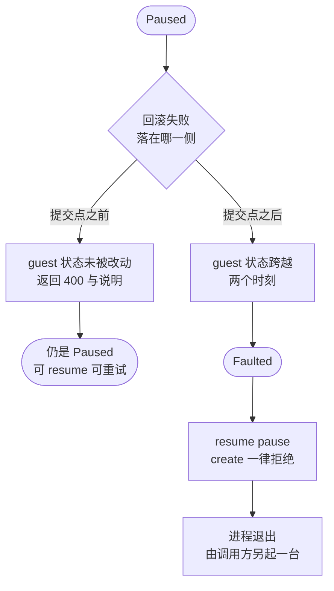

# 73 · 失败模型、Faulted 状态与 seccomp 白名单

> 原地回滚在一台活着的 microVM 上改状态，因此存在一个不可回头的点。
> 本篇讲这个点画在哪里、跨过它之后 microVM 变成什么、调用方能看到什么，
> 以及这条路径为什么必须往 seccomp 白名单里加五条规则。
>
> **读者**：要判断一次回滚失败之后该怎么处置的工程师与运维。
> 　**预备**：[第 42 篇](42-seccomp.md)、[第 69 篇](69-rollback-api-and-phases.md)、[第 72 篇](72-rollback-devices.md)。
> 　**代码**：`src/vmm/src/rollback.rs`、`src/vmm/src/lib.rs`、`src/vmm/src/rpc_interface.rs`、`src/vmm/src/vmm_config/instance_info.rs`、`resources/seccomp/aarch64-unknown-linux-musl.json`

---

## 0. 本篇要回答的问题

1. 原地回滚的提交点画在哪一步？为什么是这一步？
2. 十二个错误变体里，哪些让 microVM 还能用，哪些不能？判据是什么？
3. `Faulted` 是什么状态，哪些请求会被它挡下，怎么退出这个状态？
4. 一次成功的回滚回报哪些数字，这些数字各自覆盖哪一段？
5. 这条路径新增的五条 seccomp 规则各自服务哪一次系统调用，少一条会在哪里失败？
6. 哪些情况没有被覆盖或没有被验证？

---

## 1. 问题：这一次失败没有「什么都没发生」这个选项

从快照重建一台 microVM 失败时，处置是清楚的：构建过程发生在一个新进程里，
失败就让这个进程带着错误码退出，没有任何东西处在半成品状态。
上游快照恢复路径的错误处理建立在这个前提上（[第 38 篇](38-snapshot-load.md)）。

原地回滚没有这个前提。它改的是一台**已经存在**的 microVM：写 guest 内存、
写 vCPU 寄存器、写中断控制器、写设备对象。这几步中间任何一步出错，
留下的都是一台「一部分是过去、一部分是现在」的机器。
恢复它需要把剩下的步骤做完，而失败的原因往往正是做不完。

所以这条路径必须先回答一个设计问题：**在哪一步之前，失败可以当作没发生过。**
`rollback.rs` 给出的答案是内存写回。它之前的所有步骤要么是读，要么只改 Firecracker
进程自己的簿记；从 `GuestMemoryExtension::restore_dirty()` 的第一页写回开始，
guest 可见的状态就跨了两个时刻。代码把这条线直接写在注释里，称之为提交点，
并让错误枚举按它一分为二。

这条界线有一处需要精确表述。提交点之前的阶段并非完全没有副作用：
静默阶段（[第 72 篇 §3](72-rollback-devices.md#3-静默让在途的-io-落地或消失)）
会让块设备把完成项写进 used 环，也会把 tap 缓冲里的帧读掉。
准确的说法是：**提交点之前能够产生错误的那些步骤，对 guest 状态没有副作用** ——
静默阶段的回调错误类型是 `Infallible`，它在类型层面就不返回失败。
取脏页位图这一步也是同理：`Vm::get_dirty_bitmap()` 对 KVM 侧是破坏性读，
但代码在拿到结果后立刻 `store_dirty_bitmap()` 折叠进用户态位图，
所以即使后面某一步失败，「这些页偏离过」这个信息也不会丢，
下一次差分快照或回滚仍然看得到完整集合。

---

## 2. 十二个错误，一条判据

`RollbackError` 有十二个变体，`faults_vm()` 用一个穷举的 `match`
把它们分成两组。穷举而不是通配，意味着以后加一个变体时编译器会强迫作者做这个分类判断。

| 错误变体 | 产生于 | 是否 fault |
|---|---|---|
| `NotPaused` / `Faulted` | 入口的状态检查 | 否 |
| `SnapshotFile` | 读取并反序列化 vmstate 文件 | 否 |
| `Validation` | 页大小、内存文件长度、拓扑校验 | 否 |
| `RevertBitmap` | 读 revert 位图文件或它与当前内存不匹配 | 否 |
| `MemoryFile` | 打开内存文件或读它的元数据 | 否 |
| `DirtyBitmap` | 从 KVM 取当前脏页位图 | 否 |
| `BitmapWrite` | 写位图文件（只出现在 save-dirty-bitmap 路径） | 否 |
| `Memory` | 内存写回 | 是 |
| `Vcpu` | vCPU 状态写回 | 是 |
| `Gic` | 中断控制器状态写回 | 是 |
| `Devices` | 设备状态写回、串口重初始化、VMGenID、重标队列页 | 是 |

前七个都发生在提交点之前。它们的共同性质是：调用方收到一个 400 与一句错误说明，
microVM 仍然是 `Paused`，可以照常 resume、可以再试一次回滚、也可以继续做快照。
从调用方的角度，这一类失败与「参数写错了」没有区别。

后四个覆盖提交点之后的四个阶段。`Devices` 的范围比名字宽：
除了设备状态写回，串口重新初始化、VMGenID 换代号、以及收尾时重标队列页
这三处的错误都归进它。这不是分类不精确，而是这三处与设备写回一样都在提交点之后，
分得再细也不会改变处置方式。

`Vcpu` 这一类的错误文本要打个折扣看。vCPU 阶段的失败由 `Vmm::restore_vcpu_states_in_place()`
（`src/vmm/src/lib.rs`）转出来，而它沿用的是上游保存路径的枚举：应答个数对不上报
`UnexpectedVcpuResponse`（此时一个应答都还没收），vCPU 线程报错包成
`MicrovmStateError::SaveVcpuState`（此时做的是恢复）。行为不受影响，但日志里的错误名与实际动作对不上，
排查时以阶段为准而不是以名字为准（[第 71 篇 §2](71-rollback-vcpu-and-gic.md#2-事件走到-vcpu-线程)）。

`RevertBitmap` 值得单独说一句。位图文件与当前 microVM 不匹配（页大小不同，
或者描述的页数与 guest 内存的页数不同）被当成参数错误而不是内部错误，
因为它几乎总是调用方把另一台 microVM 的位图递了进来。
这类错误在提交点之前被挡住，是位图校验被安排在读文件之后、写回之前的理由。

---

## 3. `Faulted`：一个只进不出的状态

提交点之后失败时，包装层 `RuntimeApiController::rollback_snapshot()`
（`src/vmm/src/rpc_interface.rs`）检查 `err.faults_vm()`，为真就把
`vmm.instance_info.state` 置成 `VmState::Faulted`，然后照常把错误返回给调用方。

`VmState` 因此从三个变体变成四个（`src/vmm/src/vmm_config/instance_info.rs`）。
这个枚举的 `Serialize` 实现走的是 `Display`，所以 `GET /` 的响应里
`state` 字段会直接变成字符串 `"Faulted"` —— 调用方不需要记住自己发过哪些请求，
查一次就知道这台 microVM 还能不能用。

挡下来的请求有四类，分别在两个层次上实现。

`Vmm::resume_vm()` 与 `Vmm::pause_vm()`（`src/vmm/src/lib.rs`）在函数开头检查状态，
是 `Faulted` 就返回 `VmmError::VmFaulted`。resume 要拒绝的理由直白：
让 vCPU 在一份自相矛盾的状态上继续执行，结果不可预测。
pause 要拒绝的理由隐蔽一些 —— pause 成功之后会把 `state` 写成 `Paused`，
那等于把 `Faulted` 这个标记抹掉，resume 的那道闸随之失效。

`RuntimeApiController::create_snapshot()` 在取到锁之后检查状态，
是 `Faulted` 就返回 `NotSupported`。理由是这时候的 guest 内存与设备状态不属于同一个时刻，
拍下来的快照会把这份不一致永久固化，而且它看上去与一个正常快照没有区别。

`rollback_snapshot()` 与 `save_dirty_bitmap()` 自身的入口状态检查也认这个状态，
返回 `RollbackError::Faulted`。再回滚一次不是补救办法：
上一次失败的原因通常还在，而且当前的脏页位图已经不能准确描述「偏离了哪些页」。

**没有出口。** 全仓库没有任何一处代码把 `state` 从 `Faulted` 改回其它值。
唯一的终结方式是进程退出。这是有意的设计：把「这台 microVM 报废了」
做成一个不可逆的标记，比提供一条可能把问题掩盖过去的恢复路径更安全。
调用方侧对应的处置是杀掉进程、从快照另起一台，
这条退路本来就是 orchestrator 必备的能力（checkpoint / restore 手册讲这一侧）。

HTTP 层面这些错误是一视同仁的。`convert_to_response()`
（`src/firecracker/src/api_server/parsed_request.rs`）只对 MMDS 的超限错误返回 413，
其余全部是 400 加一段 JSON 的错误说明。所以调用方**不能靠状态码**区分
「参数写错了」与「这台 microVM 已经报废」，只能读错误文本，或者随后查一次 `GET /`。
这是一处可以改进的地方：`Faulted` 的语义与 400 并不贴切。

---

## 4. 一次成功的回滚回报什么

成功时返回 200 与一个 JSON 体（`VmmData::Rollback` 走
`success_response_with_data()`），结构是 `RollbackResponse`：

| 字段 | 含义 |
|---|---|
| `restored_pages` | 从内存文件写回的页数，等于 revert 集合里置位的页数 |
| `restored_bytes` | 写回的字节数 |
| `timings_us.validate` | 从入口到位图校验结束 |
| `timings_us.quiesce` | 静默在途设备 I/O |
| `timings_us.memory` | 取脏页位图、并入 revert 集合、写回内存 |
| `timings_us.vcpus` | vCPU 状态写回 |
| `timings_us.gic` | 中断控制器状态写回 |
| `timings_us.devices` | 设备写回、串口重初始化、VMGenID |
| `timings_us.total` | 端到端 |

有两处口径要留意，否则分段耗时会被误读。`memory` 这一段的计时起点在取脏页位图之前，
也就是说它把「读 KVM 位图并折叠进用户态位图」的开销算在了内存写回头上；
两者确实相邻，但前者的开销与脏页跟踪后端有关，与写回量无关
（[第 65 篇](65-dirty-tracking-backend.md)）。
另一处是各段之和小于 `total`：收尾阶段（清脏页基线、重标队列页）没有自己的计时字段，
它只出现在 `total` 里。

除了这个响应体，这条路径还往两个地方留痕。一是一行 `info` 日志，
写明本次回滚耗时。二是 metrics：包装层用 `update_metric_with_elapsed_time()`
把这次调用的耗时累加进 `METRICS.latencies_us.vmm_pause_vm`。
这是一处如实指出的语义混用 —— 那个指标在上游的含义是「暂停 vCPU 花了多久」
（[第 44 篇 §6](44-logging-and-metrics.md#6-latencies_us)）。
后果是：一旦调用方开始用回滚，这个指标就同时统计两种量级完全不同的操作，
基于它做的告警阈值与历史对比都会失真。
换来的是不必新增指标字段、不必改 metrics 的结构版本。
分段耗时仍然可以从每次回滚的响应体里拿到，所以这个混用损失的是聚合视图而不是单次观测。

---

## 5. seccomp：为这条路径开的五扇窗

[第 42 篇 §5](42-seccomp.md#5-怎么读一张表vcpu-线程的-ioctl-白名单)指出，
上游 vCPU 线程的白名单里一条 `KVM_SET_*` 都没有，
这把「vCPU 寄存器只在构建期被写」这条不变量编码进了过滤器。
原地回滚要在一台活着的 microVM 上重新写 vCPU 状态，这条不变量不再成立，
`resources/seccomp/aarch64-unknown-linux-musl.json` 因此多了五条规则。

| 规则 | 线程 | 服务于 | 缺失时 |
|---|---|---|---|
| `ioctl` 请求码 `0x4020aeae`（`KVM_ARM_VCPU_INIT`） | vcpu | 写回前对 vCPU 做架构定义的复位 | vCPU 阶段第一次调用即失败 |
| `ioctl` 请求码 `0x4004aec2`（`KVM_ARM_VCPU_FINALIZE`） | vcpu | 复位后重新完成 SVE 状态的 finalize | 复位之后、写寄存器之前失败 |
| `ioctl` 请求码 `0x4010aeac`（`KVM_SET_ONE_REG`） | vcpu | 逐个写回全部寄存器 | 写第一个寄存器时失败 |
| `ioctl` 请求码 `0x4004ae99`（`KVM_SET_MP_STATE`） | vcpu | 写回 vCPU 的 mp state | vCPU 阶段最后一步失败 |
| `pread64` | vmm | 定位读 `/proc/self/pagemap` | `GET /memory/dirty` 第一次调用即失败 |

四条 vcpu 规则缺任何一条，后果都不是一次可以处理的 `Err`：seccomp 违规在 Firecracker 里是 `SIGSYS`，
`signal_handler.rs` 的处理函数记一次 `seccomp.num_faults`、刷 metrics，然后以退出码 148
（`FcExitCode::BadSyscall`）结束进程。而 vCPU 阶段在提交点之后，
所以缺规则的表现是「进程直接消失」而不是「microVM 置 `Faulted`」——
对调用方是两种不同的事件。四条请求码的位域分解（方向、大小、`0xAE` 族号、序号）在
[第 62 篇](62-aarch64-seccomp-filter.md)。

前四条的顺序不是随意排的，它正好是 aarch64 `KvmVcpu::restore_state()` 的执行顺序
（`src/vmm/src/arch/aarch64/vcpu.rs`）：先 `init_vcpu()`，
再单独写 `KVM_REG_ARM64_SVE_VLS`，再 `finalize_vcpu()`，
再写其余全部寄存器，最后设置 mp state。回滚复用的正是这条上游函数
（[第 71 篇](71-rollback-vcpu-and-gic.md)），写回也确实发生在 vCPU 自己的线程里，
所以要开的是 vcpu 表而不是 vmm 表。

每条规则都对 `ioctl` 的参数 1 做等值比较，这是上游 `vcpu` 表的统一写法：
放行的不是 `ioctl` 这个系统调用，而是一个具体的请求码。
代价是白名单的收紧程度下降了一档 —— 一个拿到代码执行能力的攻击者现在可以在 vCPU 线程里
改写 vCPU 寄存器。收益是原地回滚能在装着过滤器的生产配置下运行。
这个取舍只在 aarch64 的表上做了，x86_64 的表没有动。

第五条属于另一件事。`pread64` 服务的是 e2b 定制版加的内存查询端点
`GET /memory/dirty`：它用定位读扫 `/proc/self/pagemap` 来分辨常驻页与脏页。
e2b 定制版给 x86_64 表加过 `pread64` 与 `mincore`，给 aarch64 表只加了 `mincore`
（[第 55 篇](55-seccomp-build-upload-and-upstream-fixes.md)、[第 62 篇](62-aarch64-seccomp-filter.md)），
所以在 aarch64 上这个端点第一次被调用就会撞上过滤器。
后果不是返回一个错误，而是整台 microVM 被杀：SIGSYS 触发
`signal_handler.rs` 的处理函数，记一次 `seccomp.num_faults`、刷 metrics、
以退出码 148（`FcExitCode::BadSyscall`）结束进程。
这条规则把它补齐，两个架构的表在这一点上重新一致。

反向的约束同样存在，第 72 篇讲过一例：`memfd_create` 不在 vmm 表里，
所以回滚时重建 net 的 RX 缓存只能就地擦干净复用，不能新建一个 `RxBuffers`。
过滤器一旦划定，它就不只是一道检查，而是实现可以走哪条路的硬约束。

还有一处靠时序而不是靠规则成立：aarch64 的 vmm 表里没有 `KVM_ENABLE_CAP`，
而启用硬件脏页跟踪正是用这个 ioctl（[第 66 篇](66-hdbss.md)）。它不需要规则，
是因为使能发生在过滤器装上之前 —— 与 userfaultfd 的创建与注册同一类口径
（[第 39 篇](39-uffd-backend.md)）。代价是这类能力一旦要改成运行期可调，
就得同时改过滤器表。

---

## 6. 没有覆盖的情况

以下几条是这条路径明确的边界，读者接手时不要假设它们已经解决。

**x86_64 未验证。** `KvmVcpu::restore_state_in_place()` 在 x86_64 上只是转发给
`restore_state()`（`src/vmm/src/arch/x86_64/vcpu.rs`），代码路径是通的；
但 `x86_64-unknown-linux-musl.json` 没有加任何 `KVM_SET_*` 规则。
推论：在 x86_64 上带着默认过滤器调用回滚，会在 vCPU 阶段撞上 SIGSYS，
也就是在提交点之后被杀。这条路径的部署目标是 aarch64，x86_64 上没有验证过。

**被拒绝的设备。** balloon、vsock、vhost-user 的块设备在拓扑校验阶段就被挡下
（[第 72 篇 §2](72-rollback-devices.md#2-拓扑校验把写回限制在能写回的形状上)）。
这是在提交点之前，所以只是一个 400。

**大页。** 写回与位图都按 `get_page_size()` 返回的宿主基础页大小计算页号与偏移。
推论：guest 内存由 HugeTLB 后备时，脏页跟踪的粒度与这里的页号换算是否仍然对齐，
代码里没有对应的处理，也没有测试覆盖。

**uffd 后备内存。** 写回是 VMM 进程自己去写 guest 内存的映射。
推论：如果某一页从未被 uffd 处理进程填充过，这次写会触发一次 MISSING 缺页，
由 uffd 处理进程按常规流程填充（[第 39 篇](39-uffd-backend.md)），之后再被写回覆盖 ——
结果正确但多做了一次填充。这条路径没有被单独验证。

**配置变更不被撤销。** 回滚只回退进度类状态，磁盘路径、tap 的限速器这类配置不写回，
目标快照之后的 `PATCH` 变更在回滚后依然生效。

**revert 集合的完整性是调用方的契约。** 回滚把「当前脏页位图」与调用方给的累计位图取并集，
但它无法验证这个并集确实覆盖了自目标快照以来偏离过的每一页。
少一页，回滚之后那一页就停留在未来的内容上，而且没有任何一处会报错。
这条契约怎么维护属于 orchestrator 侧（[第 68 篇](68-save-dirty-bitmap-api.md)与 checkpoint / restore 手册）。

---

## 7. 测试覆盖到哪里

`rollback.rs` 里没有 `mod tests`。这条路径的单元测试全部落在它依赖的内存层上
（`src/vmm/src/vstate/memory.rs`），两个测试覆盖的是位图与写回之间的代数关系：

- `test_restore_dirty_is_dump_dirty_inverse` 造两个各两页、在 guest 物理空间里不相邻的内存区，
  内存文件按扁平页序平铺四页，用位图 `0b1001` 只回退第 0 页与第 3 页，
  逐页断言被选中的页取到了文件内容、没被选中的页原样未动。
  它验证的正是「区在 GPA 上有空洞、在文件里没有空洞」这个容易写错的换算。
- `test_dump_dirty_returns_merged_flat_bitmap` 验证导出的位图是 KVM 侧与用户态侧的并集，
  并且按同一套扁平页序编号。

没有被单元测试覆盖的是本篇讲的全部内容：拓扑校验、静默、设备写回、vCPU 与 GIC 阶段、
`Faulted` 的置位与传播、以及分段计时。原因是这些都需要一台真实的 microVM 与一台真实的 KVM，
`src/vmm/tests/integration_tests.rs` 在这一层只做了一处编译适配（给
`CreateSnapshotParams` 补 `dirty_bitmap_path: None`），没有新增用例。
端到端的验证在 checkpoint / restore 手册的测试部分。

还有一处文档与实现不一致要记下来：`src/firecracker/swagger/firecracker.yaml`
里的 `SnapshotRollbackParams` 仍然列着一个 `vcpu_route` 字段（取值 `reinit` 或 `registers`），
而 `RollbackSnapshotParams` 上标着 `#[serde(deny_unknown_fields)]` 且没有这个字段。
按 swagger 构造的请求只要带上它就会被解析拒绝。这是 vCPU 写回路线收敛到单一做法之后
遗留的文档债（[第 71 篇](71-rollback-vcpu-and-gic.md)讲那个取舍本身）。

---

## 8. 小结

- 原地回滚的提交点是内存写回的第一页；它之前能产生错误的步骤对 guest 状态没有副作用，之后的每一步都让 guest 状态跨越两个时刻。
- `RollbackError` 的十二个变体由 `faults_vm()` 穷举分成两组，加新变体时编译器强制作者做这个判断。
- 取脏页位图是破坏性读，代码在取到后立刻折叠进用户态位图，因此即使后续失败，「哪些页偏离过」这个信息也不丢。
- 提交点之后的失败把 microVM 置为 `Faulted`：`resume`、`pause`、`create snapshot`、再次回滚全部被拒；pause 也必须拒绝，否则会抹掉这个标记。
- `Faulted` 没有出口，唯一终结方式是进程退出；`GET /` 的 `state` 字段可见。
- 所有回滚错误在 HTTP 层都是 400，调用方无法靠状态码区分参数错误与 microVM 报废。
- 成功响应给出写回页数、字节数与七个分段耗时；`memory` 一段含取位图的开销，收尾阶段没有自己的字段。
- 耗时被累加进 `latencies_us.vmm_pause_vm`，与 pause 的语义混在一起，聚合视图因此失真。
- aarch64 的 vcpu 表新增四条 `ioctl` 规则，顺序对应 `restore_state()` 的执行顺序；这打破了上游「vcpu 表里没有 `KVM_SET_*`」的不变量，是为可用性付出的收紧度代价。
- vmm 表补 `pread64` 是为了 `GET /memory/dirty`；缺它不是报错而是进程以退出码 148 被杀。
- 明确未覆盖：x86_64 未验证且缺规则、balloon / vsock / vhost-user 被拒、大页与 uffd 后备内存未验证、配置变更不被撤销、revert 集合的完整性由调用方保证。
- 单元测试只覆盖内存层的位图与写回换算；其余全部依赖端到端验证。swagger 里的 `vcpu_route` 字段已与实现不符。

---

## 延伸阅读 / 下一篇

- [第 42 篇 · seccomp](42-seccomp.md#5-怎么读一张表vcpu-线程的-ioctl-白名单)：vcpu 表原本的形状与「只读不写」那条不变量。
- [第 62 篇 · aarch64 的 seccomp 过滤器](62-aarch64-seccomp-filter.md)：这张表的全貌与怎么验证一条新规则。
- [第 69 篇 · PUT /snapshot/rollback](69-rollback-api-and-phases.md)：各阶段的顺序与参数。
- [第 72 篇 · 回滚的设备状态](72-rollback-devices.md)：`Devices` 这一类错误覆盖的那些步骤。
- [第 44 篇 · 日志与 metrics](44-logging-and-metrics.md#6-latencies_us)：被复用的那个指标在上游的含义。
- [checkpoint / restore 手册第 14 篇](../../e2b-infra-docs/rollback/docs/14-failure-semantics.md)：调用方侧的失败语义与退路。
