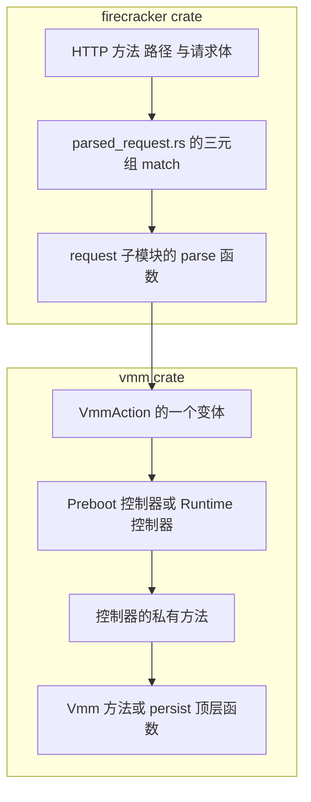

# 79 · 阅读上游代码的方法与常见问题

> 这本书把 Firecracker 拆开讲了七十多篇，但读者迟早要自己回到源码：换一个版本、查一个本书没覆盖的字段、
> 或者确认书里的某条论断在你手上的那份代码里还成不成立。本篇给出六条可复用的追踪路径，每条都带可运行的命令；
> 后半是读代码时最容易卡住的八个问题，每个给出一段结论与讲它的篇目。
>
> **读者**：准备自己动手读 Firecracker 源码的人。　**预备**：[第 01 篇](01-lineage-and-repo-map.md)、[第 05 篇](05-rust-and-crates-primer.md)。
> **代码**：`src/firecracker/src/api_server/parsed_request.rs`、`src/vmm/src/rpc_interface.rs`、`src/vmm/src/arch/mod.rs`、`resources/seccomp/`

---

## 0. 本篇要回答的问题

1. 给定一个 HTTP 方法与路径，怎么在几步之内定位到真正干活的那个函数？
2. 在 x86_64 机器上怎么读 aarch64 的那一半代码，工具链看不到的部分怎么办？
3. 一个 virtio 设备的代码分布在哪几个文件里，各自的边界是什么？
4. 一个数字常量或一行奇怪的代码是什么时候、为什么加进来的，怎么查？
5. seccomp 表里那些十进制数字怎么翻译回 ioctl 名字与调用点？
6. 没有 devtool、没有容器镜像的机器上，还能跑哪一层测试？

---

## 1. 起手式：把「读的是哪一份代码」先固定下来

Firecracker 的版本间差异比多数人预期的大：快照格式、设备模型、seccomp 表、`arch/` 的目录结构
在最近几个 minor 版本里都动过。所以每次追踪开始之前先把基线钉住：

```bash
git clone https://github.com/firecracker-microvm/firecracker
git -C firecracker checkout v1.12.1
git -C firecracker rev-parse HEAD    # d990331f7...
```

本书全部上游论断都以这个 commit 为准。三条纪律值得在动手前记住。

**以代码为准，`docs/` 只是线索。** 仓库里的 `docs/` 是人写的说明，更新滞后于代码，而且有确实不一致的地方
（第 8 节第 4 条给了一个例子：文档说快照会失败，代码只打一条 warn）。用 `docs/` 找入口，用代码下结论。

**先找类型，再找函数。** Rust 的调用关系大量经由 trait 与枚举中转，按函数名 grep 常常断在中间。
枚举变体（`VmmAction::CreateSnapshot`）、状态结构体（`EntropyState`）、错误类型（`VhostUserBlockError`）
这些名字唯一性高，是更好的锚点。

**注意 `cfg` 圈起来的代码不参与编译。** 编辑器的跳转、`cargo check`、clippy 都只看当前架构那一支；
另一支的代码对工具链是不存在的，只能靠 grep 或者显式指定 target 去读（第 3 节）。

判断某个文件在后面两层有没有被改，用 [第 78 篇 · 三层差异总表](78-layer-diff-tables.md) 的表，
或者直接对 e2b 定制版的 clone 跑 `git diff v1.12.1 a41d3fb -- <path>`。

---

## 2. 从一个 API 路径追到执行代码

这是最常用的一条路径：手上有一次 HTTP 调用（自己发的，或者日志里看到的），想知道它最终改了什么状态。
控制面是一条固定的四段式流水线，中间没有分发表、没有反射、没有宏生成的路由。



四步各对应一次 grep。以 `PUT /snapshot/create` 为例：

```bash
cd firecracker
grep -n '"snapshot"' src/firecracker/src/api_server/parsed_request.rs
grep -n "VmmAction::" src/firecracker/src/api_server/request/snapshot.rs
grep -n "CreateSnapshot" src/vmm/src/rpc_interface.rs
```

第一条落在 `ParsedRequest` 的 `TryFrom<&Request>` 实现上。这个 `match` 的模式是
`(方法, 路径第一段, 请求体)` 三元组，路径后面的段由 `path_tokens.next()` 传给解析函数
——`PUT /drives/rootfs` 的 `rootfs` 就是这么进去的。找不到匹配就落到最后一条臂，返回 `InvalidPathMethod`。

第二条落在 `request/snapshot.rs` 的 `parse_put_snapshot()`：它把请求体反序列化成
`CreateSnapshotParams`，包成 `VmmAction::CreateSnapshot`。这一层只做解析与字段校验，不碰任何 VMM 状态。

第三条要分辨落在哪个控制器上。同一个 `VmmAction` 在启动前后由两段不同的代码处理：
`PrebootApiController::handle_preboot_request()` 与 `RuntimeApiController::handle_request()`。
两个函数都是对 `VmmAction` 的穷尽 `match`，所以**只要在这两处各 grep 一次变体名，就能同时得到
「启动前做什么」与「运行时做什么」，以及在另一侧被拒绝时返回哪个错误**。
`CreateSnapshot` 在 preboot 那张表里与另外八个变体并成一条臂，统一返回 `OperationNotSupportedPreBoot`。

第四条是控制器的私有方法，例如 `RuntimeApiController::create_snapshot()`。
它在真正干活之前往往有一段前置检查（`track_dirty_pages` 那条就在这里），
之后调 `persist.rs` 的顶层 `create_snapshot()`，并在前后取时间写 metrics。
读这一层的顺序建议是：先看前置检查（这些是 API 的隐含契约），再看调用的下层函数，最后看 metrics 和日志。

运行时想确认某次调用走到了哪，不必加 `println!`：`parsed_request.rs` 的 `describe()`
会把收到的方法、路径与（部分端点的）请求体打进 info 日志，控制器又对四类耗时动作写了
`… took N us.` 的日志，两者配合足以定位。日志与 metrics 的读法见
[第 44 篇 · 日志与 metrics](44-logging-and-metrics.md)。

端点、`VmmAction` 与篇目的完整对照在 [第 76 篇 · API 端点总表](76-api-reference.md)。

---

## 3. 从 `cfg(target_arch)` 找到另一架构的实现

架构相关的代码集中在 `src/vmm/src/arch/`，下面是 `x86_64/` 与 `aarch64/` 两个目录。
不要从这两个目录开始读，要从 `src/vmm/src/arch/mod.rs` 开始：这个文件里两段对称的
`#[cfg(target_arch = …)] pub use …` 列表，就是**两个架构必须各自提供的符号清单**。

```bash
grep -n "pub use" src/vmm/src/arch/mod.rs
```

清单里有 `Kvm`、`ArchVm`、`VmState`、`arch_memory_regions`、`configure_system_for_boot`、
`MMIO_MEM_START`、`layout::SYSTEM_MEM_SIZE` 等。两边列表的差集同样有信息量：
`OptionalCapabilities` 只在 aarch64 一侧导出，`layout::APIC_ADDR`、`layout::IOAPIC_ADDR` 只在 x86_64 一侧。
差集就是「这件事只有一个架构需要」的清单。

有了符号名，对应实现在同名文件里：`vm.rs`、`vcpu.rs`、`kvm.rs`、`layout.rs`、`regs.rs`
在两个目录下都存在，语义对应但内容完全不同。x86_64 多出 `cpuid`（在 `cpu_config/` 下）、
`msr.rs`、`mptable.rs`、`xstate.rs`；aarch64 多出 `fdt.rs`、`gic/`、`cache_info.rs`。
两侧的对照读法在[第 59 篇 · aarch64 与 x86_64 的运行期路径差异](59-aarch64-vs-x86-64-runtime-paths.md)。

`arch/` 之外还有零散的 `cfg`，例如 `rpc_interface.rs` 里的 `SendCtrlAltDel`、
`devices/` 下的部分设备。找全它们用：

```bash
grep -rn 'cfg(target_arch = "aarch64")' src/vmm/src/ | grep -v "^src/vmm/src/arch/"
```

在 x86_64 机器上想让工具链真的检查 aarch64 那一支，加 target 即可，不需要交叉运行环境：

```bash
rustup target add aarch64-unknown-linux-musl
cargo check --target aarch64-unknown-linux-musl --workspace
```

这条命令编不出可执行文件（缺 musl 交叉链接器时会在链接阶段失败），但类型检查与 clippy 的诊断已经产生了，
足以回答「另一架构那一支是不是还编得过」。

---

## 4. 一个 virtio 设备的四个文件

virtio 设备在 `src/vmm/src/devices/virtio/<name>/` 下，文件切分是固定的，
四个文件对应四件互不相干的事：

| 文件 | 内容 | 实现的 trait |
|---|---|---|
| `device.rs` | 设备结构体、配置空间、队列处理逻辑 | `VirtioDevice` |
| `event_handler.rs` | 向事件管理器注册哪些 fd、醒来后做什么 | `MutEventSubscriber` |
| `persist.rs` | 状态结构体、保存与重建 | `Persist` |
| `metrics.rs` | 该设备的计数与耗时 | 无（`SharedIncMetric` 等） |

另外 `mod.rs` 放常量（队列数量、队列下标、设备 id）与对外的 `pub use`，
`test_utils.rs`（如果有）放这个设备的测试脚手架。

所以定位方式是按**问题的类别**选文件，而不是全目录 grep：问「这个设备支持哪些 feature 位」看 `device.rs`；
问「什么时候会被唤醒」看 `event_handler.rs`；问「快照里存了什么」看 `persist.rs` 里的
`type State` 与 `type ConstructorArgs`。以熵设备为例：

```bash
ls src/vmm/src/devices/virtio/rng/
grep -n "type State\|type ConstructorArgs" src/vmm/src/devices/virtio/rng/persist.rs
```

两个例外要知道。块设备是两套实现并列：`block/virtio/`（本地文件后端，四个文件齐全）
与 `block/vhost_user/`（没有 `metrics.rs`，计数在上一层的 `vhost_user_metrics.rs`），
`block/device.rs` 是把两者包起来的分发层。vsock 的会话状态机在子目录 `csm/`，
后端在 `unix/`，比其它设备多一层。

设备之上还有一层：`src/vmm/src/device_manager/` 决定设备怎么被装配、MMIO 地址与中断怎么分配，
它的 `persist.rs` 负责整台机器的设备拓扑进出快照。设备模型本身见
[第 25 篇 · virtio 设备模型与传输层](25-virtio-device-model-and-transport.md)，
设备状态的保存与恢复见[第 40 篇 · 设备状态的保存与恢复](40-device-persist.md)。

---

## 5. 用 `git log -S` 追一个常量的来历

读到一个没有注释的数字，或者一行看起来多余的代码，最快的解释来自引入它的那个提交。
`git log -S`（pickaxe）按「这个字符串的出现次数发生变化」筛提交，比 `git log -p | grep` 准得多：

```bash
git log --oneline -S "SYSTEM_MEM_SIZE" -- src/vmm/src/arch/aarch64/layout.rs
```

在 v1.12.1 上这条命令只返回一个提交 `5cde50608`（`vmgenid: add support for ARM systems`），
`git show 5cde50608` 的说明写明这段保留内存是为了在设备树里给 guest 暴露 VMGenID 的地址。
一个孤零零的 `0x20_0000` 就此有了来历。

三个配套用法：

- **去掉 `-- <path>` 看全仓库**。同一个符号在别处的引入与删除会一并出现，能看出它是被搬过来的还是新写的。
- **`git log -L :函数名:文件` 看一个函数的完整演变史**，适合追一段逻辑被改了几次、每次为什么。
- **提交信息比 diff 重要**。Firecracker 的提交信息普遍写了动机，而且 PR 号可以回到 GitHub 上看讨论。
  `git log --follow` 在文件被重命名过时（`arch/` 在 1.10 前后动过）是必需的。

对两层改动用同一套方法：e2b 定制版与 ARM 适配版的提交同样带说明，本书多处结论
（例如为什么换了 `userfaultfd` 的 crate 分叉）就是这么读出来的。两层的提交范围见
[第 49 篇 · e2b 为什么分叉](49-why-e2b-forked.md)与[第 64 篇 · checkpoint 扩展总览](64-checkpoint-extension-overview.md)。

---

## 6. 读一张 seccomp 表：从数字到调用点

过滤器的源头是 `resources/seccomp/<target triple>.json`，一个目标三元组一份。
文件顶层是三个线程类别（`vmm`、`api`、`vcpu`），各有 `default_action`、`filter_action` 与一张规则表。
表怎么分类、为什么 vCPU 线程一条 `KVM_SET_*` 都没有，在
[第 42 篇 §5](42-seccomp.md#5-怎么读一张表vcpu-线程的-ioctl-白名单)；这里只讲从一条规则查到调用点的机械步骤。

带参数的规则长这样：

```json
{ "syscall": "ioctl",
  "args": [ { "index": 1, "type": "dword", "op": "eq", "val": 2147790488 } ] }
```

`val` 是十进制的 ioctl 请求码。按 Linux 的 `_IOC` 编码拆开它：

```bash
python3 -c "v=2147790488; print(hex(v),'dir',v>>30,'size',(v>>16)&0x3fff,'type',hex((v>>8)&0xff),'nr',hex(v&0xff))"
```

输出是 `0x8004ae98 dir 2 size 4 type 0xae nr 0x98`：方向位 2 表示内核向用户态写（`_IOR`），
type `0xae` 是 `KVMIO`，序号 `0x98`。名字在 `kvm-ioctls` crate 里按序号声明，
版本由 `Cargo.lock` 钉住（v1.12.1 用 0.21.0）：

```bash
grep -rn "KVMIO, 0x98" ~/.cargo/registry/src/*/kvm-ioctls-0.21.0/src/kvm_ioctls.rs
```

得到 `ioctl_ior_nr!(KVM_GET_MP_STATE, KVMIO, 0x98, kvm_mp_state)`。反过来，从名字找 Firecracker 里的调用点，
grep 的应当是 kvm-ioctls 暴露的方法名（`get_mp_state`、`set_one_reg`），而不是常量名 ——
Firecracker 自己的代码里几乎不出现 `KVM_*` 常量，都经由 crate 的安全封装。

两个陷阱。一是 JSON 里的 `comment` 字段是这张表唯一的文档，改表时不写注释，下一个人就只剩数字；
e2b 定制版与 ARM 适配版新增的规则都带了注释，这是好习惯（[第 62 篇](62-aarch64-seccomp-filter.md)）。
二是 debug 构建根本不装这张表（下一节）。

---

## 7. 没有 devtool 的机器上跑测试

官方入口 `tools/devtool` 要求 Docker、固定 tag 的容器镜像、可访问的 S3 产物与裸金属 KVM；
在鲲鹏 / openEuler 这类环境里这条路走不通（[第 60 篇](60-kunpeng-openeuler-host.md)）。
退路是绕过 devtool 直接用 cargo，能跑到的是 Rust 单元测试与 `src/vmm/tests/` 下的 Rust 集成测试。
参数照抄 `tests/host_tools/cargo_build.py` 的 `cargo_test()`：

```bash
RUST_TEST_THREADS=1 RUST_BACKTRACE=1 \
RUSTFLAGS="-C link-arg=-lgcc -C link-arg=-lfdt" \
cargo test --all --no-fail-fast --target aarch64-unknown-linux-musl
```

四个参数各有原因：`RUST_TEST_THREADS=1` 是因为这些测试会争用 `/dev/kvm` 与网络设备；
aarch64 上的两个 `link-arg` 是链接 `libfdt` 与 `libgcc` 所需；
`--all` 覆盖 workspace 全部 crate；目标三元组固定为 musl，与发布产物一致。
这些测试**需要真的 `/dev/kvm`**：`test_utils` 里的 `create_vmm()` 走的是真正的 `build_microvm_for_boot()`，
只有 guest 里跑的内核镜像是假的（[第 47 篇 §2](47-testing.md#2-单元测试在没有真内核的情况下造一台-microvm)）。

跑不到的是整个 pytest 层，也就是功能、安全、性能、风格四类契约的自动化验证。
这个缺口要如实记着：上游防快照回归的那批用例恰好覆盖本项目改动最多的区域。

还有一条与测试相关的陷阱值得单列：**debug 构建的 seccomp 过滤器是空的**。
`src/firecracker/build.rs` 在 `DEBUG` 为真、或者目标三元组没有对应策略文件时，
把策略换成 `resources/seccomp/unimplemented.json` 并打一条 `cargo:warning`。
所以「这个操作会不会被 seccomp 挡住」这类问题，只能用 release 的 musl 构建去验证
（[第 06 篇 §2.5](06-build-run-debug.md#25-debug-构建不只是慢)）。

---

## 8. 常见问题

下面八条是读这份代码时最容易卡住的地方。每条给出结论和讲它的篇目，细节不在这里展开。

**1. 为什么创建快照的最后一步要把已激活设备的队列页重新标脏？**
因为队列的运行期访问不经过脏页跟踪。`Queue::initialize()` 在设备激活时把描述符表、avail ring、
used ring 三段的宿主地址存成裸指针，之后的读写绕开了 `vm-memory` 的访问接口，
而用户态脏位图正挂在那个接口上；KVM 侧也看不见，因为写的是 VMM 进程而不是 guest。
于是队列页只在设备激活与每次快照结束这两个时刻被标脏，形成一个不变量：两次快照之间队列页恒为脏，
每个 Diff 快照都必然包含完整的队列区域。代价是每次 Diff 多写几页，收益是 I/O 热路径上不必更新位图。
见[第 37 篇 §7](37-snapshot-create.md#7-队列为什么要重新标脏)与[第 26 篇](26-virtqueue-implementation.md)。

**2. `track_dirty_pages` 关着的时候请求 Diff 快照会怎样？**
被控制面拒绝，返回 `NotSupported`，不会退化成 Full。检查在
`RuntimeApiController::create_snapshot()` 的最前面，先于任何状态收集。
这是刻意的：如果放行，`dump_dirty()` 会拿到一张空的 KVM 位图和恒为 false 的用户态位图，
产出一个「零个脏页」的差分，静默地损坏数据。另外这个开关不进快照，
恢复时由 `LoadSnapshotParams::enable_diff_snapshots` 重新决定。
见[第 14 篇 §6](14-dirty-page-tracking.md#6-代价与边界)与[第 36 篇](36-snapshot-overview-and-format.md)。

**3. 为什么 API 是同步的，这对调用方意味着什么？**
API 线程把动作经 mpsc 通道送给 VMM 线程，写一次 eventfd 唤醒它，然后在 `recv()` 上阻塞等结果。
三个后果：HTTP 调用的时延就是 VMM 动作的时延（几 GiB 的全量快照要多久，`PUT /snapshot/create` 就挂多久）；
请求严格串行，并发发两个请求得到的是排队而不是并行，VMM 侧因此完全不需要并发控制；
`recv()` 没有超时，VMM 线程卡住则 HTTP 调用一直挂着。
`RequestAction` 枚举只有 `Sync` 一个变体，结构上给别的执行方式留了位置，但 v1.12.1 里没有用。
见[第 08 篇 §4](08-api-server.md#4-同步语义)与[第 09 篇](09-rpc-interface.md)。

**4. 为什么 v1.12.1 对配置了 vhost-user 块设备的 microVM 创建快照不报错？**
文档与代码在这里不一致。`docs/api_requests/block-vhost-user.md` 说快照会失败，
而 `device_manager/persist.rs` 遍历设备时遇到 `block.is_vhost_user()` 只打一条
`warn!("Skipping vhost-user-block device...")` 就跳过，快照照常生成。
后果是产出的快照里少一个设备：恢复出来的 microVM 拓扑与保存时不同，guest 会看到块设备凭空消失。
`VhostUserBlock::restore()` 那条返回 `SnapshottingNotSupported` 的路径实际走不到，
因为状态从一开始就没被写进去。根因是设备的真实状态在另一个进程里，vhost-user 协议没有取出再放回的消息。
见[第 29 篇 §5](29-vhost-user-block.md#5-失去的三样东西)与[第 40 篇](40-device-persist.md)。

**5. 为什么 aarch64 的原地回滚要先把 vCPU 复位再整体写回，而不是只写寄存器？**
因为一颗 vCPU 的状态不全是寄存器。挂起的虚拟中断与异常、定时器在内核侧的挂起标记、
PMU 的内部计数、SVE 是否已 finalize，这些要么没有对应的寄存器 id，要么写寄存器达不到想要的值。
只写寄存器会把它们留在被丢弃的那条时间线上，回滚后的 vCPU 成为「快照的寄存器」加「当前的内核内部状态」的混合体。
复位路线每颗 vCPU 多两次 ioctl、多两条 seccomp 规则，换来的是一条能一句话说清的不变量：
回滚之后 vCPU 的状态只是快照的函数。附带收益是直接复用上游的 `restore_state()`，不必维护一条自己写的序列。
见[第 71 篇 §4](71-rollback-vcpu-and-gic.md#4-两种做法的取舍)。

**6. 为什么 ARM 上没有 uffd 写保护？**
aarch64 的 Linux 内核不实现 userfaultfd 写保护：没有 `UFFD_FEATURE_WP_ASYNC`，
没有 `UFFDIO_REGISTER_MODE_WP`，也没有 `UFFDIO_WRITEPROTECT` ioctl。
而 e2b 定制版在创建 uffd 时用 `require_features()` 把 `WP_ASYNC` 设成硬门槛，
于是在 aarch64 上任何一次 uffd 恢复都会在创建那一步直接失败，与是否查脏页无关。
分叉的另一个分支把这三处改动整体用 `cfg(target_arch = "x86_64")` 圈起来以恢复可用性；
ARM 适配版迁入的是更早的基点，本来就不含这个提交。
见[第 53 篇 §6](53-uffd-write-protection.md#6-同一个分叉在另一个分支上把它关掉了)与[第 57 篇](57-which-fork-commit-and-uffd-wp.md)。

**7. 为什么 `GET /memory/dirty` 在 aarch64 上会退化？**
这个端点的判据是 `/proc/self/pagemap` 里的两个位：present 且 uffd 写保护位为 0，
即「有内存且写保护已被解除」。解除的唯一原因是发生过一次写 —— 但这条因果要成立，
每一页在 guest 用它的时候必须先是被写保护的，而这正是上一条说的 ARM 上不成立的前提。
写保护位恒为 0，端点于是把全部常驻页都报成脏页，没有任何报错。
还有一层是 seccomp：`pread64` 只加进了 x86_64 的表，aarch64 表里补齐是 ARM 适配版的事。
ARM 适配版因此换了后端，用鲲鹏 950 的硬件脏页跟踪 HDBSS 重新实现「哪些页被写过」。
见[第 52 篇 §6](52-memory-dirty-api.md#6-代价与失效条件)、[第 65 篇](65-dirty-tracking-backend.md)与[第 66 篇](66-hdbss.md)。

**8. 为什么在同一份代码上读到的行为与书里写的对不上？**
先查三件事。其一是构建 profile：debug 构建换成空的 seccomp 策略（第 7 节），
调试构建下得不到「会不会被挡住」的有效结论。其二是架构：本书的上游各篇以两个架构都成立的部分为主，
差异集中在[第 59 篇](59-aarch64-vs-x86-64-runtime-paths.md)；`cfg` 圈住的代码在你当前的工具链下是隐形的。
其三是层：e2b 定制版与 ARM 适配版的源码树看起来都像上游，前者在 v1.12.1 之上多了 28 个提交，后者在此基础上还有一层，
文件级的差异表在[第 78 篇](78-layer-diff-tables.md)。三件事都排除之后，再考虑是版本差异
——那就回到第 5 节，用 `git log -S` 让提交自己解释。

---

## 9. 小结

- 追踪之前先钉版本：Firecracker 的快照格式、设备模型与目录结构在近几个 minor 版本里都动过，`docs/` 滞后于代码。
- 控制面是四段固定流水线：三元组 `match` → `parse_*` → `VmmAction` → 两个控制器之一 → 下层函数；每段一次 grep。
- 在两个控制器上各 grep 一次同一个 `VmmAction` 变体，就能同时得到允许时的行为与拒绝时的错误。
- 架构相关代码从 `arch/mod.rs` 的两段 `pub use` 读起：它是两个架构的符号契约，差集就是「只有一边需要」的清单。
- `cargo check --target <另一架构>-unknown-linux-musl` 能让工具链检查 `cfg` 的另一支，不需要交叉运行环境。
- virtio 设备的四个文件按问题类别分工：feature 与队列逻辑、唤醒条件、快照状态、计数；块设备与 vsock 是两个例外。
- `git log -S` 加路径限制是解释一个常量最快的方式；Firecracker 的提交信息普遍写了动机，比 diff 更有用。
- seccomp 表里的 `val` 按 `_IOC` 编码拆开得到序号，序号在 `kvm-ioctls` 里对应常量名，调用点则要 grep crate 的方法名。
- 没有 devtool 时，`cargo test --all --target <arch>-unknown-linux-musl` 能跑到单元测试与 Rust 集成测试，但仍需 `/dev/kvm`；pytest 层整层缺失。
- 行为与书对不上时，按 profile、架构、层三步排查，最后才怀疑版本差异。

---

## 延伸阅读 / 下一篇

- [第 75 篇 · 代码地图](75-code-map.md)：crate、模块、文件与篇目的完整对照，是所有追踪的起点索引。
- [第 76 篇 · API 端点总表](76-api-reference.md)与[第 77 篇 · 配置与 metrics 总表](77-config-cli-env-metrics-reference.md)：查字段与参数用。
- [第 78 篇 · 三层差异总表](78-layer-diff-tables.md)：判断手上这份代码属于哪一层，以及升级时要重放什么。
- [第 74 篇 · 术语表](74-glossary.md)：读到不认识的词先查这里。
- [第 06 篇 · 构建、运行与调试](06-build-run-debug.md)与[第 47 篇 · 测试体系](47-testing.md)：本篇第 7 节的完整版。
- 上游仓库的 `CONTRIBUTING.md` 给出提交规范与 PR 流程，读提交信息时有帮助；以代码为准。
